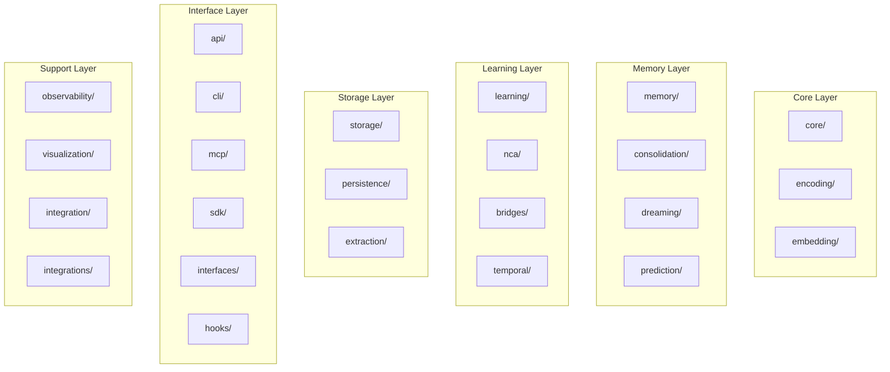
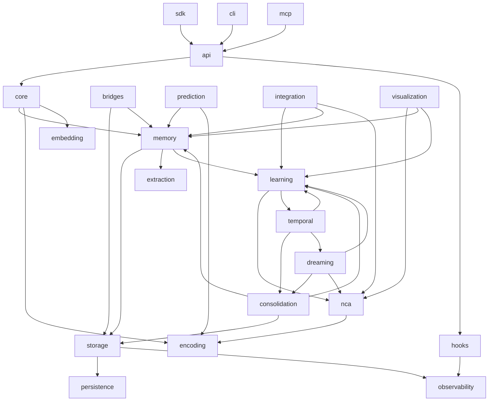
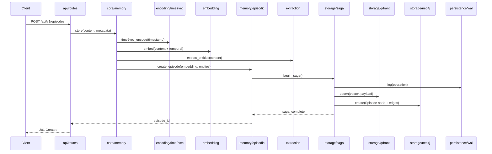
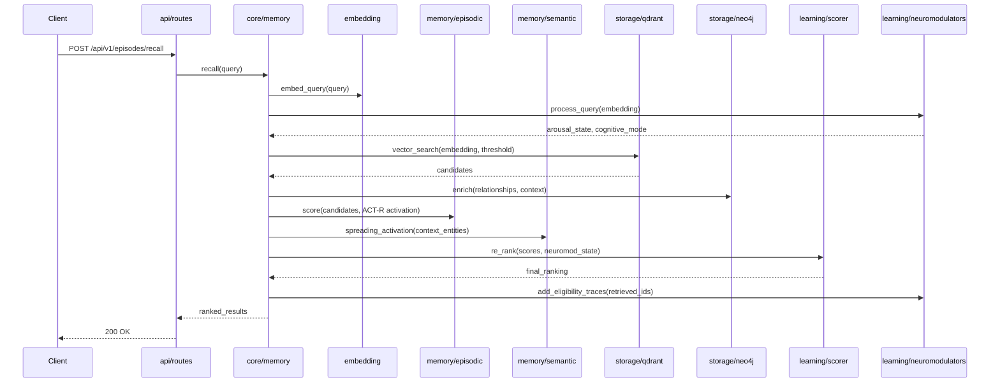
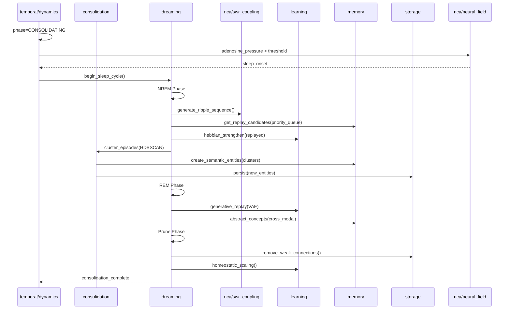
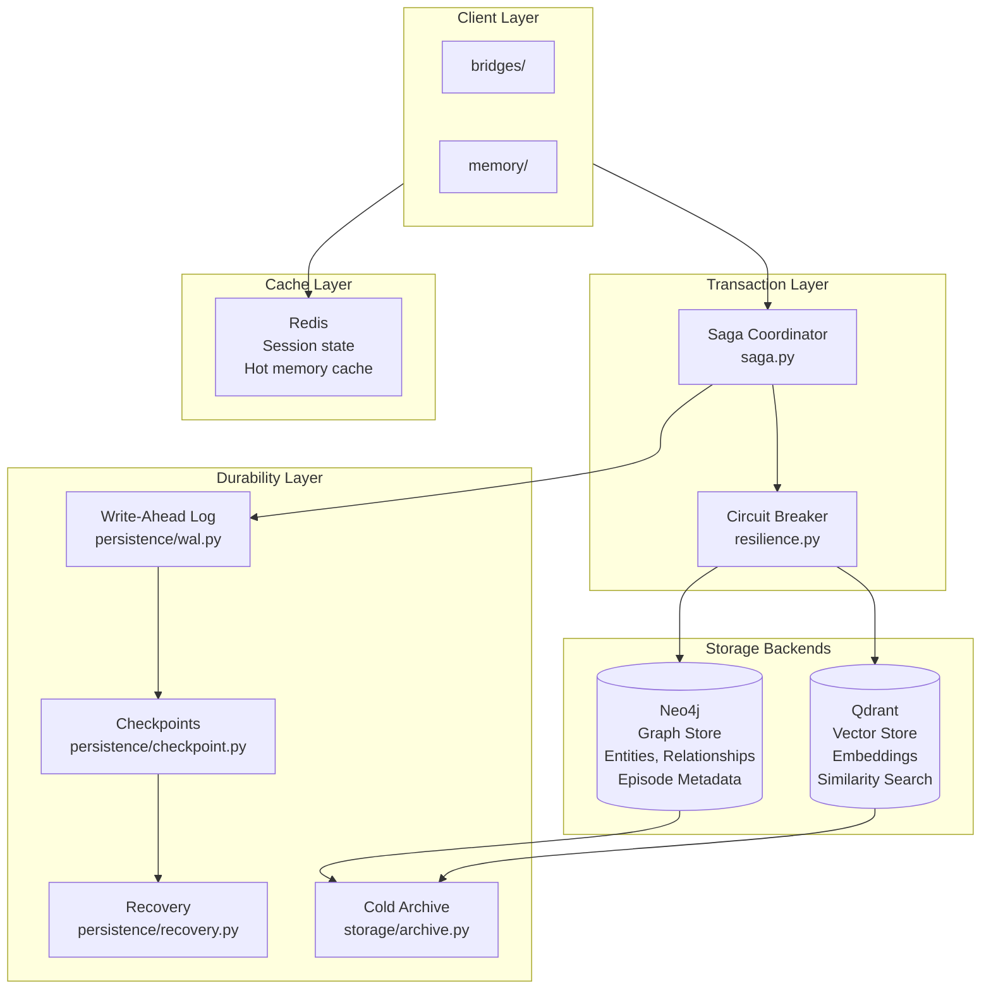
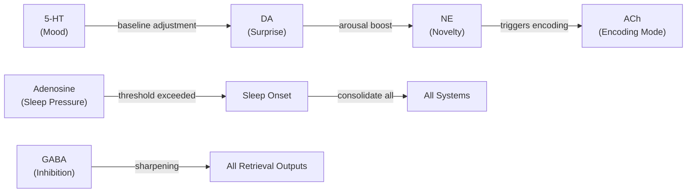
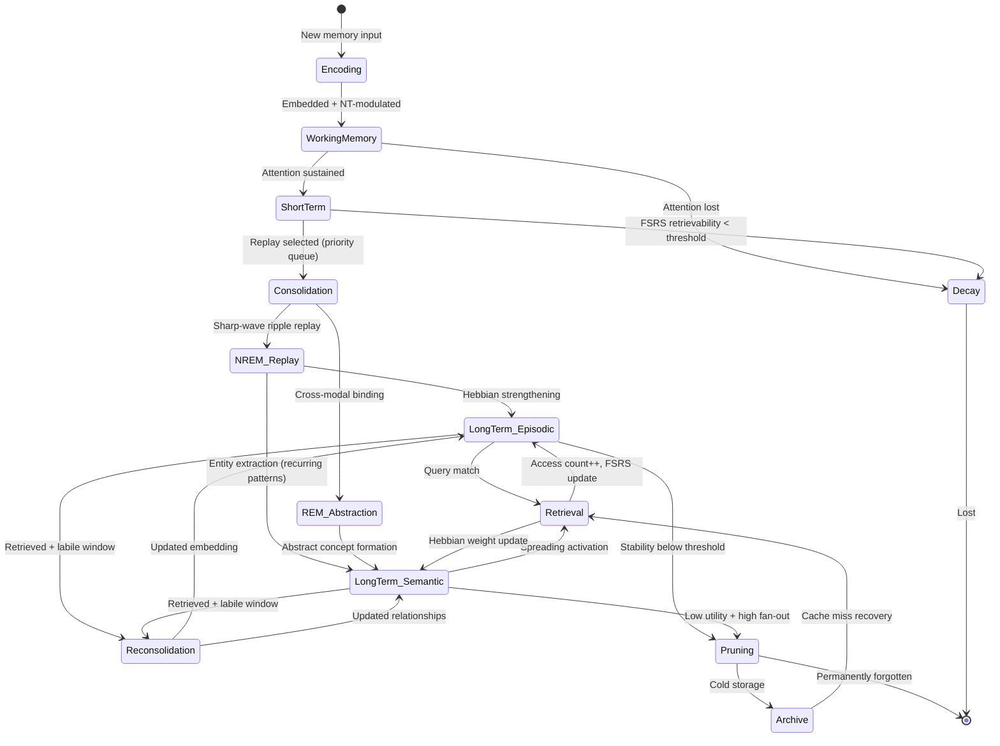

# T4DM System Architecture Master Document

**Version**: 1.0.0 | **Date**: 2026-01-28 | **Status**: Active Development
**Path**: `/mnt/projects/t4d/t4dm/`

Comprehensive architectural reference for T4DM (Temporal 4D Memory), a biologically-inspired tripartite memory system implementing episodic, semantic, and procedural memory with cognitive consolidation, neuromodulator dynamics, FSRS spaced repetition, and world model prediction.

---

## 1. Module Map



### Module Descriptions

| Layer | Module | Files | Purpose |
|-------|--------|-------|---------|
| Core | `core/` | Types, config, memory interface | Foundational types, configuration, main memory API |
| Core | `encoding/` | Time2Vec temporal encoding | Multi-scale temporal encoding for memories |
| Core | `embedding/` | Modulated embeddings | Neuromodulator-gated embedding generation |
| Memory | `memory/` | Episodic, semantic, procedural | Tripartite memory stores (Tulving model) |
| Memory | `consolidation/` | HDBSCAN consolidation | Cluster-based memory consolidation |
| Memory | `dreaming/` | Sleep replay (SWR) | NREM/REM sleep consolidation, sharp-wave ripples |
| Memory | `prediction/` | JEPA, active inference | Latent prediction, predictive coding |
| Learning | `learning/` | ~35 files | Neuromodulators, STDP, Hebbian, three-factor, FSRS |
| Learning | `nca/` | ~40 files | Neural field PDE, brain regions, oscillators, Hinton architectures |
| Learning | `bridges/` | Neo4j+Qdrant memory ops | High-level dual-store memory operations |
| Learning | `temporal/` | Dynamics, lifecycle, sessions | Multi-timescale temporal coordination |
| Storage | `storage/` | Neo4j, Qdrant, saga, circuit breaker | Dual-store backend with saga transactions |
| Storage | `persistence/` | WAL, checkpoints, recovery | Write-ahead log, crash recovery, graceful shutdown |
| Storage | `extraction/` | Entity/relationship extraction | NLP extraction from text content |
| Interface | `api/` | FastAPI routes | REST API endpoints |
| Interface | `cli/` | `t4dm` command | Command-line interface |
| Interface | `mcp/` | Model Context Protocol | MCP server integration |
| Interface | `sdk/` | Python sync/async clients | `WorldWeaverClient`, `AsyncWorldWeaverClient`, agent SDK |
| Interface | `interfaces/` | Abstract interfaces | Protocol definitions for extensibility |
| Interface | `hooks/` | Lifecycle hooks | Pre/post operation hook system |
| Support | `observability/` | Logging, metrics, tracing | Prometheus metrics, structured logging, health checks |
| Support | `visualization/` | 22 visualization modules | Neural dynamics visualization |
| Support | `integration/` | Cross-module integration | Internal module bridges |
| Support | `integrations/` | External service integrations | Third-party service connectors |

---

## 2. Dependency Graph



---

## 3. Store / Retrieve / Consolidate Sequence Diagrams

### 3.1 Memory Store Flow



### 3.2 Memory Retrieve Flow



### 3.3 Consolidation Flow



---

## 4. Learning Modalities Catalog

| Method | File(s) | Biological Basis | Use Case |
|--------|---------|-----------------|----------|
| **Hebbian** | `learning/plasticity.py` | "Fire together, wire together" -- Hebb (1949) | Co-retrieval strengthening of semantic relationships |
| **Anti-Hebbian** | `learning/anti_hebbian.py` | Decorrelation in cortical interneurons | Reduce interference between similar memories |
| **STDP** | `learning/stdp.py` | Spike-timing dependent plasticity -- Bi & Poo (2001) | Temporal causality learning between sequential memories |
| **Three-Factor** | `learning/three_factor.py` | Eligibility x neuromodulator x dopamine | Primary learning rule: `lr = base * eligibility * gate * surprise` |
| **FSRS** | `learning/fsrs.py` | Ebbinghaus forgetting curve + spaced repetition | Memory strength tracking and optimal review scheduling |
| **Causal Discovery** | `learning/causal_discovery.py` | Granger causality + transfer entropy | Learn causal graphs from event sequences |
| **Generative Replay** | `learning/generative_replay.py` | Hippocampal replay during sleep -- Wilson & McNaughton (1994) | Wake-sleep replay for consolidation (Hinton-inspired) |
| **VAE** | `learning/vae_generator.py`, `vae_training.py` | Variational inference in cortical hierarchy | Memory generation and augmentation for replay |
| **Forward-Forward** | `nca/forward_forward.py` | Hinton (2022) -- local goodness without backprop | Layer-local learning via positive/negative data goodness |
| **Capsule Networks** | `nca/capsules.py` | Part-whole hierarchical representation -- Hinton | Pose matrix routing for structured memory representation |
| **Eligibility Traces** | `learning/eligibility.py` | TD(lambda) -- Sutton & Barto; synaptic tags -- Frey & Morris | Temporal credit assignment across multiple timescales |
| **Neuromodulated Plasticity** | `learning/neuromodulators.py` | DA/NE/ACh/5-HT gating of synaptic change | Context-dependent learning rate modulation |
| **Contrastive Learning** | `nca/energy.py` | Hopfield energy landscape + contrastive phases | Attractor-based memory storage and retrieval |
| **Active Inference** | `prediction/` | Free energy minimization -- Friston | Predict future states, minimize surprise |
| **BCM Metaplasticity** | `learning/bcm_metaplasticity.py` | Bienenstock-Cooper-Munro sliding threshold | Adaptive LTP/LTD threshold prevents saturation |
| **Homeostatic** | `learning/homeostatic.py` | Synaptic scaling -- Turrigiano (2004) | Keep neural activity within biological bounds |

---

## 5. Storage Architecture



### Transaction Flow

1. **Saga Coordinator** receives a dual-store mutation request
2. **WAL** logs the intended operation before execution
3. **Step 1**: Qdrant upsert (vector + payload)
4. **Step 2**: Neo4j create (node + edges)
5. **On failure**: Saga runs compensation (rollback step 1)
6. **Circuit Breaker** monitors backend health; opens on repeated failures to prevent cascading outages

### Data Partitioning

| Store | Data | Query Pattern |
|-------|------|---------------|
| Neo4j | Entity nodes, relationships, episode metadata, Hebbian weights | Graph traversal, spreading activation, path queries |
| Qdrant | Embedding vectors with metadata payloads | k-NN similarity search, filtered vector queries |
| Redis | Session state, hot memory cache, rate limiting | Key-value lookup, TTL-based expiry |
| WAL | Mutation log for crash recovery | Sequential replay on startup |
| Archive | Aged-out memories below retrievability threshold | Cold retrieval on cache miss |

---

## 6. Neuromodulator Systems

| Neurotransmitter | Brain Region | Function | Effect on Memory | Implementation |
|-----------------|-------------|----------|-----------------|----------------|
| **Dopamine (DA)** | VTA, Substantia Nigra | Reward prediction error | Surprise-driven learning; positive RPE strengthens, negative weakens | `learning/dopamine.py`, `nca/vta.py` |
| **Norepinephrine (NE)** | Locus Coeruleus | Arousal, novelty detection | High NE broadens retrieval (exploration), increases learning rate, strengthens pattern separation | `learning/norepinephrine.py`, `nca/locus_coeruleus.py` |
| **Acetylcholine (ACh)** | Basal Forebrain | Encoding/retrieval mode switch | High ACh = encoding mode (new learning); Low ACh = retrieval mode (pattern completion) | `learning/acetylcholine.py` |
| **Serotonin (5-HT)** | Raphe Nuclei | Long-term credit assignment, patience | Modulates temporal discounting; high 5-HT = patience for delayed rewards; mood baseline affects all values | `learning/serotonin.py`, `nca/raphe.py` |
| **GABA** | Cortical interneurons | Inhibition, sparse coding | Lateral inhibition sharpens retrieval rankings; winner-take-all competition between similar memories | `learning/inhibition.py` |
| **Adenosine** | Diffuse (sleep pressure) | Sleep pressure accumulation | Triggers consolidation when pressure exceeds threshold; antagonized by NE during wakefulness | `nca/adenosine.py` |

### Neuromodulator Interactions



The `NeuromodulatorOrchestra` (`learning/neuromodulators.py`) coordinates all systems, computing combined learning rate, exploration-exploitation balance, and cognitive mode.

---

## 7. NCA Brain Region Table

| Region | Biological Analog | Function | Outputs | File |
|--------|------------------|----------|---------|------|
| **HippocampalCircuit** | Hippocampal formation (DG/CA3/CA1) | Episodic encoding via pattern separation (DG), auto-association (CA3), output gating (CA1) | Encoded episode vectors, pattern-separated representations | `nca/hippocampus.py` |
| **VTACircuit** | Ventral Tegmental Area | Dopamine reward prediction; phasic bursts for unexpected reward, dips for omission | RPE signal, phasic/tonic DA levels | `nca/vta.py` |
| **LocusCoeruleus** | Locus Coeruleus | Norepinephrine source; surprise model for uncertainty signaling | NE arousal gain, novelty signal | `nca/locus_coeruleus.py` |
| **RapheNucleus** | Dorsal Raphe Nuclei | Serotonin source; patience and temporal discounting | 5-HT mood level, long-term eligibility | `nca/raphe.py` |
| **StriatalMSN** | Striatum (Basal Ganglia) | Action selection via D1 (go) / D2 (no-go) pathways; medium spiny neuron dynamics | Selected action, procedural memory activation | `nca/striatal_msn.py` |
| **NeuralFieldSolver** | Cortical field dynamics | 3D spatiotemporal PDE solver for neurotransmitter concentration fields | NT concentration maps, diffusion dynamics | `nca/neural_field.py` |
| **AttractorBasins** | Cortical attractor networks | Cognitive state attractors: FOCUSED, EXPLORATORY, CONSOLIDATING, RESTING, ALERT | Current cognitive state, transition dynamics | `nca/attractors.py` |
| **FrequencyBandGenerator** | Thalamocortical oscillators | Theta (4-8Hz), gamma (30-100Hz), alpha (8-13Hz), delta (0.5-4Hz) oscillations | Phase signals for encoding/retrieval gating | `nca/oscillators.py` |
| **SleepSpindleGenerator** | Thalamocortical circuits | Sleep spindles (11-16Hz) coupled to delta up-states for memory consolidation | Spindle events triggering replay | `nca/sleep_spindles.py` |
| **AstrocyteLayer** | Astrocytes (glial cells) | Tripartite synapse modulation; glial influence on synaptic transmission | Synaptic gain modulation | `nca/astrocyte.py` |
| **GlymphaticSystem** | Glymphatic clearance | Metabolic waste clearance during sleep; models CSF flow | Waste clearance rate, sleep quality metric | `nca/glymphatic.py` |
| **SpatialCells** | Entorhinal cortex | Place cells and grid cells for cognitive spatial mapping | Spatial context vectors | `nca/spatial_cells.py` |
| **ThetaGammaIntegration** | Hippocampal/PFC circuits | Working memory slot binding via theta-gamma phase-amplitude coupling | WM slot assignments (7+/-2 capacity) | `nca/theta_gamma_integration.py` |

---

## 8. Memory Lifecycle State Diagram



### Lifecycle Phases (from `temporal/lifecycle.py`)

| Phase | Duration | Trigger | Key Process |
|-------|----------|---------|-------------|
| **Encoding** | Milliseconds | New input | Time2Vec + embedding + NT modulation |
| **Working Memory** | Seconds-minutes | Active attention | Theta-gamma slot binding (7+/-2) |
| **Short-term** | Minutes-hours | Sustained relevance | FSRS tracking, eligibility traces active |
| **Consolidation** | Hours (during sleep) | Adenosine pressure threshold | NREM replay, REM abstraction, pruning |
| **Long-term** | Days-indefinite | Successful consolidation | Graph storage, retrievability decay |
| **Reconsolidation** | Minutes (lability window) | Retrieval reactivation | Three-factor update, embedding modification |
| **Decay/Archive** | Continuous | FSRS R < 0.1 | Archive to cold storage or prune |

---

## 9. Module Integration Matrix

This matrix shows which modules directly depend on which others. Rows depend on columns.

| Module | core | encoding | embedding | memory | consolidation | dreaming | prediction | learning | nca | bridges | temporal | storage | persistence | extraction | api | cli | mcp | sdk | interfaces | hooks | observability | visualization | integration | integrations |
|--------|:----:|:--------:|:---------:|:------:|:-------------:|:--------:|:----------:|:--------:|:---:|:-------:|:--------:|:-------:|:-----------:|:----------:|:---:|:---:|:---:|:---:|:----------:|:-----:|:-------------:|:-------------:|:-----------:|:------------:|
| **core** | - | X | X | | | | | | | | | | | | | | | | X | | | | | |
| **encoding** | X | - | | | | | | | | | | | | | | | | | | | | | | |
| **embedding** | X | X | - | | | | | X | | | | | | | | | | | | | | | | |
| **memory** | X | | X | - | | | | X | | | | X | | X | | | | | X | | | | | |
| **consolidation** | X | | | X | - | | | X | | | | X | | | | | | | | | | | | |
| **dreaming** | X | | | X | X | - | | X | X | | | X | | | | | | | | | | | | |
| **prediction** | X | X | | X | | | - | | | | | | | | | | | | | | | | | |
| **learning** | X | | | | | | | - | X | | X | | | | | | | | | | | | | |
| **nca** | X | X | | | | | | X | - | | | | | | | | | | | | | | | |
| **bridges** | X | | | X | | | | | | - | | X | | | | | | | | | | | | |
| **temporal** | X | | | | X | X | | X | | | - | | | | | | | | | | | | | |
| **storage** | X | | | | | | | | | | | - | X | | | | | | | | X | | | |
| **persistence** | X | | | | | | | | | | | | - | | | | | | | | X | | | |
| **extraction** | X | | X | | | | | | | | | | | - | | | | | | | | | | |
| **api** | X | | | | | | | | | | | | | | - | | | | | X | X | | | |
| **cli** | X | | | | | | | | | | | | | | X | - | | | | | | | | |
| **mcp** | X | | | | | | | | | | | | | | X | | - | | | | | | | |
| **sdk** | | | | | | | | | | | | | | | X | | | - | | | | | | |
| **hooks** | X | | | | | | | X | | | | | | | | | | | | - | X | | | |
| **observability** | X | | | | | | | | | | | | | | | | | | | | - | | | |
| **visualization** | | | | X | | | | X | X | | | | | | | | | | | | | - | | |
| **integration** | X | | | X | | | | X | X | | | | | | | | | | | | | | - | |
| **integrations** | X | | | | | | | | | | | | | | | | | | | | | | | - |

### Key Dependency Clusters

1. **Core Cluster**: `core` <- `encoding` <- `embedding` (foundation for all)
2. **Memory Cluster**: `memory` <- `consolidation` <- `dreaming` (memory lifecycle)
3. **Learning Cluster**: `learning` <-> `nca` <-> `temporal` (bidirectional neural dynamics)
4. **Storage Cluster**: `storage` <- `persistence` <- `observability` (data durability)
5. **Interface Cluster**: `api` <- `cli`, `mcp`, `sdk` (all access through API)

---

## 10. Master Decision Trace

```mermaid
flowchart TB
    %% External Inputs
    UQ(["User Query"])
    NC(["New Content"])
    TS(["Timer/Schedule"])
    EA(["External API"])

    %% External Outputs
    AR(["API Response"])
    SM(["Stored Memory"])
    CK(["Consolidated Knowledge"])
    VIS(["Visualization"])
    MET(["Metrics"])

    subgraph Interface["Interface Layer"]
        api["api/"]
        cli["cli/"]
        mcp["mcp/"]
        sdk["sdk/"]
        hooks["hooks/"]
        interfaces["interfaces/"]
    end

    subgraph Core["Core Layer"]
        core["core/"]
        encoding["encoding/"]
        embedding["embedding/"]
    end

    subgraph Memory["Memory Layer"]
        memory["memory/"]
        consolidation["consolidation/"]
        dreaming["dreaming/"]
        prediction["prediction/"]
    end

    subgraph Learning["Learning Layer"]
        learning["learning/"]
        nca["nca/"]
        bridges["bridges/"]
        temporal["temporal/"]
    end

    subgraph Storage["Storage Layer"]
        storage["storage/"]
        persistence["persistence/"]
        extraction["extraction/"]
    end

    subgraph Support["Support Layer"]
        observability["observability/"]
        visualization["visualization/"]
        integration["integration/"]
        integrations["integrations/"]
    end

    %% External inputs to interface
    UQ -->|"query text"| api
    UQ -->|"CLI args"| cli
    NC -->|"content payload"| api
    EA -->|"MCP request"| mcp
    TS -->|"cron trigger"| temporal

    %% Interface to core
    cli -->|"parsed command"| api
    mcp -->|"tool call"| api
    sdk -->|"client request"| api
    api -->|"validated request"| core
    api -->|"lifecycle event"| hooks
    hooks -->|"metrics"| observability

    %% Core processing
    core -->|"timestamp"| encoding
    encoding -->|"time2vec vector"| embedding
    core -->|"content"| embedding
    embedding -->|"modulated embedding"| core
    core -->|"content text"| extraction

    %% Core to memory
    core -->|"episode"| memory
    extraction -->|"entities + relations"| memory

    %% Memory operations
    memory -->|"vector + payload"| storage
    memory -->|"scored candidates"| learning
    memory -->|"episode batch"| consolidation
    consolidation -->|"clusters"| memory
    consolidation -->|"weak connections"| storage

    %% Dreaming / consolidation
    temporal -->|"adenosine signal"| dreaming
    dreaming -->|"replay batch"| consolidation
    dreaming -->|"replay candidates"| learning
    dreaming -->|"SWR events"| nca

    %% Learning
    learning -->|"NT levels"| embedding
    learning -->|"RPE signal"| nca
    learning -->|"weight updates"| storage
    nca -->|"oscillation phase"| encoding
    nca -->|"DA/NE/ACh/5-HT levels"| learning
    temporal -->|"phase state"| learning
    temporal -->|"schedule"| consolidation
    temporal -->|"sleep trigger"| dreaming

    %% Prediction
    prediction -->|"predicted state"| memory
    prediction -->|"temporal context"| encoding
    memory -->|"recent episodes"| prediction

    %% Bridges
    bridges -->|"dual-store op"| storage
    bridges -->|"enriched result"| memory

    %% Storage
    storage -->|"WAL entry"| persistence
    persistence -->|"checkpoint"| storage
    storage -->|"telemetry"| observability

    %% Integration / support
    integration -->|"cross-module sync"| learning
    integration -->|"state sync"| memory
    integration -->|"NCA sync"| nca
    integrations -->|"external data"| core

    %% Visualization
    visualization -->|"rendered view"| VIS
    nca -->|"dynamics data"| visualization
    memory -->|"memory graph"| visualization
    learning -->|"plasticity data"| visualization

    %% External outputs
    api -->|"JSON response"| AR
    storage -->|"persisted"| SM
    consolidation -->|"semantic entities"| CK
    observability -->|"prometheus"| MET
```



---

## Appendix: Key Equations

```mermaid
mindmap
  root((Key Equations))
    Temporal Encoding
      Time2Vec
        Linear: omega_i * tau + phi_i
        Periodic: sin(omega_i * tau + phi_i)
    Memory Retrieval
      FSRS Retrievability
        R = (1 + 0.9 * t/S)^-0.5
      ACT-R Activation
        A_i = B_i + sum W_j S_ji + epsilon
        B_i = ln sum t_j^-d, d=0.5
      Modern Hopfield
        softmax(beta * X^T * query) * X
    Learning Rules
      Three-Factor
        lr * eligibility * gate * surprise
      STDP
        LTP: A+ exp(-dt/tau+)
        LTD: -A- exp(dt/tau-)
    Reward
      Dopamine RPE
        delta = actual - expected
```

---

*Generated from CLAUDE.md files across 25 modules in `/mnt/projects/t4d/t4dm/src/t4dm/`*
