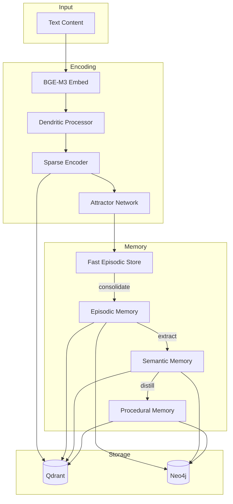
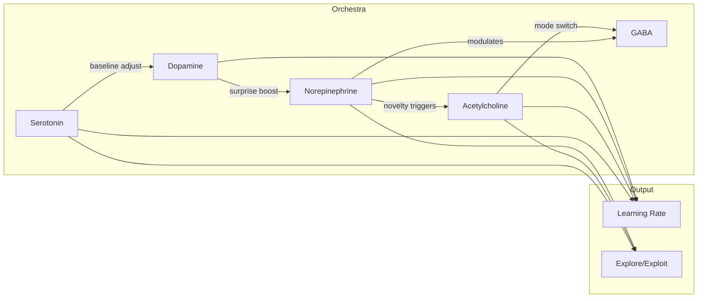

# Biologically-Inspired Integration Diagrams
## Visual Architecture Documentation

**Date**: 2025-12-06
**Companion to**: `BIOINSPIRED_INTEGRATION.md`

---

## 1. System Architecture Overview

### 1.1 Full Stack Diagram

```
┌─────────────────────────────────────────────────────────────────────────────────────┐
│                                    FRONTEND                                          │
│  ┌─────────────┐  ┌─────────────┐  ┌─────────────┐  ┌─────────────┐  ┌────────────┐ │
│  │MemoryGraph  │  │BioDashboard │  │TracingDash  │  │ ConfigPanel │  │ DocsPanel  │ │
│  │   (3D viz)  │  │(neuro viz)  │  │(flow trace) │  │ (all params)│  │(SDK docs)  │ │
│  └──────┬──────┘  └──────┬──────┘  └──────┬──────┘  └──────┬──────┘  └─────┬──────┘ │
│         └────────────────┴────────────────┴────────────────┴───────────────┘        │
│                                          │                                           │
│                            HTTP/WebSocket (localhost:3000)                           │
└──────────────────────────────────────────┬──────────────────────────────────────────┘
                                           │
┌──────────────────────────────────────────┴──────────────────────────────────────────┐
│                                   API GATEWAY                                        │
│  ┌──────────────────────────────────────────────────────────────────────────────┐   │
│  │                         FastAPI Backend (:8765)                               │   │
│  │  /api/v1/config    /api/v1/memory    /api/v1/encoding    /api/v1/bio         │   │
│  └──────────────────────────────────────────────────────────────────────────────┘   │
│  ┌──────────────────────────────────────────────────────────────────────────────┐   │
│  │                        MCP Server (17+ tools)                                 │   │
│  │  remember_episode  recall_entities  encode_sparse  attractor_complete        │   │
│  └──────────────────────────────────────────────────────────────────────────────┘   │
└──────────────────────────────────────────┬──────────────────────────────────────────┘
                                           │
┌──────────────────────────────────────────┴──────────────────────────────────────────┐
│                                 CORE WW ENGINE                                       │
│                                                                                      │
│  ┌────────────────────────────────LEARNING LAYER────────────────────────────────┐   │
│  │ NeuromodulatorOrchestra │ EligibilityTrace │ LearnedScorer │ ExperienceReplay │   │
│  │ (DA/NE/ACh/5-HT/GABA)   │ (TD-λ credit)    │ (ListMLE)     │ (Prioritized)    │   │
│  └──────────────────────────────────────────────────────────────────────────────┘   │
│                                                                                      │
│  ┌────────────────────────────────ENCODING LAYER (NEW)──────────────────────────┐   │
│  │ ┌──────────────────┐  ┌──────────────────┐  ┌──────────────────┐             │   │
│  │ │ DendriticProc    │─►│ SparseEncoder    │─►│ AttractorNetwork │             │   │
│  │ │ 2-compartment    │  │ k-WTA (2%)       │  │ Hopfield settle  │             │   │
│  │ │ mismatch signal  │  │ 8192-dim         │  │ pattern complete │             │   │
│  │ └──────────────────┘  └──────────────────┘  └──────────────────┘             │   │
│  └──────────────────────────────────────────────────────────────────────────────┘   │
│                                                                                      │
│  ┌────────────────────────────────MEMORY LAYER──────────────────────────────────┐   │
│  │ ┌────────────────┐  ┌────────────────┐  ┌────────────────┐  ┌──────────────┐ │   │
│  │ │ FastEpisodic   │  │ Episodic       │  │ Semantic       │  │ Procedural   │ │   │
│  │ │ Store (NEW)    │  │ Memory         │  │ Memory         │  │ Memory       │ │   │
│  │ │ 10K, 100x LR   │  │ FSRS decay     │  │ ACT-R + Hebb   │  │ success rate │ │   │
│  │ └────────────────┘  └────────────────┘  └────────────────┘  └──────────────┘ │   │
│  └──────────────────────────────────────────────────────────────────────────────┘   │
│                                                                                      │
│  ┌────────────────────────────────STORAGE LAYER─────────────────────────────────┐   │
│  │    ┌────────────────────────┐          ┌────────────────────────┐            │   │
│  │    │       Qdrant           │          │        Neo4j           │            │   │
│  │    │  - episodes (1024d)    │          │  - Entity graph        │            │   │
│  │    │  - entities (1024d)    │          │  - Relationships       │            │   │
│  │    │  - sparse_codes (NEW)  │          │  - Provenance          │            │   │
│  │    │  - procedures (1024d)  │          │  - Attractor states    │            │   │
│  │    └────────────────────────┘          └────────────────────────┘            │   │
│  └──────────────────────────────────────────────────────────────────────────────┘   │
└─────────────────────────────────────────────────────────────────────────────────────┘
```

---

## 2. Data Flow Diagrams

### 2.1 Encoding Pipeline

```
┌──────────────────────────────────────────────────────────────────────────────────┐
│                           ENCODING PIPELINE                                       │
│                                                                                   │
│   Input Text                                                                      │
│       │                                                                          │
│       ▼                                                                          │
│   ┌───────────────┐                                                              │
│   │  BGE-M3       │  Output: [1024-dim dense vector]                            │
│   │  Embedding    │                                                              │
│   └───────┬───────┘                                                              │
│           │                                                                       │
│           ▼                                                                       │
│   ┌───────────────┐                                                              │
│   │  Dendritic    │  Input:  x (query), h (context from WM)                      │
│   │  Processor    │  Output: soma activation + mismatch δ                        │
│   │               │                                                              │
│   │  d = σ(W_d·x) │◄── Dendritic: local input processing                        │
│   │  s = σ(W_s·h + U·d)│◄── Somatic: context integration                        │
│   │  δ = s - d    │◄── Mismatch: prediction error signal                        │
│   └───────┬───────┘                                                              │
│           │                                                                       │
│           ▼                                                                       │
│   ┌───────────────┐                                                              │
│   │  Sparse       │  Input:  [512-dim] from dendritic soma                       │
│   │  Encoder      │  Output: [8192-dim sparse, ~2% active]                       │
│   │               │                                                              │
│   │  z = W_enc·x  │◄── Linear expansion (16x)                                   │
│   │  h = kWTA(z)  │◄── Keep top 2% (164 neurons)                                │
│   └───────┬───────┘                                                              │
│           │                                                                       │
│           ├──────────────────────┬─────────────────────────┐                     │
│           ▼                      ▼                         ▼                     │
│   ┌───────────────┐      ┌───────────────┐        ┌───────────────┐             │
│   │  Attractor    │      │  FastEpisodic │        │  Qdrant       │             │
│   │  Network      │      │  Store        │        │  (backup)     │             │
│   │               │      │               │        │               │             │
│   │  - Settle     │      │  - If salient │        │  - Always     │             │
│   │  - Complete   │      │  - Quick acc. │        │  - Dense vec  │             │
│   └───────────────┘      └───────────────┘        └───────────────┘             │
│                                                                                   │
└──────────────────────────────────────────────────────────────────────────────────┘
```

### 2.2 Retrieval Pipeline

```
┌──────────────────────────────────────────────────────────────────────────────────┐
│                           RETRIEVAL PIPELINE                                      │
│                                                                                   │
│   Query Text                                                                      │
│       │                                                                          │
│       ▼                                                                          │
│   ┌───────────────────────────────────────────────────────────────────┐          │
│   │                    PARALLEL SEARCH PATHS                          │          │
│   │                                                                   │          │
│   │   Path A: Dense                Path B: Sparse (NEW)              │          │
│   │   ┌──────────────┐            ┌──────────────┐                   │          │
│   │   │ BGE-M3 embed │            │ Encode sparse│                   │          │
│   │   └──────┬───────┘            └──────┬───────┘                   │          │
│   │          │                           │                            │          │
│   │          ▼                           ▼                            │          │
│   │   ┌──────────────┐            ┌──────────────┐                   │          │
│   │   │ Qdrant cosine│            │ FES pattern  │                   │          │
│   │   │ similarity   │            │ match + CA3  │                   │          │
│   │   └──────┬───────┘            └──────┬───────┘                   │          │
│   │          │                           │                            │          │
│   │          └─────────────┬─────────────┘                            │          │
│   │                        │                                          │          │
│   └────────────────────────┼──────────────────────────────────────────┘          │
│                            ▼                                                      │
│                    ┌───────────────┐                                             │
│                    │    FUSION     │                                             │
│                    │  w_dense=0.6  │                                             │
│                    │  w_sparse=0.4 │                                             │
│                    └───────┬───────┘                                             │
│                            │                                                      │
│                            ▼                                                      │
│                    ┌───────────────┐                                             │
│                    │   SCORING     │                                             │
│                    │               │                                             │
│                    │ - ACT-R       │                                             │
│                    │ - FSRS decay  │                                             │
│                    │ - Neuromod    │                                             │
│                    └───────┬───────┘                                             │
│                            │                                                      │
│                            ▼                                                      │
│                    ┌───────────────┐                                             │
│                    │   INHIBITION  │                                             │
│                    │   (GABA)      │                                             │
│                    │ Winner-take-  │                                             │
│                    │   more        │                                             │
│                    └───────┬───────┘                                             │
│                            │                                                      │
│                            ▼                                                      │
│                       Top-K Results                                              │
│                                                                                   │
└──────────────────────────────────────────────────────────────────────────────────┘
```

---

## 3. Neuromodulator System

### 3.1 Orchestra Interactions

```
┌────────────────────────────────────────────────────────────────────────────────┐
│                      NEUROMODULATOR ORCHESTRA                                   │
│                                                                                 │
│   ┌─────────────┐     triggers      ┌─────────────┐                            │
│   │  Dopamine   │─────────────────►│Norepinephrine│                            │
│   │    (DA)     │   (surprise→     │    (NE)     │                            │
│   │             │    arousal)      │             │                            │
│   │ RPE signal  │                  │ Novelty/gain│                            │
│   └──────┬──────┘                  └──────┬──────┘                            │
│          │                                │                                    │
│          │ ┌──────────────────────────────┼──────────────────────────┐        │
│          │ │          modulates           │                          │        │
│          ▼ ▼                              ▼                          │        │
│   ┌─────────────┐                  ┌─────────────┐                   │        │
│   │ Serotonin   │                  │Acetylcholine│                   │        │
│   │   (5-HT)    │                  │   (ACh)     │                   │        │
│   │             │    adjusts       │             │                   │        │
│   │ Long-term   │◄────────────────│ Encode/     │                   │        │
│   │ credit      │    baseline      │ Retrieve    │                   │        │
│   └──────┬──────┘                  └──────┬──────┘                   │        │
│          │                                │                          │        │
│          │                                │      NE triggers         │        │
│          │                                │      encoding mode       │        │
│          └────────────────┬───────────────┘                          │        │
│                           │                                          │        │
│                           ▼                                          │        │
│                    ┌─────────────┐                                   │        │
│                    │    GABA     │◄──────────────────────────────────┘        │
│                    │ (Inhibition)│    All systems influence                   │
│                    │             │    inhibitory dynamics                     │
│                    │ Sparsity    │                                            │
│                    │ control     │                                            │
│                    └─────────────┘                                            │
│                                                                                 │
│   Learning Rate Formula:                                                        │
│   ┌─────────────────────────────────────────────────────────────────────────┐  │
│   │  η_eff = η_base × g_DA × g_NE × g_ACh × g_5HT                          │  │
│   │                                                                         │  │
│   │  g_DA = max(0.1, 1 + ρ_DA × δ)      ρ_DA = 2.0                        │  │
│   │  g_NE = 1 + ρ_NE × σ(NE)            ρ_NE = 1.5                        │  │
│   │  g_ACh = 1 + ρ_ACh × ACh            ρ_ACh = 3.0 (FES) / 0.5 (std)    │  │
│   │  g_5HT = 0.5 + 0.5 × 5HT                                               │  │
│   └─────────────────────────────────────────────────────────────────────────┘  │
│                                                                                 │
└────────────────────────────────────────────────────────────────────────────────┘
```

### 3.2 State Transitions

```
                        HIGH NOVELTY
                             │
                             ▼
┌─────────────────────────────────────────────────────────┐
│                    ENCODING MODE                         │
│                                                          │
│  NE: HIGH (1.5-2.0)    ACh: ENCODING                    │
│  DA: VARIES            Learning Rate: HIGH (3x boost)   │
│                                                          │
│  Actions:                                                │
│  - Store to FES immediately                              │
│  - Full sparse encoding                                  │
│  - Attractor storage                                     │
└─────────────────────────────────────────────────────────┘
                             │
                     FAMILIARITY INCREASES
                             │
                             ▼
┌─────────────────────────────────────────────────────────┐
│                    BALANCED MODE                         │
│                                                          │
│  NE: MEDIUM (1.0)      ACh: BALANCED                    │
│  DA: TRACKING          Learning Rate: STANDARD (1x)     │
│                                                          │
│  Actions:                                                │
│  - Normal encoding/retrieval                             │
│  - Context-dependent gating                              │
│  - Standard memory updates                               │
└─────────────────────────────────────────────────────────┘
                             │
                      TASK COMPLETION
                             │
                             ▼
┌─────────────────────────────────────────────────────────┐
│                    RETRIEVAL MODE                        │
│                                                          │
│  NE: LOW (0.7-1.0)     ACh: RETRIEVAL                   │
│  DA: OUTCOME-BASED     Learning Rate: LOW (0.7x)        │
│                                                          │
│  Actions:                                                │
│  - Prioritize recall over storage                        │
│  - Attractor pattern completion                          │
│  - Credit assignment via 5-HT                            │
└─────────────────────────────────────────────────────────┘
```

---

## 4. Memory Consolidation Flow

### 4.1 Consolidation Pipeline

```
┌─────────────────────────────────────────────────────────────────────────────────┐
│                        CONSOLIDATION PIPELINE                                    │
│                                                                                  │
│   ┌─────────────────────────────────────────────────────────────────────────┐   │
│   │                      FAST EPISODIC STORE (FES)                          │   │
│   │                                                                         │   │
│   │   ┌──────┐ ┌──────┐ ┌──────┐ ┌──────┐ ┌──────┐        Capacity: 10K    │   │
│   │   │ mem1 │ │ mem2 │ │ mem3 │ │ mem4 │ │ ...  │        LR: 100x         │   │
│   │   │ S=0.8│ │ S=0.3│ │ S=0.9│ │ S=0.2│ │      │        S = salience     │   │
│   │   └──┬───┘ └──────┘ └──┬───┘ └──────┘ └──────┘                          │   │
│   │      │    EVICT       │     EVICT                                       │   │
│   │      │    (low S)     │     (low S)                                     │   │
│   │      ▼                ▼                                                 │   │
│   │   CONSOLIDATE     CONSOLIDATE                                           │   │
│   │   (S > 0.7)       (S > 0.7)                                             │   │
│   └──────┼────────────────┼─────────────────────────────────────────────────┘   │
│          │                │                                                      │
│          ▼                ▼                                                      │
│   ┌─────────────────────────────────────────────────────────────────────────┐   │
│   │                      EPISODIC MEMORY                                    │   │
│   │                                                                         │   │
│   │   - FSRS decay applied                                                  │   │
│   │   - Standard learning rate                                              │   │
│   │   - Long-term storage                                                   │   │
│   │                                                                         │   │
│   │   After N episodes with common theme:                                   │   │
│   │   ┌──────────────────────────────────────────────────────────────────┐  │   │
│   │   │ HDBSCAN clustering → Extract entities → Create/update semantic   │  │   │
│   │   └──────────────────────────────────────────────────────────────────┘  │   │
│   └──────┬──────────────────────────────────────────────────────────────────┘   │
│          │                                                                      │
│          ▼                                                                      │
│   ┌─────────────────────────────────────────────────────────────────────────┐   │
│   │                      SEMANTIC MEMORY                                    │   │
│   │                                                                         │   │
│   │   ┌─────────┐    USES     ┌─────────┐                                   │   │
│   │   │Entity A │────────────►│Entity B │                                   │   │
│   │   │ (tool)  │             │(concept)│                                   │   │
│   │   └────┬────┘             └────┬────┘                                   │   │
│   │        │                       │                                        │   │
│   │        │  SOURCE_OF            │                                        │   │
│   │        ▼                       │                                        │   │
│   │   ┌─────────┐                  │                                        │   │
│   │   │Episode 1│                  │                                        │   │
│   │   │Episode 2│◄─────────────────┘                                        │   │
│   │   │Episode 3│                                                           │   │
│   │   └─────────┘                                                           │   │
│   │                                                                         │   │
│   │   After repeated successful patterns:                                   │   │
│   │   ┌──────────────────────────────────────────────────────────────────┐  │   │
│   │   │ Pattern detection → Distill procedure → Store to procedural      │  │   │
│   │   └──────────────────────────────────────────────────────────────────┘  │   │
│   └──────┬──────────────────────────────────────────────────────────────────┘   │
│          │                                                                      │
│          ▼                                                                      │
│   ┌─────────────────────────────────────────────────────────────────────────┐   │
│   │                      PROCEDURAL MEMORY                                  │   │
│   │                                                                         │   │
│   │   ┌──────────────────────────────────────────────────────────────────┐  │   │
│   │   │ Procedure: "Fix TypeScript errors"                               │  │   │
│   │   │ Steps: 1. Read error → 2. Check types → 3. Fix → 4. Verify       │  │   │
│   │   │ Success Rate: 87%                                                │  │   │
│   │   │ Executions: 23                                                   │  │   │
│   │   └──────────────────────────────────────────────────────────────────┘  │   │
│   └─────────────────────────────────────────────────────────────────────────┘   │
│                                                                                  │
└─────────────────────────────────────────────────────────────────────────────────┘
```

---

## 5. Attractor Network Dynamics

### 5.1 Energy Landscape

```
Energy
  │
  │     ╭─╮
  │    ╱   ╲         ╭─╮
  │   ╱     ╲       ╱   ╲            ╭─╮
  │  ╱       ╲     ╱     ╲          ╱   ╲
  │ ╱         ╲   ╱       ╲        ╱     ╲
  │╱           ╲ ╱         ╲      ╱       ╲
  ├─────────────●───────────●────●─────────●───────► State
  │            A₁          A₂   A₃        A₄
  │         (stored)    (stored)(stored)(stored)
  │
  │  A₁, A₂, A₃, A₄ = Attractor basins (stable states)
  │  ● = Local energy minima (stored patterns)
  │
  │  Given noisy input x̃:
  │  - Settle dynamics: x_{t+1} = tanh(W·x_t - θ)
  │  - Energy: E(x) = -½x^T W x + θ^T x
  │  - Converges to nearest attractor in ~10 steps
```

### 5.2 Pattern Completion Example

```
┌────────────────────────────────────────────────────────────────────────────┐
│                    ATTRACTOR PATTERN COMPLETION                             │
│                                                                             │
│   Stored Pattern (8192-dim, 2% active = 164 neurons):                      │
│   [0,0,1,0,0,0,0,1,0,0,0,1,...,0,0,1,0,0]                                  │
│                                                                             │
│   Noisy Input (30% corrupted):                                             │
│   [0,1,1,0,0,0,0,0,0,0,0,1,...,0,0,1,0,1]                                  │
│      ▲               ▲                    ▲                                │
│      │               │                    │                                │
│   corrupted     corrupted            corrupted                             │
│                                                                             │
│   ───────────────────────────────────────────────────────────────────────  │
│                                                                             │
│   Step 0: x = noisy_input                                                  │
│   Step 1: x = tanh(W·x - θ)     Energy: 12.4                              │
│   Step 2: x = tanh(W·x - θ)     Energy: 8.7                               │
│   Step 3: x = tanh(W·x - θ)     Energy: 5.2                               │
│   ...                                                                       │
│   Step 8: x = tanh(W·x - θ)     Energy: 0.3                               │
│   Step 9: x = tanh(W·x - θ)     Energy: 0.3 (converged)                   │
│                                                                             │
│   Output (recovered):                                                       │
│   [0,0,1,0,0,0,0,1,0,0,0,1,...,0,0,1,0,0]                                  │
│                                                                             │
│   All corrupted bits recovered!                                             │
└────────────────────────────────────────────────────────────────────────────┘
```

---

## 6. Component Interface Diagram

### 6.1 Python Module Structure

```
ww/
├── encoding/                     # NEW: CompBio encoding layer
│   ├── __init__.py
│   ├── dendritic.py             # DendriticProcessor class
│   │   └── class DendriticProcessor:
│   │       - forward(x, context) → (soma, mismatch)
│   │       - get_mismatch_signal() → δ
│   │
│   ├── sparse.py                # SparseEncoder class
│   │   └── class SparseEncoder:
│   │       - encode(x) → sparse_code
│   │       - decode(code) → reconstruction
│   │       - kwta(z, k) → sparse_z
│   │
│   └── attractor.py             # AttractorNetwork class
│       └── class AttractorNetwork:
│           - settle(initial, steps) → stable
│           - store_pattern(pattern) → None
│           - energy(state) → float
│
├── memory/
│   ├── episodic.py              # Existing
│   ├── semantic.py              # Existing
│   ├── procedural.py            # Existing
│   ├── pattern_separation.py    # Existing (DentateGyrus)
│   ├── working_memory.py        # Existing
│   └── fast_episodic.py         # NEW: FastEpisodicStore
│       └── class FastEpisodicStore:
│           - store(pattern, context, salience) → None
│           - retrieve(query, top_k) → list[Memory]
│           - consolidate(threshold) → list[Memory]
│           - get_statistics() → dict
│
├── learning/
│   ├── dopamine.py              # Existing
│   ├── norepinephrine.py        # Existing
│   ├── acetylcholine.py         # Existing
│   ├── serotonin.py             # Existing
│   ├── inhibition.py            # Existing
│   ├── neuromodulators.py       # Existing (ENHANCED)
│   │   └── class NeuromodulatorOrchestra:
│   │       + compute_learning_rate(base, store_type) → float
│   │       + get_gain_factors() → dict[str, float]
│   │
│   └── eligibility.py           # NEW: Eligibility traces
│       └── class EligibilityTrace:
│           - update(pre, post) → None
│           - decay(dt) → None
│           - get_traces() → Tensor
│
├── consolidation/
│   ├── service.py               # Existing
│   └── fes_consolidator.py      # NEW: FES-specific
│       └── class FESConsolidator:
│           - select_candidates(threshold) → list
│           - transfer_to_episodic(memories) → int
│           - cleanup_fes() → int
│
└── core/
    └── config.py                # ENHANCED
        └── @dataclass BioinspiredConfig:
            - dendritic: DendriticConfig
            - sparse_encoder: SparseEncoderConfig
            - attractor: AttractorConfig
            - fast_episodic: FastEpisodicConfig
            - eligibility: EligibilityTraceConfig
            - rho_da, rho_ne, rho_ach_fast, rho_ach_slow
```

---

## 7. Frontend Component Diagram

### 7.1 ConfigPanel Structure

```
┌─────────────────────────────────────────────────────────────────────────────┐
│                            ConfigPanel.tsx                                   │
│                                                                              │
│  ┌─────────────────────────────────────────────────────────────────────┐    │
│  │ STANDARD CONFIGS (Existing)                                          │    │
│  │  ┌────────────┐ ┌────────────┐ ┌────────────┐ ┌────────────┐        │    │
│  │  │   FSRS     │ │   ACT-R    │ │  Hebbian   │ │ Neuromod   │        │    │
│  │  └────────────┘ └────────────┘ └────────────┘ └────────────┘        │    │
│  │  ┌────────────┐ ┌────────────┐ ┌────────────┐ ┌────────────┐        │    │
│  │  │ PatternSep │ │MemoryGate  │ │Consolidate │ │  Weights   │        │    │
│  │  └────────────┘ └────────────┘ └────────────┘ └────────────┘        │    │
│  └─────────────────────────────────────────────────────────────────────┘    │
│                                                                              │
│  ┌─────────────────────────────────────────────────────────────────────┐    │
│  │ BIOINSPIRED CONFIGS (NEW)                                            │    │
│  │                                                                      │    │
│  │  ┌────────────────────────────────────────────────────────────────┐  │    │
│  │  │ Master Toggle: [x] Enable Bioinspired Components               │  │    │
│  │  └────────────────────────────────────────────────────────────────┘  │    │
│  │                                                                      │    │
│  │  ┌──────────────────┐  ┌──────────────────┐  ┌──────────────────┐   │    │
│  │  │ DENDRITIC        │  │ SPARSE ENCODER   │  │ ATTRACTOR        │   │    │
│  │  │                  │  │                  │  │                  │   │    │
│  │  │ hidden_dim: 512  │  │ hidden_dim: 8192 │  │ steps: 10        │   │    │
│  │  │ context_dim: 512 │  │ sparsity: 0.02   │  │ noise_std: 0.01  │   │    │
│  │  │ coupling: 0.5    │  │ use_kwta: true   │  │ adapt_tau: 200   │   │    │
│  │  │ tau_d: 10.0 ms   │  │ inhibition: 0.2  │  │ step_size: 0.1   │   │    │
│  │  │ tau_s: 15.0 ms   │  │                  │  │                  │   │    │
│  │  └──────────────────┘  └──────────────────┘  └──────────────────┘   │    │
│  │                                                                      │    │
│  │  ┌──────────────────┐  ┌──────────────────┐                         │    │
│  │  │ FAST EPISODIC    │  │ NEUROMOD GAINS   │                         │    │
│  │  │                  │  │                  │                         │    │
│  │  │ capacity: 10000  │  │ rho_da: 2.0      │                         │    │
│  │  │ learning_rate:   │  │ rho_ne: 1.5      │                         │    │
│  │  │   0.1 (100x)     │  │ rho_ach_fast: 3.0│                         │    │
│  │  │ threshold: 0.7   │  │ rho_ach_slow: 0.5│                         │    │
│  │  │ eviction: lru_s  │  │ alpha_ne: 0.3    │                         │    │
│  │  └──────────────────┘  └──────────────────┘                         │    │
│  │                                                                      │    │
│  └─────────────────────────────────────────────────────────────────────┘    │
│                                                                              │
│  ┌─────────────────────────────────────────────────────────────────────┐    │
│  │ [Reset to Defaults]  [Save Configuration]  [Export JSON]            │    │
│  └─────────────────────────────────────────────────────────────────────┘    │
│                                                                              │
└─────────────────────────────────────────────────────────────────────────────┘
```

### 7.2 BioDashboard Structure

```
┌─────────────────────────────────────────────────────────────────────────────┐
│                           BioDashboard.tsx                                   │
│                                                                              │
│  ┌─────────────────────────────────────────────────────────────────────┐    │
│  │ NEUROMODULATOR STATE (Real-time)                                     │    │
│  │                                                                      │    │
│  │  DA ████████░░░░ 0.67    NE ██████░░░░░░ 0.42                       │    │
│  │  ACh ████████████ 0.89    5-HT ███████░░░░░ 0.51                    │    │
│  │  GABA █████░░░░░░░ 0.38   Mode: ENCODING                            │    │
│  │                                                                      │    │
│  │  Effective LR: 1.87x base    Exploration: +0.34                     │    │
│  └─────────────────────────────────────────────────────────────────────┘    │
│                                                                              │
│  ┌────────────────────────────┐  ┌──────────────────────────────────┐       │
│  │ SPARSE CODE VISUALIZATION  │  │ FES UTILIZATION                  │       │
│  │                            │  │                                   │       │
│  │  [8192-dim sparse heatmap] │  │  ████████████████░░░░ 78%        │       │
│  │                            │  │                                   │       │
│  │  Active: 164/8192 (2.0%)   │  │  Memories: 7,823 / 10,000        │       │
│  │  Reconstruction: 0.034     │  │  Avg Salience: 0.62              │       │
│  │                            │  │  Consolidation Candidates: 234   │       │
│  └────────────────────────────┘  └──────────────────────────────────┘       │
│                                                                              │
│  ┌────────────────────────────┐  ┌──────────────────────────────────┐       │
│  │ ATTRACTOR ENERGY           │  │ CONSOLIDATION FLOW               │       │
│  │                            │  │                                   │       │
│  │  Energy                    │  │  FES ──► Episodic ──► Semantic   │       │
│  │    │\                      │  │   │        │           │         │       │
│  │    │ \    ___              │  │  127      89          23        │       │
│  │    │  \__/   \__           │  │  /hr      /hr         /hr        │       │
│  │    │            \___       │  │                                   │       │
│  │    └─────────────────►     │  │  [Sankey diagram]                │       │
│  │      Steps (converged: 8)  │  │                                   │       │
│  └────────────────────────────┘  └──────────────────────────────────┘       │
│                                                                              │
└─────────────────────────────────────────────────────────────────────────────┘
```

---

## 8. Tool Gap Analysis Diagram

### 8.1 Tool Ecosystem

```
┌─────────────────────────────────────────────────────────────────────────────┐
│                          TOOL ECOSYSTEM                                      │
│                                                                              │
│  ┌───────────────────────────────────────────────────────────────────────┐  │
│  │ EXISTING TOOLS (17)                                                    │  │
│  │                                                                        │  │
│  │  Episodic: remember_episode, recall_episodes, get_episode,            │  │
│  │            query_at_time, mark_important                               │  │
│  │                                                                        │  │
│  │  Semantic: create_entity, create_relationship, recall_entities,       │  │
│  │            get_entity, supersede_entity, spread_activation            │  │
│  │                                                                        │  │
│  │  Procedural: store_procedure, retrieve_procedures, record_execution,  │  │
│  │              deprecate_procedure                                       │  │
│  │                                                                        │  │
│  │  System: consolidate_memory, get_memory_stats                          │  │
│  └───────────────────────────────────────────────────────────────────────┘  │
│                                                                              │
│  ┌───────────────────────────────────────────────────────────────────────┐  │
│  │ NEW TOOLS NEEDED (6)                                                   │  │
│  │                                                                        │  │
│  │  ┌────────────────────┐  ┌────────────────────┐  ┌─────────────────┐   │  │
│  │  │ encode_sparse      │  │ attractor_complete │  │ get_fes_stats   │   │  │
│  │  │                    │  │                    │  │                 │   │  │
│  │  │ Returns sparse     │  │ Pattern completion │  │ FES utilization │   │  │
│  │  │ code for debug     │  │ from partial input │  │ and candidates  │   │  │
│  │  └────────────────────┘  └────────────────────┘  └─────────────────┘   │  │
│  │                                                                        │  │
│  │  ┌────────────────────┐  ┌────────────────────┐  ┌─────────────────┐   │  │
│  │  │ force_consolidate  │  │ get_neuromod_state │  │ set_neuromod    │   │  │
│  │  │                    │  │                    │  │                 │   │  │
│  │  │ Trigger FES→Epis   │  │ Current orchestra  │  │ Override for    │   │  │
│  │  │ consolidation      │  │ state snapshot     │  │ testing/debug   │   │  │
│  │  └────────────────────┘  └────────────────────┘  └─────────────────┘   │  │
│  └───────────────────────────────────────────────────────────────────────┘  │
│                                                                              │
│  ┌───────────────────────────────────────────────────────────────────────┐  │
│  │ FUTURE TOOLS (PHASE 2+)                                                │  │
│  │                                                                        │  │
│  │  - train_retrieval_weights: Trigger offline training                   │  │
│  │  - get_eligibility_traces: Debug credit assignment                     │  │
│  │  - replay_experience: Force experience replay batch                    │  │
│  │  - export_attractor_states: Save/restore attractor network             │  │
│  │  - analyze_forgetting: Check forgetting regret metrics                 │  │
│  └───────────────────────────────────────────────────────────────────────┘  │
│                                                                              │
└─────────────────────────────────────────────────────────────────────────────┘
```

---

## 9. Testing Strategy Diagram

### 9.1 Test Pyramid

```
                        ┌───────────────────────┐
                        │     E2E TESTS         │
                        │                       │
                        │  - Full MCP flows     │
                        │  - Frontend→Backend   │
                        │  - Consolidation      │
                        │                       │
                        │     (10 tests)        │
                        └───────────┬───────────┘
                                    │
                    ┌───────────────┴───────────────┐
                    │      INTEGRATION TESTS        │
                    │                               │
                    │  - Encoding pipeline          │
                    │  - FES ↔ Episodic transfer    │
                    │  - Neuromod ↔ Learning        │
                    │  - Sparse ↔ Attractor         │
                    │                               │
                    │         (50 tests)            │
                    └───────────────┬───────────────┘
                                    │
        ┌───────────────────────────┴───────────────────────────┐
        │                    UNIT TESTS                          │
        │                                                        │
        │  DendriticProcessor:     SparseEncoder:                │
        │  - mismatch_computation  - kwta_sparsity               │
        │  - context_gating        - reconstruction              │
        │  - gradient_flow         - orthogonality               │
        │                                                        │
        │  AttractorNetwork:       FastEpisodicStore:            │
        │  - energy_decrease       - capacity_eviction           │
        │  - pattern_storage       - salience_scoring            │
        │  - basin_attraction      - retrieval_accuracy          │
        │                                                        │
        │  NeuromodulatorOrchestra:  EligibilityTrace:           │
        │  - learning_rate_compute   - decay_correct             │
        │  - gain_factor_bounds      - credit_distribution       │
        │                                                        │
        │                      (200+ tests)                      │
        └────────────────────────────────────────────────────────┘

        BIOLOGICAL VALIDATION TESTS (Cross-cutting):
        ┌────────────────────────────────────────────────────────┐
        │  - Learning rate ratio: 50 ≤ FES/std ≤ 200            │
        │  - Sparsity range: 0.01 ≤ actual ≤ 0.05               │
        │  - Settling steps: ≤ 15                                │
        │  - Capacity: ~0.14N patterns                           │
        │  - Reconstruction error: < 0.1                         │
        └────────────────────────────────────────────────────────┘
```

---

## 10. Implementation Timeline

```
┌─────────────────────────────────────────────────────────────────────────────┐
│                        IMPLEMENTATION TIMELINE                               │
│                                                                              │
│  Week 1-2: PHASE 0 - Foundation                                             │
│  ├─ Create ww/encoding/ module                                              │
│  ├─ Implement DendriticProcessor                                            │
│  ├─ Implement SparseEncoder                                                 │
│  ├─ Implement AttractorNetwork                                              │
│  └─ Unit tests for all components                                           │
│     ┌────────────────────────────────────────────────────────────────┐     │
│     │ Success: 2% sparsity, <15 steps convergence, gradients flow    │     │
│     └────────────────────────────────────────────────────────────────┘     │
│                                                                              │
│  Week 3-4: PHASE 1 - Memory Integration                                     │
│  ├─ Implement FastEpisodicStore                                             │
│  ├─ Implement FESConsolidator                                               │
│  ├─ Extend config system                                                    │
│  └─ Integration tests                                                       │
│     ┌────────────────────────────────────────────────────────────────┐     │
│     │ Success: 10K capacity, salience eviction, consolidation works  │     │
│     └────────────────────────────────────────────────────────────────┘     │
│                                                                              │
│  Week 5-6: PHASE 2 - Neuromodulator Enhancement                             │
│  ├─ Add CompBio gain functions to Orchestra                                 │
│  ├─ Implement EligibilityTrace                                              │
│  ├─ Add rho parameters to config                                            │
│  └─ Learning rate validation tests                                          │
│     ┌────────────────────────────────────────────────────────────────┐     │
│     │ Success: Multiplicative gains working, 100x LR differential    │     │
│     └────────────────────────────────────────────────────────────────┘     │
│                                                                              │
│  Week 7-8: PHASE 3 - API & Frontend                                         │
│  ├─ Add new MCP tools                                                       │
│  ├─ Add REST endpoints                                                      │
│  ├─ Update ConfigPanel with new sections                                    │
│  ├─ Enhance BioDashboard visualizations                                     │
│  └─ E2E tests                                                               │
│     ┌────────────────────────────────────────────────────────────────┐     │
│     │ Success: All tools functional, UI renders, config saves        │     │
│     └────────────────────────────────────────────────────────────────┘     │
│                                                                              │
└─────────────────────────────────────────────────────────────────────────────┘
```

---

## Appendix: Mermaid Diagrams

For tools that support Mermaid rendering:

### A.1 Data Flow



### A.2 Neuromodulator Interactions



---

*This document provides visual reference for the integration architecture. See BIOINSPIRED_INTEGRATION.md for detailed specifications.*
