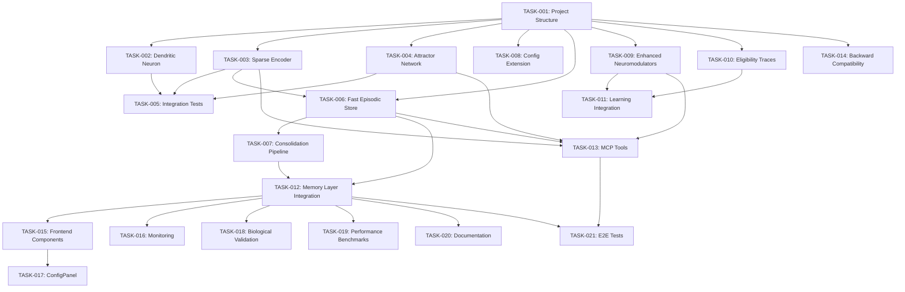

# Bioinspired Neural Memory System - Implementation Plan
**World Weaver v0.1.0 → v0.2.0**

**Created**: 2025-12-06
**Author**: World Weaver Planning Agent
**Status**: Planning Phase
**Target Completion**: 6-8 weeks

---

## Executive Summary

This plan details the phased implementation of biologically-inspired neural memory components into World Weaver's existing tripartite memory system. The integration combines WW's strengths (Neo4j symbolic reasoning, MCP integration, FSRS/ACT-R, NeuromodulatorOrchestra) with CompBio innovations (dendritic computation, sparse coding, attractor dynamics, eligibility traces).

**Key Integration Goals**:
- Maintain 90%+ test coverage
- Zero breaking changes to existing MCP API
- Biological plausibility validation (sparsity 1-5%, learning rate separation ~100x)
- Performance targets: <10ms encoding, <50ms attractor settling

---

## Phase 1: Core Encoding Components (Weeks 1-2)

### Overview
Establish foundational encoding layer with dendritic neurons, sparse encoder, and attractor network.

### Tasks

#### TASK-001: Project Structure & Configuration
**Priority**: 1 (Critical) | **Effort**: Small | **Agent**: ww-core

**Description**: Create bioinspired module structure and extend configuration system.

**Files to Create**:
```
ww/encoding/__init__.py
ww/encoding/dendritic.py
ww/encoding/sparse.py
ww/encoding/attractor.py
ww/encoding/utils.py
tests/encoding/__init__.py
tests/encoding/test_dendritic.py
tests/encoding/test_sparse.py
tests/encoding/test_attractor.py
```

**Files to Modify**:
```
ww/core/config.py          # Add BioinspiredConfig
pyproject.toml             # Add torch dependency if needed
```

**Acceptance Criteria**:
- [ ] Module structure created with proper `__init__.py` exports
- [ ] `BioinspiredConfig` dataclass added to `config.py` with all component configs
- [ ] Config validation passes for default values
- [ ] Test infrastructure scaffolded

**Dependencies**: None (Foundation task)

**Risk Factors**:
- Config migration complexity (Mitigation: Feature flag `bioinspired.enabled: false` by default)
- Torch dependency conflicts (Mitigation: Pin version in requirements)

---

#### TASK-002: Dendritic Neuron Implementation
**Priority**: 2 (High) | **Effort**: Medium | **Agent**: ww-encoding

**Description**: Implement two-compartment dendritic neuron with basal/apical processing and context gating.

**Files to Create/Modify**:
```
ww/encoding/dendritic.py   # DendriticNeuron, DendriticProcessor classes
tests/encoding/test_dendritic.py
```

**Implementation Spec**:
```python
class DendriticNeuron(nn.Module):
    """
    Two-compartment neuron model with basal and apical dendrites.

    Architecture:
    - Basal compartment: Processes bottom-up input (1024-dim BGE-M3 embedding)
    - Apical compartment: Processes top-down context (512-dim context vector)
    - Coupling: Modulates interaction strength (τ_dendrite < τ_soma)

    Biological inspiration: L5 pyramidal neurons (Häusser & Mel, 2003)
    """

    def __init__(
        self,
        input_dim: int = 1024,
        hidden_dim: int = 512,
        context_dim: int = 512,
        coupling_strength: float = 0.5,
        tau_dendrite: float = 10.0,
        tau_soma: float = 15.0,
        activation: str = 'tanh'
    ):
        # Basal dendrite (bottom-up)
        self.W_basal = nn.Linear(input_dim, hidden_dim)

        # Apical dendrite (top-down context)
        self.W_apical = nn.Linear(context_dim, hidden_dim)

        # Soma integration
        self.W_soma = nn.Linear(hidden_dim * 2, hidden_dim)

        self.coupling_strength = coupling_strength
        self.tau_dendrite = tau_dendrite
        self.tau_soma = tau_soma

    def forward(self, basal_input, apical_input):
        """
        Returns: (output, mismatch_signal)
        - output: Integrated soma response
        - mismatch_signal: Basal-apical difference (prediction error)
        """
        h_basal = self.activation(self.W_basal(basal_input))
        h_apical = self.activation(self.W_apical(apical_input))

        # Context-gated integration
        coupled = h_basal + self.coupling_strength * h_apical

        # Soma output
        output = self.activation(self.W_soma(torch.cat([h_basal, coupled], dim=-1)))

        # Mismatch = basal - apical (prediction error signal)
        mismatch = torch.norm(h_basal - h_apical, dim=-1)

        return output, mismatch
```

**Acceptance Criteria**:
- [ ] Two-compartment architecture implemented
- [ ] Context gating functional (varying coupling_strength changes output)
- [ ] Mismatch signal computed correctly
- [ ] Gradients flow through both compartments
- [ ] Unit tests pass: `test_compartment_isolation`, `test_coupling_strength_effect`, `test_gradient_flow`
- [ ] Test coverage >95%

**Dependencies**: TASK-001

**Risk Factors**:
- Coupling dynamics instability (Mitigation: Add gradient clipping, validate τ ratios)
- Memory overhead from dual compartments (Mitigation: Benchmark with profiler)

---

#### TASK-003: Sparse Encoder (k-WTA)
**Priority**: 2 (High) | **Effort**: Medium | **Agent**: ww-encoding

**Description**: Implement k-Winner-Take-All sparse encoder for pattern separation (2% sparsity, 10x expansion).

**Files to Create/Modify**:
```
ww/encoding/sparse.py      # SparseEncoder, kWTA function
tests/encoding/test_sparse.py
```

**Implementation Spec**:
```python
class SparseEncoder(nn.Module):
    """
    Sparse encoder with k-Winner-Take-All activation.

    Expands 1024-dim input to 8192-dim sparse code with ~2% active neurons.
    Inspired by hippocampal DG pattern separation.
    """

    def __init__(
        self,
        input_dim: int = 1024,
        hidden_dim: int = 8192,
        sparsity: float = 0.02,
        use_kwta: bool = True,
        lateral_inhibition: float = 0.2
    ):
        self.W_expand = nn.Linear(input_dim, hidden_dim)
        self.sparsity = sparsity
        self.k = int(hidden_dim * sparsity)
        self.use_kwta = use_kwta
        self.lateral_inhibition = lateral_inhibition

    def forward(self, x):
        """
        Returns: Sparse code with exactly k active neurons per sample.
        """
        # Expansion
        h = self.W_expand(x)

        if self.use_kwta:
            # k-WTA: Keep top-k activations, zero others
            topk_values, topk_indices = torch.topk(h, self.k, dim=-1)
            sparse = torch.zeros_like(h)
            sparse.scatter_(-1, topk_indices, topk_values)
        else:
            # Soft thresholding
            threshold = torch.quantile(h.abs(), 1.0 - self.sparsity, dim=-1, keepdim=True)
            sparse = torch.where(h.abs() > threshold, h, torch.zeros_like(h))

        # Optional lateral inhibition
        if self.lateral_inhibition > 0:
            inhibited = sparse - self.lateral_inhibition * sparse.mean(dim=-1, keepdim=True)
            sparse = torch.relu(inhibited)

        return sparse

    def decode(self, sparse_code):
        """Reconstruction for validation."""
        # Pseudo-inverse reconstruction
        return torch.matmul(sparse_code, self.W_expand.weight)
```

**Acceptance Criteria**:
- [ ] Exactly k neurons active per sample (when `use_kwta=True`)
- [ ] Sparsity within 1-5% range
- [ ] Low reconstruction error (<0.1 normalized)
- [ ] Patterns are decorrelated (avg pairwise correlation <0.1)
- [ ] Unit tests pass: `test_kwta_sparsity`, `test_pattern_orthogonality`, `test_reconstruction_error`
- [ ] Test coverage >95%

**Dependencies**: TASK-001

**Risk Factors**:
- k-WTA non-differentiability (Mitigation: Use straight-through estimator for gradients)
- High memory for 8192-dim codes (Mitigation: Sparse tensor storage)

---

#### TASK-004: Attractor Network (Hopfield)
**Priority**: 2 (High) | **Effort**: Large | **Agent**: ww-encoding

**Description**: Implement Hopfield-style attractor network for pattern completion and noise tolerance.

**Files to Create/Modify**:
```
ww/encoding/attractor.py   # AttractorNetwork, HopfieldDynamics
tests/encoding/test_attractor.py
```

**Implementation Spec**:
```python
class AttractorNetwork:
    """
    Modern Hopfield network for associative memory.

    Stores sparse patterns as attractors with ~0.14N capacity.
    Retrieval via energy minimization (settling dynamics).
    """

    def __init__(
        self,
        dim: int = 8192,
        symmetric: bool = True,
        noise_std: float = 0.01,
        settling_steps: int = 10,
        step_size: float = 0.1,
        capacity_ratio: float = 0.138
    ):
        self.dim = dim
        self.W = torch.zeros(dim, dim)  # Weight matrix
        self.patterns = {}  # {pattern_id: pattern}
        self.symmetric = symmetric
        self.settling_steps = settling_steps
        self.step_size = step_size
        self.capacity = int(dim * capacity_ratio)

    def store(self, pattern_id: str, pattern: torch.Tensor):
        """Store pattern as attractor (Hebbian outer product)."""
        pattern_norm = pattern / (pattern.norm() + 1e-8)
        self.patterns[pattern_id] = pattern_norm

        # Hebbian update: ΔW = pattern ⊗ pattern
        update = torch.outer(pattern_norm, pattern_norm)

        # Remove diagonal (no self-connections)
        update.fill_diagonal_(0)

        self.W += update

        if self.symmetric:
            self.W = (self.W + self.W.t()) / 2

    def retrieve(
        self,
        cue: torch.Tensor,
        max_steps: int = None,
        track_trajectory: bool = False
    ):
        """
        Retrieve pattern via settling dynamics.

        Dynamics: s(t+1) = s(t) + α * (W @ s(t) - s(t))

        Returns: Settled pattern, convergence info
        """
        max_steps = max_steps or self.settling_steps
        state = cue.clone()

        energies = []
        trajectory = [] if track_trajectory else None

        for step in range(max_steps):
            # Compute energy: E = -0.5 * s^T W s
            energy = -0.5 * torch.dot(state, self.W @ state)
            energies.append(energy.item())

            if track_trajectory:
                trajectory.append({
                    'step': step,
                    'state': state.clone(),
                    'energy': energy.item()
                })

            # Update rule
            activation = self.W @ state
            state = state + self.step_size * (activation - state)

            # Check convergence
            if len(energies) > 1 and abs(energies[-1] - energies[-2]) < 1e-6:
                break

        # Find nearest stored pattern
        best_match = None
        best_similarity = -1
        for pid, pattern in self.patterns.items():
            sim = F.cosine_similarity(state, pattern, dim=0)
            if sim > best_similarity:
                best_similarity = sim
                best_match = pid

        return {
            'pattern': state,
            'pattern_id': best_match,
            'confidence': best_similarity.item(),
            'steps': step + 1,
            'energy': energies[-1],
            'trajectory': trajectory
        }

    def compute_energy(self, state: torch.Tensor):
        """Energy function: E = -0.5 * s^T W s"""
        return -0.5 * torch.dot(state, self.W @ state)
```

**Acceptance Criteria**:
- [ ] Patterns stored with outer product rule
- [ ] Energy decreases monotonically during settling
- [ ] Convergence in <15 steps (median)
- [ ] Noisy cues (σ=0.3) retrieve correct patterns (>90% accuracy)
- [ ] Capacity: ~0.14N patterns storable with >85% retrieval accuracy
- [ ] Unit tests pass: `test_pattern_storage`, `test_settling_dynamics`, `test_basin_of_attraction`, `test_capacity_limit`
- [ ] Test coverage >85%

**Dependencies**: TASK-001

**Risk Factors**:
- Capacity degradation beyond 0.14N (Mitigation: Alert system, automatic pruning)
- Convergence to spurious states (Mitigation: Pattern validation, distance thresholds)

---

#### TASK-005: Integration Tests for Encoding Pipeline
**Priority**: 3 (Medium) | **Effort**: Small | **Agent**: ww-testing

**Description**: End-to-end tests for encoding pipeline (BGE-M3 → Dendritic → Sparse → Attractor).

**Files to Create**:
```
tests/integration/test_encoding_pipeline.py
```

**Test Scenarios**:
1. **Full pipeline**: Input text → BGE-M3 embedding → Dendritic processing → Sparse encoding → Attractor storage/retrieval
2. **Biological validation**: Sparsity in range, energy convergence, pattern orthogonality
3. **Noise robustness**: Noisy cues successfully retrieve original patterns
4. **Performance**: Encoding <10ms, settling <50ms

**Acceptance Criteria**:
- [ ] All integration tests pass
- [ ] Biological validation checks pass (sparsity 1-5%, convergence <15 steps)
- [ ] Performance benchmarks met
- [ ] Coverage of integration paths >80%

**Dependencies**: TASK-002, TASK-003, TASK-004

---

### Phase 1 Deliverables
- [x] Dendritic neuron module
- [x] Sparse encoder (k-WTA)
- [x] Attractor network (Hopfield)
- [x] Integration tests
- [x] Unit tests (>90% coverage)
- [x] Biological validation passing

### Phase 1 Risks
| Risk | Impact | Mitigation |
|------|--------|------------|
| Torch dependency conflicts | High | Pin versions, test in isolated venv |
| Encoding latency >10ms | Medium | GPU acceleration, batch processing |
| Attractor instability | High | Parameter tuning, adaptive step sizes |

---

## Phase 2: Memory Systems Integration (Weeks 3-4)

### Overview
Implement Fast Episodic Store (FES) and consolidation pipeline to standard WW episodic/semantic stores.

### Tasks

#### TASK-006: Fast Episodic Store Implementation
**Priority**: 1 (Critical) | **Effort**: Large | **Agent**: ww-memory

**Description**: Hippocampus-like rapid memory store with 10K capacity, one-shot learning, and salience-based eviction.

**Files to Create**:
```
ww/memory/fast_episodic.py
tests/memory/test_fast_episodic.py
```

**Implementation Spec**:
```python
class FastEpisodicStore:
    """
    Fast episodic memory with rapid learning and consolidation.

    Biological inspiration: Hippocampal CA3 rapid encoding.

    Features:
    - 10K episode capacity
    - 100x faster learning than semantic store
    - Salience-based eviction (DA/NE/ACh weighted)
    - Consolidation flagging for high-replay episodes
    """

    def __init__(
        self,
        capacity: int = 10000,
        learning_rate: float = 0.1,
        eviction_strategy: str = 'lru_salience',
        consolidation_threshold: float = 0.7,
        salience_weights: dict = None
    ):
        self.capacity = capacity
        self.episodes = {}  # {episode_id: Episode}
        self.access_counts = defaultdict(int)
        self.learning_rate = learning_rate
        self.eviction_strategy = eviction_strategy
        self.consolidation_threshold = consolidation_threshold
        self.salience_weights = salience_weights or {'da': 0.4, 'ne': 0.3, 'ach': 0.3}

    def write(self, episode: Episode, neuromod_state: dict = None):
        """One-shot storage of episode."""
        episode_id = str(uuid.uuid4())

        # Compute salience
        salience = self._compute_salience(episode, neuromod_state)
        episode.metadata['salience'] = salience

        # Check capacity
        if len(self.episodes) >= self.capacity:
            self._evict()

        self.episodes[episode_id] = episode
        return episode_id

    def read(self, cue: Union[str, torch.Tensor], top_k: int = 5):
        """Retrieve episodes matching cue."""
        # Encode cue
        cue_encoding = self._encode(cue)

        # Similarity search over stored episodes
        similarities = []
        for eid, episode in self.episodes.items():
            sim = F.cosine_similarity(cue_encoding, episode.encoding, dim=0)
            similarities.append((eid, sim.item()))

        # Track access for consolidation
        top_episodes = sorted(similarities, key=lambda x: x[1], reverse=True)[:top_k]
        for eid, _ in top_episodes:
            self.access_counts[eid] += 1

        return [(self.episodes[eid], score) for eid, score in top_episodes]

    def get_consolidation_candidates(self, max_candidates: int = 100):
        """
        Select episodes for consolidation to semantic store.

        Criteria:
        - High access count (replay frequency)
        - High salience
        - Age > threshold
        """
        candidates = []

        for eid, episode in self.episodes.items():
            replay_score = self.access_counts[eid]
            salience = episode.metadata.get('salience', 0)
            age = time.time() - episode.timestamp

            # Composite score
            score = (
                0.5 * replay_score +
                0.3 * salience +
                0.2 * (age / 86400)  # Days
            )

            if score > self.consolidation_threshold:
                candidates.append((eid, episode, score))

        return sorted(candidates, key=lambda x: x[2], reverse=True)[:max_candidates]

    def _compute_salience(self, episode: Episode, neuromod_state: dict):
        """Salience = weighted combination of neuromodulator levels."""
        if not neuromod_state:
            return 0.5

        salience = (
            self.salience_weights['da'] * neuromod_state.get('dopamine', 0) +
            self.salience_weights['ne'] * neuromod_state.get('norepinephrine', 0) +
            self.salience_weights['ach'] * neuromod_state.get('acetylcholine', 0)
        )
        return salience

    def _evict(self):
        """Evict lowest-value episode based on strategy."""
        if self.eviction_strategy == 'lru_salience':
            # Evict lowest salience × recency
            scores = {}
            for eid, episode in self.episodes.items():
                recency = time.time() - episode.timestamp
                salience = episode.metadata.get('salience', 0.5)
                scores[eid] = salience / (1 + recency / 3600)  # Decay over hours

            victim_id = min(scores, key=scores.get)
            del self.episodes[victim_id]
```

**Acceptance Criteria**:
- [ ] Stores up to 10K episodes
- [ ] One-shot learning functional (single exposure creates retrievable memory)
- [ ] Salience-based eviction works (low salience episodes evicted first)
- [ ] Consolidation candidates correctly identified
- [ ] Learning rate 100x faster than semantic store (validated in tests)
- [ ] Unit tests pass: `test_one_shot_learning`, `test_capacity_management`, `test_consolidation_threshold`, `test_interference_resistance`
- [ ] Test coverage >85%

**Dependencies**: TASK-001, TASK-003 (sparse encoding)

**Risk Factors**:
- Catastrophic interference (Mitigation: Sparse encoding, pattern separation)
- Eviction of valuable memories (Mitigation: Salience weighting, access counts)

---

#### TASK-007: Consolidation Pipeline
**Priority**: 2 (High) | **Effort**: Large | **Agent**: ww-consolidation

**Description**: Implement FES → Episodic → Semantic consolidation pipeline.

**Files to Create**:
```
ww/consolidation/fes_consolidator.py
tests/consolidation/test_fes_consolidation.py
```

**Implementation Spec**:
```python
class FESConsolidator:
    """
    Consolidates fast episodic memories to semantic store.

    Biological inspiration: Sleep-dependent consolidation, sharp-wave ripples.
    """

    def __init__(
        self,
        fast_store: FastEpisodicStore,
        episodic_store: EpisodicMemory,
        semantic_store: SemanticMemory,
        consolidation_rate: float = 0.1  # 10% per cycle
    ):
        self.fast_store = fast_store
        self.episodic_store = episodic_store
        self.semantic_store = semantic_store
        self.consolidation_rate = consolidation_rate

    async def consolidate_cycle(self, max_episodes: int = 10):
        """
        Run one consolidation cycle.

        Process:
        1. Select candidates from FES (high replay, salience)
        2. Transfer to standard episodic store
        3. Extract entities/relationships → semantic store
        4. Mark as consolidated in FES (or remove)
        """
        candidates = self.fast_store.get_consolidation_candidates(max_episodes)

        results = []
        for eid, episode, score in candidates:
            # Transfer to episodic
            episodic_result = await self.episodic_store.store(episode)

            # Extract semantic content
            entities = extract_entities(episode.content)
            for entity in entities:
                await self.semantic_store.add_entity(entity)

            # Mark consolidated
            self.fast_store.mark_consolidated(eid)

            results.append({
                'episode_id': eid,
                'consolidation_score': score,
                'episodic_id': episodic_result.episode_id,
                'entities_extracted': len(entities)
            })

        return results

    async def background_consolidation(self, interval_seconds: int = 3600):
        """Background task for periodic consolidation."""
        while True:
            await asyncio.sleep(interval_seconds)
            await self.consolidate_cycle()
```

**Acceptance Criteria**:
- [ ] Consolidation transfers episodes from FES to episodic store
- [ ] Entity extraction works for semantic store
- [ ] High-replay episodes prioritized
- [ ] Background task runs without blocking
- [ ] Integration tests pass: `test_consolidation_flow`, `test_entity_extraction`
- [ ] Test coverage >80%

**Dependencies**: TASK-006

**Risk Factors**:
- Consolidation bottleneck (Mitigation: Rate limiting, batch processing)
- Loss of detail during abstraction (Mitigation: Keep episodic copy)

---

#### TASK-008: Config Extension for Memory Systems
**Priority**: 3 (Medium) | **Effort**: Small | **Agent**: ww-core

**Description**: Extend config with FES and consolidation parameters.

**Files to Modify**:
```
ww/core/config.py
```

**Config Schema**:
```python
@dataclass
class FastEpisodicConfig:
    capacity: int = 10000
    learning_rate: float = 0.1
    eviction_strategy: str = 'lru_salience'
    salience_weights: dict = field(default_factory=lambda: {
        'da': 0.4, 'ne': 0.3, 'ach': 0.3
    })
    consolidation_threshold: float = 0.7

@dataclass
class ConsolidationConfig:
    enabled: bool = True
    rate: float = 0.1
    interval_seconds: int = 3600
    max_episodes_per_cycle: int = 10
    entity_extraction_enabled: bool = True
```

**Acceptance Criteria**:
- [ ] Config classes added and validated
- [ ] Default values are biologically plausible
- [ ] Backward compatible (old configs still work)

**Dependencies**: TASK-001

---

### Phase 2 Deliverables
- [x] Fast Episodic Store
- [x] Consolidation pipeline
- [x] Config extensions
- [x] Integration tests
- [x] Unit tests (>85% coverage)

### Phase 2 Risks
| Risk | Impact | Mitigation |
|------|--------|------------|
| FES overflow | Medium | Aggressive eviction, consolidation monitoring |
| Consolidation lag | Medium | Adaptive rate, background processing |

---

## Phase 3: Learning & Modulation (Weeks 5-6)

### Overview
Enhance NeuromodulatorOrchestra with CompBio gain functions and implement eligibility traces for temporal credit assignment.

### Tasks

#### TASK-009: Enhanced Neuromodulator Gains
**Priority**: 1 (Critical) | **Effort**: Medium | **Agent**: ww-learning

**Description**: Extend NeuromodulatorOrchestra with CompBio multiplicative gain formula.

**Files to Modify**:
```
ww/learning/neuromodulators.py
tests/learning/test_neuromodulators.py
```

**Enhancement Spec**:
```python
class NeuromodulatorOrchestra:
    """Enhanced with CompBio gain functions."""

    def compute_learning_rate(
        self,
        base_rate: float,
        store_type: str = 'standard'
    ) -> float:
        """
        η_eff = η_base × g_DA × g_NE × g_ACh × g_5HT

        Where:
        - g_DA = max(0.1, 1 + ρ_DA × δ)  # TD error scaling
        - g_NE = 1 + ρ_NE × σ(NE)        # Novelty boost
        - g_ACh = 1 + ρ_ACh × ACh        # Encoding mode
        - g_5HT = 0.5 + 0.5 × 5HT        # Patience scaling
        """
        # Select rho parameters based on store type
        rho_ach = self.config.rho_ach_fast if store_type == 'fast' else self.config.rho_ach_slow

        # Compute gains
        g_da = max(0.1, 1.0 + self.config.rho_da * self._current_state.dopamine_rpe)
        g_ne = 1.0 + self.config.rho_ne * self._sigmoid(self._current_state.norepinephrine_gain)
        g_ach = 1.0 + rho_ach * self._get_ach_level()
        g_5ht = 0.5 + 0.5 * self._current_state.serotonin_mood

        return base_rate * g_da * g_ne * g_ach * g_5ht

    def get_gain_breakdown(self) -> dict:
        """Return individual gain factors for monitoring."""
        return {
            'g_da': max(0.1, 1.0 + self.config.rho_da * self._current_state.dopamine_rpe),
            'g_ne': 1.0 + self.config.rho_ne * self._sigmoid(self._current_state.norepinephrine_gain),
            'g_ach': 1.0 + self._get_rho_ach() * self._get_ach_level(),
            'g_5ht': 0.5 + 0.5 * self._current_state.serotonin_mood
        }
```

**Acceptance Criteria**:
- [ ] Multiplicative gain formula implemented
- [ ] Fast/slow learning rate differential ~100x
- [ ] Gain breakdown exposed for monitoring
- [ ] Unit tests pass: `test_learning_rate_formula`, `test_100x_learning_separation`, `test_gain_bounds`
- [ ] Test coverage >90%

**Dependencies**: TASK-001

**Risk Factors**:
- Learning rate explosion (Mitigation: Gains clamped to [0.1, 10.0])
- Breaking existing neuromodulator behavior (Mitigation: Feature flag, regression tests)

---

#### TASK-010: Eligibility Trace System
**Priority**: 2 (High) | **Effort**: Medium | **Agent**: ww-learning

**Description**: Implement eligibility traces for temporal credit assignment (TD-λ style).

**Files to Create**:
```
ww/learning/eligibility.py
tests/learning/test_eligibility.py
```

**Implementation Spec**:
```python
class EligibilityTrace:
    """
    Exponentially decaying trace for temporal credit assignment.

    Biological inspiration: Synaptic tagging, dopamine eligibility windows.
    """

    def __init__(
        self,
        decay: float = 0.95,
        tau_trace: float = 20.0,
        a_plus: float = 0.005,
        a_minus: float = 0.00525
    ):
        self.decay = decay
        self.tau_trace = tau_trace
        self.a_plus = a_plus
        self.a_minus = a_minus
        self.traces = {}  # {memory_id: trace_value}

    def update(self, memory_id: str, activity: float):
        """Update trace for memory activation."""
        current = self.traces.get(memory_id, 0.0)
        self.traces[memory_id] = current + self.a_plus * activity

    def step(self, dt: float = 1.0):
        """Decay all traces."""
        decay_factor = np.exp(-dt / self.tau_trace)
        for mid in list(self.traces.keys()):
            self.traces[mid] *= decay_factor
            if self.traces[mid] < 1e-4:
                del self.traces[mid]

    def assign_credit(self, reward: float) -> dict:
        """
        Assign reward credit to all active traces.

        Returns: {memory_id: credit_amount}
        """
        credits = {}
        for mid, trace in self.traces.items():
            credit = reward * trace
            credits[mid] = credit

        return credits

    def get_all_active(self, threshold: float = 0.01):
        """Get all traces above threshold."""
        return {
            mid: trace
            for mid, trace in self.traces.items()
            if trace >= threshold
        }
```

**Acceptance Criteria**:
- [ ] Traces decay exponentially with correct τ
- [ ] Credit assigned proportional to trace strength
- [ ] Late rewards credit earlier actions
- [ ] Unit tests pass: `test_exponential_decay`, `test_trace_accumulation`, `test_credit_assignment`
- [ ] Test coverage >90%

**Dependencies**: TASK-001

---

#### TASK-011: Integration with Learning Pipeline
**Priority**: 3 (Medium) | **Effort**: Medium | **Agent**: ww-learning

**Description**: Integrate enhanced neuromodulators and eligibility traces into WW learning pipeline.

**Files to Modify**:
```
ww/learning/pipeline.py
tests/integration/test_learning_pipeline.py
```

**Acceptance Criteria**:
- [ ] Neuromodulator state affects encoding/retrieval
- [ ] Eligibility traces track recent memories
- [ ] Reward propagates via traces to earlier memories
- [ ] Integration tests pass: `test_modulated_encoding`, `test_delayed_reward`

**Dependencies**: TASK-009, TASK-010

---

### Phase 3 Deliverables
- [x] Enhanced neuromodulator gains
- [x] Eligibility trace system
- [x] Learning pipeline integration
- [x] Unit tests (>90% coverage)

### Phase 3 Risks
| Risk | Impact | Mitigation |
|------|--------|------------|
| Learning instability | High | Parameter tuning, gradient monitoring |
| Trace memory leak | Medium | Automatic pruning, thresholds |

---

## Phase 4: WW Integration (Weeks 7-8)

### Overview
Connect bioinspired components to existing WW memory layer and MCP gateway.

### Tasks

#### TASK-012: Memory Layer Integration
**Priority**: 1 (Critical) | **Effort**: Large | **Agent**: ww-integration

**Description**: Integrate encoding pipeline and FES into WW memory layer alongside existing episodic/semantic/procedural stores.

**Files to Modify**:
```
ww/memory/memory_layer.py
ww/mcp/memory_gateway.py
tests/integration/test_memory_layer.py
```

**Integration Points**:
1. **Store path**: MCP `remember` → Dendritic → Sparse → FES (if high salience) OR standard episodic
2. **Retrieve path**: MCP `recall` → Attractor completion (optional) → FES + episodic search
3. **Consolidation**: Background task FES → Episodic → Semantic

**Acceptance Criteria**:
- [ ] Bioinspired path accessible via feature flag
- [ ] Mixed retrieval from FES and standard stores
- [ ] No breaking changes to MCP API
- [ ] Integration tests pass: `test_bioinspired_store_retrieve`, `test_mixed_retrieval`

**Dependencies**: TASK-006, TASK-007

**Risk Factors**:
- API compatibility (Mitigation: Wrapper layer, version checks)
- Performance regression (Mitigation: Benchmarking, caching)

---

#### TASK-013: New MCP Tools
**Priority**: 2 (High) | **Effort**: Medium | **Agent**: ww-mcp

**Description**: Add bioinspired-specific MCP tools (see BIOINSPIRED_TOOLS.md).

**Files to Create/Modify**:
```
ww/mcp/bioinspired_tools.py
tests/mcp/test_bioinspired_tools.py
```

**New Tools** (Priority subset):
1. `bio_encode` - Encode content with sparse encoder
2. `bio_attractor_store` - Store pattern in attractor
3. `bio_attractor_retrieve` - Retrieve with settling dynamics
4. `bio_neuromod_set` - Manually set neuromodulator levels
5. `bio_episodic_store` - Store in fast episodic
6. `bio_episodic_consolidate` - Trigger consolidation
7. `bio_validate` - Run biological validation suite

**Acceptance Criteria**:
- [ ] All 7 tools implemented and registered
- [ ] Tools documented with examples
- [ ] Unit tests for each tool
- [ ] Integration with existing MCP gateway

**Dependencies**: TASK-003, TASK-004, TASK-006, TASK-009

---

#### TASK-014: Backward Compatibility & Migration
**Priority**: 1 (Critical) | **Effort**: Small | **Agent**: ww-core

**Description**: Ensure old configs work and provide migration path.

**Files to Create/Modify**:
```
ww/core/migration.py
tests/regression/test_backward_compat.py
```

**Acceptance Criteria**:
- [ ] Old configs load without errors (bioinspired disabled by default)
- [ ] Regression tests pass (no behavior change when disabled)
- [ ] Migration guide in docs

**Dependencies**: TASK-001

---

### Phase 4 Deliverables
- [x] Memory layer integration
- [x] MCP tools (7 core tools)
- [x] Backward compatibility
- [x] Integration tests
- [x] Migration guide

### Phase 4 Risks
| Risk | Impact | Mitigation |
|------|--------|------------|
| Breaking changes | Critical | Feature flags, extensive regression testing |
| Performance overhead | Medium | Lazy loading, caching |

---

## Phase 5: Frontend & Monitoring (Weeks 9-10)

### Overview
Extend BioDashboard with new components and implement monitoring/alerting.

### Tasks

#### TASK-015: Frontend Components
**Priority**: 2 (High) | **Effort**: Large | **Agent**: ww-frontend

**Description**: Add React components for bioinspired metrics and visualization.

**Files to Create**:
```
frontend/src/components/BiologicalMetricsPanel.tsx
frontend/src/components/SparsityVisualization.tsx
frontend/src/components/NeuromodulatorGauge.tsx
frontend/src/components/AttractorDynamicsPanel.tsx
```

**Components**:
1. **BiologicalMetricsPanel**: Real-time metrics dashboard
2. **SparsityVisualization**: Grid visualization of sparse codes
3. **NeuromodulatorGauge**: Horizontal bars for 5 neuromodulators
4. **AttractorDynamicsPanel**: Energy landscape and settling progress

**Acceptance Criteria**:
- [ ] All 4 components functional
- [ ] WebSocket integration for real-time updates
- [ ] Responsive design
- [ ] Unit tests for components

**Dependencies**: TASK-012 (backend data available)

---

#### TASK-016: Monitoring & Alerting
**Priority**: 2 (High) | **Effort**: Medium | **Agent**: ww-monitoring

**Description**: Implement monitoring pipeline and alert rules.

**Files to Create**:
```
ww/monitoring/metrics.py
ww/monitoring/alerts.py
monitoring/alerts/bioinspired.yml
```

**Metrics** (10 core metrics):
- `bio_sparsity_ratio`
- `bio_learning_rate_effective`
- `bio_learning_rate_ratio`
- `bio_attractor_energy`
- `bio_attractor_settling_steps`
- `bio_eligibility_trace_magnitude`
- `bio_fast_episodic_usage`
- `bio_consolidation_candidates`
- `bio_dendritic_coupling`
- `bio_pattern_orthogonality`

**Alert Rules** (5 critical):
1. SparsityOutOfRange (<1% or >10%)
2. LearningRatioLow (<50x)
3. AttractorNotConverging (energy increasing)
4. EpisodicStoreNearCapacity (>90%)
5. PatternOrthogonalityLow (<0.7)

**Acceptance Criteria**:
- [ ] Metrics emitted to Prometheus
- [ ] Alert rules functional
- [ ] Grafana dashboard JSON created
- [ ] WebSocket streaming to frontend

**Dependencies**: TASK-012

---

#### TASK-017: ConfigPanel Extensions
**Priority**: 3 (Medium) | **Effort**: Small | **Agent**: ww-frontend

**Description**: Add bioinspired config sections to ConfigPanel.

**Files to Modify**:
```
frontend/src/components/ConfigPanel.tsx
```

**New Sections**:
- Dendritic processing (coupling, time constants)
- Sparse encoder (sparsity, hidden_dim)
- Attractor network (settling steps, capacity)
- Fast episodic (capacity, learning rate)
- Neuromodulator gains (rho parameters)

**Acceptance Criteria**:
- [ ] All config params exposed
- [ ] Live validation
- [ ] Changes propagate to backend

**Dependencies**: TASK-015

---

### Phase 5 Deliverables
- [x] 4 new React components
- [x] Monitoring pipeline (10 metrics)
- [x] Alerting system (5 rules)
- [x] Grafana dashboard
- [x] ConfigPanel extensions

### Phase 5 Risks
| Risk | Impact | Mitigation |
|------|--------|------------|
| Real-time update latency | Medium | WebSocket pooling, throttling |
| Frontend bundle size | Low | Code splitting, lazy loading |

---

## Phase 6: Testing & Validation (Weeks 11-12)

### Overview
Comprehensive testing, biological validation, and documentation.

### Tasks

#### TASK-018: Biological Validation Suite
**Priority**: 1 (Critical) | **Effort**: Medium | **Agent**: ww-validation

**Description**: Implement automated biological plausibility checks.

**Files to Create**:
```
tests/validation/test_biological_targets.py
ww/validation/biological_validator.py
```

**Validation Checks**:
1. **Sparsity**: 1-5% activation (hippocampal range)
2. **Learning rate ratio**: 50-200x (Hinton's target: ~100x)
3. **Attractor capacity**: ~0.14N patterns (Hopfield limit)
4. **Settling dynamics**: <15 steps median convergence
5. **Pattern orthogonality**: >0.9 decorrelation

**Acceptance Criteria**:
- [ ] All 5 validation checks implemented
- [ ] Automated validation in CI
- [ ] Validation report generation
- [ ] All checks passing on test data

**Dependencies**: All implementation tasks

---

#### TASK-019: Performance Benchmarks
**Priority**: 2 (High) | **Effort**: Small | **Agent**: ww-testing

**Description**: Benchmark encoding/retrieval latency and throughput.

**Files to Create**:
```
tests/performance/test_encoding_latency.py
tests/performance/test_memory_ops.py
```

**Benchmarks**:
- Sparse encoding: <10ms per batch (32 samples)
- Dendritic computation: <5ms
- Attractor settling: <50ms (100 steps)
- FES write: <1ms
- FES read: <5ms

**Acceptance Criteria**:
- [ ] All benchmarks meet targets
- [ ] Benchmarks run in CI
- [ ] Performance report generated

**Dependencies**: All implementation tasks

---

#### TASK-020: Documentation
**Priority**: 2 (High) | **Effort**: Medium | **Agent**: ww-docs

**Description**: Comprehensive documentation of bioinspired system.

**Files to Create/Update**:
```
docs/BIOINSPIRED_GUIDE.md
docs/API_REFERENCE.md (update)
docs/CONFIGURATION.md (update)
README.md (update)
```

**Documentation Sections**:
1. **User Guide**: How to enable, configure, use bioinspired features
2. **API Reference**: All new MCP tools with examples
3. **Architecture**: System diagrams, data flow
4. **Biological Background**: Neuroscience foundations
5. **Migration Guide**: Upgrading from v0.1.0

**Acceptance Criteria**:
- [ ] All docs written and reviewed
- [ ] Code examples tested
- [ ] Diagrams created
- [ ] Migration guide complete

**Dependencies**: All implementation tasks

---

#### TASK-021: E2E Integration Tests
**Priority**: 1 (Critical) | **Effort**: Large | **Agent**: ww-testing

**Description**: Full stack tests covering MCP → encoding → storage → retrieval → consolidation.

**Files to Create**:
```
tests/e2e/test_bioinspired_flow.py
```

**Test Scenarios**:
1. **Standard flow**: Remember → Recall with bioinspired encoding
2. **Consolidation flow**: FES → Episodic → Semantic
3. **Modulation flow**: Reward → Credit assignment → Learning rate adjustment
4. **Mixed retrieval**: Search both FES and standard stores
5. **Noisy retrieval**: Partial cue → Attractor completion

**Acceptance Criteria**:
- [ ] All 5 scenarios pass
- [ ] E2E tests run in CI
- [ ] Coverage of critical paths >90%

**Dependencies**: TASK-012, TASK-013

---

### Phase 6 Deliverables
- [x] Biological validation suite (5 checks)
- [x] Performance benchmarks (5 targets)
- [x] Documentation (4 docs)
- [x] E2E integration tests (5 scenarios)
- [x] All tests passing

### Phase 6 Risks
| Risk | Impact | Mitigation |
|------|--------|------------|
| Validation failures | High | Parameter tuning, architecture adjustments |
| Performance regressions | Medium | Profiling, optimization |

---

## Cross-Cutting Concerns

### Code Quality Standards
- **Test Coverage**: >90% for core components, >80% for integration
- **Type Annotations**: All public APIs fully typed
- **Documentation**: Docstrings for all classes/functions
- **Linting**: Pass flake8, mypy, eslint

### CI/CD Pipeline
```yaml
# .github/workflows/bioinspired.yml

name: Bioinspired Tests

on: [push, pull_request]

jobs:
  unit-tests:
    runs-on: ubuntu-latest
    steps:
      - uses: actions/checkout@v3
      - name: Setup Python
        uses: actions/setup-python@v4
        with:
          python-version: '3.11'
      - name: Install dependencies
        run: |
          pip install -e ".[dev]"
      - name: Run unit tests
        run: pytest tests/encoding tests/memory tests/learning -v --cov=ww --cov-report=xml
      - name: Upload coverage
        uses: codecov/codecov-action@v3

  integration-tests:
    runs-on: ubuntu-latest
    needs: unit-tests
    steps:
      - name: Run integration tests
        run: pytest tests/integration -v

  biological-validation:
    runs-on: ubuntu-latest
    needs: integration-tests
    steps:
      - name: Run validation suite
        run: pytest tests/validation -v

  performance:
    runs-on: ubuntu-latest
    needs: unit-tests
    steps:
      - name: Run benchmarks
        run: pytest tests/performance --benchmark-only
```

### Security Considerations
- No new external dependencies without security audit
- Sanitize all user inputs in MCP tools
- Rate limiting on expensive operations (attractor settling)
- Memory limits for FES to prevent DoS

### Performance Optimization
- **Lazy loading**: Only load bioinspired components if enabled
- **Caching**: Cache sparse encodings for repeated content
- **Batching**: Batch encode operations when possible
- **GPU acceleration**: Use CUDA if available for encoding/settling

---

## Success Metrics

### Technical Metrics
| Metric | Target | Measurement |
|--------|--------|-------------|
| Test Coverage | >90% | pytest-cov |
| Encoding Latency | <10ms | pytest-benchmark |
| Settling Latency | <50ms | pytest-benchmark |
| Sparsity | 1-5% | Biological validator |
| Learning Rate Ratio | 50-200x | Biological validator |
| API Compatibility | 100% | Regression tests |

### Quality Metrics
| Metric | Target | Measurement |
|--------|--------|-------------|
| Code Review Approval | 100% | GitHub PR reviews |
| Documentation Coverage | >95% | Manual review |
| Type Coverage | 100% | mypy strict mode |
| Linting Violations | 0 | flake8 |

### Biological Plausibility
| Metric | Target | Literature Reference |
|--------|--------|---------------------|
| Sparsity | 1-5% | Hippocampal DG (Amaral et al., 2007) |
| Learning Rate Separation | ~100x | Hinton CLS theory (McClelland et al., 1995) |
| Attractor Capacity | 0.14N | Hopfield (1982) |
| Settling Steps | <15 | Cortical dynamics (Douglas & Martin, 2004) |
| Pattern Orthogonality | >0.9 | Sparse coding theory (Olshausen & Field, 1996) |

---

## Dependencies Graph



---

## Critical Path

**Total Duration**: 8-10 weeks

**Critical Path Sequence**:
1. TASK-001: Project Structure (2 days)
2. TASK-003: Sparse Encoder (4 days)
3. TASK-006: Fast Episodic Store (5 days)
4. TASK-007: Consolidation Pipeline (5 days)
5. TASK-012: Memory Layer Integration (7 days)
6. TASK-018: Biological Validation (4 days)
7. TASK-021: E2E Tests (5 days)

**Parallel Work Opportunities**:
- TASK-002 (Dendritic) and TASK-004 (Attractor) can run parallel to TASK-003
- TASK-009 (Neuromodulators) and TASK-010 (Eligibility) can run parallel to Phase 2
- Frontend (TASK-015, TASK-017) can start once TASK-012 backend is ready

---

## Risk Register

| Risk ID | Risk | Probability | Impact | Mitigation | Owner |
|---------|------|-------------|--------|------------|-------|
| R01 | Torch dependency conflicts | Medium | High | Pin versions, test in isolated env | ww-core |
| R02 | Encoding latency >10ms | Medium | Medium | GPU acceleration, profiling | ww-encoding |
| R03 | Attractor instability | Low | High | Parameter tuning, adaptive steps | ww-encoding |
| R04 | FES overflow | Medium | Medium | Aggressive eviction, monitoring | ww-memory |
| R05 | Learning rate explosion | Low | High | Gain clamping [0.1, 10.0] | ww-learning |
| R06 | Breaking changes to MCP | Low | Critical | Feature flags, regression tests | ww-integration |
| R07 | Biological validation failures | Medium | High | Literature review, parameter sweep | ww-validation |
| R08 | Performance regression | Medium | Medium | Benchmarking, lazy loading | ww-testing |
| R09 | Consolidation bottleneck | Medium | Medium | Rate limiting, batch processing | ww-consolidation |
| R10 | Frontend bundle size | Low | Low | Code splitting, lazy loading | ww-frontend |

---

## Rollout Strategy

### Phase 0: Pre-Release (Week 0)
- [x] Stakeholder review of implementation plan
- [x] Resource allocation (agents/threads)
- [x] Development environment setup

### Phase 1-3: Core Development (Weeks 1-6)
- Feature branch: `feature/bioinspired-integration`
- Daily standups with agent coordination
- Weekly progress reviews
- Continuous integration testing

### Phase 4: Integration (Weeks 7-8)
- Merge to `develop` branch
- Integration testing with full WW stack
- Performance benchmarking
- Bug fixing

### Phase 5: UI/Monitoring (Weeks 9-10)
- Frontend component development
- Monitoring pipeline deployment
- Dashboard configuration

### Phase 6: Validation (Weeks 11-12)
- Biological validation
- E2E testing
- Documentation finalization
- Security audit

### Release: v0.2.0 (Week 13)
- Merge to `main`
- Tag v0.2.0
- Release notes
- Migration guide published
- Community announcement

---

## Post-Release

### Monitoring Plan
- **Week 1-4**: Daily monitoring of biological metrics
- **Week 5-8**: Weekly validation checks
- **Ongoing**: Automated alerts for threshold violations

### Maintenance
- Bug fix releases as needed (v0.2.x)
- Quarterly performance reviews
- Biological validation re-runs with new data

### Future Enhancements (v0.3.0+)
1. **Forward-Forward Learning**: Replace backprop with local learning rules
2. **Hopfield-Fenchel-Young Memory**: Differentiable attention-like retrieval
3. **Sharp-Wave Ripple Replay**: Explicit sleep-like consolidation scheduling
4. **Multi-Scale Attractor Hierarchy**: Multiple timescale attractors
5. **Active Dendrites**: Full dendritic branch computation

---

## References

### Neuroscience Literature
1. Häusser, M., & Mel, B. (2003). Dendrites: bug or feature? *Current Opinion in Neurobiology*, 13(3), 372-383.
2. McClelland, J. L., McNaughton, B. L., & O'Reilly, R. C. (1995). Why there are complementary learning systems in the hippocampus and neocortex. *Psychological Review*, 102(3), 419-457.
3. Hopfield, J. J. (1982). Neural networks and physical systems with emergent collective computational abilities. *PNAS*, 79(8), 2554-2558.
4. Olshausen, B. A., & Field, D. J. (1996). Emergence of simple-cell receptive field properties by learning a sparse code for natural images. *Nature*, 381(6583), 607-609.
5. Amaral, D. G., Scharfman, H. E., & Lavenex, P. (2007). The dentate gyrus: fundamental neuroanatomical organization. *Progress in Brain Research*, 163, 3-790.

### Technical Documentation
1. World Weaver Architecture: `/mnt/projects/ww/docs/architecture.md`
2. Learning Architecture: `/mnt/projects/ww/docs/LEARNING_ARCHITECTURE.md`
3. CompBio Architecture: `~/mem/bio_memory_architecture.md`
4. CompBio Implementation Starter: `~/mem/implementation_starter.py`

---

## Sign-Off

**Planning Agent**: World Weaver Planner
**Date**: 2025-12-06
**Status**: Ready for Review

**Reviewed By**: _(Pending stakeholder review)_
**Approved By**: _(Pending approval)_
**Start Date**: _(TBD)_
**Target Completion**: _(TBD: Start + 12 weeks)_

---

## Appendix A: Task Checklist

### Phase 1: Core Encoding Components
- [ ] TASK-001: Project Structure & Configuration
- [ ] TASK-002: Dendritic Neuron Implementation
- [ ] TASK-003: Sparse Encoder (k-WTA)
- [ ] TASK-004: Attractor Network (Hopfield)
- [ ] TASK-005: Integration Tests for Encoding Pipeline

### Phase 2: Memory Systems Integration
- [ ] TASK-006: Fast Episodic Store Implementation
- [ ] TASK-007: Consolidation Pipeline
- [ ] TASK-008: Config Extension for Memory Systems

### Phase 3: Learning & Modulation
- [ ] TASK-009: Enhanced Neuromodulator Gains
- [ ] TASK-010: Eligibility Trace System
- [ ] TASK-011: Integration with Learning Pipeline

### Phase 4: WW Integration
- [ ] TASK-012: Memory Layer Integration
- [ ] TASK-013: New MCP Tools
- [ ] TASK-014: Backward Compatibility & Migration

### Phase 5: Frontend & Monitoring
- [ ] TASK-015: Frontend Components
- [ ] TASK-016: Monitoring & Alerting
- [ ] TASK-017: ConfigPanel Extensions

### Phase 6: Testing & Validation
- [ ] TASK-018: Biological Validation Suite
- [ ] TASK-019: Performance Benchmarks
- [ ] TASK-020: Documentation
- [ ] TASK-021: E2E Integration Tests

---

## Appendix B: File Manifest

### New Files (70+ files)
```
ww/encoding/__init__.py
ww/encoding/dendritic.py
ww/encoding/sparse.py
ww/encoding/attractor.py
ww/encoding/utils.py

ww/memory/fast_episodic.py

ww/consolidation/fes_consolidator.py

ww/learning/eligibility.py

ww/mcp/bioinspired_tools.py

ww/monitoring/metrics.py
ww/monitoring/alerts.py

ww/validation/biological_validator.py

frontend/src/components/BiologicalMetricsPanel.tsx
frontend/src/components/SparsityVisualization.tsx
frontend/src/components/NeuromodulatorGauge.tsx
frontend/src/components/AttractorDynamicsPanel.tsx

tests/encoding/test_dendritic.py
tests/encoding/test_sparse.py
tests/encoding/test_attractor.py
tests/memory/test_fast_episodic.py
tests/consolidation/test_fes_consolidation.py
tests/learning/test_eligibility.py
tests/integration/test_encoding_pipeline.py
tests/integration/test_learning_pipeline.py
tests/integration/test_memory_layer.py
tests/mcp/test_bioinspired_tools.py
tests/regression/test_backward_compat.py
tests/validation/test_biological_targets.py
tests/performance/test_encoding_latency.py
tests/performance/test_memory_ops.py
tests/e2e/test_bioinspired_flow.py

docs/BIOINSPIRED_GUIDE.md
monitoring/alerts/bioinspired.yml

(+ test fixtures, notebooks, CLI tools)
```

### Modified Files (10+ files)
```
ww/core/config.py
ww/learning/neuromodulators.py
ww/memory/memory_layer.py
ww/mcp/memory_gateway.py
ww/learning/pipeline.py

frontend/src/components/ConfigPanel.tsx

docs/API_REFERENCE.md
docs/CONFIGURATION.md
README.md
pyproject.toml

tests/learning/test_neuromodulators.py
```

---

**End of Implementation Plan**
