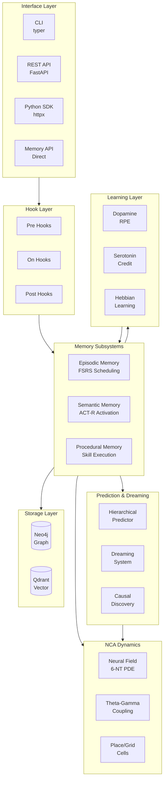
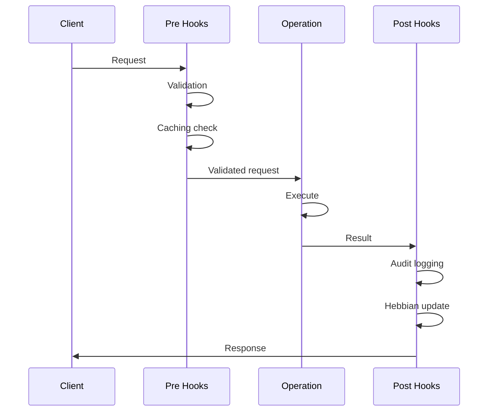
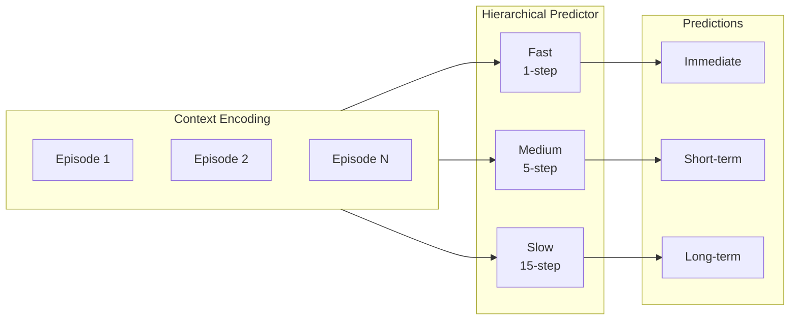
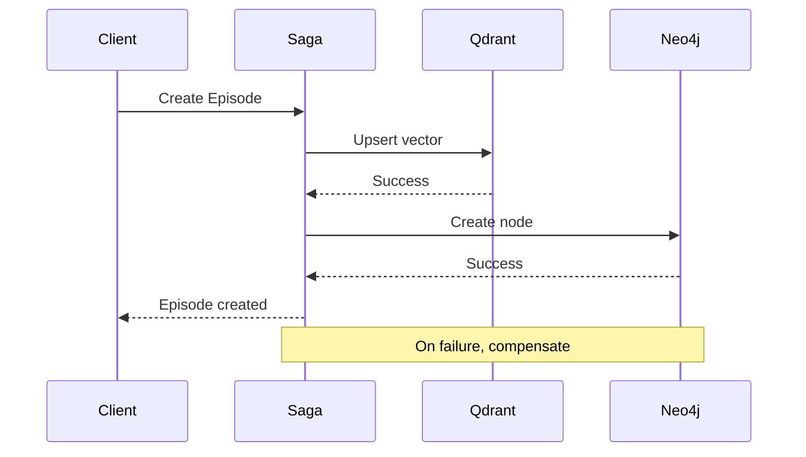
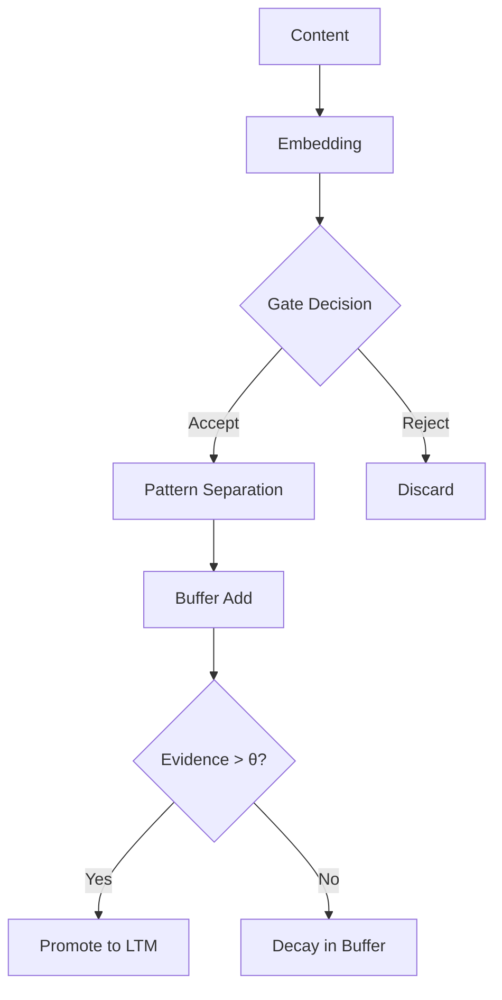
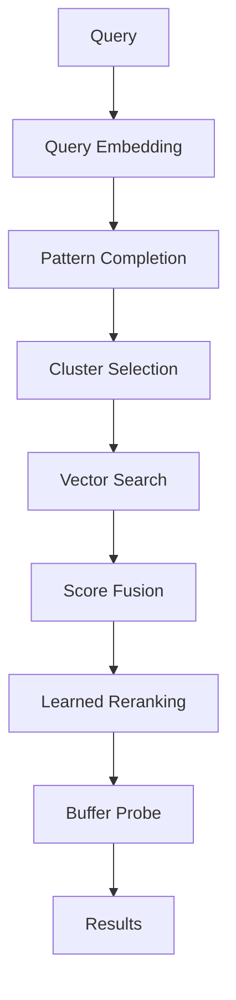
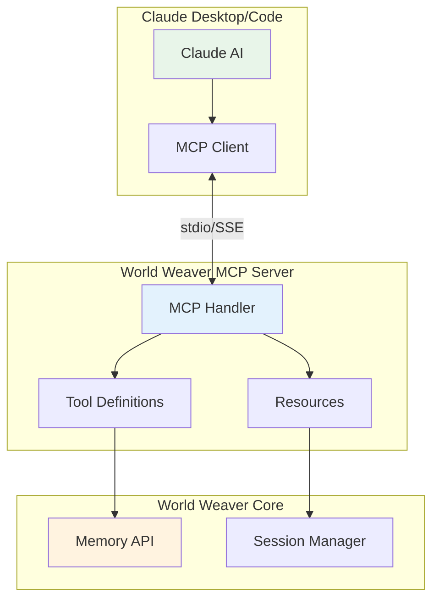
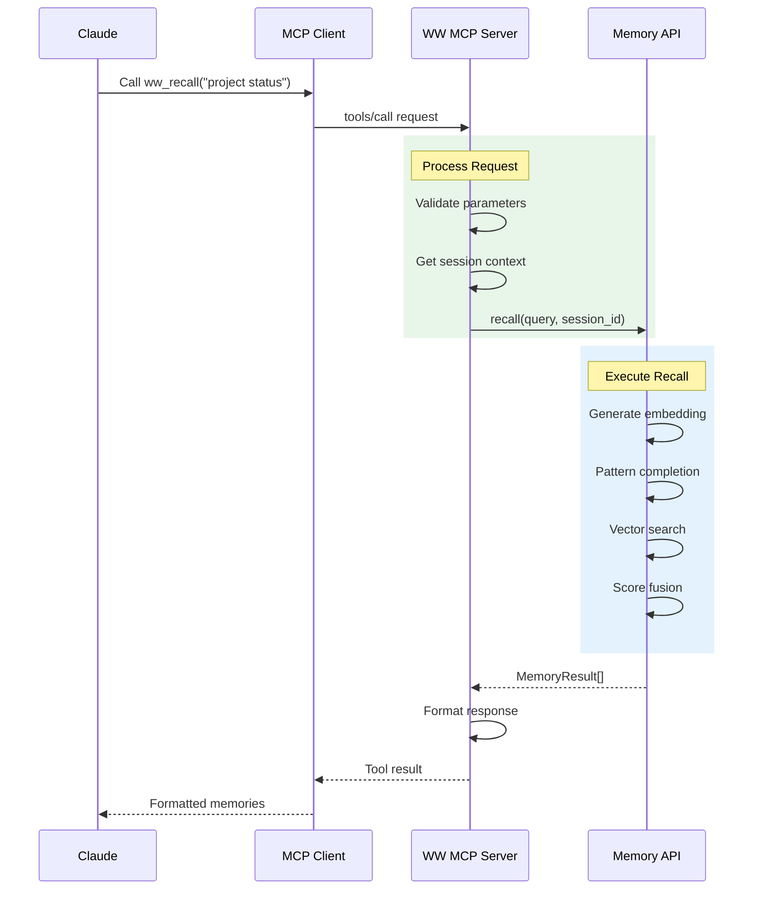
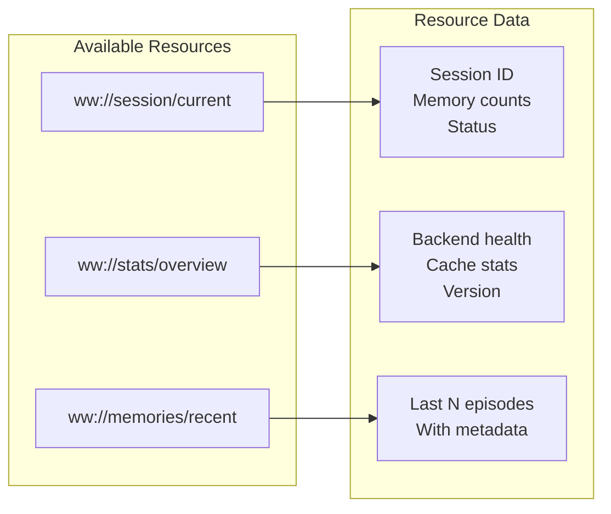
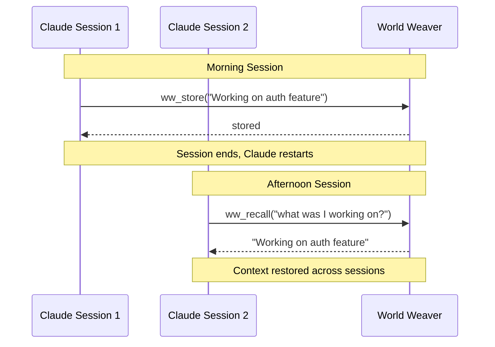

# Architecture

World Weaver's architecture combines cognitive neuroscience principles with modern software engineering.

## System Overview



## Layer Details

### Interface Layer

Four access methods for different use cases:

| Interface | Best For | Async | Authentication |
|-----------|----------|-------|----------------|
| **CLI** | Terminal users | No | None |
| **REST API** | External services | Yes | API Key |
| **Python SDK** | Python applications | Yes/No | API Key |
| **Memory API** | Direct embedding | Yes | None |

### Hook Layer

Extensible hook system for customization:



### Memory Subsystems

#### Episodic Memory

Stores autobiographical events with temporal context:

- **Storage**: Qdrant vectors + Neo4j metadata
- **Retrieval**: Embedding similarity + temporal weighting
- **Decay**: FSRS-based spaced repetition
- **Key files**: `src/ww/memory/episodic.py`

#### Semantic Memory

Knowledge graph with spreading activation:

- **Storage**: Neo4j graph
- **Retrieval**: ACT-R activation spreading
- **Learning**: Hebbian co-access strengthening
- **Key files**: `src/ww/memory/semantic.py`

#### Procedural Memory

Skills with execution tracking:

- **Storage**: Qdrant vectors + Neo4j metadata
- **Retrieval**: Task-based matching
- **Learning**: Success rate tracking
- **Key files**: `src/ww/memory/procedural.py`

### Prediction Layer



### NCA Dynamics Layer

Six-neurotransmitter PDE system:

| NT | Full Name | Role | Timescale |
|----|-----------|------|-----------|
| DA | Dopamine | Reward, motivation | ~100ms |
| 5-HT | Serotonin | Mood, satiety | ~500ms |
| ACh | Acetylcholine | Attention, encoding | ~50ms |
| NE | Norepinephrine | Arousal, vigilance | ~200ms |
| GABA | - | Fast inhibition | ~10ms |
| Glu | Glutamate | Fast excitation | ~5ms |

### Storage Layer

Dual-store architecture with Saga pattern:



## Data Flow

### Store Operation



### Recall Operation



## Module Organization

```
src/ww/
├── api/           # REST API server
├── bridge/        # Memory-NCA integration
├── cli/           # Command-line interface
├── consolidation/ # Memory consolidation
├── core/          # Types, config, schemas
├── dreaming/      # Dream trajectory generation
├── embedding/     # BGE-M3 embeddings
├── encoding/      # Sparse, dendritic encoding
├── hooks/         # Hook system
├── learning/      # Neuromodulators, STDP
├── memory/        # Episodic, semantic, procedural
├── nca/           # Neural dynamics
├── persistence/   # Checkpoint, WAL
├── prediction/    # JEPA, hierarchical
├── sdk/           # Python client
├── storage/       # Neo4j, Qdrant
└── visualization/ # Dashboards
```

## Key Design Decisions

### 1. Dual Storage

- **Vector (Qdrant)**: Fast similarity search
- **Graph (Neo4j)**: Rich relationships, temporal links

### 2. Saga Pattern

Distributed transactions across stores with compensation on failure.

### 3. Hook System

Decoupled concerns through priority-based hooks at PRE/ON/POST phases.

### 4. Session Isolation

Complete isolation between sessions using collection namespacing.

### 5. Async-First

All I/O operations are async with sync wrappers for convenience.

## MCP/Claude Integration

World Weaver integrates with Claude through the Model Context Protocol (MCP).

### Integration Architecture



### MCP Tools

| Tool | Description | Parameters |
|------|-------------|------------|
| `ww_store` | Store memory | content, importance, tags |
| `ww_recall` | Retrieve memories | query, limit, memory_type |
| `ww_forget` | Delete memory | episode_id |
| `ww_stats` | System statistics | - |
| `ww_consolidate` | Trigger consolidation | - |

### MCP Request Flow



### MCP Resources



### Configuration

Claude Desktop `claude_desktop_config.json`:

```json
{
  "mcpServers": {
    "world-weaver": {
      "command": "ww",
      "args": ["mcp", "serve"],
      "env": {
        "WW_SESSION_ID": "claude-desktop"
      }
    }
  }
}
```

### Session Persistence


