# Bioinspired Components

World Weaver implements biologically-inspired encoding, learning, and memory mechanisms.

## Overview

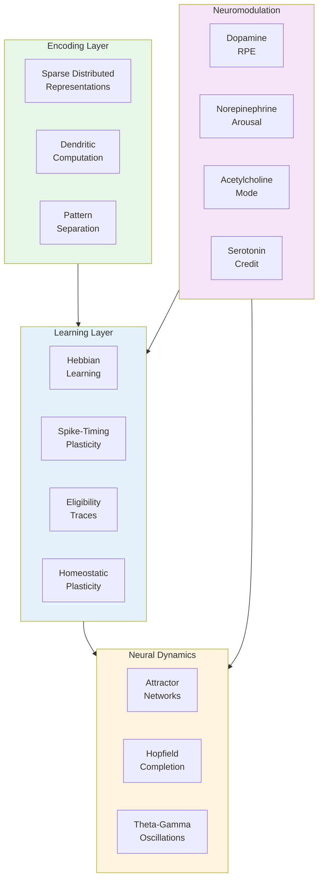

## Encoding Pipeline

### Full Encoding Flow

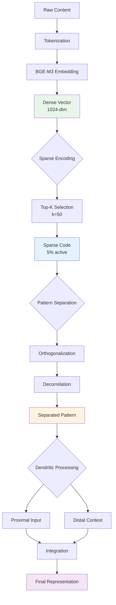

### Sparse Distributed Representations

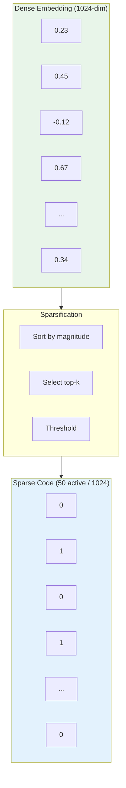

**Properties:**

| Property | Value | Biological Analog |
|----------|-------|-------------------|
| Sparsity | 5% active | Cortical neurons |
| Overlap | ~10 shared bits | Pattern similarity |
| Capacity | ~10^6 patterns | Hippocampal storage |
| Noise tolerance | ~10% bit flips | Graceful degradation |

### Pattern Separation

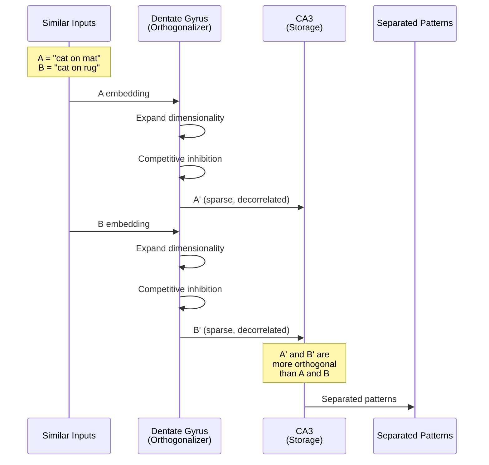

**Algorithm:**

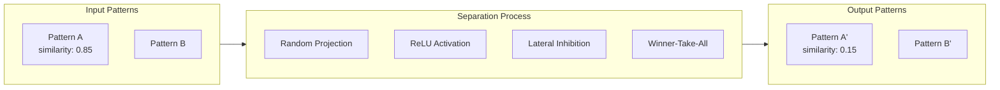

### Dendritic Computation

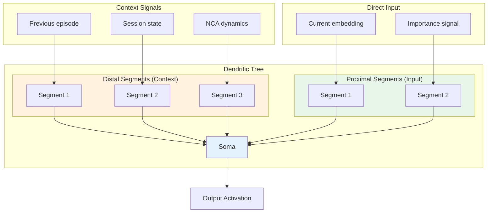

**Integration:**

| Input Type | Location | Function |
|------------|----------|----------|
| Feedforward | Proximal | Direct activation |
| Context | Distal | Modulatory gating |
| Recurrent | Basal | Self-stabilization |

## Attractor Networks

### Hopfield Pattern Completion

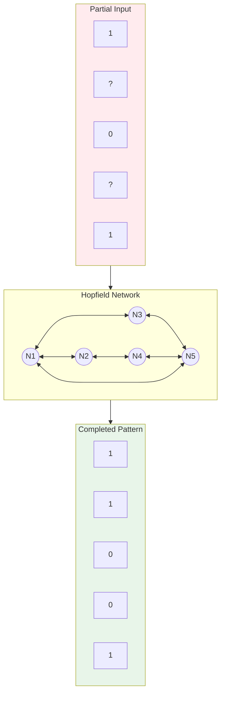

### Attractor Dynamics

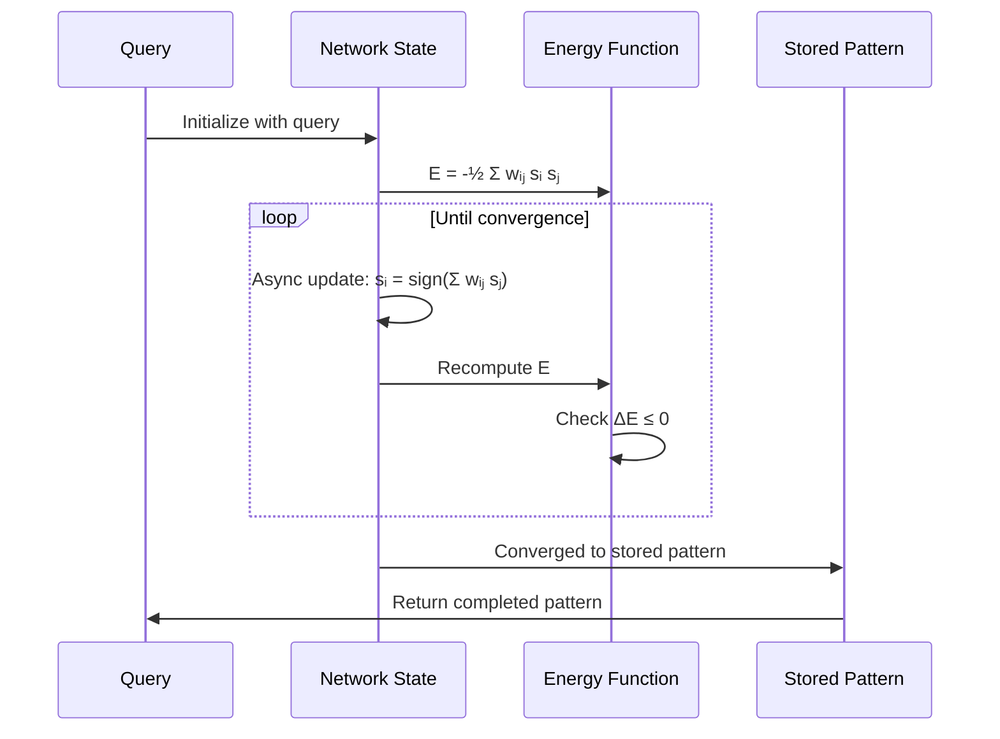

### Energy Landscape

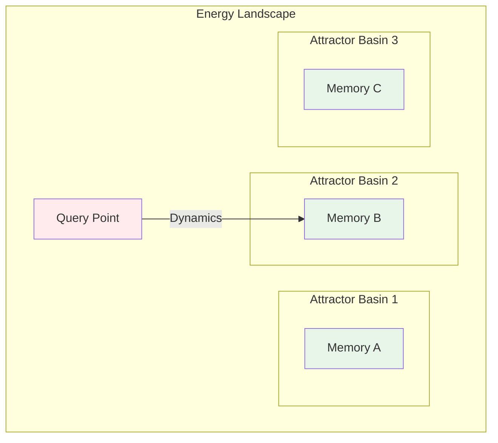

## Learning Mechanisms

### Hebbian Learning

"Neurons that fire together wire together."

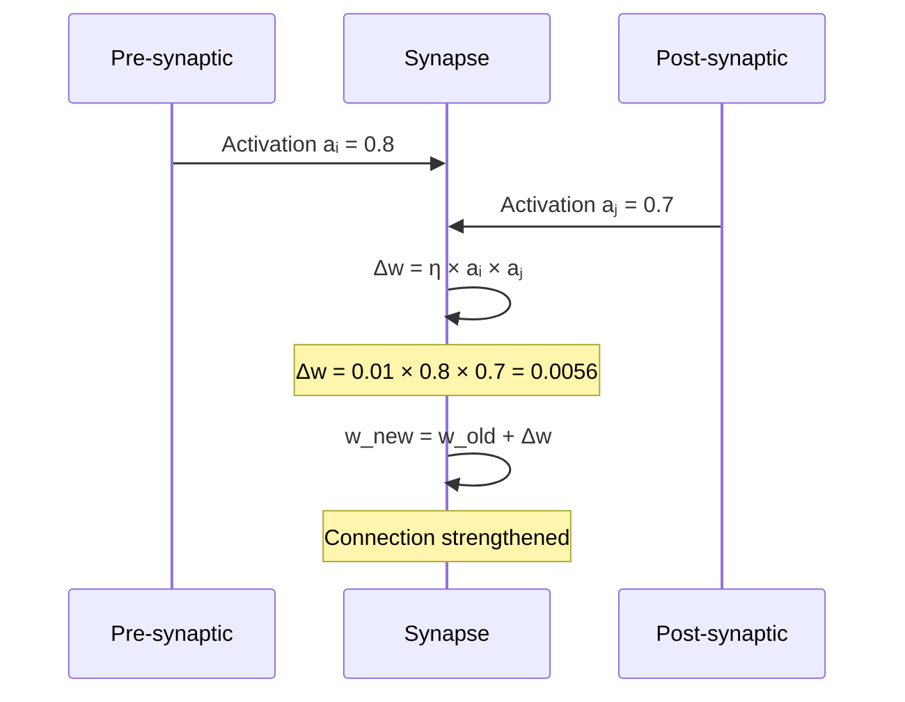

### STDP (Spike-Timing Dependent Plasticity)

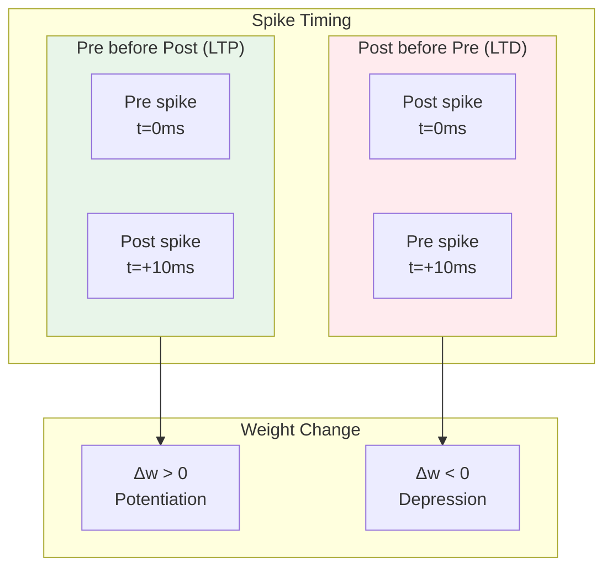

### STDP Learning Window

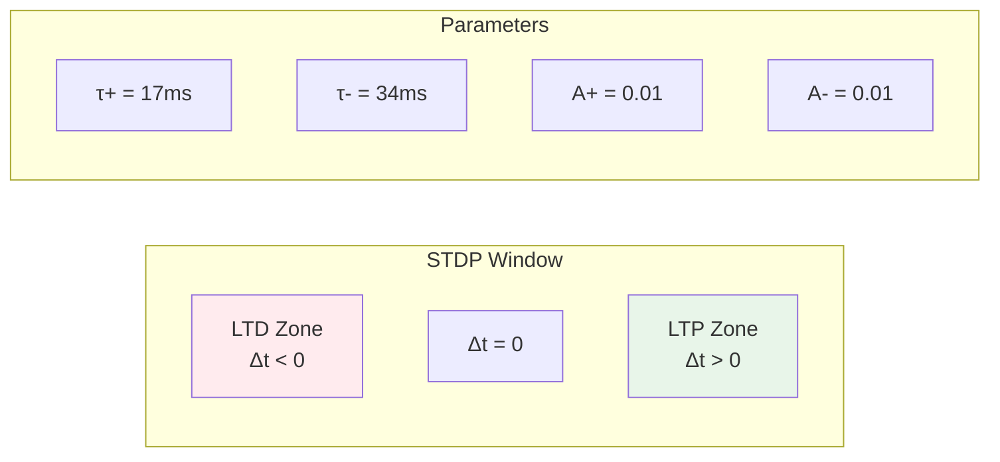

**Formula:**

```
if Δt > 0:  Δw = A+ × exp(-Δt / τ+)   # LTP
if Δt < 0:  Δw = -A- × exp(Δt / τ-)   # LTD
```

### Eligibility Traces

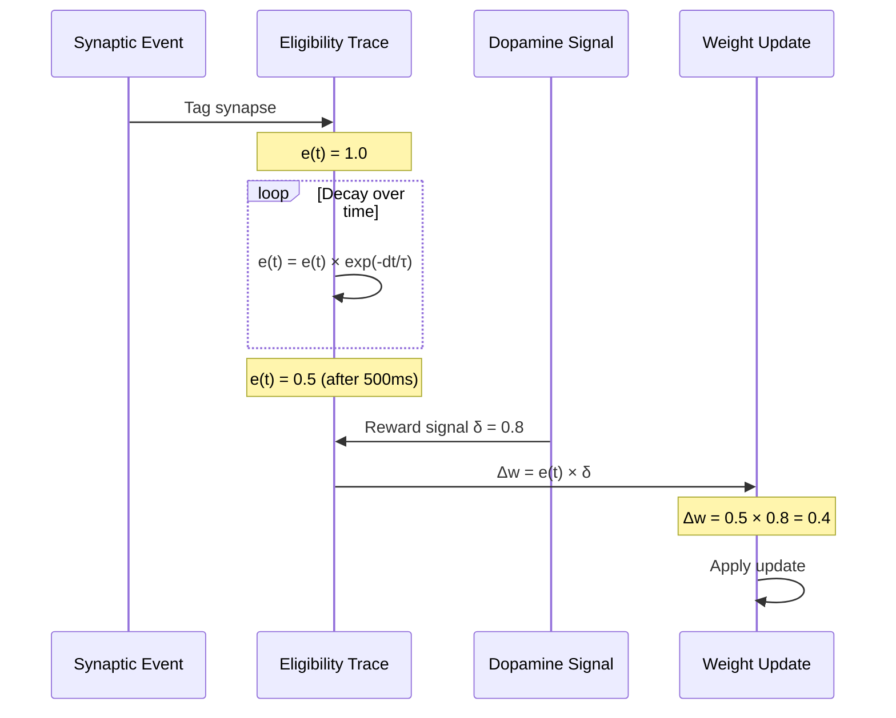

### Three-Factor Learning

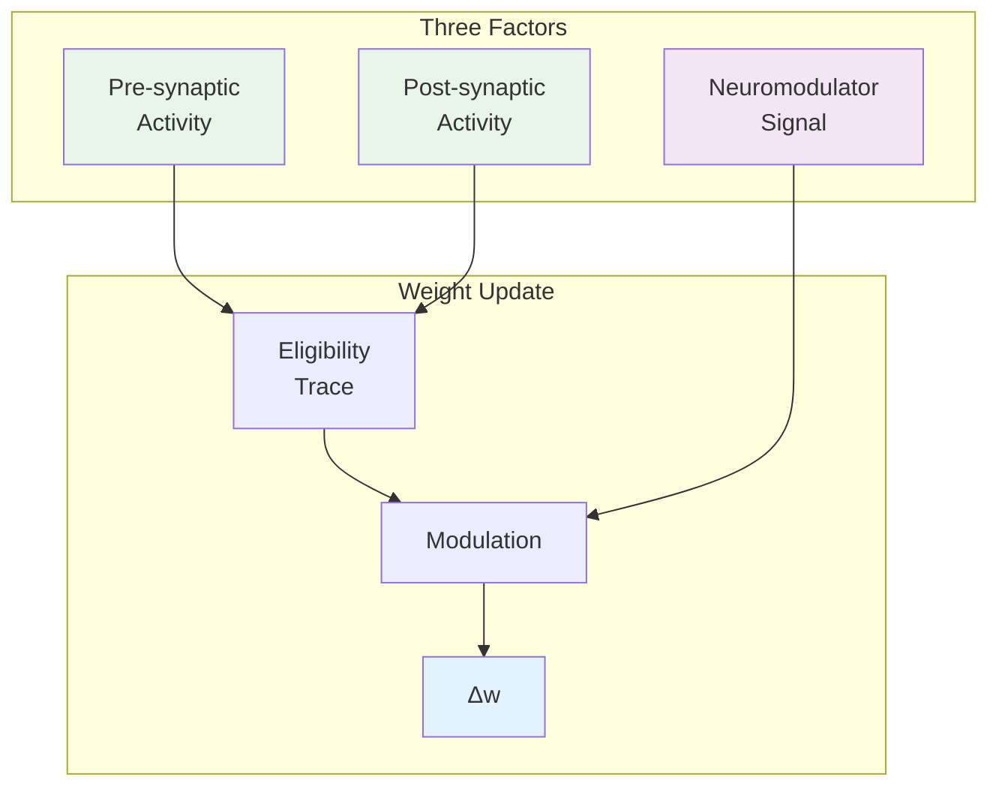

**Formula:**

```
Δw = eligibility_trace × neuromodulator × dopamine_signal
```

### Homeostatic Plasticity

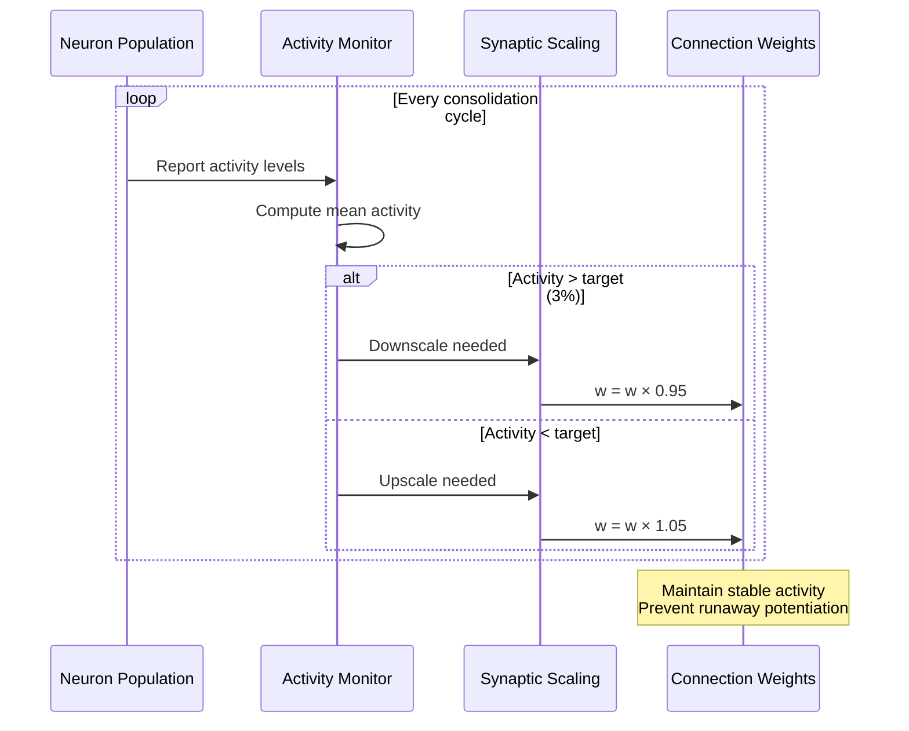

## Neuromodulator Effects

### Dopamine: Reward Prediction Error

```mermaid
graph TB
    subgraph Prediction["Prediction"]
        EXP[Expected Reward<br/>V(s) = 0.5]
    end

    subgraph Outcome["Outcome"]
        ACT[Actual Reward<br/>r = 0.8]
    end

    subgraph RPE["RPE Computation"]
        DELTA[δ = r - V(s)<br/>= 0.8 - 0.5 = 0.3]
    end

    subgraph Effect["Effect"]
        BURST[DA Burst<br/>Reinforce]
    end

    Prediction --> RPE
    Outcome --> RPE
    RPE --> Effect

    style BURST fill:#e8f5e9
```

### Norepinephrine: Arousal & Surprise (Phase 2 Enhanced)

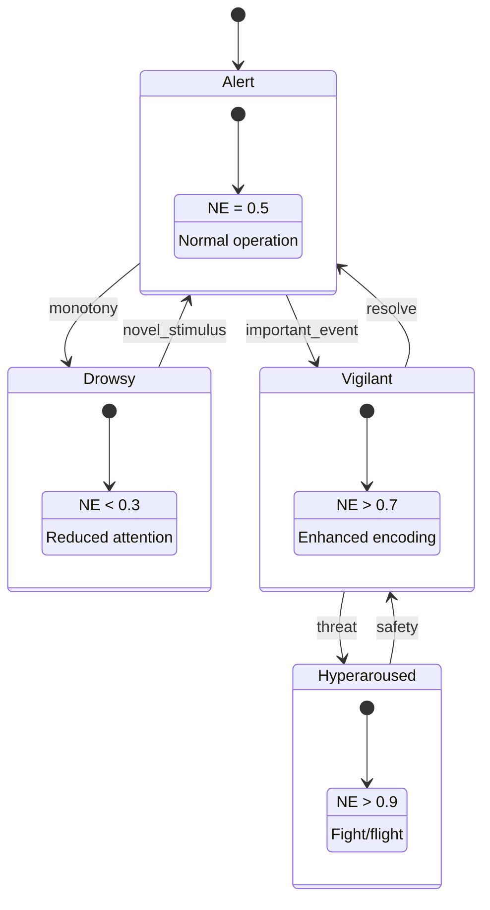

**Phase 2 Surprise Model** (`ww.nca.locus_coeruleus`):

Norepinephrine now encodes unexpected uncertainty and drives adaptive learning:

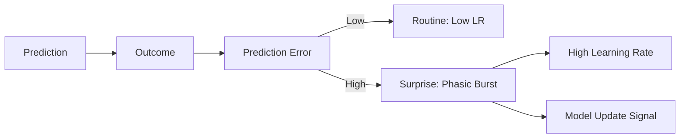

```python
from ww.nca import create_locus_coeruleus

lc = create_locus_coeruleus()

# Observe prediction-outcome pair
surprise, phasic_triggered = lc.observe_prediction_outcome(
    prediction=0.3,
    outcome=0.9  # Surprising!
)

# Get adaptive learning rate
lr = lc.get_adaptive_learning_rate()

# Check if model needs updating
if lc.should_update_model():
    update_weights(lr=lr)  # High surprise → high LR
```

**Surprise-Learning Rate Mapping** (Dayan & Yu 2006):

| Surprise Level | Phasic | Learning Rate | Action |
|----------------|--------|---------------|--------|
| Low (<0.3) | No | 0.01 | Trust model |
| Medium (0.3-0.7) | Maybe | 0.1 | Monitor |
| High (>0.7) | Yes | 0.3 | Update model |

### Acetylcholine: Encoding vs Retrieval

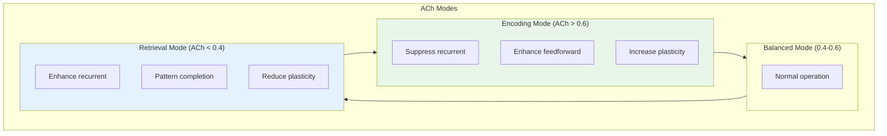

### Serotonin: Temporal Credit Assignment (Phase 2 Enhanced)

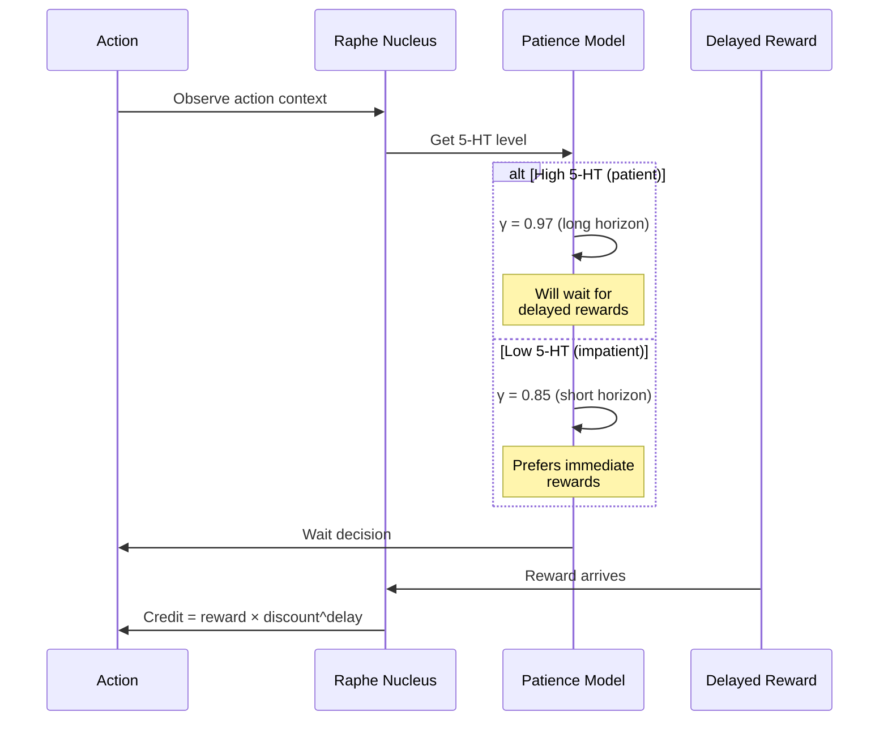

**Phase 2 Patience Model** (`ww.nca.raphe`):

```python
from ww.nca import create_raphe_nucleus

raphe = create_raphe_nucleus(setpoint=0.5)

# Get patience-related outputs
gamma = raphe.get_discount_rate()       # 0.85 - 0.97
horizon = raphe.get_temporal_horizon()  # 3 - 50 steps

# Wait/don't-wait decision API
should_wait, value_diff = raphe.evaluate_wait_decision(
    immediate_reward=1.0,
    delayed_reward=2.0,
    delay_steps=10
)
```

**Serotonin-Patience Mapping** (Doya 2002):

| 5-HT Level | Discount γ | Horizon | Behavior |
|------------|------------|---------|----------|
| Low (0.2) | ~0.85 | 5 steps | Impatient |
| Medium (0.5) | ~0.91 | 20 steps | Balanced |
| High (0.8) | ~0.97 | 45 steps | Patient |

## Integration Example

### Full Store with Bioinspired Components

```mermaid
sequenceDiagram
    participant Content as Content
    participant Encode as Encoding
    participant NCA as NCA Dynamics
    participant Gate as Memory Gate
    participant Learn as Learning

    Content->>Encode: "Important meeting notes"

    rect rgb(232, 245, 233)
        Note over Encode: Sparse Encoding
        Encode->>Encode: BGE-M3 → 1024-dim dense
        Encode->>Encode: Top-K → 50 active (5%)
        Encode->>Encode: Pattern separation
        Encode->>Encode: Dendritic integration
    end

    rect rgb(227, 242, 253)
        Note over NCA: Neural Dynamics
        NCA->>NCA: Theta phase: 0.3 (encoding)
        NCA->>NCA: ACh level: 0.7 (encoding mode)
        NCA->>NCA: NE level: 0.6 (alert)
    end

    rect rgb(255, 243, 224)
        Note over Gate: Gate Evaluation
        Gate->>Gate: Novelty: 0.8 (sparse distance)
        Gate->>Gate: Importance: 0.7 (content)
        Gate->>Gate: Context: 0.6 (dendritic)
        Gate->>Gate: Bayesian: p(store) = 0.82
        Gate-->>Content: ACCEPT
    end

    rect rgb(243, 229, 245)
        Note over Learn: Learning Updates
        Learn->>Learn: Create eligibility trace
        Learn->>Learn: DA signal (if outcome)
        Learn->>Learn: STDP on active synapses
        Learn->>Learn: Hebbian on co-active
    end
```

## Sleep and Consolidation

### Delta Oscillations (0.5-4 Hz)

Delta oscillations are the hallmark of slow-wave sleep (NREM stage 3-4) and coordinate memory consolidation.

```mermaid
graph TB
    subgraph SleepStages["Sleep Architecture"]
        WAKE[Awake<br/>High ACh, Low Delta]
        NREM1[NREM 1-2<br/>Transition, Spindles]
        SWS[Slow-Wave Sleep<br/>High Delta, Low ACh]
    end

    subgraph Delta["Delta Oscillator (0.5-4 Hz)"]
        UP[Up-State<br/>200-500ms]
        DOWN[Down-State<br/>200-500ms]
    end

    subgraph Consolidation["Memory Consolidation"]
        HC[Hippocampal<br/>Replay]
        CTX[Cortical<br/>Storage]
        SCALE[Synaptic<br/>Downscaling]
    end

    WAKE --> NREM1
    NREM1 --> SWS
    SWS --> NREM1

    SWS --> Delta
    UP --> HC
    DOWN --> SCALE
    HC --> CTX

    style SWS fill:#e8f5e9
    style UP fill:#e3f2fd
    style DOWN fill:#fff3e0
```

**Delta Up/Down State Dynamics:**

```mermaid
sequenceDiagram
    participant Delta as Delta Oscillator
    participant Adenosine as Adenosine Level
    participant HC as Hippocampus
    participant CTX as Cortex

    Note over Adenosine: Accumulated during wake<br/>Adenosine = 0.7

    Adenosine->>Delta: High adenosine pressure
    Delta->>Delta: Increase delta amplitude

    loop Every ~1 second (1 Hz)
        Delta->>Delta: UP-STATE begins
        Note over Delta: Consolidation gate = 1.0

        Delta->>HC: Trigger replay
        HC->>CTX: Transfer memory traces
        Note over CTX: Strengthen cortical<br/>representations

        Delta->>Delta: DOWN-STATE begins
        Note over Delta: Consolidation gate = 0.0

        Delta->>CTX: Enable downscaling
        Note over CTX: Synaptic homeostasis<br/>Scale down by 10%
    end
```

### Sleep Spindles (11-16 Hz)

Sleep spindles are thalamocortical oscillations that gate memory transfer and enable cortical plasticity.

```mermaid
graph TB
    subgraph TRN["Thalamic Reticular Nucleus"]
        GABA[GABAergic<br/>Neurons]
        BURST[Burst<br/>Firing]
    end

    subgraph Spindle["Spindle Structure"]
        WAX[Waxing Phase<br/>250ms]
        PLAT[Plateau Phase<br/>500-1000ms]
        WANE[Waning Phase<br/>250ms]
    end

    subgraph Function["Spindle Function"]
        GATE[Plasticity<br/>Window]
        TRANSFER[HC→CTX<br/>Transfer]
        PROTECT[Memory<br/>Protection]
    end

    GABA --> BURST
    BURST --> WAX
    WAX --> PLAT
    PLAT --> WANE
    WANE --> GATE

    GATE --> TRANSFER
    GATE --> PROTECT

    style PLAT fill:#e8f5e9
    style GATE fill:#e3f2fd
```

**Spindle-Delta Coupling:**

```mermaid
sequenceDiagram
    participant Delta as Delta Oscillator
    participant Spindle as Spindle Generator
    participant HC as Hippocampus
    participant CTX as Cortex

    Note over Delta: Deep sleep (sleep_depth=0.8)

    Delta->>Delta: UP-STATE onset
    Note over Delta: Consolidation window open

    Delta->>Spindle: Trigger spindle (50-200ms delay)
    Spindle->>Spindle: WAXING (amplitude rises)
    Spindle->>Spindle: PLATEAU (peak gating)

    Note over Spindle: consolidation_gate = 1.0

    HC->>Spindle: Sharp-wave ripple
    Spindle->>CTX: Gated memory transfer

    Spindle->>Spindle: WANING (amplitude falls)
    Spindle->>Spindle: INACTIVE

    Delta->>Delta: DOWN-STATE
    Note over CTX: Synaptic downscaling active
```

### Sharp-Wave Ripples (Phase 2 Enhanced)

Sharp-wave ripples (150-250 Hz) are hippocampal events that compress and replay memories during consolidation.

```mermaid
stateDiagram-v2
    [*] --> ACTIVE_WAKE: High NE/ACh
    ACTIVE_WAKE --> QUIET_WAKE: NE decreases
    QUIET_WAKE --> NREM_LIGHT: Sleep onset
    NREM_LIGHT --> NREM_DEEP: ACh drops
    NREM_DEEP --> REM: ACh rises
    REM --> NREM_LIGHT: NE rises

    note right of ACTIVE_WAKE: No SWRs (0%)
    note right of QUIET_WAKE: Rare SWRs (30%)
    note right of NREM_DEEP: Frequent SWRs (90%)
    note right of REM: No SWRs (0%)
```

**Phase 2 SWR Implementation** (`ww.nca.swr_coupling`):

```python
from ww.nca import (
    SWRNeuralFieldCoupling, WakeSleepMode,
    RIPPLE_FREQ_MIN, RIPPLE_FREQ_MAX, RIPPLE_FREQ_OPTIMAL,
    create_swr_coupling,
)

# Create with Phase 2 state gating
swr = create_swr_coupling(enable_state_gating=True)

# Set wake/sleep mode
swr.set_wake_sleep_mode(WakeSleepMode.NREM_DEEP)

# Get probability based on state
prob = swr.get_swr_probability()  # High during NREM_DEEP

# Validate ripple frequency (biological range)
assert swr.validate_ripple_frequency(180.0)  # True (optimal)
assert not swr.validate_ripple_frequency(100.0)  # False (too low)
```

**SWR Frequency Constants** (Buzsaki 2015, Carr et al. 2011):

| Constant | Value | Source |
|----------|-------|--------|
| RIPPLE_FREQ_MIN | 150 Hz | Buzsaki 2015 |
| RIPPLE_FREQ_OPTIMAL | 180 Hz | CA1 common |
| RIPPLE_FREQ_MAX | 250 Hz | Carr et al. 2011 |

**Wake-Sleep State Gating**:

| State | ACh/NE Pattern | SWR Probability |
|-------|----------------|-----------------|
| ACTIVE_WAKE | High/High | 0% |
| QUIET_WAKE | Low/Med | 30% |
| NREM_LIGHT | Low/Low | 50% |
| NREM_DEEP | VeryLow/VeryLow | 90% |
| REM | High/VeryLow | 0% |

## Contrastive Learning

### Learnable Embedding Adaptation

World Weaver uses contrastive learning to adapt frozen embeddings to task-specific needs.

```mermaid
graph TB
    subgraph Frozen["Frozen BGE-M3"]
        INPUT[Text Input]
        EMBED[Frozen Encoder<br/>1024-dim]
    end

    subgraph Adapter["Contrastive Adapter"]
        PROJ1[Linear Layer<br/>1024 → 512]
        NORM[Layer Norm]
        RELU[ReLU]
        PROJ2[Linear Layer<br/>512 → 256]
        L2[L2 Normalize]
    end

    subgraph Loss["InfoNCE Loss"]
        ANCHOR[Anchor]
        POS[Positive]
        NEG[Negatives]
        TEMP[Temperature τ]
    end

    INPUT --> EMBED
    EMBED --> PROJ1
    PROJ1 --> NORM
    NORM --> RELU
    RELU --> PROJ2
    PROJ2 --> L2

    L2 --> ANCHOR
    L2 --> POS
    L2 --> NEG

    ANCHOR --> Loss
    POS --> Loss
    NEG --> Loss
    TEMP --> Loss

    style Frozen fill:#f5f5f5
    style Adapter fill:#e3f2fd
    style Loss fill:#e8f5e9
```

**InfoNCE Loss:**

```
L = -log(exp(sim(anchor, positive)/τ) / Σ exp(sim(anchor, negative)/τ))
```

**Hard Negative Mining:**

```mermaid
sequenceDiagram
    participant Anchor as Anchor Embedding
    participant Pool as Candidate Pool
    participant Pos as Positive Samples
    participant Neg as Hard Negatives

    Anchor->>Pool: Compute all similarities
    Pool->>Pos: Mask positive samples

    Note over Pool: Semi-hard mining:<br/>sim(a,n) < sim(a,p)<br/>but sim(a,n) > sim(a,p) - margin

    Pool->>Neg: Select semi-hard negatives
    Note over Neg: Challenging but not too hard

    alt Not enough semi-hard
        Pool->>Neg: Fall back to hardest negatives
    end

    Neg-->>Anchor: Return hard negative batch
```

**Temporal Contrastive Loss:**

For episodic sequences, nearby episodes should have similar representations:

```mermaid
graph LR
    subgraph Sequence["Episode Sequence"]
        E1[Episode 1]
        E2[Episode 2]
        E3[Episode 3<br/>Anchor]
        E4[Episode 4]
        E5[Episode 5]
    end

    subgraph Window["Context Window (w=2)"]
        E2 --> |Positive| E3
        E4 --> |Positive| E3
    end

    subgraph Outside["Outside Window"]
        E1 --> |Negative| E3
        E5 --> |Negative| E3
    end

    style E3 fill:#e8f5e9
    style E2 fill:#e3f2fd
    style E4 fill:#e3f2fd
    style E1 fill:#ffcdd2
    style E5 fill:#ffcdd2
```

### Temperature Learning

The temperature parameter τ controls the sharpness of distinctions and is learnable:

```mermaid
graph TB
    subgraph Temperature["Temperature τ"]
        LOW[Low τ = 0.05<br/>Sharp distinctions]
        MED[Medium τ = 0.1<br/>Balanced]
        HIGH[High τ = 0.5<br/>Soft distinctions]
    end

    subgraph Effect["Effect on Learning"]
        HARD[Hard to learn<br/>Overconfident]
        OPT[Optimal learning<br/>Good gradients]
        EASY[Easy to learn<br/>Less discriminative]
    end

    LOW --> HARD
    MED --> OPT
    HIGH --> EASY

    style MED fill:#e8f5e9
    style OPT fill:#e8f5e9
```

**Meta-Learning Temperature:**

```mermaid
sequenceDiagram
    participant Adapter as Contrastive Adapter
    participant Loss as Loss Function
    participant Temp as Temperature

    Adapter->>Loss: Compute InfoNCE with τ
    Loss->>Loss: Estimate ∂L/∂(log τ)

    alt Loss too high
        Temp->>Temp: Increase τ (softer)
    else Loss too low
        Temp->>Temp: Decrease τ (sharper)
    end

    Temp->>Adapter: Updated temperature
    Note over Adapter: Self-tuning difficulty
```

## Phase 4: Advanced Bioinspired Components

### Forward-Forward Algorithm (Hinton 2022)

The Forward-Forward algorithm replaces backpropagation with layer-local learning using a "goodness" function:

```mermaid
graph TB
    subgraph Positive["Positive Phase (Real Data)"]
        P1[Layer 1<br/>G=2.3]
        P2[Layer 2<br/>G=3.1]
        P3[Layer 3<br/>G=2.8]
    end

    subgraph Negative["Negative Phase (Corrupted Data)"]
        N1[Layer 1<br/>G=1.2]
        N2[Layer 2<br/>G=0.8]
        N3[Layer 3<br/>G=0.9]
    end

    subgraph Learning["Layer-Local Learning"]
        L1[Push G+ above θ]
        L2[Push G- below θ]
    end

    Positive --> Learning
    Negative --> Learning

    style Positive fill:#e8f5e9
    style Negative fill:#ffebee
    style Learning fill:#e3f2fd
```

**Goodness Function:**

$$G(h) = \sum_i h_i^2$$

**Learning Rule:**

```python
from ww.nca import create_ff_network, FFPhase

ff = create_ff_network(layer_sizes=[64, 128, 64])

# Positive phase: maximize goodness
ff.forward(positive_data, phase=FFPhase.POSITIVE)

# Negative phase: minimize goodness
ff.forward(negative_data, phase=FFPhase.NEGATIVE)

# Layer-local weight update
for layer in ff.layers:
    layer.update_weights(threshold=2.0)
```

**NT Modulation of FF** (`ww.nca.forward_forward_nca_coupling`):

| NT | Effect on FF | Mechanism |
|----|--------------|-----------|
| DA | Threshold modulation | High DA → lower θ (easier learning) |
| NE | Learning rate | High NE → faster updates |
| ACh | Phase selection | High ACh → more encoding |
| 5-HT | Patience | High 5-HT → longer negative phase |

### Capsule Networks (Hinton 2017)

Capsule networks represent entities with pose vectors, enabling part-whole hierarchies:

```mermaid
graph TB
    subgraph Primary["Primary Capsules"]
        PC1[Capsule 1<br/>|v|=0.8]
        PC2[Capsule 2<br/>|v|=0.3]
        PC3[Capsule 3<br/>|v|=0.9]
    end

    subgraph Routing["Dynamic Routing"]
        R1[c₁₁=0.7]
        R2[c₁₂=0.3]
        R3[c₂₁=0.4]
        R4[c₂₂=0.6]
    end

    subgraph Digit["Digit Capsules"]
        DC1[Entity A<br/>|v|=0.95]
        DC2[Entity B<br/>|v|=0.2]
    end

    PC1 --> R1 --> DC1
    PC1 --> R2 --> DC2
    PC2 --> R3 --> DC1
    PC2 --> R4 --> DC2
    PC3 --> DC1

    style DC1 fill:#e8f5e9
    style DC2 fill:#ffebee
```

**Squash Activation:**

$$v_j = \frac{||s_j||^2}{1 + ||s_j||^2} \cdot \frac{s_j}{||s_j||}$$

**Dynamic Routing:**

```python
from ww.nca import create_capsule_network, RoutingType

caps = create_capsule_network(
    input_dim=64,
    n_primary=8,
    n_digit=4,
    routing=RoutingType.DYNAMIC,  # or RoutingType.EM
    iterations=3,
)

# Forward with routing
entity_probs, poses = caps.forward(input_tensor)

# NT modulation affects routing temperature
caps.set_routing_temperature(da_level * 2.0)  # DA → routing sharpness
```

**Pose Matrix Semantics:**

| Dimension | Meaning | Example |
|-----------|---------|---------|
| Position (x,y,z) | Spatial location | Object center |
| Scale (s) | Size | Object magnitude |
| Rotation (θ,φ,ψ) | Orientation | Object angle |
| Deformation (d) | Shape distortion | Aspect ratio |

### Glymphatic System (Nedergaard 2012)

The glymphatic system clears metabolic waste during sleep, enabling memory consolidation:

```mermaid
graph TB
    subgraph Wake["Wake State"]
        W1[High neural activity]
        W2[Small interstitial space]
        W3[Low CSF flow]
        W4[Waste accumulates]
    end

    subgraph Sleep["Sleep State (NREM Deep)"]
        S1[Low neural activity]
        S2[Expanded interstitial space]
        S3[High CSF flow]
        S4[Waste cleared]
    end

    subgraph AQP4["AQP4 Channels"]
        A1[Astrocyte endfeet]
        A2[Water transport]
        A3[Waste clearance]
    end

    Wake --> Sleep
    Sleep --> AQP4
    AQP4 --> S4

    style Wake fill:#ffebee
    style Sleep fill:#e8f5e9
    style AQP4 fill:#e3f2fd
```

**Clearance Dynamics:**

```python
from ww.nca import create_glymphatic_system, SleepStage

glymph = create_glymphatic_system()

# Set sleep stage (from sleep oscillator)
glymph.set_sleep_stage(SleepStage.NREM_DEEP)

# Observe clearance
rate = glymph.get_clearance_rate()  # High during NREM
waste = glymph.get_waste_level()    # Decreasing during sleep

# Integrate with memory system
memories_to_prune = glymph.get_prune_candidates(threshold=0.1)
```

**Sleep Stage Clearance Rates:**

| Stage | Interstitial Space | CSF Flow | Clearance Rate |
|-------|-------------------|----------|----------------|
| WAKE | 14% of tissue | Low | 0.1x |
| NREM_LIGHT | 18% | Medium | 0.5x |
| NREM_DEEP | 23% | High | 1.0x (baseline) |
| REM | 16% | Medium | 0.3x |

### Cross-Region Integration

Phase 4 introduces bidirectional coupling between neural subsystems:

```mermaid
graph TB
    subgraph FF["Forward-Forward"]
        FF_G[Goodness G(h)]
        FF_T[Threshold θ]
    end

    subgraph NCA["NCA Dynamics"]
        NCA_E[Energy E(U)]
        NCA_T[Temperature T]
    end

    subgraph Caps["Capsule Networks"]
        CAPS_R[Routing c_ij]
        CAPS_P[Poses v_j]
    end

    subgraph Glymph["Glymphatic"]
        GL_C[Clearance rate]
        GL_W[Waste level]
    end

    FF_G <-->|Energy coupling| NCA_E
    NCA_T <-->|Temperature| FF_T

    CAPS_R <-->|Routing modulation| NCA_E
    CAPS_P <-->|Pose stability| NCA_T

    NCA_E --> GL_C
    GL_W --> NCA_T

    style FF fill:#e8f5e9
    style NCA fill:#e3f2fd
    style Caps fill:#fff3e0
    style Glymph fill:#f3e5f5
```

**Coupling Equations:**

```
# FF-NCA Coupling
E_coupled = E_nca + α * (G_pos - G_neg)
T_coupled = T_nca * (1 + β * margin)

# Capsule-NCA Coupling
routing_temp = base_temp * (1 + DA * γ)
pose_stability = stability * (1 - waste_level)

# Glymphatic-NCA Coupling
clearance = base_rate * sleep_gate * (1 - activity_level)
```

**Integration API:**

```python
from ww.nca import (
    create_ff_network,
    create_capsule_network,
    create_glymphatic_system,
    FFNCACoupling,
    CapsuleNCACoupling,
    GlymphaticConsolidationBridge,
)

# Create coupled system
ff = create_ff_network(layer_sizes=[64, 128, 64])
caps = create_capsule_network(input_dim=64, n_digit=4)
glymph = create_glymphatic_system()

# Set up coupling bridges
ff_nca = FFNCACoupling(ff_network=ff, energy_landscape=energy)
caps_nca = CapsuleNCACoupling(capsule_net=caps, neural_field=field)
glymph_bridge = GlymphaticConsolidationBridge(
    glymphatic=glymph,
    memory=episodic_memory,
)

# During consolidation
ff_nca.couple_step(nt_state)
caps_nca.modulate_routing(nt_state)
glymph_bridge.prune_and_consolidate()
```
