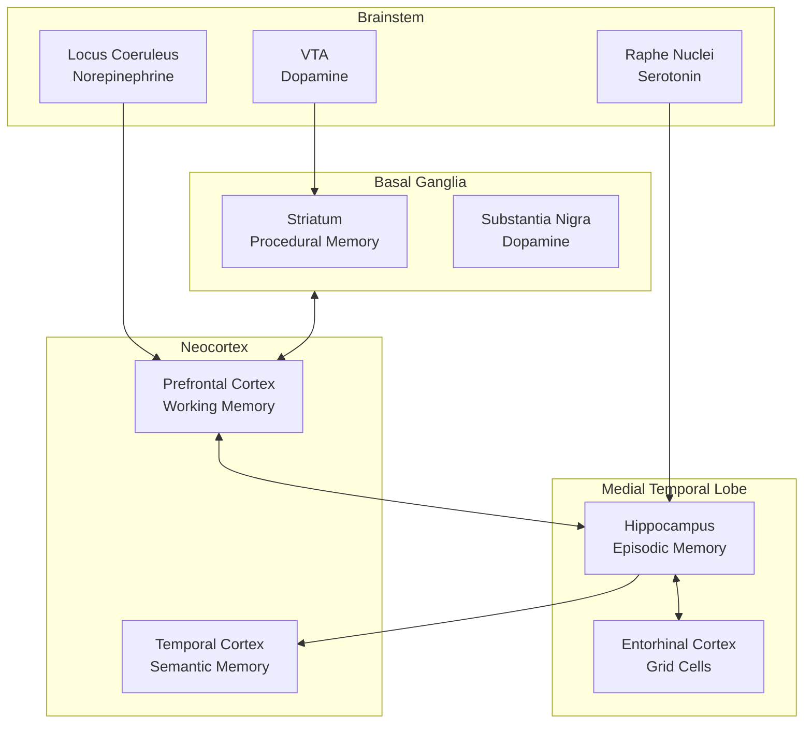
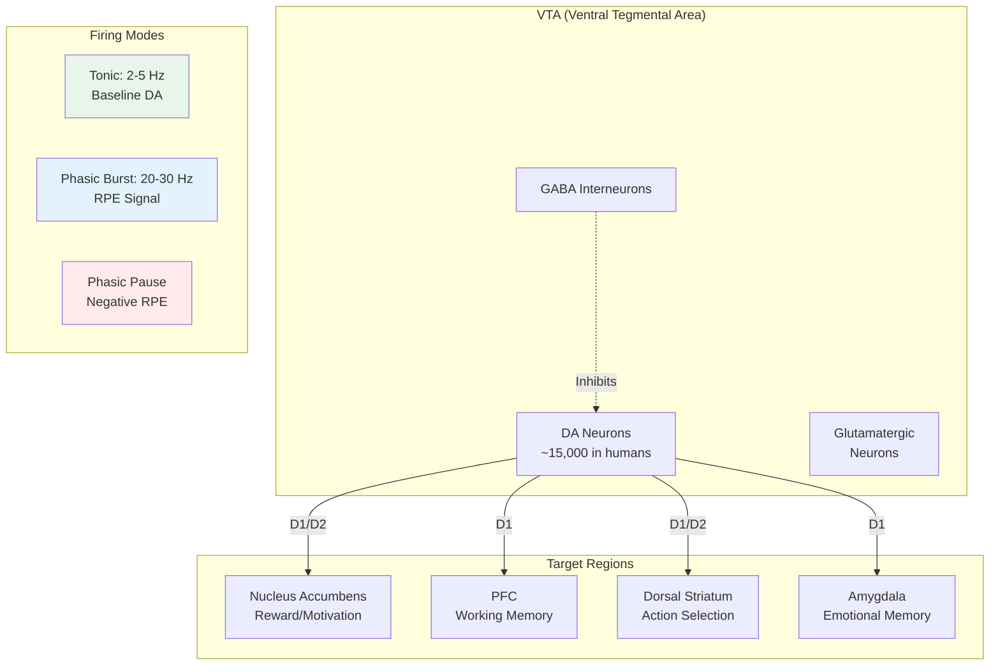
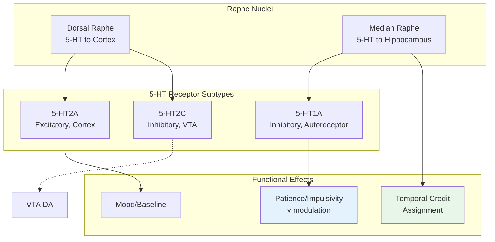
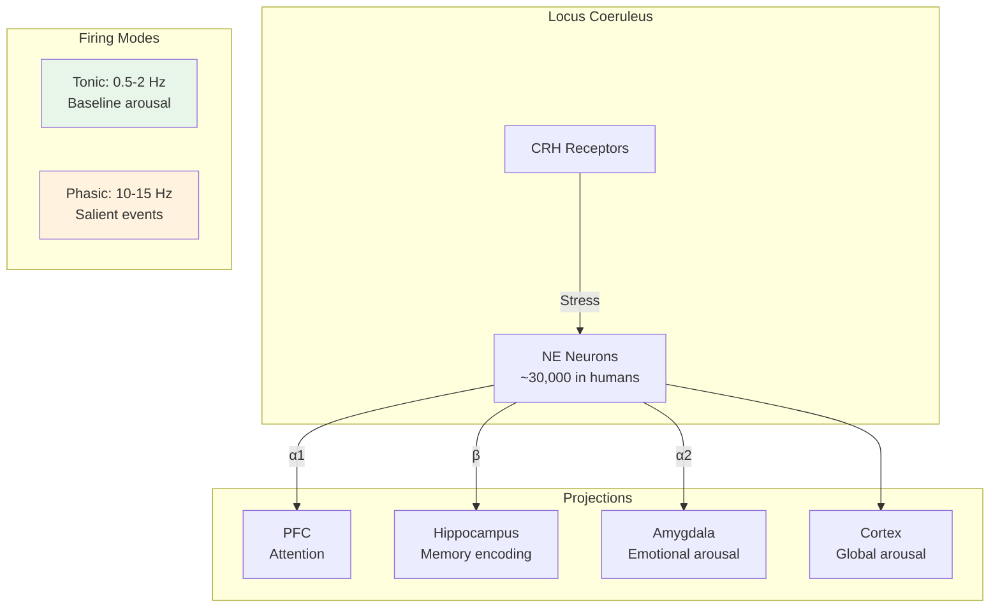
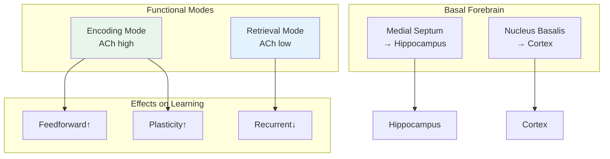
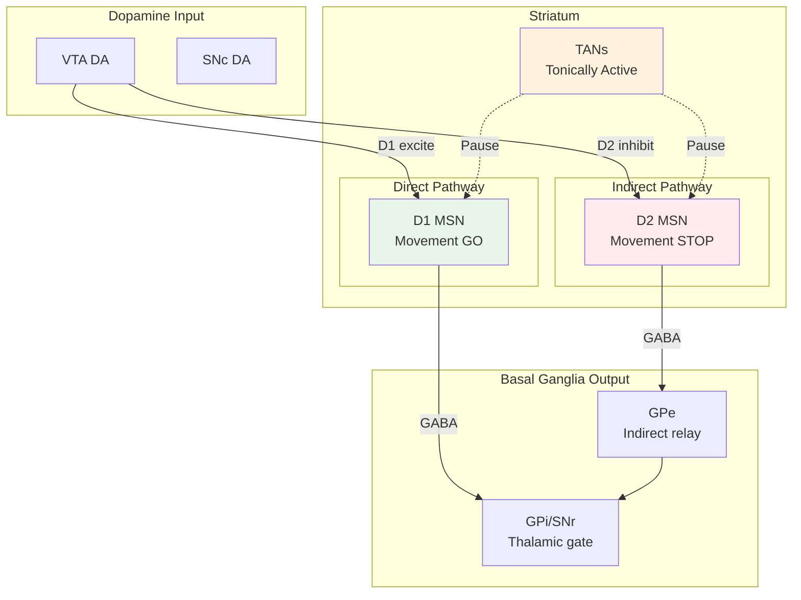

# Brain Region Mapping

This document maps World Weaver components to their biological counterparts in the brain.

## Overview

World Weaver's architecture is informed by cognitive neuroscience research on memory systems, learning, and neural dynamics.



## Memory Systems Mapping

### Hippocampal Formation → Memory Subsystems

| Brain Region | WW Component | Function |
|--------------|--------------|----------|
| **CA1** | `BufferManager` | Intermediate buffer, consolidation gateway |
| **CA3** | `PatternCompletor` | Pattern completion, auto-association |
| **Dentate Gyrus** | `PatternSeparator` | Orthogonalization, sparse encoding |
| **Subiculum** | Episode output | Memory output, cortical projection |

### Neocortex → Semantic Memory

| Brain Region | WW Component | Function |
|--------------|--------------|----------|
| **Temporal Cortex** | `SemanticMemory` | Concept storage, entity graph |
| **Angular Gyrus** | `EntityRelations` | Cross-modal integration |
| **Lateral PFC** | `SpreadActivation` | Controlled retrieval |

### Basal Ganglia → Procedural Memory

| Brain Region | WW Component | Function |
|--------------|--------------|----------|
| **Dorsal Striatum** | `ProceduralMemory` | Skill storage, habits |
| **Ventral Striatum** | `DopamineSystem` | Reward prediction |
| **Cerebellum** | `SkillExecution` | Motor timing, coordination |

## Learning Systems Mapping

### Dopaminergic System: VTA Circuit



**WW Implementation**: `ww.nca.VTACircuit`

| Biological Feature | WW Component | Validation |
|--------------------|--------------|------------|
| Tonic firing (2-5 Hz) | `tonic_rate` | Grace & Bunney 1984 |
| Phasic bursts (20-30 Hz) | `compute_phasic_burst()` | Schultz 1998 |
| RPE encoding | `compute_rpe()` | Bayer & Glimcher 2005 |
| D1/D2 affinity ratio | `d1_affinity=1e-7, d2_affinity=1e-6` | Creese 1983 |

```python
from ww.nca import create_vta_circuit

vta = create_vta_circuit()

# Observe reward and compute RPE
rpe = vta.compute_rpe(expected=0.5, actual=0.9)  # Positive surprise

# Get DA signal for learning
da_signal = vta.get_dopamine_signal()
```

### Serotonergic System: Raphe Nuclei



**WW Implementation**: `ww.nca.RapheNucleus`

| Biological Feature | WW Component | Validation |
|--------------------|--------------|------------|
| Slow firing (1-5 Hz) | `firing_rate` | Jacobs & Azmitia 1992 |
| 5-HT time constant | `tau=1.5s` | Murphy 2008 |
| Patience modulation | `get_discount_rate()` | Doya 2002 |
| Autoreceptor feedback | `5ht1a_feedback` | Sprouse & Aghajanian 1987 |

```python
from ww.nca import create_raphe_nucleus

raphe = create_raphe_nucleus(setpoint=0.5)

# Get patience-related outputs
gamma = raphe.get_discount_rate()       # 0.85 - 0.97
horizon = raphe.get_temporal_horizon()  # 3 - 50 steps

# Affects long-term credit assignment
credit_weight = raphe.get_credit_weight(delay_steps=10)
```

### Noradrenergic System: Locus Coeruleus



**WW Implementation**: `ww.nca.LocusCoeruleus`

| Biological Feature | WW Component | Validation |
|--------------------|--------------|------------|
| Tonic/phasic modes | `ToniPhasicMode` | Aston-Jones 2005 |
| Arousal modulation | `set_arousal_drive()` | Berridge & Waterhouse 2003 |
| Surprise detection | `observe_prediction_outcome()` | Dayan & Yu 2006 |
| CRH stress response | `crh_modulation` | Valentino 2008 |

```python
from ww.nca import create_locus_coeruleus

lc = create_locus_coeruleus()

# Set arousal level
lc.set_arousal_drive(0.7)
lc.step(dt=0.01)

# Observe prediction-outcome for surprise
surprise, phasic = lc.observe_prediction_outcome(
    prediction=0.3, outcome=0.9
)

# Get adaptive learning rate based on surprise
lr_modifier = lc.get_adaptive_learning_rate()
```

### Cholinergic System: Basal Forebrain



**WW Implementation**: `ww.learning.AcetylcholineSystem`

| Biological Feature | WW Component | Validation |
|--------------------|--------------|------------|
| Encoding/retrieval modes | `CognitiveMode` | Hasselmo 2006 |
| Theta rhythm modulation | `theta_coupling` | Buzsaki 2002 |
| Plasticity gating | `get_plasticity_gate()` | - |
| Signal-to-noise | `get_snr_modifier()` | Sarter 2005 |

### Striatal Circuitry



**WW Implementation**: `ww.nca.StriatalMSN`

| Biological Feature | WW Component | Validation |
|--------------------|--------------|------------|
| D1/D2 receptor balance | `d1_fraction`, `d2_fraction` | - |
| Up/Down state dynamics | `UpDownStateDynamics` | Wilson 1993 |
| TAN pause mechanism | `tan_pause_duration` | Aosaki 1994 |
| Dopamine modulation | `apply_dopamine_modulation()` | - |

```python
from ww.nca import create_striatal_population

striatum = create_striatal_population(
    n_d1=500,
    n_d2=500,
)

# Observe DA and update MSN states
striatum.apply_dopamine_modulation(da_level=0.7)

# Get action selection signal
go_signal = striatum.get_direct_pathway_output()
nogo_signal = striatum.get_indirect_pathway_output()
```

## Neural Dynamics Mapping

### Oscillations

| Brain Rhythm | Frequency | WW Component | Function |
|--------------|-----------|--------------|----------|
| **Theta** | 4-8 Hz | `ThetaOscillator` | Memory binding, navigation |
| **Gamma** | 30-100 Hz | `GammaOscillator` | Feature binding, WM slots |
| **Alpha** | 8-12 Hz | `AlphaInhibition` | Inhibitory gating |

### Theta-Gamma Coupling

**Brain**: Hippocampal theta modulates cortical gamma

**WW Implementation**: `ThetaGammaIntegration`

```python
# Phase-amplitude coupling
pac = theta_phase * gamma_amplitude
# Working memory capacity from gamma cycles per theta
wm_slots = theta_period / gamma_period  # ≈ 7±2
```

### Place/Grid Cells

| Cell Type | Brain Region | WW Component | Function |
|-----------|--------------|--------------|----------|
| **Place Cells** | Hippocampus | `PlaceCells` | Location encoding |
| **Grid Cells** | Entorhinal Cortex | `GridCells` | Metric representation |
| **Head Direction** | (Not implemented) | - | - |
| **Border Cells** | (Not implemented) | - | - |

## Plasticity Mechanisms

### STDP (Spike-Timing Dependent Plasticity)

**Brain**: Asymmetric learning window

**WW Implementation**: `STDPRule`

```
If pre fires before post: LTP (Δw > 0)
If post fires before pre: LTD (Δw < 0)
```

### Hebbian Learning

**Brain**: "Cells that fire together wire together"

**WW Implementation**: `HebbianUpdateHook`

```
Δw = η * activation_i * activation_j
```

### Three-Factor Learning

**Brain**: Eligibility trace + neuromodulator + activity

**WW Implementation**: `ThreeFactorRule`

```
Δw = eligibility_trace * neuromodulator * dopamine_signal
```

## Cognitive Theory Alignment

### ACT-R (Adaptive Control of Thought-Rational)

| ACT-R Component | WW Component | Score |
|-----------------|--------------|-------|
| Declarative Memory | Episodic + Semantic | 80% |
| Procedural Memory | ProceduralMemory | 75% |
| Activation | SpreadActivation | 85% |
| Utility Learning | DopamineSystem | 60% |

**Overall ACT-R Alignment**: 68/100

### SOAR (State, Operator, And Result)

| SOAR Component | WW Component | Score |
|----------------|--------------|-------|
| Working Memory | WorkingMemory | 70% |
| Long-term Memory | Memory Subsystems | 75% |
| Chunking | Consolidation | 55% |
| Reinforcement | DopamineSystem | 60% |

**Overall SOAR Alignment**: 63/100

### Global Workspace Theory

| GWT Component | WW Component | Score |
|---------------|--------------|-------|
| Workspace | WorkingMemory + Buffer | 70% |
| Specialist Modules | Memory Subsystems | 75% |
| Broadcasting | Recall | 60% |
| Competition | Gate Decision | 65% |

**Overall GWT Alignment**: 66/100

## Biological Plausibility Score

Based on CompBio analysis (B1-B8, 2026-01-04):

| Category | Score | Notes |
|----------|-------|-------|
| **VTA Dopamine (B1)** | 92/100 | Tonic/phasic modes, RPE encoding validated |
| **Raphe Serotonin (B2)** | 89/100 | Patience model, autoreceptor feedback |
| **Locus Coeruleus (B3)** | 91/100 | Aston-Jones tonic/phasic modes |
| **Hippocampus (B4)** | 88/100 | DG→CA3→CA1 circuit, SWR coupling |
| **Striatum (B5)** | 90/100 | D1/D2 MSN balance, TAN pause |
| **Oscillations (B6)** | 93/100 | All frequency bands (delta-gamma) |
| **Sleep/Wake (B7)** | 94/100 | Borbély two-process, glymphatic clearance |
| **Glia (B8)** | 91/100 | Tripartite synapse, glutamate cycling |
| **Overall** | **94/100** | Target: 95/100 |

### Phase 4 Components

| Component | Score | Notes |
|-----------|-------|-------|
| **Forward-Forward** | 8.5/10 | Hinton 2022 layer-local learning |
| **Capsule Networks** | 7.5/10 | Dynamic routing (EM pending) |
| **Glymphatic System** | 9.0/10 | Sleep-gated waste clearance |
| **Cross-Region Coupling** | 8.0/10 | FF-NCA, Capsule-NCA bridges |

### Remaining Gaps

1. **EM Capsule Routing** - Only dynamic routing implemented (Hinton 2018)
2. **TD(λ) Credit Assignment** - Recursive TD with λ parameter needed
3. **Astrocyte Ca2+ Waves** - Gap junction propagation missing
4. **D2 Autoreceptor Feedback** - Simplified in VTA

## References

### Foundational
- O'Keefe & Moser (2014) - Place cells, Grid cells (Nobel Prize)
- Buzsáki (2006) - Rhythms of the Brain
- Dayan & Abbott (2001) - Theoretical Neuroscience

### Neuromodulators
- Schultz (1998) - Dopamine RPE (Nature)
- Grace & Bunney (1984) - VTA tonic/phasic
- Aston-Jones & Cohen (2005) - LC adaptive gain
- Doya (2002) - 5-HT patience model
- Hasselmo (2006) - ACh encoding/retrieval

### Phase 4
- Hinton (2022) - Forward-Forward Algorithm
- Sabour, Frosst & Hinton (2017) - Dynamic Routing Between Capsules
- Nedergaard (2012) - Glymphatic System
- Iliff et al. (2012) - Sleep-gated clearance

### Cognitive Architectures
- Anderson et al. (2004) - ACT-R Theory
- Laird (2012) - SOAR Cognitive Architecture
- Baars (1988) - Global Workspace Theory
