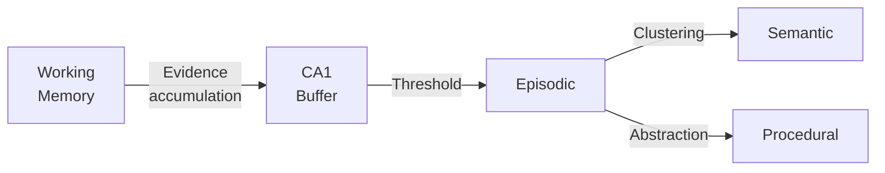

# Concepts

Understanding the core concepts behind World Weaver.

## Overview

World Weaver implements a biologically-inspired memory architecture based on cognitive neuroscience research. The system combines multiple memory subsystems with neural dynamics to create an AI memory system that exhibits properties similar to human memory.

## Key Concepts

-   :material-brain: **[Architecture](architecture.md)**

    ---

    System architecture with tripartite memory, prediction layers, and NCA dynamics

-   :material-database: **[Memory Types](memory-types.md)**

    ---

    Episodic, Semantic, and Procedural memory subsystems

-   :material-sine-wave: **[Neuro Cognitive Architecture](nca.md)**

    ---

    Neural field dynamics, oscillations, and attractor states

-   :material-map-marker: **[Brain Region Mapping](brain-mapping.md)**

    ---

    Mapping World Weaver components to brain regions

-   :material-play-network: **[Forward-Forward Algorithm](forward-forward.md)**

    ---

    Hinton's (2022) layer-local learning without backpropagation

-   :material-shape-plus: **[Capsule Networks](capsules.md)**

    ---

    Part-whole hierarchical representations with dynamic routing

-   :material-water: **[Glymphatic System](glymphatic.md)**

    ---

    Sleep-gated waste clearance and memory pruning

-   :material-hub: **[Cross-Region Integration](cross-region-integration.md)**

    ---

    FF-NCA coupling, Capsule-NCA coupling, and consolidation bridges

## Design Principles

### 1. Biological Plausibility

World Weaver's algorithms are informed by neuroscience research:

- **FSRS** for episodic memory decay (spaced repetition)
- **ACT-R** activation for semantic retrieval
- **Dopamine RPE** for reward prediction errors
- **STDP** for synaptic plasticity
- **Theta-gamma coupling** for memory binding

### 2. Separation of Concerns

Each memory type has distinct characteristics:

| Memory Type | Time Scale | Structure | Learning |
|------------|------------|-----------|----------|
| Episodic | Minutes to years | Sequential | FSRS decay |
| Semantic | Persistent | Graph | Hebbian |
| Procedural | Persistent | Skills | Reinforcement |

### 3. Consolidation

Memories transition between systems through consolidation:

### 4. Prediction-Driven

World models enable:

- **Anticipation** of future states
- **Prioritized replay** of surprising events
- **Dream-like** trajectory generation for consolidation
