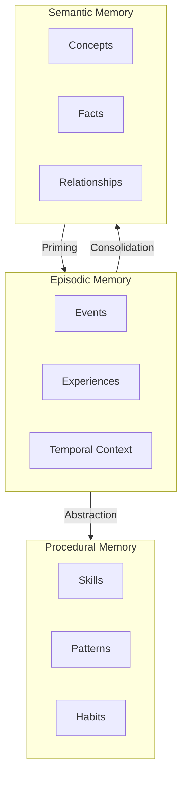
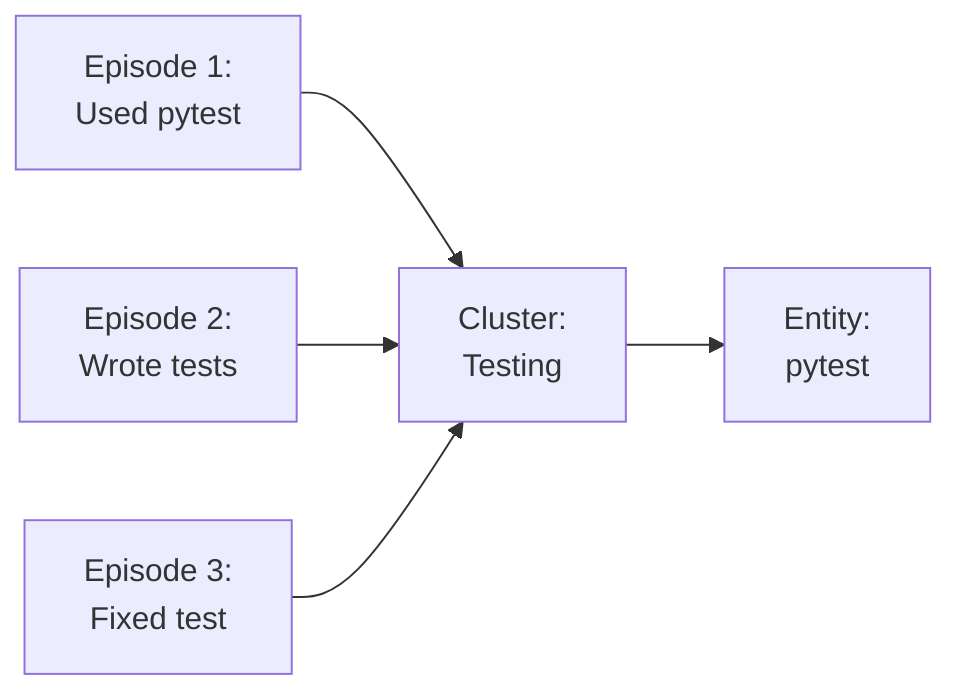
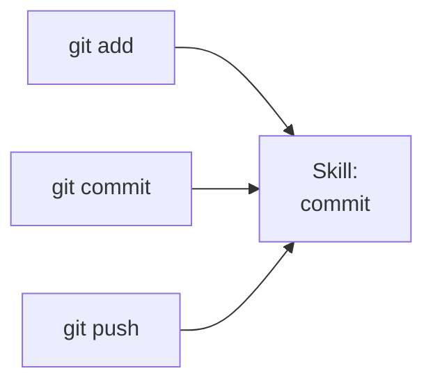

# Memory Types

T4DM implements three distinct memory subsystems inspired by cognitive neuroscience.

## Overview



## Episodic Memory

**Purpose**: Store autobiographical events with rich temporal and contextual information.

### Characteristics

| Aspect | Description |
|--------|-------------|
| **Time Scale** | Minutes to years |
| **Structure** | Sequential, timestamped |
| **Decay** | FSRS-based spaced repetition |
| **Retrieval** | Similarity + recency |

### Data Model

```python
@dataclass
class Episode:
    id: UUID
    session_id: str
    content: str
    timestamp: datetime
    embedding: np.ndarray

    # Context
    project: str | None
    file: str | None
    tool: str | None

    # Learning
    outcome: str | None         # SUCCESS, FAILURE, PARTIAL
    emotional_valence: float    # 0.0 to 1.0

    # FSRS State
    stability: float            # Memory stability
    difficulty: float           # Learning difficulty
    retrievability: float       # Current retrievability

    # Access tracking
    access_count: int
    last_accessed: datetime
```

### Operations

=== "Store"

    ```python
    from ww import memory

    await memory.store(
        content="Discovered a bug in the authentication flow",
        importance=0.9,
        tags=["bug", "auth"],
        metadata={"file": "auth.py", "line": 42}
    )
    ```

=== "Recall"

    ```python
    results = await memory.recall_episodes(
        query="authentication issues",
        limit=10,
        min_similarity=0.7
    )
    ```

=== "Mark Important"

    ```python
    # Boost stability for important memories
    await memory.mark_important(episode_id, importance=1.0)
    ```

### FSRS Scheduling

Memories decay according to the Free Spaced Repetition Scheduler:

```
retrievability = e^(-t / stability)
```

Where:
- `t` = time since last access
- `stability` = memory strength (increases with successful retrievals)

## Semantic Memory

**Purpose**: Store conceptual knowledge as a graph of interconnected entities.

### Characteristics

| Aspect | Description |
|--------|-------------|
| **Time Scale** | Persistent |
| **Structure** | Knowledge graph |
| **Learning** | Hebbian strengthening |
| **Retrieval** | ACT-R activation spreading |

### Entity Types

| Type | Description | Example |
|------|-------------|---------|
| `CONCEPT` | Abstract ideas | "Machine Learning" |
| `PERSON` | People | "Geoffrey Hinton" |
| `PROJECT` | Projects | "T4DM" |
| `TOOL` | Tools/Software | "PyTorch" |
| `TECHNIQUE` | Methods | "Backpropagation" |
| `FACT` | Factual statements | "Python 3.10 released 2021" |

### Data Model

```python
@dataclass
class Entity:
    id: UUID
    name: str
    entity_type: EntityType
    summary: str
    details: dict
    source: str | None

    # Graph properties
    relationships: list[Relationship]

    # Learning
    stability: float
    access_count: int
    created_at: datetime
```

### Relationships

```python
@dataclass
class Relationship:
    source_id: UUID
    target_id: UUID
    relation_type: str      # IS_A, RELATED_TO, PART_OF, etc.
    weight: float           # Strength (Hebbian learning)
    co_access_count: int    # Co-retrieval count
```

### Operations

=== "Store Entity"

    ```python
    from ww import memory

    await memory.store_entity(
        name="Transformer",
        description="Neural network architecture using self-attention",
        entity_type="concept"
    )
    ```

=== "Create Relationship"

    ```python
    # Via REST API
    POST /api/v1/entities/relations
    {
        "source_id": "...",
        "target_id": "...",
        "relation_type": "IS_A"
    }
    ```

=== "Spread Activation"

    ```python
    # ACT-R style activation spreading
    activation = await memory.spread_activation(
        entity_id=start_entity,
        depth=3
    )
    ```

### Hebbian Learning

When entities are co-retrieved, their relationship strengthens:

```
Δw = η * a_i * a_j
```

Where:
- `η` = learning rate
- `a_i`, `a_j` = activation levels of entities

## Procedural Memory

**Purpose**: Store skills, patterns, and executable knowledge.

### Characteristics

| Aspect | Description |
|--------|-------------|
| **Time Scale** | Persistent |
| **Structure** | Skills with steps |
| **Learning** | Reinforcement (success rate) |
| **Retrieval** | Task-based matching |

### Domains

| Domain | Description | Examples |
|--------|-------------|----------|
| `CODING` | Programming tasks | "git commit", "pytest" |
| `RESEARCH` | Research workflows | "literature review" |
| `TRADING` | Trading operations | "order execution" |
| `DEVOPS` | Operations tasks | "deploy service" |
| `WRITING` | Writing tasks | "draft email" |

### Data Model

```python
@dataclass
class Skill:
    id: UUID
    name: str
    domain: Domain
    trigger_pattern: str        # When to use
    description: str

    # Execution
    steps: list[Step]
    script: str | None          # Executable script
    parameters: dict

    # Learning
    success_rate: float
    execution_count: int
    last_executed: datetime

    # Versioning
    version: int
    deprecated: bool
```

### Operations

=== "Store Skill"

    ```python
    from ww import memory

    await memory.store_skill(
        name="run_tests",
        script="pytest tests/ -v",
        domain="coding",
        description="Run the test suite with verbose output"
    )
    ```

=== "Record Execution"

    ```python
    # After skill execution
    POST /api/v1/skills/{skill_id}/execute
    {
        "success": true,
        "duration_ms": 1500,
        "output": "10 passed"
    }
    ```

=== "How-To Query"

    ```python
    # Natural language skill search
    skill, steps, confidence = await memory.how_to("run the tests")
    ```

### Success Rate Learning

Skills track execution outcomes:

```
success_rate = (successes + 1) / (total + 2)  # Laplace smoothing
```

## Memory Consolidation

### Episodic → Semantic

Repeated episodes are clustered into semantic concepts:



### Episodic → Procedural

Action sequences are abstracted into skills:



## Cross-Memory Retrieval

The unified `recall` function searches across all memory types:

```python
from ww import memory

# Search all memory types
results = await memory.recall(
    "machine learning",
    limit=10,
    memory_types=["episodic", "semantic", "procedural"]
)

for r in results:
    print(f"[{r.memory_type}] {r.content} (score: {r.score:.2f})")
```
