# Neuro Cognitive Architecture

The NCA layer implements biologically-inspired neural dynamics for cognitive state management.

## Overview

World Weaver's NCA is inspired by the KATIE architecture and implements:

- **6-Neurotransmitter PDE System**: Continuous neural field dynamics
- **Cognitive State Attractors**: Stable cognitive modes
- **Theta-Gamma Coupling**: Phase-based memory binding
- **Place/Grid Cells**: Spatial cognition in embedding space

## Neural Field Dynamics

### The PDE System

The neural field evolves according to:

```
dU/dt = -αU + D∇²U + S + KU
```

Where:
- `U` = neurotransmitter concentration vector (6D)
- `α` = decay rates (per NT)
- `D` = diffusion coefficients
- `S` = external input sources
- `K` = coupling matrix (learnable)

### Neurotransmitters

| NT | Full Name | Role | Timescale | Baseline |
|----|-----------|------|-----------|----------|
| **DA** | Dopamine | Reward, motivation | ~100ms | 0.5 |
| **5-HT** | Serotonin | Mood, satiety | ~500ms | 0.5 |
| **ACh** | Acetylcholine | Attention, encoding | ~50ms | 0.3 |
| **NE** | Norepinephrine | Arousal, vigilance | ~200ms | 0.3 |
| **GABA** | - | Fast inhibition | ~10ms | 0.4 |
| **Glu** | Glutamate | Fast excitation | ~5ms | 0.4 |

### Coupling Matrix

The coupling matrix `K` defines how neurotransmitters influence each other:

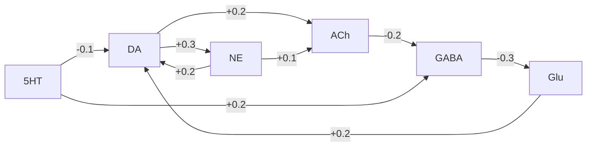

## Cognitive State Attractors

The system has five stable attractor states in NT concentration space:

### ALERT State

```
NT Signature: High NE, High DA
Role: Vigilance, rapid response to threats
Triggers: Novel stimuli, uncertainty
```

### FOCUS State

```
NT Signature: High ACh, High Glu
Role: Sustained attention, encoding
Triggers: Learning tasks, problem-solving
```

### REST State

```
NT Signature: High 5-HT, High GABA
Role: Default mode, recovery
Triggers: Task completion, low demand
```

### EXPLORE State

```
NT Signature: High DA, High ACh
Role: Novelty seeking, curiosity
Triggers: New information, rewards
```

### CONSOLIDATE State

```
NT Signature: High GABA, High 5-HT
Role: Memory consolidation, sleep-like
Triggers: Explicit consolidation, dreams
```

### State Transitions

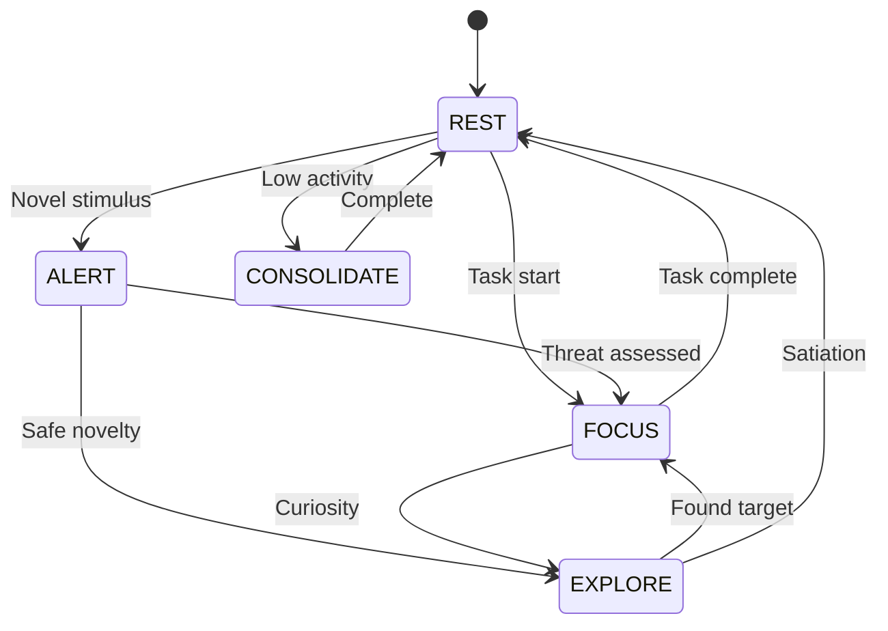

## Sleep Oscillations

### Delta Band (0.5-4 Hz)

Delta oscillations dominate slow-wave sleep (NREM stage 3-4) and gate memory consolidation:

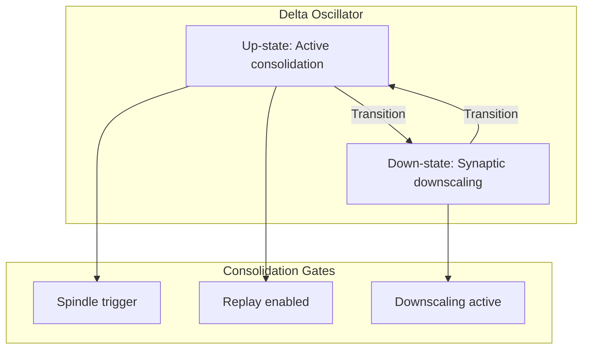

**Parameters**:
- Frequency: 0.5-4 Hz (center: 1.5 Hz)
- Adenosine sensitivity: 0.6 (sleep pressure modulation)
- Sleep threshold: 0.3 (requires sleep_depth >= 0.3)

```python
from ww.nca import DeltaOscillator, OscillatorConfig

config = OscillatorConfig()
delta = DeltaOscillator(config)

# Step with sleep state
output, phase = delta.step(
    adenosine_level=0.7,  # High sleep pressure
    sleep_depth=0.5,      # Medium sleep
    dt_ms=10.0
)

# Check consolidation gates
if delta.is_up_state():
    consolidation_gate = delta.get_consolidation_gate()  # 1.0
else:
    downscaling = delta.get_downscaling_signal()  # Active
```

### Sleep Spindles (11-16 Hz)

Thalamocortical spindles (sigma band) during NREM stage 2 gate hippocampal-cortical memory transfer:

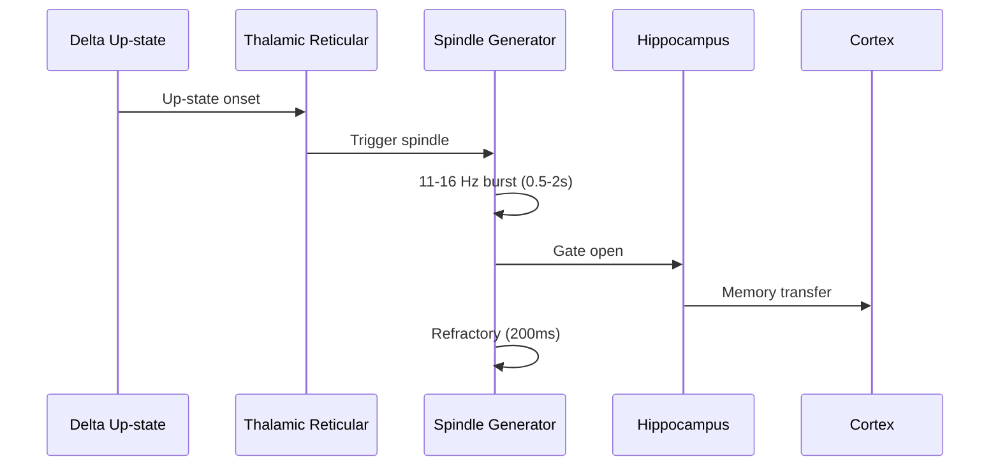

**Spindle Phases**:
| Phase | Duration | Function |
|-------|----------|----------|
| SILENT | Variable | Waiting for trigger |
| RISING | ~100ms | Amplitude buildup |
| PLATEAU | 500-2000ms | Memory transfer window |
| FALLING | ~100ms | Gradual decay |

**Spindle-Delta Coupling**:
```python
from ww.nca import SleepSpindleGenerator, SpindleConfig, SpindleDeltaCoupler

config = SpindleConfig(
    freq_range=(11.0, 16.0),
    min_duration_ms=500,
    max_duration_ms=2000,
    delta_coupling_strength=0.8
)
spindles = SleepSpindleGenerator(config)
coupler = SpindleDeltaCoupler()

# Update on delta up-state transition
if coupler.update(current_time_ms, delta.is_up_state(), prev_up_state):
    # New up-state detected, spindle may trigger
    pass

# Step spindle generator
result = spindles.step(
    sleep_depth=0.5,
    delta_up_state=delta.is_up_state(),
    gaba_level=0.6,
    ach_level=0.2,  # Low during NREM
    dt_ms=1.0
)

# Check spindle density (should be 10-15/min for healthy sleep)
density = spindles.get_spindle_density(window_ms=60000)
```

### Sleep State Machine

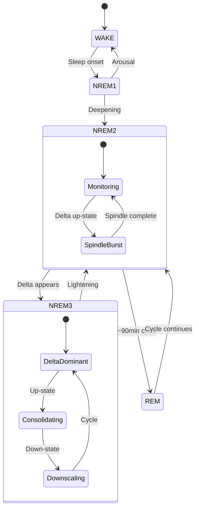

## Theta-Gamma Coupling

### Phase-Amplitude Coupling

Theta oscillations (4-8 Hz) modulate gamma (30-100 Hz) amplitude:

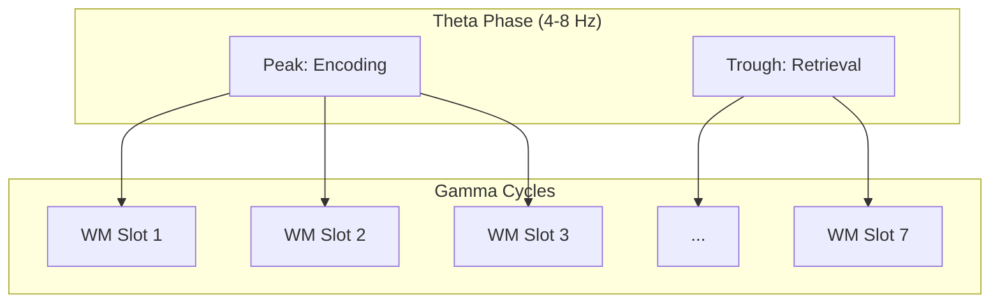

### Plasticity Gating

Theta phase gates synaptic plasticity:

| Phase | Effect | Multiplier |
|-------|--------|------------|
| Peak (encoding) | LTP enhanced | 2.0x |
| Trough (retrieval) | LTP suppressed | 0.3x |

### Working Memory Slots

Gamma cycles create discrete working memory slots:

- **Capacity**: 7±2 items (Miller's Law)
- **Mechanism**: Each gamma cycle (~25ms) holds one item
- **Binding**: Items bound to theta phase

```python
from ww.nca import ThetaGammaIntegration

tg = ThetaGammaIntegration()

# Get plasticity gate value
gate = tg.get_plasticity_gate(theta_phase=0.25)  # Peak
# gate ≈ 2.0 (enhanced encoding)

# Get available WM slots
slots = tg.get_wm_slots()  # Returns 5-9 slots
```

## Place/Grid Cells

### Spatial Cognition in Embedding Space

World Weaver implements Nobel Prize 2014 mechanisms (O'Keefe, Moser) for navigation in embedding space.

### Place Cells

```
100 place cells with Gaussian receptive fields
```

Each place cell fires when the current embedding is near its preferred location:

```python
activation = exp(-||embedding - center||² / (2σ²))
```

### Grid Cells

```
3 grid modules at different spatial scales (0.3, 0.5, 0.8)
```

Grid cells fire in a hexagonal pattern (Moser et al. 2008, Nobel Prize 2014):

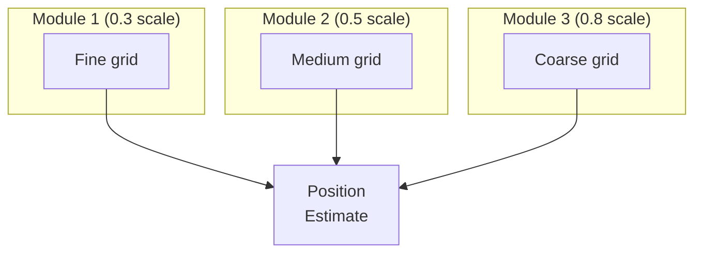

### Operations

```python
from ww.nca import SpatialCellSystem

spatial = SpatialCellSystem(embed_dim=1024)

# Encode position
place_code, grid_code = spatial.encode_position(embedding)

# Find neighbors
neighbors = spatial.find_neighbors(
    embedding,
    memory_embeddings,
    k=5
)

# Path integration
new_position = spatial.integrate_path(
    current_embedding,
    movement_vector
)
```

### Grid Cell Hexagonal Validation (Phase 3 - B7)

Grid cells are validated using the gridness score (Sargolini et al. 2006):

```
Gridness = min(corr at 60°,120°) - max(corr at 30°,90°,150°)
```

A positive gridness score indicates hexagonal firing patterns with 6-fold rotational symmetry.

```python
from ww.nca import SpatialCellSystem, SpatialConfig

spatial = SpatialCellSystem(SpatialConfig(n_grid_modules=3))

# Validate hexagonal patterns
results = spatial.validate_hexagonal_pattern(
    resolution=50,   # Sampling resolution
    threshold=0.3    # Gridness threshold
)

# Check results
print(f"Overall gridness: {results['overall_gridness']:.3f}")
print(f"Passes threshold: {results['passes_threshold']}")

# Per-module validation
for module in results['modules']:
    print(f"Module {module['module_id']}: gridness={module['gridness']:.3f}, "
          f"6-fold symmetry={module['has_symmetry']}")

# Compute gridness for custom autocorrelation
gridness = spatial.compute_gridness_score(autocorr_matrix)
```

**Validation Methods**:
| Method | Description |
|--------|-------------|
| `validate_hexagonal_pattern()` | Full validation with gridness score and symmetry |
| `compute_gridness_score()` | Sargolini gridness from 2D autocorrelation |
| `_compute_autocorrelation()` | 2D spatial autocorrelation via FFT |
| `_check_sixfold_symmetry()` | 6-fold rotational symmetry detection |

## Integration with Memory

### Memory-NCA Bridge

The bridge connects memory operations to NCA dynamics:

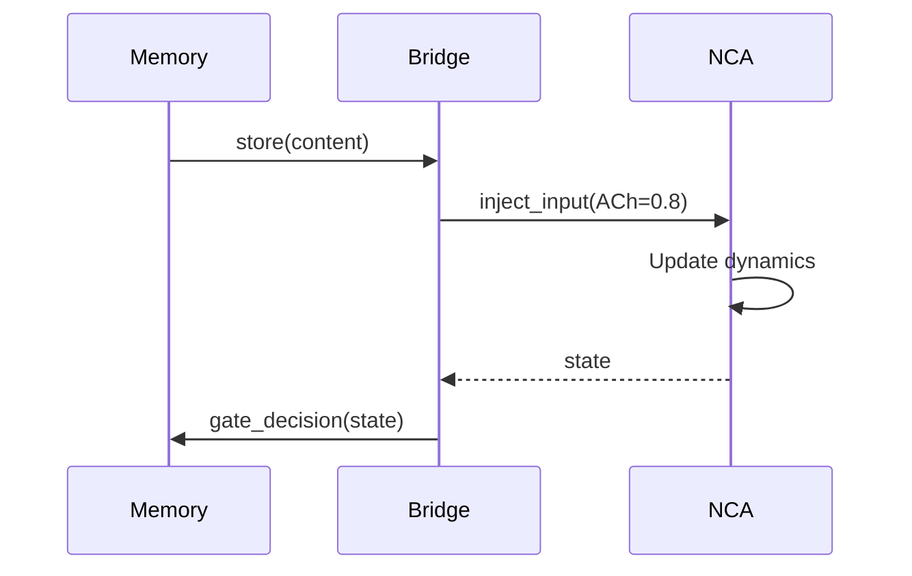

### Cognitive State Effects

| State | Memory Effect |
|-------|---------------|
| FOCUS | Enhanced encoding, reduced interference |
| EXPLORE | Broader retrieval, novel associations |
| CONSOLIDATE | Pattern completion, abstraction |
| ALERT | Fast retrieval, reduced encoding |
| REST | Background consolidation |

## Visualization

World Weaver provides dashboards for NCA monitoring:

- **Energy Landscape**: Lyapunov function visualization
- **NT State Dashboard**: Real-time 6-channel monitoring
- **Stability Monitor**: Jacobian eigenvalues, Lyapunov exponents
- **Coupling Dynamics**: Interactive coupling matrix visualization

## Sharp-Wave Ripples (Phase 2)

### SWR Timing

Sharp-wave ripples operate in the 150-250 Hz frequency range:

| Metric | Value | Source |
|--------|-------|--------|
| Min Frequency | 150 Hz | Buzsaki 2015 |
| Optimal Frequency | 180 Hz | Common in CA1 |
| Max Frequency | 250 Hz | Carr et al. 2011 |

### Wake/Sleep State Gating

SWRs are gated by arousal state:

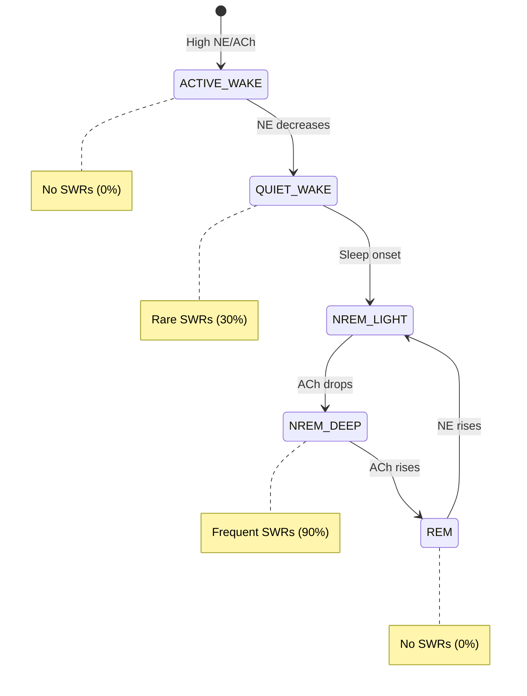

### Usage

```python
from ww.nca import (
    SWRNeuralFieldCoupling, WakeSleepMode,
    RIPPLE_FREQ_MIN, RIPPLE_FREQ_MAX, RIPPLE_FREQ_OPTIMAL
)

# Create with state gating enabled
swr = create_swr_coupling(enable_state_gating=True)

# Set wake/sleep mode
swr.set_wake_sleep_mode(WakeSleepMode.NREM_DEEP)

# Get probability based on state
prob = swr.get_swr_probability()  # High during NREM_DEEP
```

## Neuromodulator Meta-Learning (Phase 2)

### Serotonin Patience Model

Serotonin modulates temporal discounting (Doya 2002):

| 5-HT Level | Discount Rate | Temporal Horizon | Behavior |
|------------|---------------|------------------|----------|
| Low (0.2) | ~0.85 | 5 steps | Impatient |
| Medium (0.5) | ~0.91 | 20 steps | Balanced |
| High (0.8) | ~0.97 | 45 steps | Patient |

```python
from ww.nca import RapheNucleus, create_raphe_nucleus

raphe = create_raphe_nucleus(setpoint=0.5)

# Step the circuit
raphe.step(dt=0.1)

# Get patience metrics
gamma = raphe.get_discount_rate()      # Temporal discount factor
horizon = raphe.get_temporal_horizon() # Planning horizon

# Evaluate wait decision
should_wait, value_diff = raphe.evaluate_wait_decision(
    immediate_reward=1.0,
    delayed_reward=2.0,
    delay_steps=10
)
```

### Surprise-Driven NE

Norepinephrine encodes unexpected uncertainty (Dayan & Yu 2006):

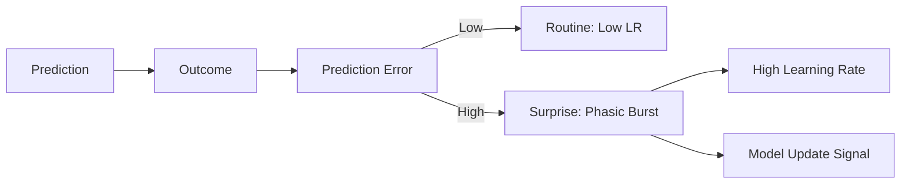

| Surprise Level | Phasic | Learning Rate | Action |
|----------------|--------|---------------|--------|
| Low (<0.3) | No | 0.01 | Trust model |
| Medium (0.3-0.7) | Maybe | 0.1 | Monitor |
| High (>0.7) | Yes | 0.3 | Update model |

```python
from ww.nca import LocusCoeruleus, create_locus_coeruleus

lc = create_locus_coeruleus()

# Observe prediction-outcome pair
surprise, phasic_triggered = lc.observe_prediction_outcome(
    prediction=0.3,
    outcome=0.9  # Surprising!
)

# Get adaptive learning rate
lr = lc.get_adaptive_learning_rate()

# Check if model needs updating
if lc.should_update_model():
    # High surprise or change point detected
    update_weights(lr=lr)
```

## Forward-Forward Algorithm (Phase 3)

### Overview

The Forward-Forward (FF) algorithm (Hinton 2022) provides layer-local learning without backpropagation. Each layer learns independently using a **goodness function**.

For detailed documentation, see [Forward-Forward Concept Guide](forward-forward.md).

### Key Concepts

**Goodness Function**: G(h) = Σ h_i² (sum of squared activations)

- **Positive phase**: Maximize goodness for real data (G > θ)
- **Negative phase**: Minimize goodness for corrupted data (G < θ)
- **No backward pass**: Each layer updates using only local information

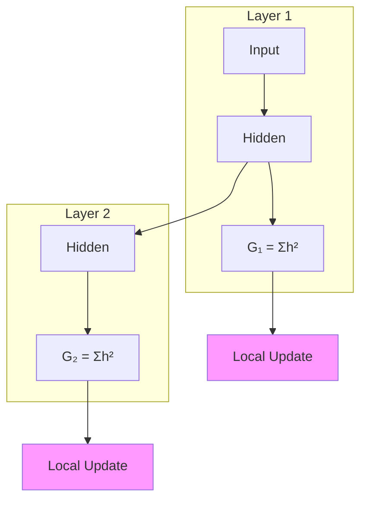

### Usage

```python
from ww.nca import create_ff_layer, create_ff_network, ForwardForwardConfig

# Single layer
layer = create_ff_layer(
    input_dim=1024,
    hidden_dim=512,
    learning_rate=0.03,
    threshold=2.0
)

# Forward pass
h = layer.forward(x)
print(f"Goodness: {layer.state.goodness}")

# Local learning (no backprop needed)
layer.learn_positive(x, h)  # Real data
layer.learn_negative(x, h)  # Corrupted data

# Multi-layer network
network = create_ff_network([1024, 512, 256])

# Generate negative samples
negative, _ = network.generate_negative(positive, method="hybrid")

# Training step
stats = network.train_step(positive, negative)

# Inference
is_positive, confidence = network.infer(test_input)
```

### Negative Sample Generation

| Method | Description |
|--------|-------------|
| `noise` | Add Gaussian noise to positive data |
| `shuffle` | Randomly permute feature dimensions |
| `adversarial` | Gradient ascent on goodness function |
| `hybrid` | Combination of above methods |
| `wrong_label` | Correct data with incorrect label |

### Neuromodulator Integration

FF layers integrate with the NCA neuromodulator system:

| Neuromodulator | FF Effect |
|----------------|-----------|
| Dopamine | Modulates learning rate (high DA → faster learning) |
| Acetylcholine | Gates encoding vs retrieval phase |
| Norepinephrine | Modulates threshold (high NE → higher threshold) |

### Biological Plausibility (H6, H7)

The FF algorithm addresses Hinton's concerns about backpropagation:

1. **H6 - Local Learning**: Synapses update based on local activity only
2. **H7 - Contrastive Phases**: Positive/negative phases map to wake/sleep
