# Persistence Layer

T4DM implements durable persistence with write-ahead logging, checkpointing, and recovery mechanisms.

## Overview

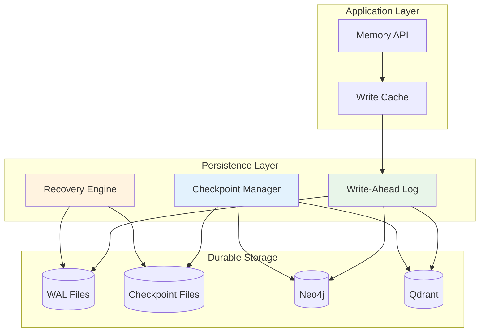

## Write-Ahead Log (WAL)

All mutations are logged before being applied to ensure durability.

### WAL Flow

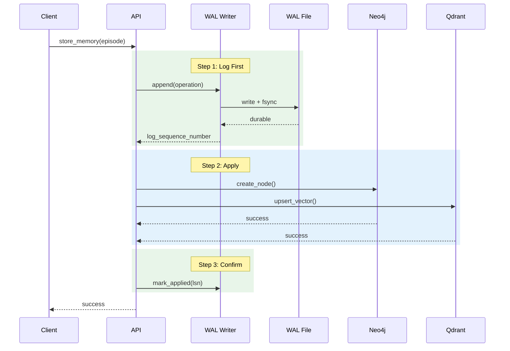

### WAL Entry Structure

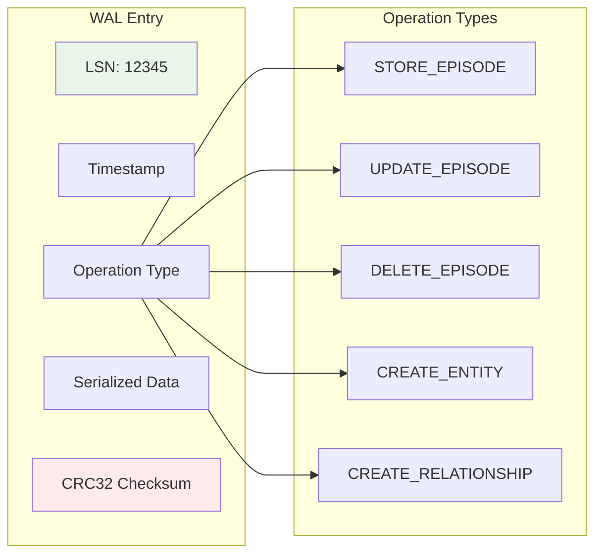

### WAL Segment Management

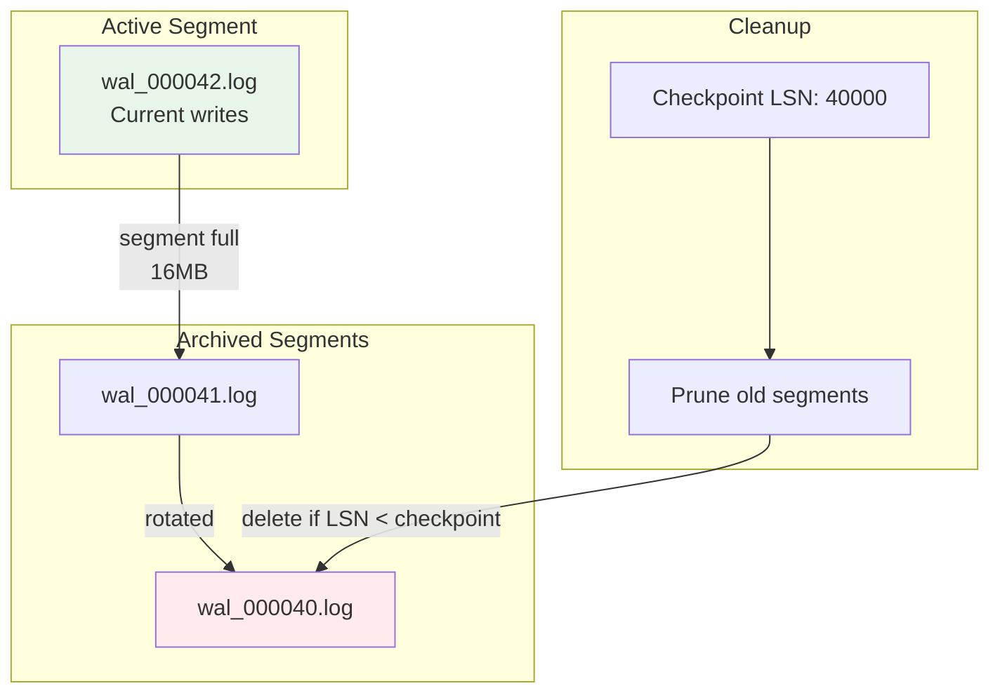

### WAL Configuration

| Parameter | Default | Description |
|-----------|---------|-------------|
| `segment_size` | 16 MB | Max segment file size |
| `sync_mode` | `fsync` | Durability mode |
| `buffer_size` | 4 KB | Write buffer size |
| `retention` | 7 days | Archive retention |
| `compression` | `lz4` | Segment compression |

## Checkpointing

Periodic snapshots reduce recovery time by establishing known-good states.

### Checkpoint Lifecycle

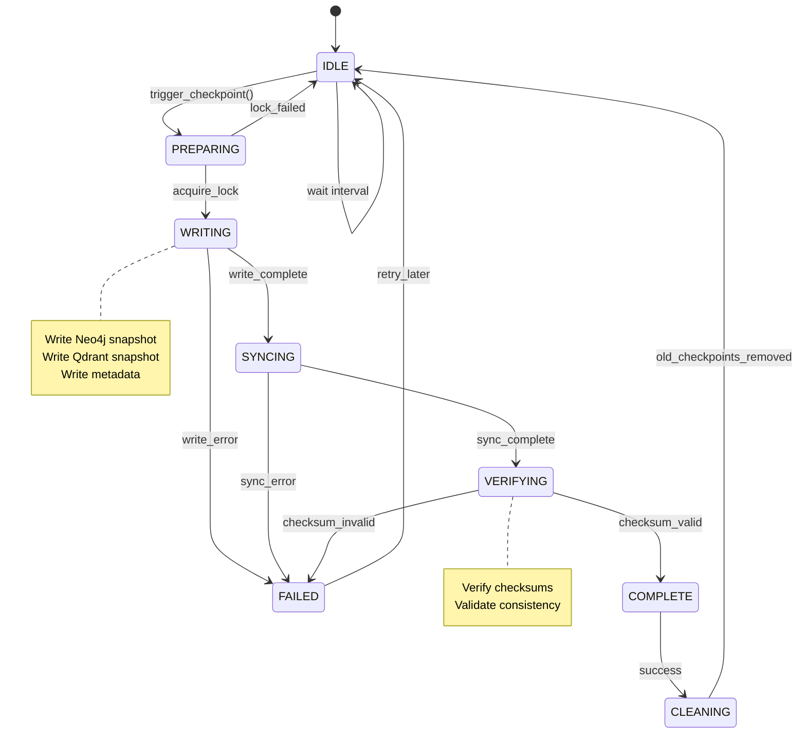

### Checkpoint Process

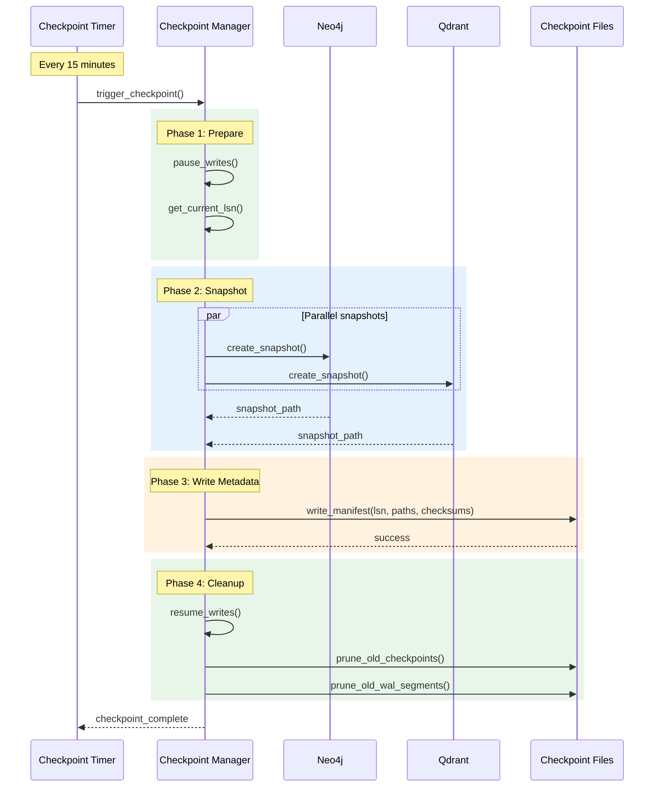

### Checkpoint Structure

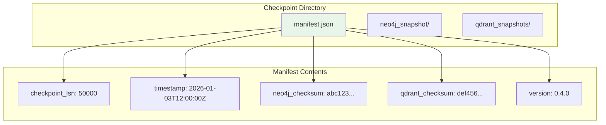

### Checkpoint Configuration

| Parameter | Default | Description |
|-----------|---------|-------------|
| `interval` | 15 min | Checkpoint frequency |
| `retention` | 3 | Checkpoints to keep |
| `timeout` | 5 min | Max checkpoint duration |
| `parallel` | true | Parallel backend snapshots |

## Recovery

System recovery from WAL and checkpoints after crash or restart.

### Recovery Flow

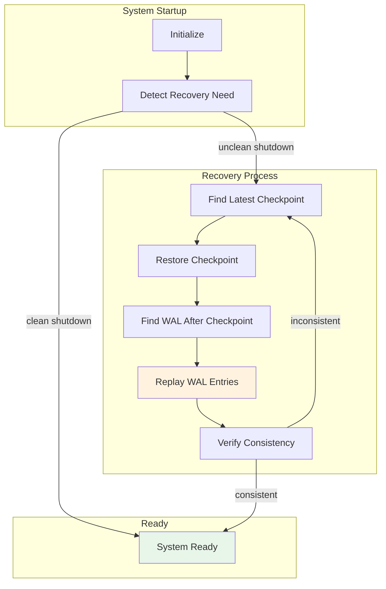

### Recovery Sequence

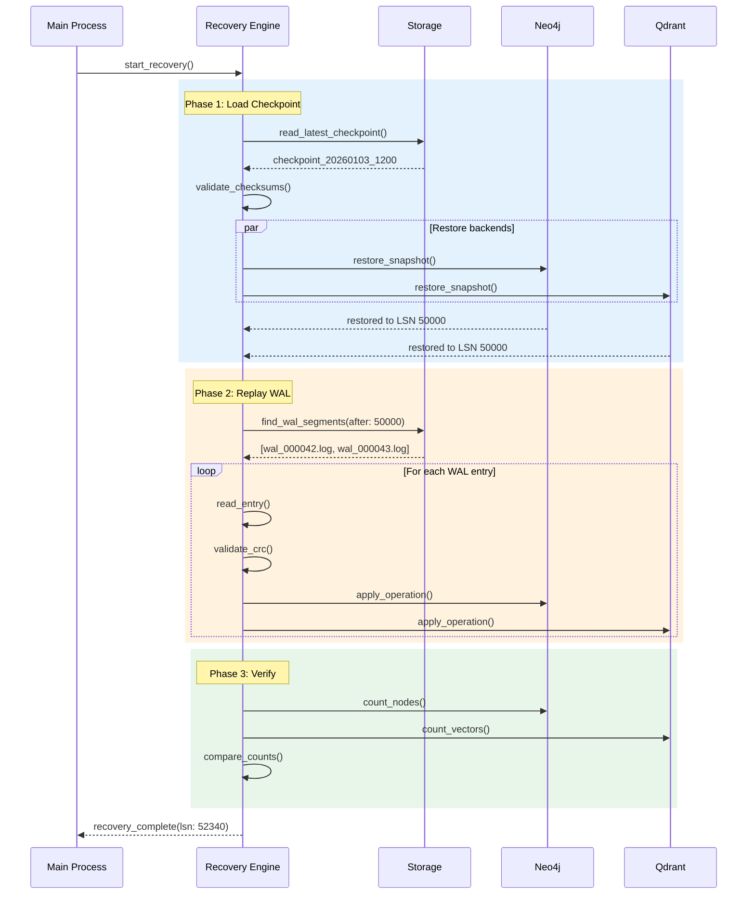

### Recovery Modes

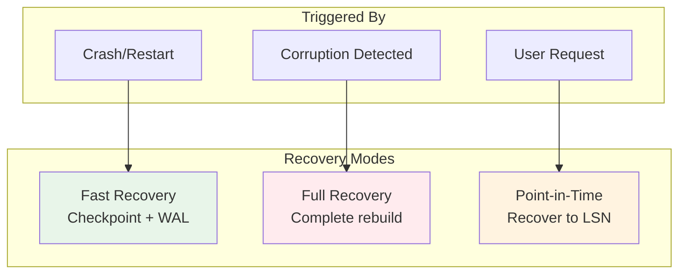

### Recovery Statistics

| Metric | Description |
|--------|-------------|
| `recovery_duration_seconds` | Total recovery time |
| `checkpoint_restore_seconds` | Checkpoint load time |
| `wal_entries_replayed` | WAL entries processed |
| `wal_replay_rate` | Entries per second |
| `recovery_lsn_gap` | LSN distance recovered |

## Graceful Shutdown

Orderly shutdown ensures no data loss.

### Shutdown Sequence

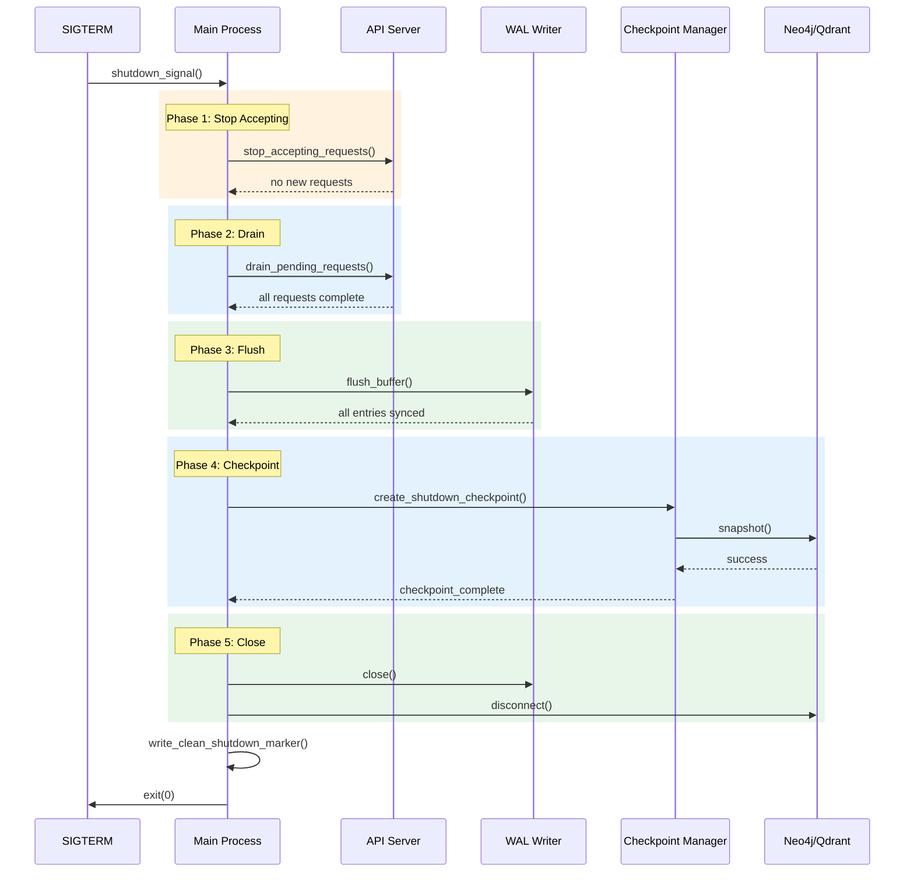

### Shutdown States

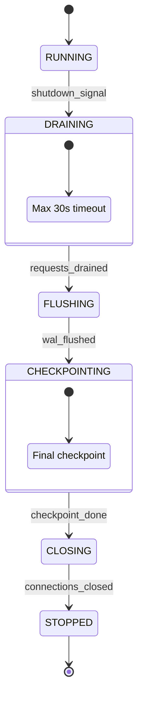

## Data Integrity

Multiple layers ensure data integrity.

### Integrity Checks

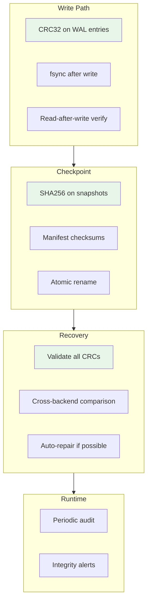

### Integrity Configuration

| Parameter | Default | Description |
|-----------|---------|-------------|
| `verify_on_read` | true | Verify CRC on WAL read |
| `verify_on_recovery` | true | Full verification on recovery |
| `audit_interval` | 1 hour | Background integrity check |
| `repair_mode` | `conservative` | Auto-repair strategy |
