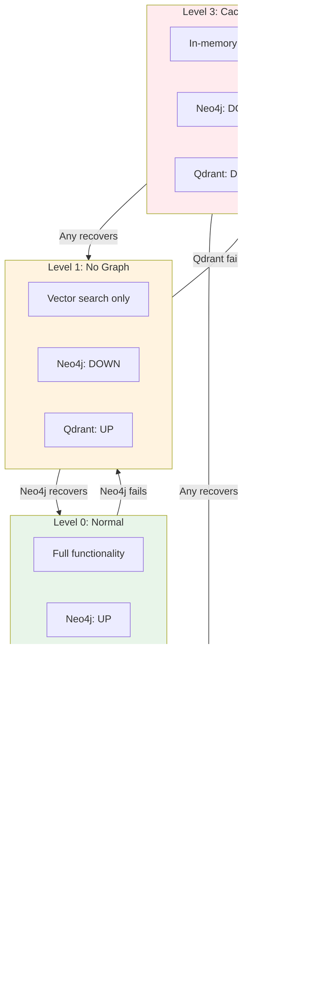

# Storage Resilience

T4DM implements multiple resilience patterns to ensure data durability and graceful degradation.

## Overview


## Circuit Breaker Pattern

Prevents cascade failures by temporarily blocking requests to failing backends.

### State Machine


### Implementation


### Configuration

| Parameter | Default | Description |
|-----------|---------|-------------|
| `failure_threshold` | 5 | Failures before opening |
| `reset_timeout` | 60s | Time before half-open |
| `success_threshold` | 2 | Successes to close |
| `half_open_max` | 3 | Max concurrent in half-open |

## Saga Pattern

Coordinates distributed transactions across Neo4j and Qdrant with automatic rollback.

### Transaction Flow


### Rollback Flow


### Saga States


## Graceful Degradation

System continues operating with reduced functionality when backends fail.

### Degradation Levels



### Feature Availability

| Feature | Level 0 | Level 1 | Level 2 | Level 3 |
|---------|---------|---------|---------|---------|
| Store memory | Full | Pending queue | Pending queue | Cache only |
| Vector search | Full | Full | Disabled | Disabled |
| Graph traversal | Full | Disabled | Full | Disabled |
| Relationship queries | Full | Disabled | Full | Disabled |
| Entity extraction | Full | Delayed | Delayed | Disabled |
| Consolidation | Full | Partial | Partial | Disabled |

### Degradation State Machine


## Fallback Cache

In-memory cache provides resilience during backend outages.

### Cache Architecture


### Queue Drain Process


## Health Monitoring

Continuous monitoring of backend health with automatic recovery.

### Health Check Flow

```mermaid
graph TB
    subgraph Monitor["Health Monitor"]
        TIMER[30s Timer]
        CHECK[Health Check]
        METRICS[Metrics Collector]
    end

    subgraph Backends["Backend Checks"]
        NEO4J_H[Neo4j Health<br/>MATCH (n) RETURN 1]
        QDRANT_H[Qdrant Health<br/>GET /health]
    end

    subgraph Actions["Actions"]
        ALERT[Alert System]
        CB_UPDATE[Circuit Breaker Update]
        DEGRADE[Degradation Manager]
    end

    TIMER --> CHECK
    CHECK --> NEO4J_H
    CHECK --> QDRANT_H

    NEO4J_H --> METRICS
    QDRANT_H --> METRICS

    METRICS -->|unhealthy| ALERT
    METRICS -->|state change| CB_UPDATE
    METRICS -->|level change| DEGRADE

    style ALERT fill:#ffebee
    style CB_UPDATE fill:#fff3e0
    style DEGRADE fill:#e3f2fd
```

### Metrics Collected

| Metric | Type | Description |
|--------|------|-------------|
| `ww_backend_up` | Gauge | Backend availability (0/1) |
| `ww_circuit_state` | Gauge | Circuit breaker state |
| `ww_degradation_level` | Gauge | Current degradation level |
| `ww_pending_queue_size` | Gauge | Pending operations count |
| `ww_cache_hit_rate` | Gauge | Fallback cache hit rate |
| `ww_recovery_duration` | Histogram | Time to recover |

## Performance Impact

| Pattern | Overhead | When Active |
|---------|----------|-------------|
| Circuit Breaker | < 100μs | Always |
| Saga Coordinator | 1-5ms | Store operations |
| Fallback Cache | < 50μs | Backend failures |
| Health Monitor | Negligible | Background |
| **Total Normal** | < 5ms | - |
| **Total Degraded** | < 10ms | - |
