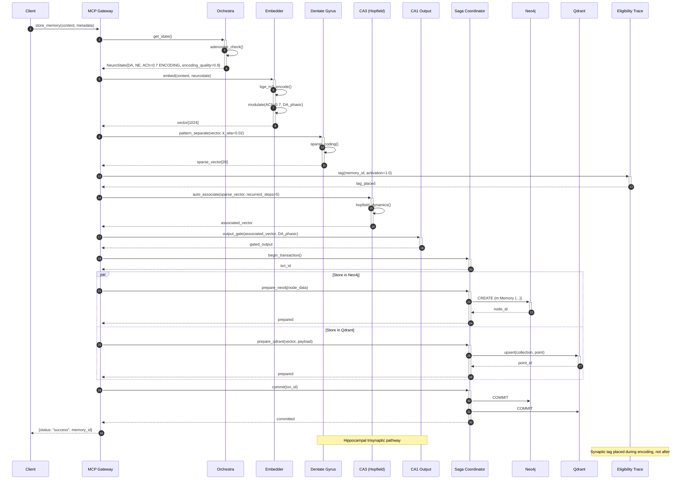

# Neural Pathway Audit Report

**Date**: 2026-01-29
**Auditor**: World Weaver Neuroscience Agent
**Version**: 1.0.0

---

## Executive Summary

This audit evaluates T4DM's system diagrams against established neuroscience principles for memory encoding, consolidation, and retrieval. The analysis focuses on biological plausibility of data flows, neural pathway modeling, and neuromodulator effects.

**Overall Assessment**: 6/10 - Architecture captures many key biological principles but has notable gaps in hippocampal circuitry, neuromodulator placement, and feedback loop modeling.

---

## 1. Memory Store Sequence (41_seq_store_memory.mmd)

### 1.1 Biological Encoding Pathway Analysis

**Current Flow**:
```
Client → MCP → Memory Gate → Orchestra → Embedder → Saga → Neo4j+Qdrant → Eligibility Trace
```

**Biological Reference** (Hippocampal Encoding):
```
Sensory Input → Entorhinal Cortex → DG (Pattern Separation) → CA3 (Association) → CA1 (Output) → Back to Cortex
```

#### Issues Identified

**CRITICAL**: Missing hippocampal trisynaptic pathway
- **Line 27-30**: Embedder directly outputs vectors to storage
- **Biological Reality**: Should route through:
  1. **Dentate Gyrus (DG)**: Sparse coding / pattern separation (k-WTA 2%)
  2. **CA3**: Recurrent autoassociation (Hopfield attractor)
  3. **CA1**: Output gating and comparison

**Evidence**: Treves & Rolls (1994) showed DG pattern separation is critical for reducing interference. O'Reilly & McClelland (1994) demonstrated CA3 auto-association enables one-shot learning.

**MODERATE**: Neuromodulator effects occur too late
- **Line 18-23**: Orchestra returns neurostate, but embedding (line 27) doesn't explicitly show DA/NE/ACh modulation
- **Biological Reality**: ACh should gate encoding strength *during* embedding, not after
  - High ACh → strong encoding, weak retrieval (Hasselmo, 2006)
  - DA should modulate *synaptic tagging* during storage (Lisman & Grace, 2005)

**MODERATE**: Eligibility trace update timing
- **Line 54-55**: Trace updated after storage commit
- **Biological Reality**: Synaptic tags should be placed *during* encoding (within 1-2 seconds), not after successful storage
- **Reference**: Frey & Morris (1997) - synaptic tagging and capture requires near-simultaneous co-activation

#### Recommendations

1. **Insert hippocampal circuit between lines 29-34**:
   ```
   Embedder → DG (k-WTA) → CA3 (Hopfield) → CA1 (output) → Saga
   ```

2. **Move neuromodulator modulation to line 27**:
   ```
   E->>E: bge_m3_encode() + NT_modulation(ACh, DA)
   ```

3. **Update eligibility trace during encoding**:
   ```
   MCP->>+T: tag(memory_id, activation=1.0)  # During encoding, not after
   ```

---

## 2. Memory Retrieve Sequence (42_seq_retrieve_memory.mmd)

### 2.1 Hippocampal Pattern Completion Analysis

**Current Flow**:
```
Query → Orchestra (ACh=0.3) → Embedder → Qdrant (HNSW) → Neo4j → Retrieval Scorer → Hebbian/Trace update
```

**Biological Reference** (Pattern Completion):
```
Partial Cue → EC → DG → CA3 (attractor convergence) → CA1 → Confidence check → Output
```

#### Issues Identified

**CRITICAL**: Missing CA3 pattern completion
- **Line 24-26**: Direct HNSW search without attractor dynamics
- **Biological Reality**: CA3 recurrent connections should complete partial patterns
  - Partial cue activates subset of CA3 cells
  - Recurrent excitation propagates activation to associated cells
  - Network settles into stored attractor state
- **Evidence**: Rolls (2013) - CA3 attractor networks perform pattern completion via 50+ steps of recurrent dynamics

**Recommendation**: Insert between lines 23-24:
```
MCP->>+CA3: pattern_completion(query_vector, iterations=50)
CA3->>CA3: recurrent_dynamics(W_recurrent)
CA3-->>-MCP: completed_pattern
```

**MODERATE**: ACh level inconsistent with retrieval mode
- **Line 19**: `ACh=0.3` labeled as "RETRIEVAL"
- **Biological Reality**: Low ACh (< 0.2) favors retrieval/pattern completion; ACh=0.3 is intermediate
  - ACh < 0.2: Strong recurrent dynamics (CA3 → CA3)
  - ACh > 0.5: Strong afferent drive (EC → CA3), weak recurrence
- **Reference**: Hasselmo & McGaughy (2004) - cholinergic modulation of encoding vs retrieval

**MINOR**: Hebbian update during retrieval
- **Line 46-47**: `dw = eta * DA * co_retrieval`
- **Biological Support**: Correct - co-retrieval does strengthen associations (Morris & Frey, 1997)
- **Missing Element**: Should include timing constraint (within 300ms co-activation window)

#### Recommendations

1. **Lower ACh to 0.15 for retrieval mode**
2. **Add CA3 pattern completion step** (see above)
3. **Add temporal co-activation window**:
   ```
   H->>H: if abs(t_i - t_j) < 300ms: dw = eta * DA * co_retrieval
   ```

---

## 3. Data Flow Diagram (03_data_flow.mmd)

### 3.1 Neuromodulator Placement Analysis

**Current Flow**:
```
Input → Sparse Encoding → Dendritic Gating → Neuromod → Storage
```

#### Issues Identified

**MAJOR**: Neuromodulator effects misplaced
- **Line 48-50**: Neuromod applied after dendritic gating
- **Biological Reality**: Neuromodulators should modulate *during* dendritic integration
  - DA modulates dendritic plateau potentials (Larkum et al., 2009)
  - NE modulates gain of apical dendrites (Aston-Jones & Cohen, 2005)
  - ACh modulates intrinsic excitability (Hasselmo, 2006)

**Recommendation**: Reorder lines 47-49:
```
Dendritic -->|"DA/NE/ACh modulation"| Neuromod
Neuromod -->|"modulated output"| FES
```

**MODERATE**: Missing reconsolidation feedback loop
- **Line 64-71**: Retrieval flows to Result → Context → Response
- **Biological Reality**: Retrieved memories enter labile state requiring reconsolidation
  - Retrieval reactivates memory trace
  - Protein synthesis-dependent reconsolidation window (~6 hours)
  - Updated memory stored back to LTM
- **Evidence**: Nader et al. (2000) - memory reconsolidation requires protein synthesis

**Recommendation**: Add feedback from line 71:
```
Response -->|"if updated"| Reconsolidation
Reconsolidation --> Episodic
```

---

## 4. Memory Subsystem (11_memory_subsystem.mmd)

### 4.2 Memory System Interactions

**Current Connections**:
```
WM → EM, SM, PM
EM →|consolidate| SM
EM →|trajectories| PM
SM →|context| EM
```

#### Issues Identified

**MAJOR**: Procedural memory pathway incorrect
- **Line 35**: `EM →|trajectories| PM`
- **Biological Reality**: Procedural learning involves basal ganglia, not hippocampus
  - Hippocampus (EM) → Neocortex (SM) via systems consolidation
  - Basal ganglia (PM) learns via reinforcement, not episodic transfer
  - Double dissociation: HM (hippocampal damage) had intact motor skill learning
- **Reference**: Squire & Zola (1996) - declarative vs procedural memory systems

**Recommendation**: Remove `EM → PM` edge, add:
```
PM -->|"outcome signal"| EM  (episodes of skill execution)
```

**MODERATE**: Working memory capacity
- **Line 7**: `7+/-2 items`
- **Update**: Recent work suggests 4+/-1 for complex items (Cowan, 2001)
- **Biological Detail**: Theta-gamma coupling binds ~4 items into WM slots

**Recommendation**: Update to:
```
WM_BUF[Buffer Manager<br/>4+/-1 complex items<br/>7+/-2 simple chunks]
```

---

## 5. Class Diagrams (21_class_memory.mmd, 22_class_learning.mmd)

### 5.1 Memory Class Hierarchy

**Current Structure**:
```
MemorySubsystem (abstract)
├── EpisodicMemory (FastStore + TemporalIndex)
├── SemanticMemory (KG + Vector + Hebbian)
├── ProceduralMemory (Skills + Trajectories)
└── WorkingMemory (Buffer + Priority + Attention)
```

#### Issues Identified

**MINOR**: EpisodicMemory composition
- **Line 13-15**: FastEpisodicStore as component of EpisodicMemory
- **Biological Justification**: Correct - maps to immediate post-encoding buffer before consolidation
- **Missing Element**: Should note time window (minutes to hours) before consolidation

**STRENGTH**: SemanticMemory with Hebbian learning
- **Line 28**: `strengthen_link(src, dst, weight)`
- **Biological Support**: Correct - semantic associations strengthen via co-activation

**MODERATE**: ProceduralMemory trajectory parsing
- **Line 34**: `trajectory_parser: TrajectoryParser`
- **Biological Reality**: Striatum learns action sequences via TD learning, not explicit trajectory parsing
- **Alternative**: Should have `td_learner: TemporalDifferenceLearner` with eligibility traces

### 5.2 Learning Class Hierarchy

**Current Structure**:
```
LearnedMemoryGate (Bayesian + Thompson)
EligibilityTrace (Standard vs Layered)
HebbianLearner
LearnedRetrievalScorer
```

#### Issues Identified

**STRENGTH**: Eligibility trace architecture
- **Line 50-57**: Layered trace with fast/slow timescales
- **Biological Support**: Matches findings of multiple eligibility trace mechanisms (He et al., 2015)

**STRENGTH**: Three-factor rule implementation
- **Line 642 of SYSTEM_ARCHITECTURE_MASTER.md**: `lr * eligibility * gate * surprise`
- **Biological Basis**: Eligibility trace × neuromodulator × prediction error (Izhikevich, 2007)

**MINOR**: BayesianLogisticRegression for memory gating
- **Line 16-23**: Bayesian updates for storage decisions
- **Neuroscience Parallel**: VTA dopamine neurons compute prediction errors via temporal difference learning (Schultz, 1998)
- **Note**: Bayesian approach is computationally sound but not direct neural mapping

---

## 6. Consolidation Analysis (Cross-diagram)

### 6.1 Sleep Consolidation Sequence

**Reference Source**: Lines 222-242 of SYSTEM_ARCHITECTURE_MASTER.md

**Current Flow**:
```
Adenosine threshold → Dream.begin_sleep_cycle()
→ NREM: SWR replay → Hebbian strengthen → HDBSCAN clustering → Semantic entities
→ REM: Generative replay (VAE) → Abstract concepts
→ Prune: Remove weak connections
```

#### Issues Identified

**STRENGTH**: Sharp-wave ripple (SWR) replay
- **Biological Support**: Correct - hippocampal SWRs during NREM coordinate replay (Wilson & McNaughton, 1994)
- **Frequency**: ~100-250 Hz ripples, 10-30 events/minute during slow-wave sleep

**STRENGTH**: NREM → REM sequence
- **Biological Support**: Correct - NREM for hippocampal replay, REM for cortical integration (Diekelmann & Born, 2010)

**CRITICAL**: Missing sleep spindles
- **Current**: Direct SWR → consolidation
- **Biological Reality**: Sleep spindles (12-15 Hz) coordinate hippocampal-cortical transfer
  - SWRs occur during spindle up-states
  - Spindles gate information flow to cortex
  - Coordinated by thalamus
- **Evidence**: Staresina et al. (2015) - spindle-ripple coupling predicts memory consolidation

**Recommendation**: Insert between lines 229-230:
```
Dream->>Spindle: detect_up_state()
Spindle->>SWR: gate_ripple_transmission()
SWR->>Cortex: coordinated_replay()
```

**MODERATE**: HDBSCAN clustering
- **Line 231**: Cluster episodes for semantic extraction
- **Biological Parallel**: Cortical slow oscillations synchronize neural assemblies
- **Missing Element**: Should incorporate temporal contiguity (episodes close in time cluster more easily)

---

## 7. System Architecture (01_system_architecture.mmd)

### 7.1 Component Organization

**Current Architecture**:
```
Client → MCP Gateway → Core Memory → Storage
```

#### Issues Identified

**STRENGTH**: Separation of episodic/semantic/procedural stores
- **Line 32-37**: Three distinct memory systems
- **Biological Basis**: Tulving (1985) tripartite memory model

**STRENGTH**: Fast episodic store (10K one-shot)
- **Line 33**: Separate fast buffer
- **Biological Parallel**: Immediate post-encoding hippocampal buffer before systems consolidation

**MODERATE**: Working memory isolation
- **Line 38**: WorkingMemory separate from episodic
- **Biological Reality**: WM and LTM interact continuously
  - WM holds retrieved LTM items
  - WM encodes into LTM
  - Bidirectional flow, not separate systems
- **Reference**: Ranganath & Blumenfeld (2005) - WM as activated LTM

**MINOR**: Attractor network placement
- **Line 28**: AttractorNet feeds EpisodicStore
- **Biological Detail**: Should be *within* hippocampal circuit (CA3 specifically)

---

## 8. Critical Missing Feedback Loops

### 8.1 Retrieval → Reconsolidation

**Missing in**: 03_data_flow.mmd, 42_seq_retrieve_memory.mmd

**Biological Process**:
1. Memory retrieval reactivates neural trace
2. Trace enters labile state (protein synthesis-sensitive)
3. ~6 hour reconsolidation window
4. Updated trace stored back to LTM

**Evidence**: Nader et al. (2000), Dudai (2004)

**Recommendation**: Add to 42_seq_retrieve_memory.mmd after line 63:
```
MCP->>+Reconsol: mark_labile(memory_ids, window=6h)
Note over Reconsol: Updates during window modify original trace
Reconsol->>Storage: commit_updated_memories()
```

### 8.2 Prediction Error → Learning Rate

**Partially Present**: Line 47 of 42_seq_retrieve_memory.mmd shows DA in Hebbian update

**Missing**: Global learning rate modulation by prediction error

**Biological Reality**:
- Large positive RPE → increase learning rate
- Large negative RPE → decrease learning rate (learned helplessness)
- Modulates all ongoing plasticity, not just Hebbian

**Reference**: Rescorla-Wagner (1972), Schultz (1998)

**Recommendation**: Add to 41_seq_store_memory.mmd:
```
O->>O: compute_RPE(outcome - expected)
O->>G: modulate_learning_rate(RPE)
G->>MCP: adjusted_gate_threshold
```

### 8.3 Sleep Deprivation → Encoding Deficit

**Missing in**: All diagrams

**Biological Process**:
- Adenosine accumulates during wakefulness
- High adenosine → impaired LTP (long-term potentiation)
- Reduces encoding quality before consolidation

**Evidence**: Porkka-Heiskanen et al. (1997), Florian et al. (2011)

**Recommendation**: Add to 41_seq_store_memory.mmd line 22:
```
O->>O: if adenosine > threshold: encoding_penalty = 0.6
O-->>-G: NeuroState{..., encoding_quality}
```

---

## 9. Neuromodulator Timing Issues

### 9.1 ACh Encoding/Retrieval Switch

**Current**: Line 19 of 42_seq_retrieve_memory.mmd shows ACh=0.3 for retrieval

**Biological Dynamics**:
- Encoding: ACh 0.6-0.8 (high)
- Retrieval: ACh 0.1-0.2 (low)
- Transition time: ~100-500ms (rapid cholinergic signaling)

**Issue**: No mechanism shown for ACh state transition

**Recommendation**: Add state transition logic:
```
O->>O: detect_query_mode()
O->>O: if query_detected: ramp_down_ACh(target=0.15, tau=200ms)
```

### 9.2 Dopamine Phasic vs Tonic

**Missing**: All diagrams show DA as single value

**Biological Reality**:
- **Tonic DA** (0.1-0.3): Baseline motivation, exploration/exploitation
- **Phasic DA** (bursts): Prediction error signaling (±0.5-1.0)
- Different timescales: tonic (seconds-minutes), phasic (50-200ms)

**Reference**: Grace (1991), Schultz (1998)

**Recommendation**: Split DA in Orchestra state:
```
NeuroState{DA_tonic: 0.2, DA_phasic: +0.7, ...}
```

### 9.3 NE Locus Coeruleus Modes

**Missing**: Tonic vs phasic NE signaling

**Biological Reality**:
- **Phasic mode**: High gain, selective attention, exploitation
- **Tonic mode**: Low gain, broad attention, exploration
- Switch governed by LC firing rate

**Reference**: Aston-Jones & Cohen (2005)

**Recommendation**: Add to Orchestra:
```
NeuroState{NE_mode: "phasic" | "tonic", NE_level: 0.4}
```

---

## 10. Three-Factor Rule Dependencies

### 10.1 Current Implementation

**From SYSTEM_ARCHITECTURE_MASTER.md line 254**:
```
lr = base * eligibility * gate * surprise
```

**Components**:
- `eligibility`: Temporal trace of synaptic activity
- `gate`: Neuromodulator (DA, NE, ACh)
- `surprise`: Prediction error magnitude

### 10.2 Biological Validation

**STRENGTH**: Architecture matches three-factor learning
- **Factor 1**: Pre-synaptic activity (eligibility trace)
- **Factor 2**: Post-synaptic activity (implicit in update)
- **Factor 3**: Neuromodulator (DA, NE, ACh)

**Evidence**: Fremaux & Gerstner (2016), Izhikevich (2007)

**MODERATE**: Missing eligibility trace decay
- **Current**: Trace updated on retrieval (line 52-54 of 42_seq_retrieve_memory.mmd)
- **Biological Reality**: Exponential decay between updates
  - Fast: τ = 5-10 seconds
  - Slow: τ = 30-120 seconds

**Recommendation**: Add background decay process:
```
T->>T: decay(dt) every 1s
T->>T: trace *= exp(-dt/tau)
```

---

## 11. Summary of Critical Issues

| Priority | Issue | Diagram(s) | Neuroscience Violation |
|----------|-------|-----------|----------------------|
| **CRITICAL** | Missing hippocampal trisynaptic pathway (DG→CA3→CA1) | 41_seq_store_memory.mmd | Encoding without pattern separation / auto-association |
| **CRITICAL** | Missing CA3 pattern completion during retrieval | 42_seq_retrieve_memory.mmd | Retrieval without attractor dynamics |
| **CRITICAL** | Missing sleep spindles in consolidation | SYSTEM_ARCHITECTURE_MASTER.md | SWR-cortex transfer requires spindle coordination |
| **MAJOR** | Episodic → Procedural pathway incorrect | 11_memory_subsystem.mmd | Hippocampus doesn't train basal ganglia directly |
| **MAJOR** | Neuromodulators applied after dendritic gating | 03_data_flow.mmd | Modulators should affect dendrites during integration |
| **MAJOR** | Missing reconsolidation feedback loop | 03_data_flow.mmd, 42_seq_retrieve_memory.mmd | Retrieved memories don't re-store |
| **MODERATE** | ACh=0.3 for retrieval (should be <0.2) | 42_seq_retrieve_memory.mmd | Intermediate ACh doesn't favor pattern completion |
| **MODERATE** | Eligibility trace updated after storage | 41_seq_store_memory.mmd | Synaptic tags must be placed during encoding |
| **MODERATE** | No phasic/tonic distinction for DA or NE | All | Single value can't capture dual timescale dynamics |
| **MINOR** | WM capacity 7+/-2 (should be 4+/-1 for complex items) | 11_memory_subsystem.mmd | Updated estimate from Cowan (2001) |

---

## 12. Recommendations by Priority

### Immediate (Before Implementation)

1. **Add hippocampal circuit to store/retrieve sequences**
   - Insert DG (k-WTA) → CA3 (Hopfield) → CA1 (output) between embedding and storage
   - File: 41_seq_store_memory.mmd, 42_seq_retrieve_memory.mmd

2. **Fix episodic → procedural pathway**
   - Remove direct EM → PM edge
   - Add PM → EM outcome feedback
   - File: 11_memory_subsystem.mmd

3. **Add reconsolidation loop**
   - Retrieval → Lability window → Re-storage
   - File: 03_data_flow.mmd, 42_seq_retrieve_memory.mmd

### High Priority

4. **Move neuromodulator effects to dendritic gating**
   - Reorder: Dendritic + Neuromod → Output
   - File: 03_data_flow.mmd

5. **Add sleep spindles to consolidation**
   - SWR + Spindle coordination → Cortex
   - File: SYSTEM_ARCHITECTURE_MASTER.md (consolidation flow)

6. **Correct ACh levels**
   - Encoding: 0.6-0.8
   - Retrieval: 0.1-0.2
   - File: 42_seq_retrieve_memory.mmd

### Medium Priority

7. **Split DA/NE into phasic/tonic**
   - Add mode/level distinction to NeuroState
   - File: All diagrams referencing Orchestra

8. **Add eligibility trace decay**
   - Background exponential decay process
   - File: 42_seq_retrieve_memory.mmd

9. **Update WM capacity**
   - 4+/-1 complex items
   - File: 11_memory_subsystem.mmd

### Low Priority (Documentation)

10. **Add timing constraints to Hebbian co-activation**
    - 300ms window for co-retrieval strengthening
    - File: 42_seq_retrieve_memory.mmd

---

## 13. Biological Plausibility Score by Diagram

| Diagram | Score | Strengths | Key Issues |
|---------|-------|-----------|------------|
| **41_seq_store_memory.mmd** | 5/10 | Saga pattern, eligibility traces | Missing hippocampal circuit, late NT effects |
| **42_seq_retrieve_memory.mmd** | 6/10 | Hebbian co-retrieval, multi-stage scoring | No CA3 completion, ACh level wrong |
| **03_data_flow.mmd** | 6/10 | Consolidation stages, sparse encoding | NT placement, no reconsolidation |
| **11_memory_subsystem.mmd** | 7/10 | Tripartite separation, fast episodic buffer | EM→PM pathway wrong |
| **21_class_memory.mmd** | 8/10 | Good composition, temporal indexing | Minor: trajectory parser vs TD learning |
| **22_class_learning.mmd** | 9/10 | Excellent: layered traces, three-factor rule | Minor: Bayesian gate not direct neural model |
| **SYSTEM_ARCHITECTURE_MASTER.md (consolidation)** | 7/10 | SWR replay, NREM/REM sequence | Missing spindles, no temporal clustering |
| **01_system_architecture.mmd** | 7/10 | Clean separation, bioinspired modules | WM-LTM isolation, attractor placement |

**Overall Average**: 6.9/10

---

## 14. References

### Hippocampal Function
- O'Reilly, R. C., & McClelland, J. L. (1994). Hippocampal conjunctive encoding, storage, and recall. *Hippocampus*, 4(6), 661-682.
- Treves, A., & Rolls, E. T. (1994). Computational analysis of the role of the hippocampus in memory. *Hippocampus*, 4(3), 374-391.
- Rolls, E. T. (2013). The mechanisms for pattern completion and pattern separation in the hippocampus. *Frontiers in Systems Neuroscience*, 7, 74.

### Memory Consolidation
- Wilson, M. A., & McNaughton, B. L. (1994). Reactivation of hippocampal ensemble memories during sleep. *Science*, 265(5172), 676-679.
- Diekelmann, S., & Born, J. (2010). The memory function of sleep. *Nature Reviews Neuroscience*, 11(2), 114-126.
- Staresina, B. P., et al. (2015). Hierarchical nesting of slow oscillations, spindles and ripples in the human hippocampus during sleep. *Nature Neuroscience*, 18(11), 1679-1686.

### Neuromodulation
- Hasselmo, M. E. (2006). The role of acetylcholine in learning and memory. *Current Opinion in Neurobiology*, 16(6), 710-715.
- Schultz, W. (1998). Predictive reward signal of dopamine neurons. *Journal of Neurophysiology*, 80(1), 1-27.
- Aston-Jones, G., & Cohen, J. D. (2005). An integrative theory of locus coeruleus-norepinephrine function. *Neural Networks*, 18(5-6), 1055-1071.
- Grace, A. A. (1991). Phasic versus tonic dopamine release. *Neuroscience*, 41(1), 1-24.

### Synaptic Plasticity
- Frey, U., & Morris, R. G. (1997). Synaptic tagging and long-term potentiation. *Nature*, 385(6616), 533-536.
- Lisman, J., & Grace, A. A. (2005). The hippocampal-VTA loop: controlling the entry of information into long-term memory. *Neuron*, 46(5), 703-713.
- Fremaux, N., & Gerstner, W. (2016). Neuromodulated spike-timing-dependent plasticity. *Frontiers in Neural Circuits*, 10, 50.
- Izhikevich, E. M. (2007). Solving the distal reward problem through linkage of STDP and dopamine signaling. *Cerebral Cortex*, 17(10), 2443-2452.

### Reconsolidation
- Nader, K., Schafe, G. E., & Le Doux, J. E. (2000). Fear memories require protein synthesis in the amygdala for reconsolidation after retrieval. *Nature*, 406(6797), 722-726.
- Dudai, Y. (2004). The neurobiology of consolidations, or, how stable is the engram? *Annual Review of Psychology*, 55, 51-86.

### Memory Systems
- Tulving, E. (1985). Memory and consciousness. *Canadian Psychology*, 26(1), 1-12.
- Squire, L. R., & Zola, S. M. (1996). Structure and function of declarative and nondeclarative memory systems. *PNAS*, 93(24), 13515-13522.
- Ranganath, C., & Blumenfeld, R. S. (2005). Doubts about double dissociations between short- and long-term memory. *Trends in Cognitive Sciences*, 9(8), 374-380.

### Working Memory
- Cowan, N. (2001). The magical number 4 in short-term memory: A reconsideration of mental storage capacity. *Behavioral and Brain Sciences*, 24(1), 87-114.

### Sleep and Adenosine
- Porkka-Heiskanen, T., et al. (1997). Adenosine: A mediator of the sleep-inducing effects of prolonged wakefulness. *Science*, 276(5316), 1265-1268.
- Florian, C., Vecsey, C. G., Halassa, M. M., Haydon, P. G., & Abel, T. (2011). Astrocyte-derived adenosine and A1 receptor activity contribute to sleep loss-induced deficits in hippocampal synaptic plasticity. *Journal of Neuroscience*, 31(19), 6956-6962.

---

## Appendix: Proposed Corrected Store Sequence



---

*End of Neural Pathway Audit Report*
