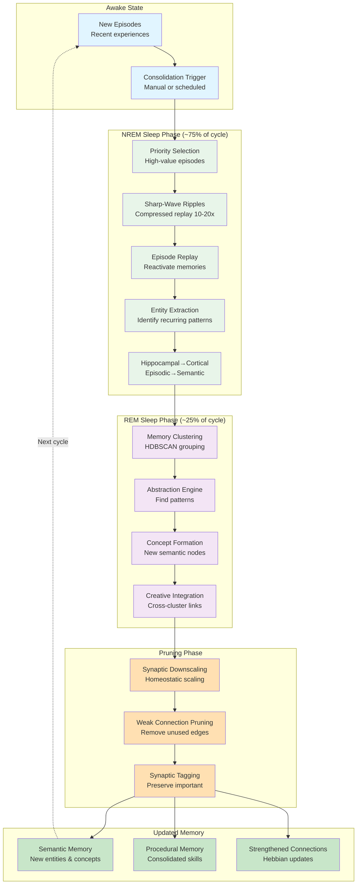
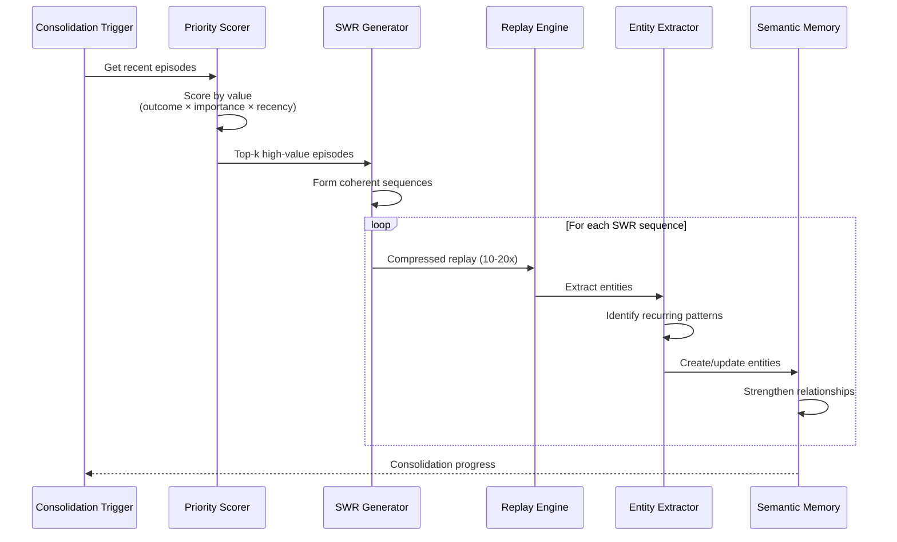
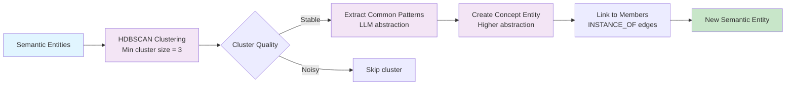
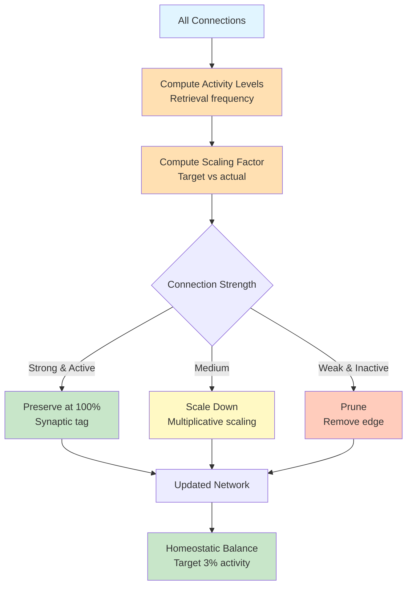

# Consolidation Flow - Sleep-Based Memory Consolidation with SWR

## Sleep Cycle Architecture

This diagram illustrates the complete sleep consolidation cycle with NREM, REM, and pruning phases.



## NREM Sleep Phase - Sharp-Wave Ripple Replay

### SWR Generation Process



### Priority Scoring for Replay

Episodes are prioritized based on:

```python
def compute_replay_priority(episode: Episode) -> float:
    """
    Compute priority score for episode replay.

    High priority = worth consolidating into semantic memory.
    """
    # Outcome weight: Success = 1.2, Failure = 0.5
    outcome_weight = 1.2 if episode.outcome == "success" else 0.5

    # Importance from emotional valence [0, 1]
    importance = episode.emotional_valence

    # Recency with exponential decay (days)
    days_old = (datetime.now() - episode.timestamp).days
    recency = math.exp(-0.1 * days_old)

    # Novelty: How different from existing semantic memory
    novelty = compute_novelty_score(episode)

    # Combined priority
    priority = (
        0.3 * outcome_weight +
        0.25 * importance +
        0.25 * recency +
        0.2 * novelty
    )

    return priority
```

### Sharp-Wave Ripple Sequence Generation

```python
class SharpWaveRipple:
    """
    Sharp-wave ripple (SWR) generator for compressed memory replay.

    Biological inspiration:
    - ~100ms high-frequency oscillations in hippocampus
    - Compress temporal sequences at 10-20x speed
    - Critical for hippocampal-cortical dialogue
    """

    def __init__(
        self,
        compression_factor: float = 10.0,
        min_sequence_length: int = 3,
        max_sequence_length: int = 8,
        coherence_threshold: float = 0.5
    ):
        self.compression_factor = compression_factor
        self.min_sequence_length = min_sequence_length
        self.max_sequence_length = max_sequence_length
        self.coherence_threshold = coherence_threshold

    def generate_ripple_sequence(
        self,
        episodes: list[Episode],
        seed_idx: Optional[int] = None
    ) -> list[Episode]:
        """
        Generate a coherent sequence of related memories.

        Selects episodes that are semantically similar and
        form a narrative arc for efficient replay.
        """
        if not episodes:
            return []

        # Start with seed episode (high priority)
        if seed_idx is None:
            seed_idx = 0
        sequence = [episodes[seed_idx]]

        # Build sequence by finding similar episodes
        while len(sequence) < self.max_sequence_length:
            current = sequence[-1]
            candidates = [e for e in episodes if e not in sequence]

            if not candidates:
                break

            # Find most similar candidate
            similarities = [
                self._compute_coherence(current, candidate)
                for candidate in candidates
            ]
            best_idx = np.argmax(similarities)

            if similarities[best_idx] < self.coherence_threshold:
                break  # No more coherent episodes

            sequence.append(candidates[best_idx])

        # Require minimum length
        if len(sequence) < self.min_sequence_length:
            return []

        return sequence

    def _compute_coherence(self, ep1: Episode, ep2: Episode) -> float:
        """
        Compute coherence between two episodes.

        Combines:
        - Semantic similarity (embeddings)
        - Temporal proximity
        - Shared entities
        """
        # Semantic similarity
        semantic = cosine_similarity(ep1.embedding, ep2.embedding)

        # Temporal proximity (closer in time = more coherent)
        time_diff_hours = abs((ep1.timestamp - ep2.timestamp).total_seconds() / 3600)
        temporal = math.exp(-0.05 * time_diff_hours)

        # Shared entities
        shared = len(set(ep1.entities) & set(ep2.entities))
        total = len(set(ep1.entities) | set(ep2.entities))
        entity_overlap = shared / total if total > 0 else 0

        # Weighted combination
        coherence = (
            0.5 * semantic +
            0.3 * temporal +
            0.2 * entity_overlap
        )

        return coherence
```

### Entity Extraction and Consolidation

```python
async def consolidate_episodes_to_semantic(
    episodes: list[Episode],
    min_recurrence: int = 3
) -> list[Entity]:
    """
    Extract semantic entities from episodic memories.

    Process:
    1. Extract entity mentions from each episode
    2. Group mentions by normalized name
    3. Create semantic entity if mentioned ≥ min_recurrence times
    4. Extract stable facts that appear consistently
    """
    entity_mentions = defaultdict(list)

    # Extract entities from each episode
    for episode in episodes:
        for mention in extract_entities(episode.content):
            key = normalize_entity_name(mention.name)
            entity_mentions[key].append({
                "mention": mention,
                "episode": episode,
                "timestamp": episode.timestamp
            })

    # Create semantic entities for recurring mentions
    new_entities = []
    for entity_name, mentions in entity_mentions.items():
        if len(mentions) < min_recurrence:
            continue  # Not recurring enough

        # Extract stable facts
        facts = extract_stable_facts(mentions)

        # Create semantic entity
        entity = Entity(
            id=uuid4(),
            name=entity_name,
            entity_type=infer_entity_type(mentions),
            summary=generate_summary(facts),
            facts=facts,
            source_episodes=[m["episode"].id for m in mentions],
            first_seen=min(m["timestamp"] for m in mentions),
            last_seen=max(m["timestamp"] for m in mentions),
            mention_count=len(mentions),
        )

        new_entities.append(entity)

    return new_entities
```

## REM Sleep Phase - Creative Abstraction

### Clustering and Pattern Discovery



### HDBSCAN Clustering

```python
import hdbscan

async def cluster_semantic_memories(
    entities: list[Entity],
    min_cluster_size: int = 3,
    min_samples: int = 2
) -> dict[int, list[Entity]]:
    """
    Cluster semantic entities to find abstract concepts.

    Uses HDBSCAN for density-based clustering that doesn't
    require specifying number of clusters.
    """
    if len(entities) < min_cluster_size:
        return {}

    # Get embeddings
    embeddings = np.array([e.embedding for e in entities])

    # Cluster
    clusterer = hdbscan.HDBSCAN(
        min_cluster_size=min_cluster_size,
        min_samples=min_samples,
        metric='cosine',
        cluster_selection_method='eom'  # Excess of mass
    )
    cluster_labels = clusterer.fit_predict(embeddings)

    # Group entities by cluster
    clusters = defaultdict(list)
    for entity, label in zip(entities, cluster_labels):
        if label != -1:  # Skip noise
            clusters[label].append(entity)

    return dict(clusters)
```

### Concept Abstraction

```python
async def abstract_concept_from_cluster(
    cluster: list[Entity],
    llm_client: AnthropicClient
) -> Optional[Entity]:
    """
    Use LLM to abstract a concept from a cluster of entities.

    Example:
    - Input: ["Python", "JavaScript", "Rust"]
    - Output: "Programming Language" concept
    """
    # Build prompt with cluster members
    member_descriptions = "\n".join(
        f"- {e.name}: {e.summary}"
        for e in cluster
    )

    prompt = f"""
    I have a cluster of related entities:

    {member_descriptions}

    What is the common abstract concept that unifies these entities?
    Provide a concise name and description for this concept.

    Format:
    Name: <concept name>
    Description: <2-3 sentence description>
    """

    # Query LLM
    response = await llm_client.messages.create(
        model="claude-3-5-sonnet-20241022",
        max_tokens=200,
        messages=[{"role": "user", "content": prompt}]
    )

    # Parse response
    text = response.content[0].text
    name = extract_field(text, "Name")
    description = extract_field(text, "Description")

    if not name or not description:
        return None

    # Create concept entity
    concept = Entity(
        id=uuid4(),
        name=name,
        entity_type="CONCEPT",
        summary=description,
        abstraction_level=1,  # Higher = more abstract
        derived_from=[e.id for e in cluster],
        created_at=datetime.now(),
    )

    return concept
```

### Cross-Cluster Integration

```python
async def integrate_across_clusters(
    concepts: list[Entity]
) -> list[Relationship]:
    """
    Find creative connections between concepts.

    This is the "dreaming" phase - combining disparate
    concepts in novel ways.
    """
    new_relationships = []

    # All pairs of concepts
    for i, concept_a in enumerate(concepts):
        for concept_b in concepts[i+1:]:
            # Compute semantic similarity
            similarity = cosine_similarity(
                concept_a.embedding,
                concept_b.embedding
            )

            # Only connect if moderately similar (not too obvious)
            if 0.3 < similarity < 0.7:
                # Create creative relationship
                rel = Relationship(
                    source=concept_a.id,
                    target=concept_b.id,
                    type="CREATIVELY_RELATED_TO",
                    weight=similarity,
                    discovered_during="REM_sleep",
                    timestamp=datetime.now(),
                )
                new_relationships.append(rel)

    return new_relationships
```

## Pruning Phase - Synaptic Homeostasis

### Synaptic Downscaling



### Implementation

```python
class SynapticPruner:
    """
    Synaptic downscaling and pruning during sleep.

    Biological basis:
    - Sleep downscales weak synapses (homeostatic plasticity)
    - Strong synapses are protected by synaptic tags
    - Maintains network stability and sparsity
    """

    def __init__(
        self,
        target_activity: float = 0.03,  # 3% active
        weak_threshold: float = 0.1,
        strong_threshold: float = 0.7,
    ):
        self.target_activity = target_activity
        self.weak_threshold = weak_threshold
        self.strong_threshold = strong_threshold

    async def prune_connections(
        self,
        relationships: list[Relationship]
    ) -> PruningResult:
        """
        Prune weak connections and downscale medium ones.

        Returns statistics about pruning.
        """
        # Compute activity levels
        activity_levels = self._compute_activity(relationships)
        avg_activity = np.mean(activity_levels)

        # Compute scaling factor
        scaling_factor = self.target_activity / (avg_activity + 1e-8)

        pruned = []
        scaled = []
        preserved = []

        for rel, activity in zip(relationships, activity_levels):
            # Strong and active connections are preserved
            if rel.weight > self.strong_threshold and activity > 0.01:
                preserved.append(rel)

            # Weak and inactive connections are pruned
            elif rel.weight < self.weak_threshold and activity < 0.001:
                pruned.append(rel)
                await self._delete_relationship(rel)

            # Medium connections are downscaled
            else:
                rel.weight *= scaling_factor
                scaled.append(rel)
                await self._update_relationship(rel)

        return PruningResult(
            total_connections=len(relationships),
            pruned_count=len(pruned),
            scaled_count=len(scaled),
            preserved_count=len(preserved),
            scaling_factor=scaling_factor,
        )

    def _compute_activity(
        self,
        relationships: list[Relationship]
    ) -> np.ndarray:
        """
        Compute activity level for each relationship.

        Based on:
        - Recent co-retrieval count
        - Recency of last access
        - Strength of connection
        """
        activities = []

        for rel in relationships:
            # Recency decay
            days_since = (datetime.now() - rel.last_accessed).days
            recency = math.exp(-0.05 * days_since)

            # Co-retrieval frequency (normalized)
            frequency = rel.co_access_count / 100  # Normalize

            # Combined activity
            activity = 0.6 * recency + 0.4 * frequency
            activities.append(activity)

        return np.array(activities)
```

## Complete Sleep Cycle

### Main Consolidation Loop

```python
async def run_sleep_cycle(
    session_id: str,
    episodic_memory: EpisodicMemory,
    semantic_memory: SemanticMemory,
    procedural_memory: ProceduralMemory,
) -> SleepCycleResult:
    """
    Run a complete sleep cycle: NREM → REM → Prune.

    Returns statistics about consolidation.
    """
    start_time = datetime.now()

    # Phase 1: NREM Sleep (Sharp-Wave Ripple Replay)
    logger.info("Starting NREM sleep phase...")
    nrem_result = await nrem_phase(
        episodic_memory=episodic_memory,
        semantic_memory=semantic_memory,
        session_id=session_id,
    )

    # Phase 2: REM Sleep (Creative Abstraction)
    logger.info("Starting REM sleep phase...")
    rem_result = await rem_phase(
        semantic_memory=semantic_memory,
    )

    # Phase 3: Pruning (Synaptic Downscaling)
    logger.info("Starting pruning phase...")
    prune_result = await prune_phase(
        semantic_memory=semantic_memory,
    )

    end_time = datetime.now()

    # Compile results
    result = SleepCycleResult(
        session_id=session_id,
        start_time=start_time,
        end_time=end_time,
        nrem_replays=nrem_result.replay_count,
        rem_abstractions=rem_result.concept_count,
        pruned_connections=prune_result.pruned_count,
        strengthened_connections=nrem_result.strengthened_count,
        total_duration_seconds=(end_time - start_time).total_seconds(),
    )

    logger.info(f"Sleep cycle complete: {result}")
    return result
```

## Performance Metrics

### Consolidation Statistics

| Metric | Typical Value | Description |
|--------|---------------|-------------|
| Episodes processed | 100-1000 | Recent episodes since last sleep |
| SWR sequences | 10-50 | Number of replay sequences |
| Entities created | 5-20 | New semantic entities |
| Concepts abstracted | 2-5 | High-level concepts from REM |
| Connections pruned | 50-200 | Weak edges removed |
| Connections strengthened | 100-500 | Hebbian updates |
| Total duration | 10-60 seconds | Full cycle time |

### Phase Timing

| Phase | Duration | % of Cycle | Operations |
|-------|----------|------------|------------|
| NREM | 30-45s | ~75% | SWR replay, entity extraction |
| REM | 10-15s | ~25% | Clustering, abstraction |
| Prune | 5-10s | Variable | Downscaling, pruning |

### Memory Impact

| Memory Type | Before Sleep | After Sleep | Change |
|-------------|--------------|-------------|--------|
| Episodes | 1000 items | 1000 items | 0 (preserved) |
| Semantic Entities | 500 items | 520 items | +20 (new) |
| Relationships | 2000 edges | 1850 edges | -150 (pruned) |
| Concepts | 50 items | 53 items | +3 (abstracted) |

## Configuration

```python
# Sleep consolidation config
CONSOLIDATION_CONFIG = {
    # NREM phase
    "nrem": {
        "min_episodes": 10,  # Minimum episodes to trigger
        "max_episodes": 1000,  # Maximum to process
        "priority_top_k": 100,  # Top episodes to replay
        "swr_compression": 10.0,  # Temporal compression factor
        "min_sequence_length": 3,
        "max_sequence_length": 8,
        "coherence_threshold": 0.5,
        "min_recurrence": 3,  # For entity creation
    },

    # REM phase
    "rem": {
        "min_cluster_size": 3,
        "min_samples": 2,
        "max_clusters": 20,
        "abstraction_threshold": 0.7,  # Cluster quality
        "creative_similarity_range": (0.3, 0.7),
    },

    # Pruning phase
    "prune": {
        "target_activity": 0.03,  # 3% active
        "weak_threshold": 0.1,
        "strong_threshold": 0.7,
        "min_access_days": 30,  # Delete if not accessed
    },

    # Scheduling
    "schedule": {
        "auto_trigger": False,  # Manual by default
        "trigger_interval_hours": 24,
        "trigger_episode_threshold": 100,
    },
}
```
