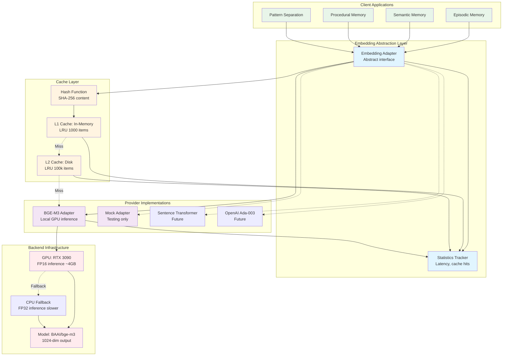
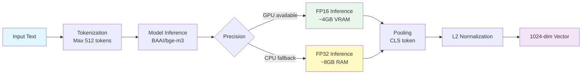
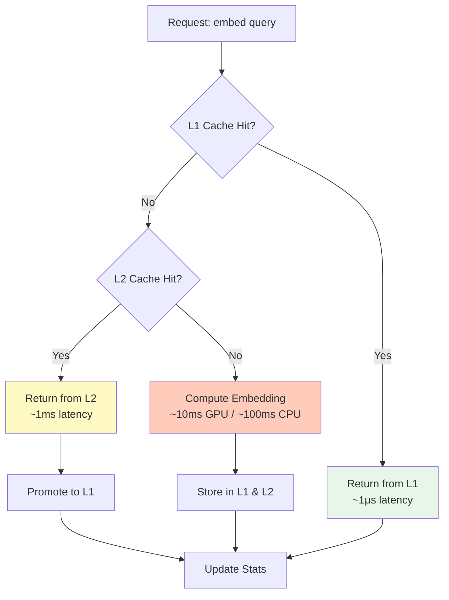

# Embedding Pipeline - Adapter Hierarchy and Caching

## Embedding Adapter Architecture

This diagram shows the embedding adapter hierarchy, caching strategies, and integration with memory systems.



## Embedding Adapter Protocol

### Abstract Interface

```python
from abc import ABC, abstractmethod
from typing import Protocol, runtime_checkable

@runtime_checkable
class EmbeddingProvider(Protocol):
    """Protocol for embedding providers."""

    @property
    def dimension(self) -> int:
        """Return embedding dimension."""
        ...

    async def embed_query(self, query: str) -> list[float]:
        """
        Embed a single query text.

        Optimized for search queries (may differ from document embedding).
        """
        ...

    async def embed(self, texts: list[str]) -> list[list[float]]:
        """
        Embed multiple texts.

        Batched for efficiency.
        """
        ...
```

### Base Adapter Implementation

```python
class EmbeddingAdapter(ABC):
    """
    Abstract base class for embedding adapters.

    Provides consistent interface with statistics tracking.
    """

    def __init__(self, dimension: int = 1024):
        self.dimension = dimension
        self.stats = EmbeddingStats()
        self._cache_l1 = LRUCache(max_size=1000)
        self._cache_l2 = None  # Optional disk cache

    async def embed_query(self, query: str) -> list[float]:
        """Embed query with caching."""
        cache_key = self._hash(query)

        # Check L1 cache
        cached = self._cache_l1.get(cache_key)
        if cached is not None:
            self.stats.cache_hits += 1
            return cached

        # Check L2 cache if available
        if self._cache_l2:
            cached = await self._cache_l2.get(cache_key)
            if cached is not None:
                self.stats.cache_hits += 1
                self._cache_l1.set(cache_key, cached)  # Promote to L1
                return cached

        # Cache miss - compute embedding
        self.stats.cache_misses += 1
        start = time.time()
        embedding = await self._embed_impl(query)
        latency_ms = (time.time() - start) * 1000

        # Update stats and cache
        self.stats.total_queries += 1
        self.stats.total_latency_ms += latency_ms
        self.stats.last_used = datetime.now()
        self._cache_l1.set(cache_key, embedding)
        if self._cache_l2:
            await self._cache_l2.set(cache_key, embedding)

        return embedding

    @abstractmethod
    async def _embed_impl(self, text: str) -> list[float]:
        """Subclass implements actual embedding logic."""
        pass

    def _hash(self, text: str) -> str:
        """Hash text for cache key."""
        return hashlib.sha256(text.encode()).hexdigest()
```

## Provider Implementations

### BGE-M3 Adapter (Primary)



**Implementation Details**:

```python
from FlagEmbedding import BGEM3FlagModel

class BGEM3Adapter(EmbeddingAdapter):
    """BGE-M3 embedding adapter with GPU acceleration."""

    def __init__(self, device: str = "cuda", use_fp16: bool = True):
        super().__init__(dimension=1024)
        self.device = device
        self.use_fp16 = use_fp16

        # Load model
        self.model = BGEM3FlagModel(
            'BAAI/bge-m3',
            device=device,
            use_fp16=use_fp16
        )

        # Warm up model
        self.model.encode(["warmup"])

    async def _embed_impl(self, text: str) -> list[float]:
        """Encode text using BGE-M3."""
        # Truncate to max length
        if len(text) > 8192:  # BGE-M3 max length
            text = text[:8192]

        # Encode (blocking call - run in executor)
        loop = asyncio.get_event_loop()
        embedding = await loop.run_in_executor(
            None,
            lambda: self.model.encode([text])['dense_vecs'][0]
        )

        return embedding.tolist()

    async def embed(self, texts: list[str]) -> list[list[float]]:
        """Batch encode texts."""
        # Truncate all texts
        texts = [t[:8192] for t in texts]

        # Batch encode (blocking call)
        loop = asyncio.get_event_loop()
        embeddings = await loop.run_in_executor(
            None,
            lambda: self.model.encode(texts)['dense_vecs']
        )

        return embeddings.tolist()
```

**Performance Characteristics**:

| Property | Value |
|----------|-------|
| Dimension | 1024 |
| Max Tokens | 8192 |
| Batch Size | 32 (optimal) |
| GPU Latency | ~10ms/query, ~200ms/batch-32 |
| CPU Latency | ~100ms/query, ~3s/batch-32 |
| VRAM Usage | ~4GB (FP16), ~8GB (FP32) |
| RAM Usage | ~8GB (CPU mode) |

### Mock Adapter (Testing)

```python
class MockEmbeddingAdapter(EmbeddingAdapter):
    """Mock adapter for testing - deterministic embeddings."""

    def __init__(self, dimension: int = 1024, seed: int = 42):
        super().__init__(dimension=dimension)
        self.seed = seed

    async def _embed_impl(self, text: str) -> list[float]:
        """Generate deterministic embedding from text hash."""
        # Use text hash as seed for reproducibility
        text_hash = int(hashlib.sha256(text.encode()).hexdigest(), 16)
        rng = random.Random(text_hash + self.seed)

        # Generate random unit vector
        embedding = [rng.gauss(0, 1) for _ in range(self.dimension)]

        # L2 normalize
        norm = sum(x**2 for x in embedding) ** 0.5
        embedding = [x / norm for x in embedding]

        return embedding

    async def embed(self, texts: list[str]) -> list[list[float]]:
        """Batch embed texts."""
        return [await self._embed_impl(text) for text in texts]
```

## Caching Strategy

### Two-Level Cache Architecture



### L1 Cache: In-Memory LRU

```python
from collections import OrderedDict

class LRUCache:
    """Thread-safe LRU cache for embeddings."""

    def __init__(self, max_size: int = 1000):
        self.max_size = max_size
        self._cache = OrderedDict()
        self._lock = asyncio.Lock()

    async def get(self, key: str) -> Optional[list[float]]:
        """Get item from cache (LRU)."""
        async with self._lock:
            if key not in self._cache:
                return None

            # Move to end (most recently used)
            self._cache.move_to_end(key)
            return self._cache[key]

    async def set(self, key: str, value: list[float]) -> None:
        """Set item in cache, evict if full."""
        async with self._lock:
            if key in self._cache:
                self._cache.move_to_end(key)
            else:
                if len(self._cache) >= self.max_size:
                    # Evict least recently used
                    self._cache.popitem(last=False)

            self._cache[key] = value

    def clear(self) -> None:
        """Clear cache."""
        self._cache.clear()

    @property
    def size(self) -> int:
        """Current cache size."""
        return len(self._cache)
```

### L2 Cache: Disk-Based (Optional)

```python
import aiosqlite
import pickle

class DiskCache:
    """SQLite-backed disk cache for embeddings."""

    def __init__(self, db_path: str = "embeddings.db", max_size: int = 100000):
        self.db_path = db_path
        self.max_size = max_size

    async def init(self):
        """Initialize database."""
        async with aiosqlite.connect(self.db_path) as db:
            await db.execute("""
                CREATE TABLE IF NOT EXISTS embeddings (
                    key TEXT PRIMARY KEY,
                    embedding BLOB,
                    created_at REAL,
                    accessed_at REAL
                )
            """)
            await db.execute("""
                CREATE INDEX IF NOT EXISTS idx_accessed
                ON embeddings(accessed_at)
            """)
            await db.commit()

    async def get(self, key: str) -> Optional[list[float]]:
        """Get embedding from disk cache."""
        async with aiosqlite.connect(self.db_path) as db:
            async with db.execute(
                "SELECT embedding FROM embeddings WHERE key = ?",
                (key,)
            ) as cursor:
                row = await cursor.fetchone()
                if row is None:
                    return None

                # Update access time
                await db.execute(
                    "UPDATE embeddings SET accessed_at = ? WHERE key = ?",
                    (time.time(), key)
                )
                await db.commit()

                return pickle.loads(row[0])

    async def set(self, key: str, embedding: list[float]) -> None:
        """Store embedding in disk cache."""
        async with aiosqlite.connect(self.db_path) as db:
            # Check if cache is full
            async with db.execute("SELECT COUNT(*) FROM embeddings") as cursor:
                count = (await cursor.fetchone())[0]

            if count >= self.max_size:
                # Evict least recently accessed
                await db.execute("""
                    DELETE FROM embeddings
                    WHERE key IN (
                        SELECT key FROM embeddings
                        ORDER BY accessed_at ASC
                        LIMIT 1000
                    )
                """)

            # Insert or replace
            now = time.time()
            await db.execute(
                """
                INSERT OR REPLACE INTO embeddings
                (key, embedding, created_at, accessed_at)
                VALUES (?, ?, ?, ?)
                """,
                (key, pickle.dumps(embedding), now, now)
            )
            await db.commit()
```

## Statistics and Monitoring

### Embedding Statistics

```python
@dataclass
class EmbeddingStats:
    """Statistics for embedding provider."""

    total_queries: int = 0
    total_documents: int = 0
    cache_hits: int = 0
    cache_misses: int = 0
    total_latency_ms: float = 0.0
    errors: int = 0
    last_used: Optional[datetime] = None

    @property
    def cache_hit_rate(self) -> float:
        """Calculate cache hit rate."""
        total = self.cache_hits + self.cache_misses
        return self.cache_hits / total if total > 0 else 0.0

    @property
    def avg_latency_ms(self) -> float:
        """Calculate average latency."""
        total = self.total_queries + self.total_documents
        return self.total_latency_ms / total if total > 0 else 0.0

    def to_dict(self) -> dict:
        """Convert to dictionary for API."""
        return {
            "total_queries": self.total_queries,
            "total_documents": self.total_documents,
            "cache_hits": self.cache_hits,
            "cache_misses": self.cache_misses,
            "cache_hit_rate": round(self.cache_hit_rate, 4),
            "avg_latency_ms": round(self.avg_latency_ms, 2),
            "errors": self.errors,
            "last_used": self.last_used.isoformat() if self.last_used else None,
        }
```

### Health Check Endpoint

```python
from fastapi import APIRouter

router = APIRouter()

@router.get("/health/embedding")
async def embedding_health(adapter: EmbeddingAdapter):
    """Check embedding adapter health."""

    # Test embedding
    try:
        start = time.time()
        test_embedding = await adapter.embed_query("health check")
        latency_ms = (time.time() - start) * 1000

        return {
            "status": "healthy",
            "dimension": adapter.dimension,
            "latency_ms": round(latency_ms, 2),
            "stats": adapter.stats.to_dict(),
        }
    except Exception as e:
        return {
            "status": "unhealthy",
            "error": str(e),
            "stats": adapter.stats.to_dict(),
        }
```

## Integration with Memory Systems

### Episodic Memory

```python
class EpisodicMemory:
    def __init__(self, embedding_adapter: EmbeddingAdapter):
        self.embedding_adapter = embedding_adapter

    async def store_episode(self, content: str, **metadata) -> Episode:
        """Store episode with embedding."""
        # Generate embedding
        embedding = await self.embedding_adapter.embed_query(content)

        # Create episode
        episode = Episode(
            id=uuid4(),
            content=content,
            embedding=embedding,
            timestamp=datetime.now(),
            **metadata
        )

        # Store in Neo4j + Qdrant (via Saga)
        await self.saga.store_episode(episode)

        return episode

    async def recall_episodes(
        self,
        query: str,
        limit: int = 10
    ) -> list[Episode]:
        """Recall episodes by semantic similarity."""
        # Embed query
        query_embedding = await self.embedding_adapter.embed_query(query)

        # Vector search in Qdrant
        results = await self.t4dx_vector_adapter.search(
            query_embedding,
            limit=limit * 3  # Retrieve more for reranking
        )

        # Rerank with multi-factor scoring
        scored = self._score_episodes(results, query_embedding)

        return scored[:limit]
```

## Performance Benchmarks

### Latency Breakdown

| Operation | L1 Hit | L2 Hit | Cache Miss (GPU) | Cache Miss (CPU) |
|-----------|--------|--------|------------------|------------------|
| Single Query | ~1μs | ~1ms | ~10ms | ~100ms |
| Batch-8 | ~8μs | ~8ms | ~50ms | ~500ms |
| Batch-32 | ~32μs | ~32ms | ~200ms | ~3s |

### Cache Performance

| Cache Size | Hit Rate | Memory Usage | Disk Usage |
|------------|----------|--------------|------------|
| L1: 1K items | 60-70% | ~4MB | 0 |
| L2: 100K items | 90-95% | 0 | ~400MB |
| Combined | 95-98% | ~4MB | ~400MB |

### Throughput

| Mode | Queries/sec | Batches/sec | GPU Utilization |
|------|-------------|-------------|-----------------|
| Cache hits | ~1M | ~100K | 0% |
| GPU inference | ~100 | ~5 | 80-90% |
| CPU inference | ~10 | ~0.5 | 100% (8 cores) |

## Configuration

```python
# Embedding adapter config
EMBEDDING_CONFIG = {
    "provider": "bge_m3",  # bge_m3, mock, sentence_transformer, openai
    "dimension": 1024,
    "device": "cuda",      # cuda, cpu
    "use_fp16": True,      # FP16 for GPU, FP32 for CPU
    "batch_size": 32,
    "max_length": 8192,
}

# Cache config
CACHE_CONFIG = {
    "l1_enabled": True,
    "l1_max_size": 1000,
    "l2_enabled": True,
    "l2_max_size": 100000,
    "l2_db_path": "data/embeddings.db",
}
```
