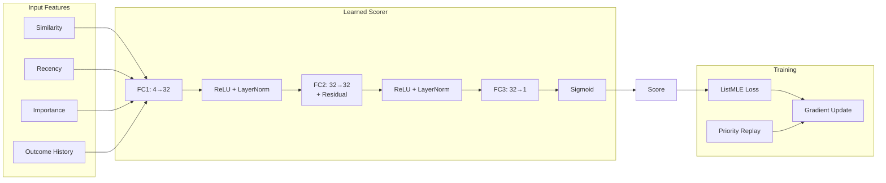
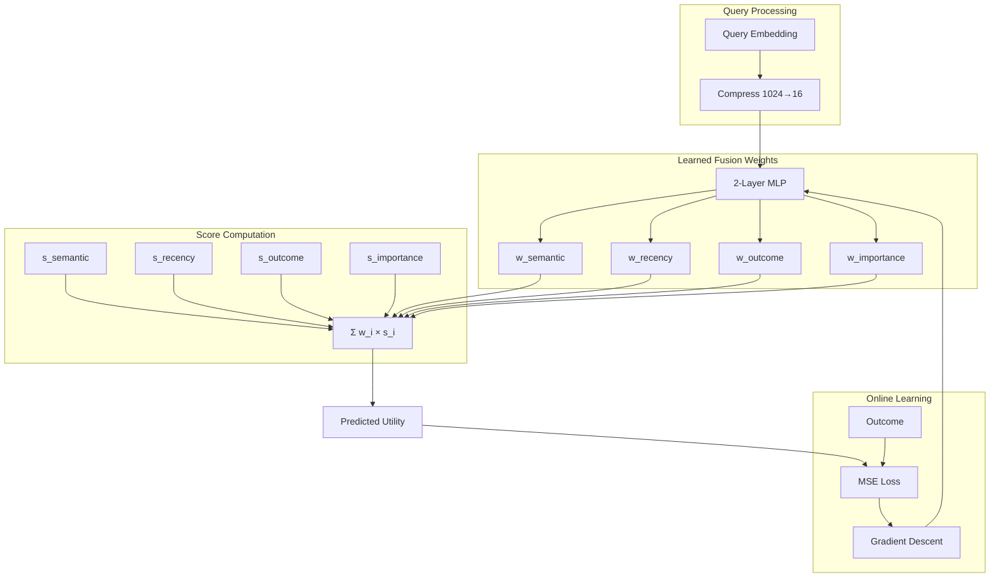
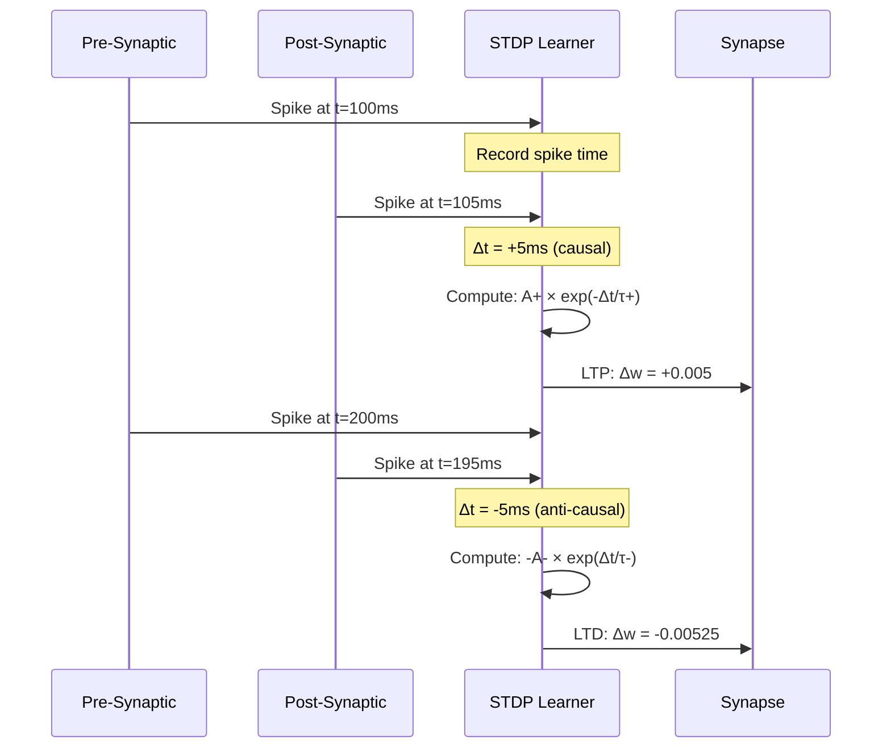

# Learning Signal Flow

Complete learning pathway from events to weight updates.

## Full Learning Signal Flow

```mermaid
flowchart TB
    subgraph Events["Event Capture"]
        RET_EVENT[Retrieval Event]
        OUT_EVENT[Outcome Event]
        EXP[Experience]
    end

    subgraph Eligibility["Eligibility Traces"]
        FAST[Fast Layer τ=5s]
        SLOW[Slow Layer τ=60s]
        DECAY[Exponential Decay]
        CREDIT[Credit Assignment]
    end

    subgraph Dopamine["Dopamine System"]
        VALUE[Value Estimator<br/>V(s)]
        RPE[RPE: δ = r - V(s)]
        UPDATE[Update V(s)]
        TD[TD(λ) Distribution]
    end

    subgraph Orchestra["Neuromod Orchestra"]
        NE[NE Gain]
        ACH[ACh Mode]
        SHT[5-HT Mood]
        GATE[Neuromod Gate]
    end

    subgraph ThreeFactor["Three-Factor Rule"]
        ELIG_F[Factor 1: Eligibility]
        GATE_F[Factor 2: Gate]
        DA_F[Factor 3: |RPE|]
        COMBINE[LR = base × elig × gate × |δ|]
    end

    subgraph Output["Weight Updates"]
        RECON[Reconsolidation]
        SCORER[Scorer Update]
        GATE_W[Gate Weights]
        EMB[Embedding Shift]
    end

    %% Event flow
    RET_EVENT --> FAST
    RET_EVENT --> SLOW
    RET_EVENT --> EXP
    OUT_EVENT --> RPE
    OUT_EVENT --> EXP

    %% Eligibility flow
    FAST --> DECAY
    SLOW --> DECAY
    DECAY --> CREDIT
    CREDIT --> ELIG_F

    %% Dopamine flow
    VALUE --> RPE
    OUT_EVENT --> UPDATE
    UPDATE --> VALUE
    RPE --> TD
    TD --> DA_F

    %% Orchestra flow
    RET_EVENT --> NE
    RET_EVENT --> ACH
    SHT --> GATE
    NE --> GATE
    ACH --> GATE
    GATE --> GATE_F

    %% Three-factor combination
    ELIG_F --> COMBINE
    GATE_F --> COMBINE
    DA_F --> COMBINE

    %% Output
    COMBINE --> RECON
    COMBINE --> SCORER
    COMBINE --> GATE_W
    RECON --> EMB

    %% Styling
    classDef event fill:#e3f2fd,stroke:#1565c0
    classDef elig fill:#f3e5f5,stroke:#7b1fa2
    classDef da fill:#fff8e1,stroke:#f9a825
    classDef orch fill:#e8f5e9,stroke:#2e7d32
    classDef tf fill:#fce4ec,stroke:#c2185b
    classDef out fill:#ffebee,stroke:#c62828

    class RET_EVENT,OUT_EVENT,EXP event
    class FAST,SLOW,DECAY,CREDIT elig
    class VALUE,RPE,UPDATE,TD da
    class NE,ACH,SHT,GATE orch
    class ELIG_F,GATE_F,DA_F,COMBINE tf
    class RECON,SCORER,GATE_W,EMB out
```

## Learned Components



## Fusion Weight Learning



## Reconsolidation Engine

```mermaid
flowchart LR
    subgraph Input
        MEM[Memory Embedding]
        QUERY[Query Embedding]
        OUT[Outcome]
    end

    subgraph Direction["Update Direction"]
        POS[Positive → Move toward query]
        NEG[Negative → Move away]
        ADV[Advantage = |outcome - 0.5|]
    end

    subgraph Modulation["Learning Rate"]
        BASE[Base LR: 0.01]
        THREE[Three-Factor]
        EFF[Effective LR]
    end

    subgraph Update
        SHIFT[Embedding Shift]
        BOUND[Bounded Update]
        NEW[New Embedding]
    end

    MEM --> SHIFT
    QUERY --> SHIFT
    OUT --> POS
    OUT --> NEG
    OUT --> ADV

    POS --> SHIFT
    NEG --> SHIFT
    ADV --> EFF

    BASE --> THREE
    THREE --> EFF
    EFF --> BOUND
    SHIFT --> BOUND
    BOUND --> NEW
```

## STDP Weight Updates



## Learning Parameters

| Component | Parameter | Value |
|-----------|-----------|-------|
| Eligibility Fast | τ | 5s |
| Eligibility Slow | τ | 60s |
| Dopamine | Value LR | 0.1 |
| Dopamine | Surprise threshold | 0.05 |
| Reconsolidation | Base LR | 0.01 |
| Scorer | Hidden dim | 32 |
| Scorer | Dropout | 0.1 |
| STDP | A+ | 0.005 |
| STDP | A- | 0.00525 |
| STDP | τ+ | 20ms |
| STDP | τ- | 20ms |
