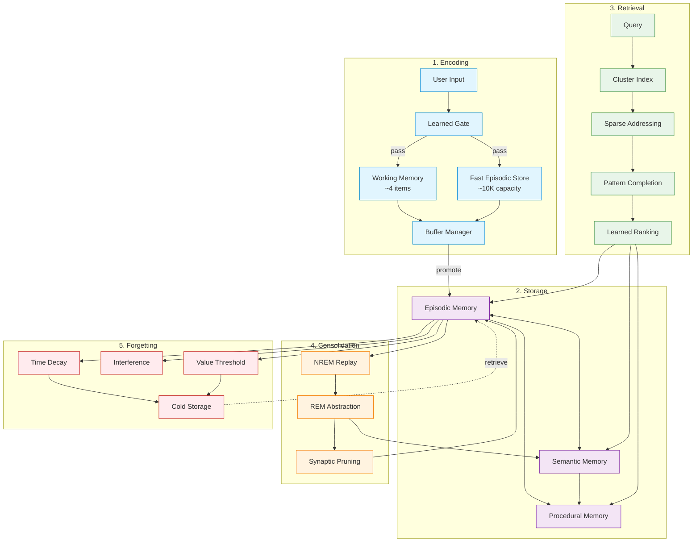
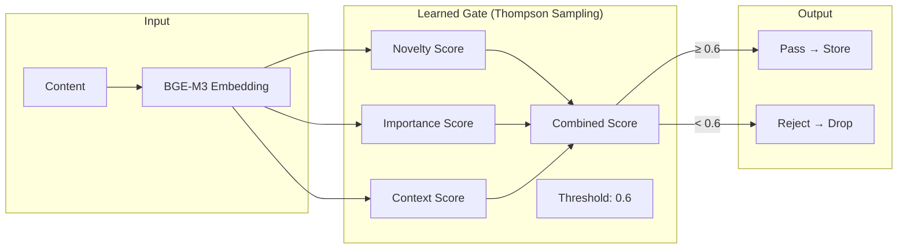
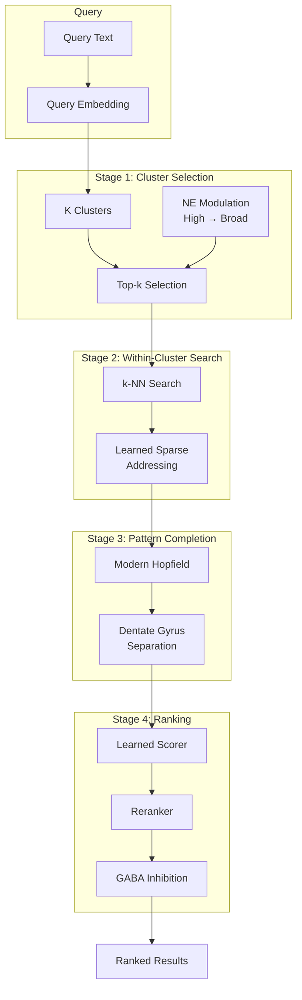
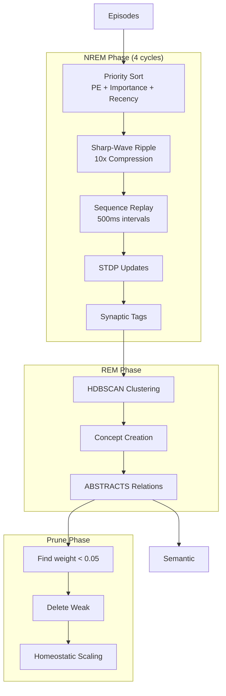
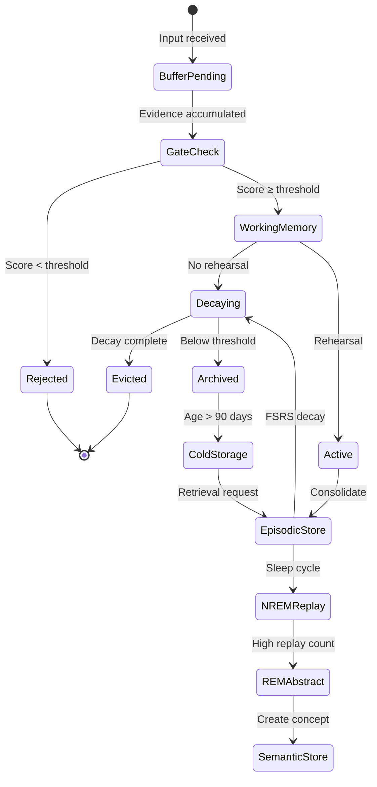

# Memory Lifecycle

Complete flow from encoding to consolidation to forgetting.

## Full Memory Lifecycle

## Encoding Phase Detail

## Retrieval Phase Detail

## Consolidation Phase Detail

## State Transitions

## Timing Parameters

| Phase | Parameter | Value |
|-------|-----------|-------|
| Gate | Threshold | 0.6 |
| Working Memory | Capacity | 4 items |
| Working Memory | Decay | Exponential |
| FES | Capacity | 10,000 |
| FES | Learning rate | 100x faster |
| Buffer | Max residence | 300s |
| Buffer | Promotion threshold | 0.65 |
| NREM | Replay delay | 500ms |
| NREM | Cycles | 4 |
| SWR | Compression | 10x |
| Prune | Weight threshold | 0.05 |
| Archive | Age threshold | 90 days |
