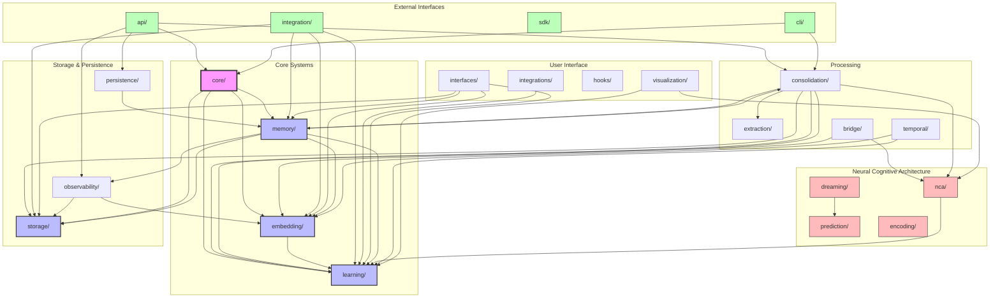
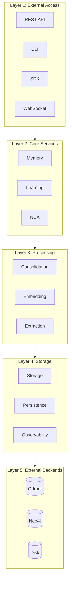

# Module Dependency Graph

Complete dependency map of World Weaver's 23 modules.

## Full Dependency Graph

## Centrality Scores

| Module | In-Degree | Out-Degree | Centrality Score |
|--------|-----------|------------|------------------|
| core | 12 | 4 | 16 |
| learning | 11 | 1 | 12 |
| memory | 5 | 6 | 11 |
| consolidation | 0 | 10 | 10 |
| embedding | 7 | 2 | 9 |
| storage | 6 | 2 | 8 |
| interfaces | 0 | 6 | 6 |
| observability | 3 | 3 | 6 |
| nca | 3 | 2 | 5 |
| api | 0 | 4 | 4 |

## Simplified Layer View

## Circular Dependencies

**None detected** - Clean acyclic dependency graph.

## Module Clusters

### High-Cohesion Clusters

1. **Memory System**: memory, consolidation, learning, embedding
2. **Neural System**: nca, prediction, encoding, dreaming
3. **Storage System**: storage, persistence, observability
4. **Interface System**: api, interfaces, visualization, hooks
