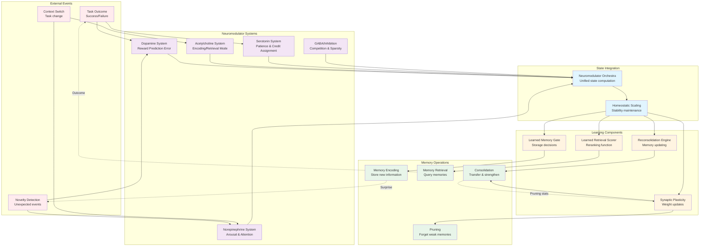
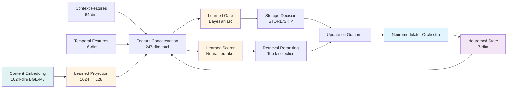

# Neural Pathways - Neuromodulator Orchestra & Plasticity

## Neuromodulator Orchestra and Learning System

This diagram shows how neuromodulator systems work together to modulate memory encoding, retrieval, and plasticity.



## Neuromodulator System Details

### Dopamine System (Reward Prediction Error)

**Biological Function**: Learning from outcomes, reinforcement signals

```mermaid
graph LR
    A[Outcome Event] --> B[Compute RPE<br/>δ = actual - expected]
    B --> C{RPE Sign}
    C -->|δ > 0| D[Positive Surprise<br/>Strengthen memories]
    C -->|δ < 0| E[Negative Surprise<br/>Weaken/revise memories]
    C -->|δ ≈ 0| F[As Expected<br/>Small update]
    D --> G[Update Expected Value]
    E --> G
    F --> G
    G --> H[Dopamine Level<br/>∈ [0, 2]]

    style A fill:#ffebee
    style H fill:#f3e5f5
```

**Key Properties**:
- **Range**: [0, 2] with baseline at 1.0
- **RPE Formula**: δ = actual_reward - expected_reward
- **Update**: expected ← expected + α × δ (learning rate α = 0.1)
- **Effect on Learning**: Higher DA → stronger plasticity, more exploration

**Parameters**:
```python
DA_baseline = 1.0
DA_min = 0.0  # Depression (negative prediction error)
DA_max = 2.0  # Euphoria (positive prediction error)
learning_rate = 0.1
decay_rate = 0.95  # Returns to baseline
```

### Norepinephrine System (Arousal & Attention)

**Biological Function**: Vigilance, novelty detection, exploration/exploitation balance

```mermaid
graph LR
    A[Novelty Signal] --> B[Compute Surprise<br/>|actual - expected|]
    B --> C[Arousal Level<br/>∈ [0, 2]]
    C --> D{Arousal State}
    D -->|< 0.3| E[Drowsy<br/>Low attention]
    D -->|0.3-0.7| F[Alert<br/>Balanced]
    D -->|0.7-1.5| G[Vigilant<br/>High attention]
    D -->|> 1.5| H[Hyperaroused<br/>Scattered attention]
    E --> I[Exploration Weight]
    F --> I
    G --> I
    H --> I

    style A fill:#ffebee
    style C fill:#f3e5f5
    style I fill:#fff4e1
```

**Key Properties**:
- **Range**: [0, 2] with baseline at 0.5 (alert)
- **Surprise**: |actual - expected| (absolute prediction error)
- **Effect**: High NE → more exploration, broader retrieval
- **Decay**: Fast (0.9) - arousal is transient

**Arousal States**:
| State | Range | Effect | Use Case |
|-------|-------|--------|----------|
| Drowsy | [0, 0.3] | Narrow focus, exploitation | Routine tasks |
| Alert | [0.3, 0.7] | Balanced | Normal operation |
| Vigilant | [0.7, 1.5] | Heightened attention | Novel situations |
| Hyperaroused | [1.5, 2.0] | Scattered, overly broad | Stress, panic |

### Acetylcholine System (Encoding vs Retrieval Mode)

**Biological Function**: Switch between learning new information and using existing knowledge

```mermaid
graph LR
    A[Context Signal] --> B{Task Type}
    B -->|New information| C[High ACh<br/>Encoding mode]
    B -->|Use knowledge| D[Low ACh<br/>Retrieval mode]
    B -->|Both| E[Medium ACh<br/>Balanced]
    C --> F[ACh Level ∈ [0, 1]]
    D --> F
    E --> F
    F --> G[Cognitive Mode]
    G -->|ACh > 0.6| H[ENCODING<br/>Strong plasticity]
    G -->|ACh < 0.4| I[RETRIEVAL<br/>Stable weights]
    G -->|0.4-0.6| J[BALANCED<br/>Moderate plasticity]

    style A fill:#ffebee
    style F fill:#f3e5f5
    style G fill:#fff4e1
```

**Key Properties**:
- **Range**: [0, 1] with baseline at 0.5 (balanced)
- **High ACh (>0.6)**: Encoding mode - strong plasticity, learn new patterns
- **Low ACh (<0.4)**: Retrieval mode - minimal plasticity, use existing knowledge
- **Effect**: Modulates learned gate threshold and scorer learning rate

**Cognitive Modes**:
```python
if ach_level > 0.6:
    mode = CognitiveMode.ENCODING
    plasticity_multiplier = 1.5
    gate_threshold_reduction = 0.1
elif ach_level < 0.4:
    mode = CognitiveMode.RETRIEVAL
    plasticity_multiplier = 0.5
    gate_threshold_increase = 0.1
else:
    mode = CognitiveMode.BALANCED
    plasticity_multiplier = 1.0
```

### Serotonin System (Long-term Credit Assignment)

**Biological Function**: Patience, mood, temporal credit assignment across delayed rewards

```mermaid
graph LR
    A[Outcome Event] --> B[Eligibility Trace<br/>e(t) = γλe(t-1) + 1]
    B --> C[Temporal Context<br/>Recent history]
    C --> D[Credit Assignment<br/>Distribute reward]
    D --> E[Update Memories<br/>In eligibility window]
    E --> F[Serotonin Level<br/>∈ [0, 1]]
    F --> G{Mood}
    G -->|> 0.6| H[Optimistic<br/>Broad credit]
    G -->|0.4-0.6| I[Neutral<br/>Standard credit]
    G -->|< 0.4| J[Pessimistic<br/>Narrow credit]

    style A fill:#ffebee
    style F fill:#f3e5f5
```

**Key Properties**:
- **Range**: [0, 1] with baseline at 0.5 (neutral mood)
- **Eligibility Trace**: e(t) = γλe(t-1) + 1 where γ=0.9, λ=0.8
- **Effect**: Assigns credit to memories retrieved before delayed reward
- **Window**: Eligibility decay over ~10-20 timesteps

**Credit Assignment**:
```python
# Update memories in eligibility trace
for memory_id, trace_value in eligibility_traces.items():
    if trace_value > 0.1:  # Above threshold
        credit = reward × trace_value × serotonin_level
        update_memory_value(memory_id, credit)
```

### GABA/Inhibition (Competition & Sparsity)

**Biological Function**: Lateral inhibition, winner-take-all, sparse activation

```mermaid
graph LR
    A[Retrieved Memories] --> B[Compute Similarities<br/>Between memories]
    B --> C[Inhibition Network<br/>Lateral suppression]
    C --> D[Winner-Take-All<br/>Top-k selection]
    D --> E[Sparse Retrieval<br/>2-5% active]
    E --> F[Inhibition Strength<br/>∈ [0, 1]]
    F --> G{Sparsity}
    G -->|High| H[Strong Inhibition<br/>Few winners]
    G -->|Medium| I[Moderate Inhibition<br/>Balanced]
    G -->|Low| J[Weak Inhibition<br/>Many winners]

    style A fill:#e8f5e9
    style F fill:#f3e5f5
    style E fill:#fff4e1
```

**Key Properties**:
- **Range**: [0, 1] inhibition strength
- **Sparsity Target**: 2-5% of candidates active
- **Mechanism**: Lateral inhibition proportional to similarity
- **Effect**: Prevents redundant retrievals, promotes diversity

**Inhibition Formula**:
```python
for i, memory_i in enumerate(memories):
    inhibition = 0
    for j, memory_j in enumerate(memories):
        if i != j:
            similarity = cosine_similarity(memory_i, memory_j)
            inhibition += strength × similarity × activation[j]

    final_activation[i] = max(0, activation[i] - inhibition)
```

## Neuromodulator Orchestra Integration

### Unified State Computation

The orchestra computes a unified neuromodulator state from all systems:

```python
@dataclass
class NeuromodulatorState:
    dopamine: float        # [0, 2], baseline 1.0
    norepinephrine: float  # [0, 2], baseline 0.5
    serotonin: float       # [0, 1], baseline 0.5
    acetylcholine: float   # [0, 1], baseline 0.5
    inhibition: float      # [0, 1], baseline 0.3
    timestamp: datetime
```

### State Update Sequence

1. **Dopamine Update** (on outcome):
   ```python
   rpe = actual_reward - expected_reward
   dopamine = clip(baseline + rpe, 0, 2)
   expected_reward += learning_rate × rpe
   ```

2. **Norepinephrine Update** (on novelty):
   ```python
   surprise = abs(actual - expected)
   norepinephrine = clip(baseline + surprise, 0, 2)
   ```

3. **Acetylcholine Update** (on context):
   ```python
   if context == "new_task":
       acetylcholine = 0.8  # Encoding mode
   elif context == "familiar_task":
       acetylcholine = 0.3  # Retrieval mode
   ```

4. **Serotonin Update** (on delayed reward):
   ```python
   eligibility_traces = update_traces(gamma=0.9, lambda_=0.8)
   serotonin = clip(baseline + mood_adjustment, 0, 1)
   ```

5. **Inhibition Update** (on retrieval):
   ```python
   target_sparsity = 0.03  # 3% active
   actual_sparsity = compute_sparsity(activations)
   inhibition += learning_rate × (target_sparsity - actual_sparsity)
   inhibition = clip(inhibition, 0, 1)
   ```

## Plasticity Modulation

### Homeostatic Synaptic Scaling

Prevents runaway excitation/inhibition by maintaining stable average activity:

```python
class HomeostaticPlasticity:
    def __init__(self, target_rate: float = 0.03, tau: float = 1000):
        self.target_rate = target_rate  # Target firing rate
        self.tau = tau  # Time constant (events)
        self.activity_history = deque(maxlen=tau)

    def scale_weights(self, weights: np.ndarray) -> np.ndarray:
        """Apply multiplicative scaling to maintain target activity."""
        avg_activity = np.mean(self.activity_history)
        scaling_factor = self.target_rate / (avg_activity + 1e-8)

        # Multiplicative scaling (preserves relative weights)
        scaled_weights = weights * scaling_factor

        return scaled_weights
```

### Dopamine-Modulated Reconsolidation

Memories become labile upon retrieval and are updated based on new information:

```python
class ReconsolidationEngine:
    def reconsolidate(
        self,
        memory: Memory,
        new_info: np.ndarray,
        dopamine_level: float
    ) -> Memory:
        """Update memory during reconsolidation window."""

        # Lability proportional to dopamine (surprise)
        lability = dopamine_level / 2.0  # Normalize to [0, 1]

        # Blend old and new information
        updated_embedding = (
            (1 - lability) * memory.embedding +
            lability * new_info
        )

        memory.embedding = updated_embedding
        memory.reconsolidation_count += 1

        return memory
```

## Learning System Architecture

### Feature Flow Through Learning Pipeline



## Performance Metrics

| System | Latency | Update Frequency | Memory |
|--------|---------|------------------|--------|
| Dopamine | <1ms | Per outcome | 8 bytes |
| Norepinephrine | <1ms | Per novelty | 8 bytes |
| Acetylcholine | <1ms | Per context | 8 bytes |
| Serotonin | <5ms | Per outcome | ~1KB (traces) |
| Inhibition | <10ms | Per retrieval | ~10KB (network) |
| Orchestra | <5ms | On demand | ~50KB |
| Learned Gate | <5ms | Per encoding | ~200KB |
| Learned Scorer | <20ms | Per retrieval | ~2MB |
