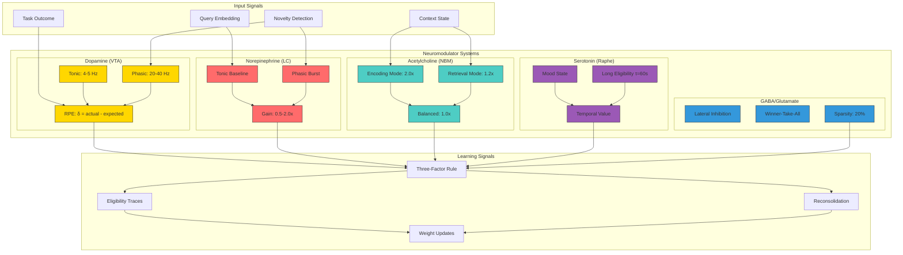
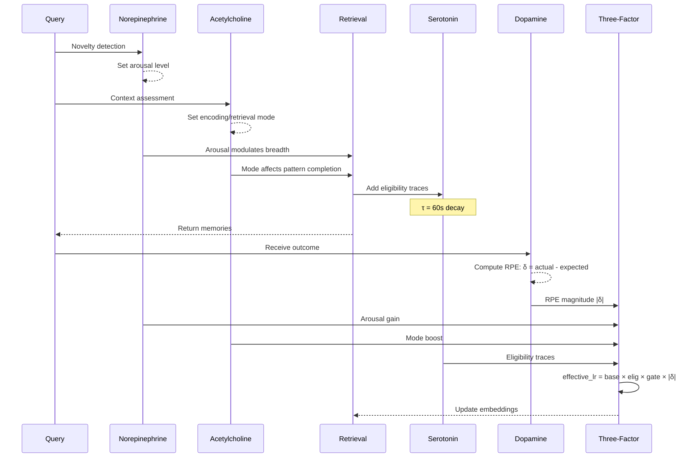

# Neuromodulator Pathways

Complete neural pathway map showing neuromodulator flow and interactions.

## Full Neuromodulator System



## Three-Factor Integration

```mermaid
flowchart LR
    subgraph Factor1["Factor 1: Eligibility"]
        E_FAST[Fast τ=5s]
        E_SLOW[Slow τ=60s]
        E_DECAY[Exponential Decay]
    end

    subgraph Factor2["Factor 2: Neuromod Gate"]
        NE_G[NE × Arousal]
        ACH_G[ACh × Mode]
        SHT_G[5-HT × Mood]
        GATE[Gate = NE × ACh × 5-HT]
    end

    subgraph Factor3["Factor 3: DA Surprise"]
        RPE[|RPE| Magnitude]
        SIGN[Signed PE]
    end

    subgraph Output["Effective LR"]
        LR[base_lr × elig × gate × |RPE|]
    end

    E_FAST --> E_DECAY
    E_SLOW --> E_DECAY
    E_DECAY --> LR

    NE_G --> GATE
    ACH_G --> GATE
    SHT_G --> GATE
    GATE --> LR

    RPE --> LR

    LR --> |"Weight Update"| WEIGHT[Δw]
```

## Signal Flow During Query-Retrieval-Outcome



## Biological Parameters

| System | Parameter | Value | Source |
|--------|-----------|-------|--------|
| DA Tonic | Firing rate | 4-5 Hz | Schultz 1998 |
| DA Phasic | Burst rate | 20-40 Hz | Schultz 1998 |
| NE Baseline | Arousal | 0.5 | Aston-Jones 2005 |
| NE Gain | Range | 0.5-2.0x | Yerkes-Dodson |
| ACh Encoding | Boost | 2.0x | Hasselmo 2006 |
| ACh Retrieval | Boost | 1.2x | BIO-002 fix |
| 5-HT Baseline | Mood | 0.5 | Doya 2002 |
| 5-HT Eligibility | τ | 60s | Temporal credit |
| GABA Sparsity | Target | 20% | Competitive |
