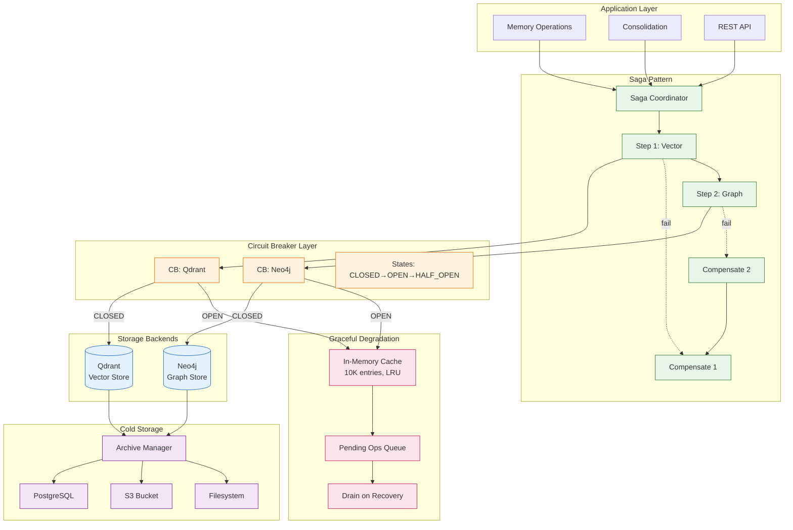
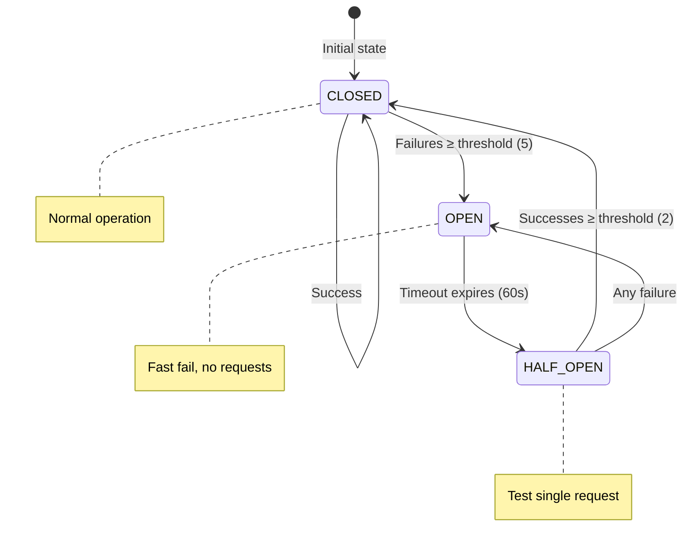
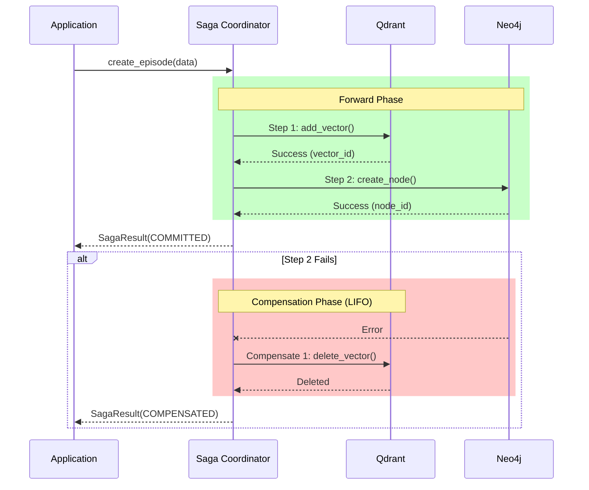
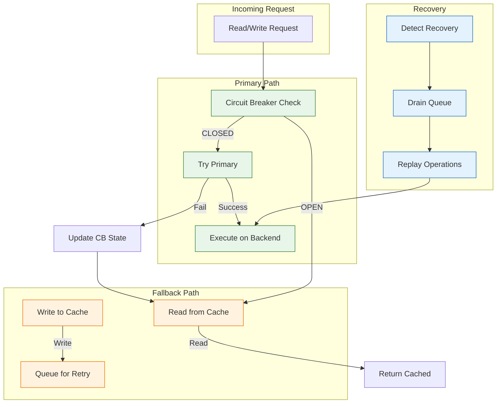
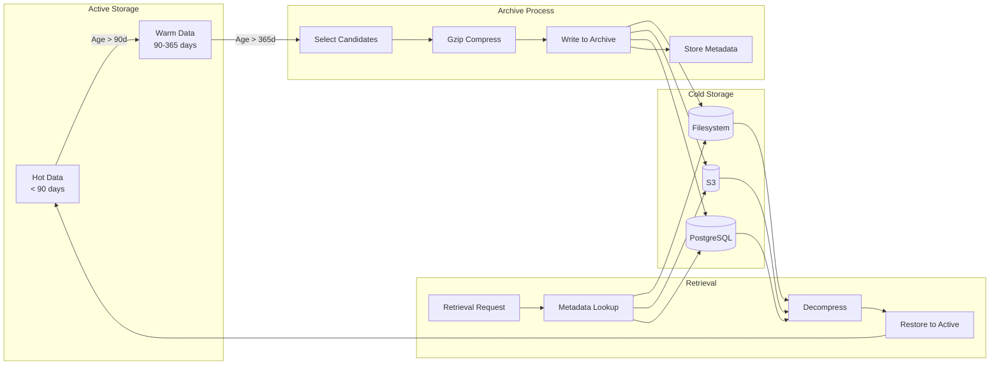
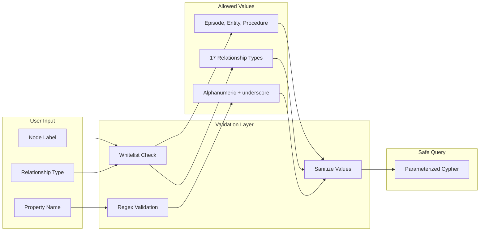
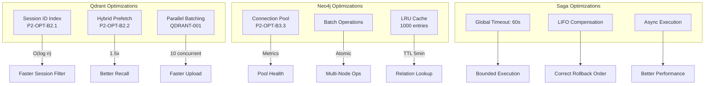

# Storage Resilience Patterns

Complete storage architecture with resilience, saga, and cold storage patterns.

## Full Storage Architecture

## Circuit Breaker States

## Saga Transaction Flow

## Graceful Degradation Flow

## Cold Storage Lifecycle

## Storage Security (P3-SEC-L2)

## Performance Optimizations

## Configuration Reference

| Component | Parameter | Default | Purpose |
|-----------|-----------|---------|---------|
| Circuit Breaker | failure_threshold | 5 | Failures before OPEN |
| Circuit Breaker | success_threshold | 2 | Successes to close |
| Circuit Breaker | reset_timeout | 60s | Time before HALF_OPEN |
| Fallback Cache | max_entries | 10,000 | LRU eviction limit |
| Saga | timeout | 60s | Global saga timeout |
| Qdrant | batch_size | 100 | Upload batch size |
| Qdrant | max_concurrency | 10 | Parallel uploads |
| Neo4j | pool_size | 50 | Connection pool |
| Archive | retention_days | 1825 | 5-year retention |
| Archive | compression | gzip | Compression method |
