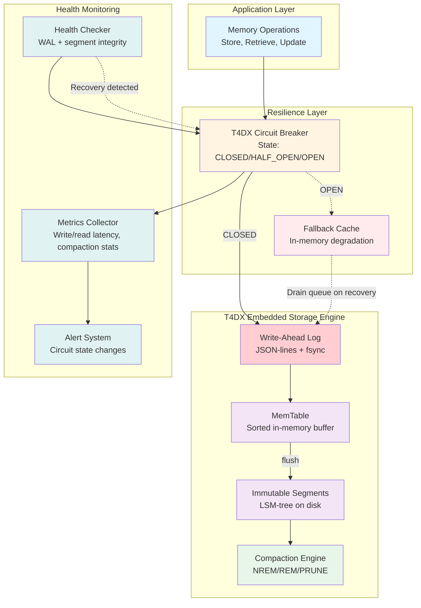
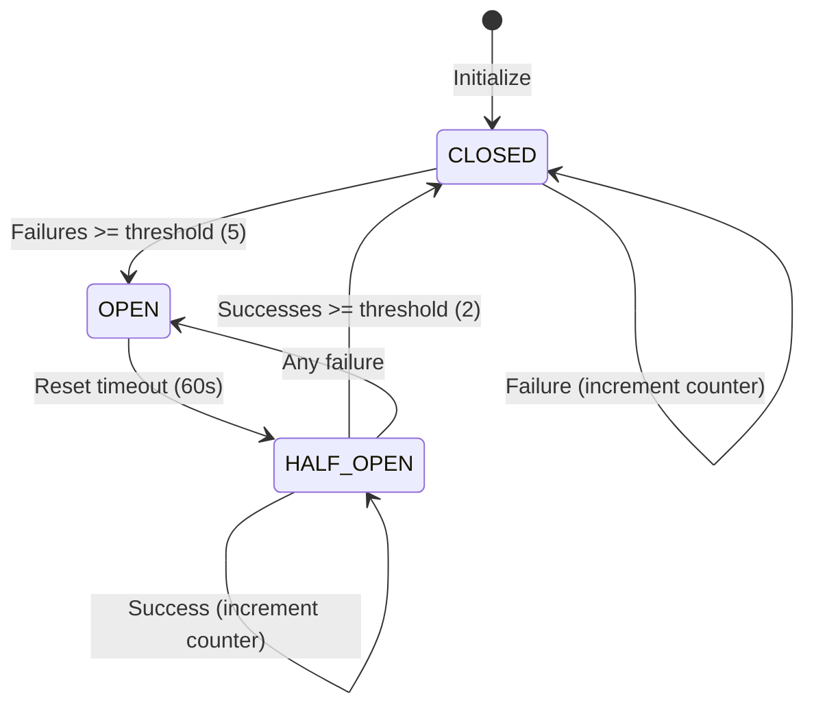
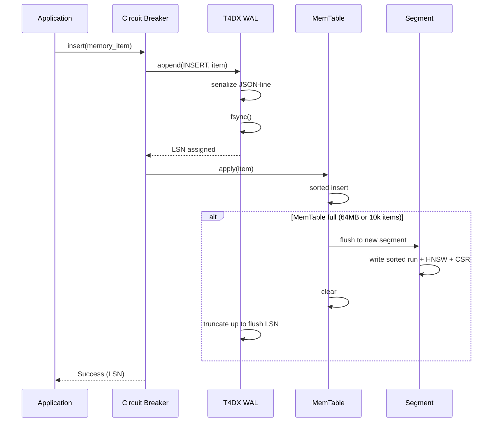
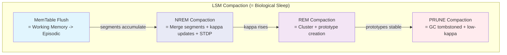
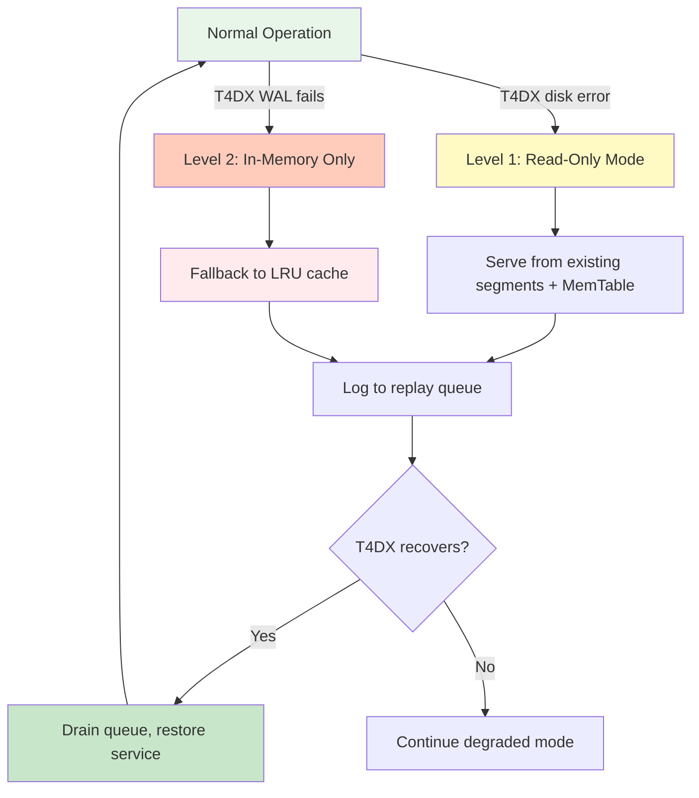

# Storage Resilience - Circuit Breaker and T4DX WAL Durability

## T4DX Storage Resilience Architecture

This diagram illustrates the resilience mechanisms protecting T4DM's embedded T4DX storage engine.



## Circuit Breaker Pattern

### State Machine



### Circuit Breaker Configuration

```python
@dataclass
class CircuitBreakerConfig:
    """Configuration for circuit breaker wrapping T4DX."""
    failure_threshold: int = 5        # Failures before opening
    success_threshold: int = 2        # Successes to close from half-open
    reset_timeout: float = 60.0       # Seconds before trying half-open
    excluded_exceptions: tuple = ()   # Exceptions that don't count
```

### State Descriptions

| State | Behavior | Transitions |
|-------|----------|-------------|
| **CLOSED** | Normal operation, requests flow to T4DX | -> OPEN after 5 failures |
| **OPEN** | Fail fast, redirect to fallback cache | -> HALF_OPEN after 60s timeout |
| **HALF_OPEN** | Testing recovery, limited requests to T4DX | -> CLOSED after 2 successes, -> OPEN on any failure |

## T4DX WAL Durability Model

### Write Path



### Compaction = Consolidation



### Recovery Model

| Failure Mode | T4DX Recovery |
|-------------|---------------|
| Process crash | WAL replay from last flush LSN restores MemTable |
| Disk full | Circuit breaker opens, fallback cache queues writes |
| Corrupt segment | Skip segment, rebuild from WAL + remaining segments |
| Corrupt WAL entry | CRC check fails, truncate WAL at corruption point |
| Power loss | fsync guarantees WAL durability up to last sync |

## Graceful Degradation Strategy

### Degradation Levels



### Degradation Level Details

| Level | T4DX Status | Capabilities | Limitations |
|-------|-------------|--------------|-------------|
| **0: Normal** | Healthy | Full read/write/search/compact | None |
| **1: Read-Only** | Disk errors on write | Read from segments + MemTable | No new writes, no compaction |
| **2: In-Memory** | WAL unavailable | LRU cache (1000 items) | No persistence, limited capacity |

## Health Monitoring

### Health Check Loop

```python
class T4DXHealthChecker:
    """Periodic health checks for T4DX storage engine."""

    def __init__(self, t4dx_engine, check_interval: float = 30.0):
        self.engine = t4dx_engine
        self.check_interval = check_interval

    async def check_wal(self) -> bool:
        """Verify WAL is writable and fsync works."""
        try:
            test_lsn = await self.engine.wal.append_test_entry()
            return test_lsn is not None
        except Exception:
            return False

    async def check_segments(self) -> bool:
        """Verify segment files are readable."""
        try:
            for seg in self.engine.segments:
                if not seg.verify_checksum():
                    return False
            return True
        except Exception:
            return False
```

## Configuration

```python
# Circuit breaker config (wraps T4DX)
CIRCUIT_BREAKER_CONFIG = CircuitBreakerConfig(
    failure_threshold=5,
    success_threshold=2,
    reset_timeout=60.0,
)

# T4DX WAL config
WAL_CONFIG = {
    "format": "json-lines",
    "fsync": True,
    "max_segment_size": "64MB",
    "truncate_on_flush": True,
}

# Fallback cache config
FALLBACK_CONFIG = {
    "max_size": 1000,
    "max_queue_size": 10000,
    "drain_batch_size": 100,
}

# Health check config
HEALTH_CONFIG = {
    "check_interval_seconds": 30.0,
    "timeout_seconds": 5.0,
    "alert_threshold": 3,
}
```

## Performance Impact

| Resilience Feature | Latency Overhead | Memory Overhead | CPU Overhead |
|--------------------|------------------|-----------------|--------------|
| Circuit Breaker | <100us | ~100 bytes | Negligible |
| T4DX WAL fsync | ~1-5ms per write | ~64MB (WAL buffer) | ~2% |
| Fallback Cache | <50us | ~1MB (1000 items) | ~5% |
| Health Checks | 0 (async) | ~10KB | ~1% |
| **Total** | **<5ms** | **~66MB** | **~8%** |

## Resilience Pattern Summary

| Pattern | Purpose | Failure Mode | Recovery |
|---------|---------|--------------|----------|
| **Circuit Breaker** | Fast failure detection for T4DX | 5 consecutive failures | 60s timeout -> 2 successes |
| **WAL + fsync** | Durability guarantee | Process crash | WAL replay from last flush LSN |
| **LSM Compaction** | Segment management + consolidation | Corrupt segment | Rebuild from WAL |
| **Fallback Cache** | Graceful degradation | T4DX unavailable | Queue replay on recovery |
| **Health Checks** | Proactive monitoring | Slow degradation | Alert before failure |
