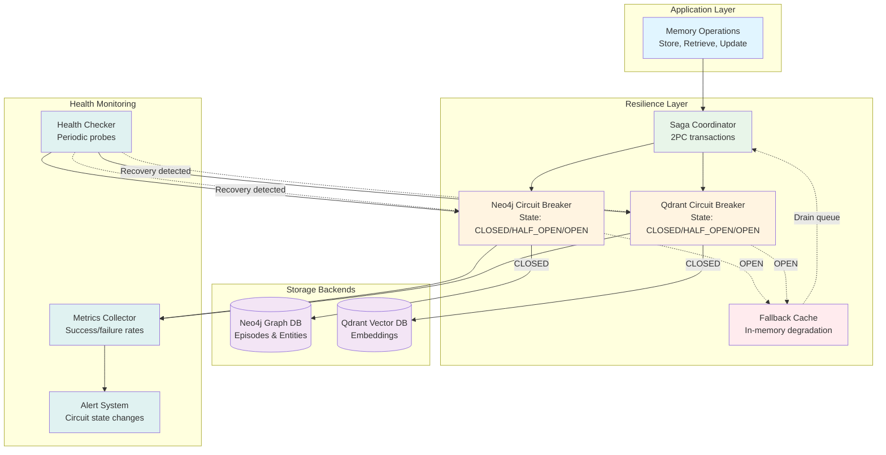
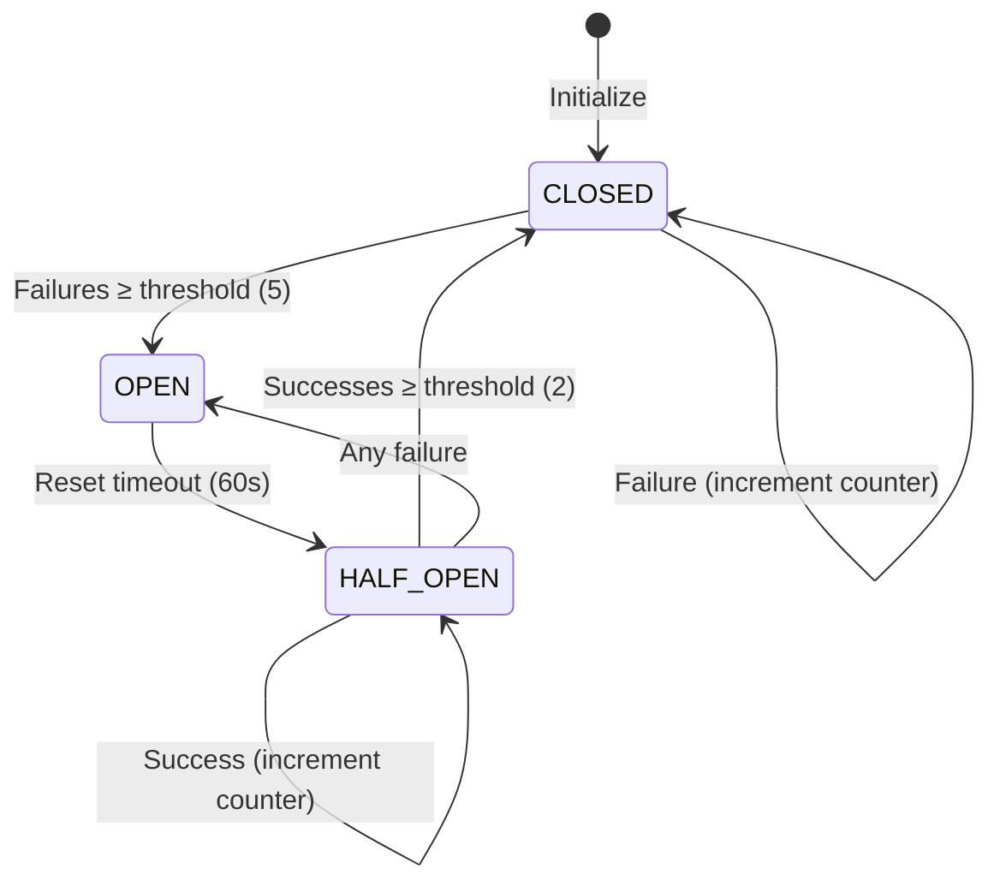
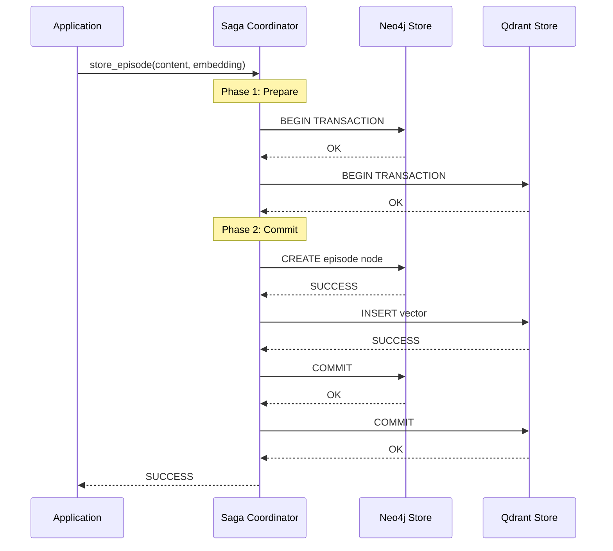
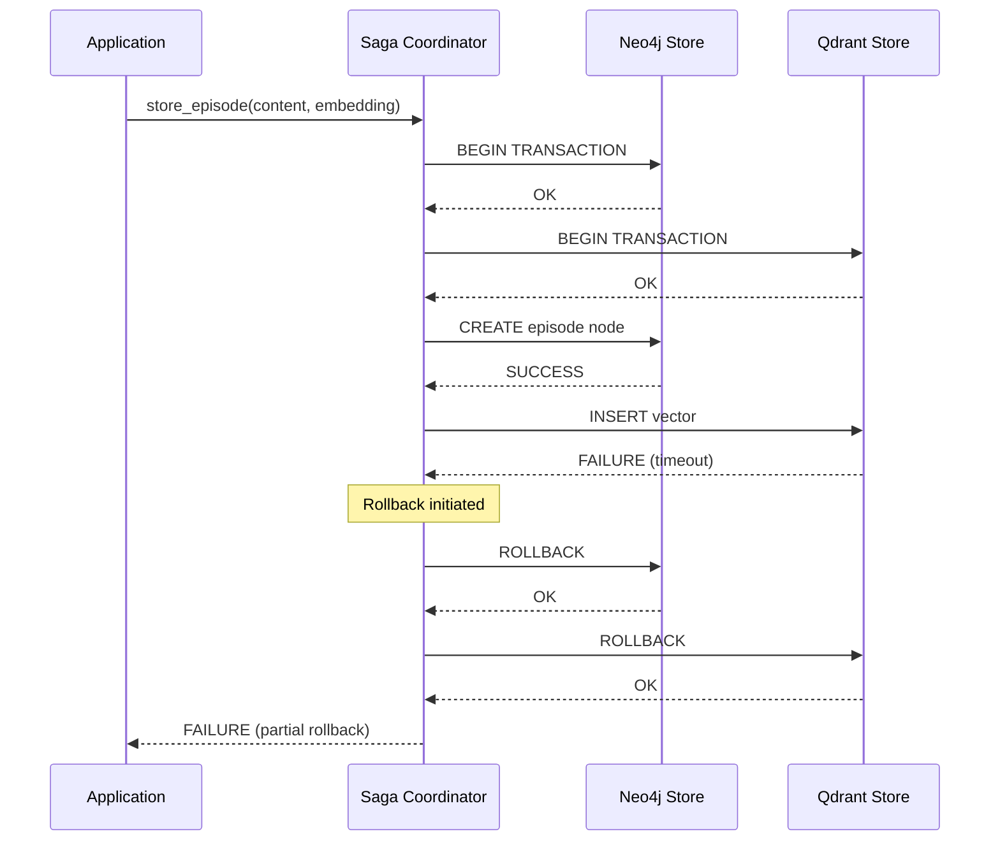
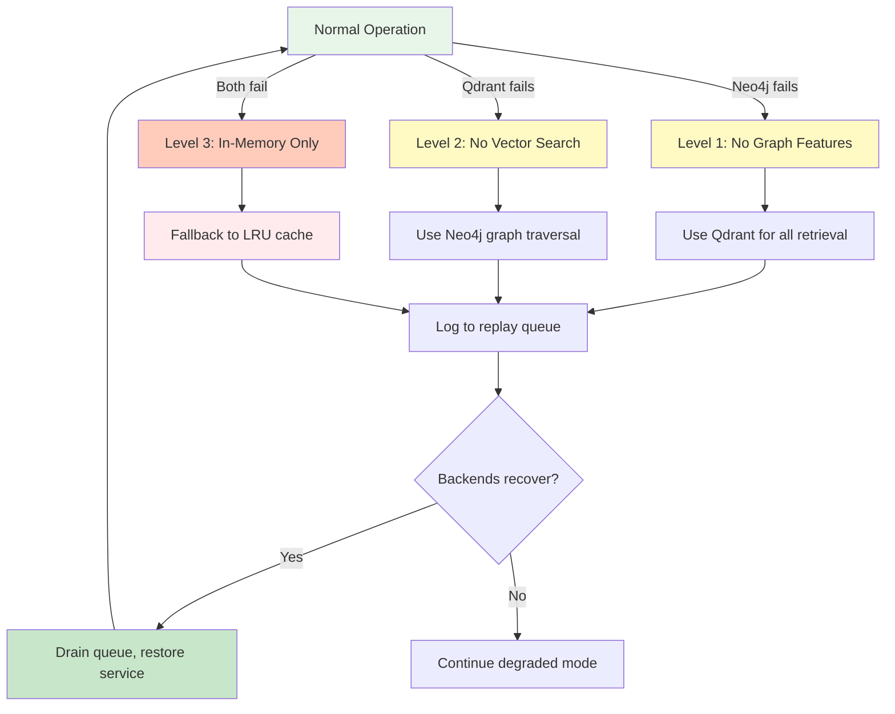

# Storage Resilience - Circuit Breaker, Saga, and Graceful Degradation

## Storage Backend Resilience Patterns

This diagram illustrates the resilience mechanisms protecting World Weaver's storage operations.



## Circuit Breaker Pattern

### State Machine



### Circuit Breaker Configuration

```python
@dataclass
class CircuitBreakerConfig:
    """Configuration for circuit breaker."""
    failure_threshold: int = 5        # Failures before opening
    success_threshold: int = 2        # Successes to close from half-open
    reset_timeout: float = 60.0       # Seconds before trying half-open
    excluded_exceptions: tuple = ()   # Exceptions that don't count
```

### State Descriptions

| State | Behavior | Transitions |
|-------|----------|-------------|
| **CLOSED** | Normal operation, requests flow through | → OPEN after 5 failures |
| **OPEN** | Fail fast, reject immediately | → HALF_OPEN after 60s timeout |
| **HALF_OPEN** | Testing recovery, limited requests | → CLOSED after 2 successes<br/>→ OPEN on any failure |

### Usage Example

```python
from ww.storage import CircuitBreaker, CircuitBreakerConfig

# Create circuit breaker for Neo4j
neo4j_cb = CircuitBreaker(
    name="neo4j",
    config=CircuitBreakerConfig(
        failure_threshold=5,
        success_threshold=2,
        reset_timeout=60.0,
        excluded_exceptions=(ValidationError,)
    )
)

# Protect operation with circuit breaker
@neo4j_cb.protect
async def query_neo4j(cypher: str):
    async with neo4j_driver.session() as session:
        result = await session.run(cypher)
        return await result.data()

# Use the protected function
try:
    data = await query_neo4j("MATCH (n:Episode) RETURN n LIMIT 10")
except CircuitBreakerError as e:
    logger.warning(f"Neo4j unavailable: {e}")
    # Fall back to cache
    data = fallback_cache.get("recent_episodes")
```

## Saga Pattern (Distributed Transactions)

### Two-Phase Commit Flow



### Saga with Rollback



### Saga Coordinator Implementation

```python
class SagaCoordinator:
    """
    Coordinates distributed transactions across Neo4j and Qdrant.

    Ensures atomicity: Either both stores succeed or both rollback.
    """

    async def store_episode_saga(
        self,
        episode: Episode,
        embedding: list[float]
    ) -> bool:
        """Store episode in both Neo4j and Qdrant atomically."""

        neo4j_tx = None
        qdrant_prepared = False

        try:
            # Phase 1: Prepare
            neo4j_tx = await self.neo4j_store.begin_transaction()
            await self.qdrant_store.prepare(episode.id, embedding)
            qdrant_prepared = True

            # Phase 2: Execute
            await neo4j_tx.run(
                "CREATE (e:Episode $props)",
                props=episode.to_dict()
            )
            await self.qdrant_store.commit(episode.id)

            # Phase 3: Commit
            await neo4j_tx.commit()

            return True

        except Exception as e:
            logger.error(f"Saga failed: {e}")

            # Rollback
            if neo4j_tx:
                await neo4j_tx.rollback()
            if qdrant_prepared:
                await self.qdrant_store.rollback(episode.id)

            return False
```

## Graceful Degradation Strategy

### Degradation Levels



### Degradation Level Details

| Level | Neo4j | Qdrant | Capabilities | Limitations |
|-------|-------|--------|--------------|-------------|
| **0: Normal** | ✓ | ✓ | Full system | None |
| **1: No Graph** | ✗ | ✓ | Vector search, no graph traversal | No entity relationships, no temporal queries |
| **2: No Vector** | ✓ | ✗ | Graph queries, no semantic search | No similarity search, exact match only |
| **3: In-Memory** | ✗ | ✗ | LRU cache (1000 items) | No persistence, limited capacity |

### Fallback Cache Implementation

```python
from collections import OrderedDict
from dataclasses import dataclass
from typing import Optional

@dataclass
class FallbackCache:
    """In-memory LRU cache for degraded mode."""

    max_size: int = 1000
    _cache: OrderedDict = field(default_factory=OrderedDict)
    _pending_queue: list = field(default_factory=list)

    def get(self, key: str) -> Optional[Any]:
        """Get item from cache (LRU)."""
        if key not in self._cache:
            return None

        # Move to end (most recently used)
        self._cache.move_to_end(key)
        return self._cache[key]

    def set(self, key: str, value: Any) -> None:
        """Set item in cache, evict if full."""
        if key in self._cache:
            self._cache.move_to_end(key)
        else:
            if len(self._cache) >= self.max_size:
                # Evict least recently used
                self._cache.popitem(last=False)

        self._cache[key] = value

        # Queue for replay when backend recovers
        self._pending_queue.append({
            "operation": "set",
            "key": key,
            "value": value,
            "timestamp": datetime.now()
        })

    async def drain_to_backends(
        self,
        neo4j_store: Neo4jStore,
        qdrant_store: QdrantStore
    ) -> int:
        """Drain pending queue to backends on recovery."""
        drained = 0

        for operation in self._pending_queue:
            try:
                if operation["operation"] == "set":
                    await neo4j_store.create_episode(operation["value"])
                    await qdrant_store.insert(
                        operation["key"],
                        operation["value"]["embedding"]
                    )
                    drained += 1
            except Exception as e:
                logger.error(f"Failed to drain operation: {e}")
                break

        # Clear drained operations
        self._pending_queue = self._pending_queue[drained:]

        return drained
```

## Health Monitoring

### Health Check Loop

```python
class StorageHealthChecker:
    """Periodic health checks for storage backends."""

    def __init__(
        self,
        neo4j_store: Neo4jStore,
        qdrant_store: QdrantStore,
        check_interval: float = 30.0
    ):
        self.neo4j_store = neo4j_store
        self.qdrant_store = qdrant_store
        self.check_interval = check_interval
        self._running = False

    async def start(self):
        """Start health check loop."""
        self._running = True

        while self._running:
            await asyncio.sleep(self.check_interval)

            # Check Neo4j
            neo4j_healthy = await self._check_neo4j()
            if neo4j_healthy:
                logger.info("Neo4j health check: OK")
            else:
                logger.warning("Neo4j health check: FAILED")

            # Check Qdrant
            qdrant_healthy = await self._check_qdrant()
            if qdrant_healthy:
                logger.info("Qdrant health check: OK")
            else:
                logger.warning("Qdrant health check: FAILED")

    async def _check_neo4j(self) -> bool:
        """Ping Neo4j with simple query."""
        try:
            async with self.neo4j_store.session() as session:
                result = await session.run("RETURN 1 AS n")
                data = await result.single()
                return data["n"] == 1
        except Exception as e:
            logger.error(f"Neo4j health check failed: {e}")
            return False

    async def _check_qdrant(self) -> bool:
        """Ping Qdrant with collection info."""
        try:
            info = await self.qdrant_store.get_collection_info()
            return info.status == "green"
        except Exception as e:
            logger.error(f"Qdrant health check failed: {e}")
            return False
```

## Metrics Collection

### Circuit Breaker Metrics

```python
@dataclass
class CircuitBreakerMetrics:
    """Metrics for a circuit breaker."""

    name: str
    state: CircuitState
    total_requests: int = 0
    successful_requests: int = 0
    failed_requests: int = 0
    rejected_requests: int = 0  # Rejected when OPEN
    state_transitions: int = 0
    time_in_closed: float = 0.0
    time_in_open: float = 0.0
    time_in_half_open: float = 0.0
    last_failure_time: Optional[datetime] = None
    last_success_time: Optional[datetime] = None

    @property
    def success_rate(self) -> float:
        """Calculate success rate."""
        total = self.successful_requests + self.failed_requests
        return self.successful_requests / total if total > 0 else 0.0

    @property
    def availability(self) -> float:
        """Calculate availability (not rejected)."""
        total = self.total_requests
        available = total - self.rejected_requests
        return available / total if total > 0 else 1.0

    def to_dict(self) -> dict:
        """Export metrics as dictionary."""
        return {
            "name": self.name,
            "state": self.state.value,
            "total_requests": self.total_requests,
            "successful_requests": self.successful_requests,
            "failed_requests": self.failed_requests,
            "rejected_requests": self.rejected_requests,
            "success_rate": round(self.success_rate, 4),
            "availability": round(self.availability, 4),
            "state_transitions": self.state_transitions,
            "time_in_closed_seconds": round(self.time_in_closed, 2),
            "time_in_open_seconds": round(self.time_in_open, 2),
            "time_in_half_open_seconds": round(self.time_in_half_open, 2),
        }
```

## Resilience Pattern Summary

| Pattern | Purpose | Failure Mode | Recovery |
|---------|---------|--------------|----------|
| **Circuit Breaker** | Fast failure detection | 5 consecutive failures | 60s timeout → 2 successes |
| **Saga** | Atomic dual-store | Partial commit | Automatic rollback |
| **Fallback Cache** | Graceful degradation | Both backends down | Queue replay on recovery |
| **Health Checks** | Proactive monitoring | Slow degradation | Alert before failure |
| **Retry** | Transient fault tolerance | Network blips | Exponential backoff |

## Configuration

```python
# Circuit breaker config
CIRCUIT_BREAKER_CONFIG = {
    "neo4j": CircuitBreakerConfig(
        failure_threshold=5,
        success_threshold=2,
        reset_timeout=60.0,
    ),
    "qdrant": CircuitBreakerConfig(
        failure_threshold=5,
        success_threshold=2,
        reset_timeout=60.0,
    ),
}

# Saga config
SAGA_CONFIG = {
    "timeout_seconds": 30.0,
    "max_retries": 3,
    "rollback_timeout": 10.0,
}

# Fallback cache config
FALLBACK_CONFIG = {
    "max_size": 1000,
    "max_queue_size": 10000,
    "drain_batch_size": 100,
}

# Health check config
HEALTH_CONFIG = {
    "check_interval_seconds": 30.0,
    "timeout_seconds": 5.0,
    "alert_threshold": 3,  # Alert after 3 consecutive failures
}
```

## Performance Impact

| Resilience Feature | Latency Overhead | Memory Overhead | CPU Overhead |
|--------------------|------------------|-----------------|--------------|
| Circuit Breaker | <100μs | ~100 bytes/breaker | Negligible |
| Saga Coordinator | ~1-5ms | ~1KB/transaction | ~1% |
| Fallback Cache | <50μs | ~1MB (1000 items) | ~5% |
| Health Checks | 0 (async) | ~10KB | ~1% |
| **Total** | **<5ms** | **~2MB** | **~7%** |
