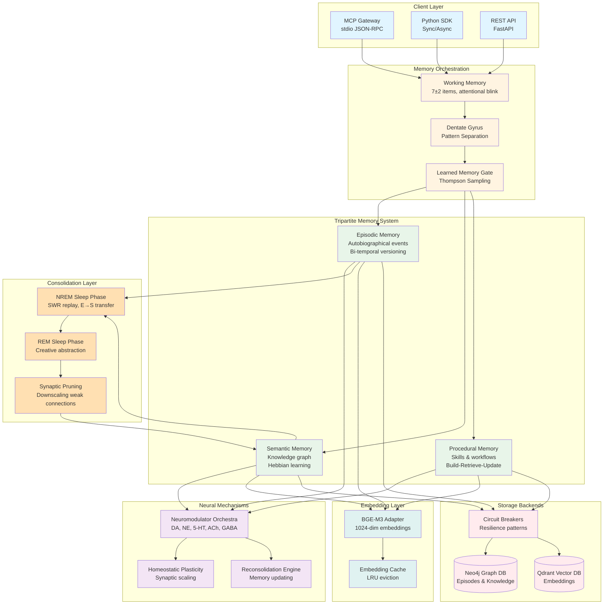

# World Weaver - System Architecture

## High-Level System Overview

This diagram shows the complete World Weaver system architecture, from client interfaces through memory subsystems to storage backends.

## Component Descriptions

### Client Layer
- **MCP Gateway**: stdio-based JSON-RPC 2.0 server for Claude Code integration
- **Python SDK**: Synchronous and asynchronous clients with context managers
- **REST API**: FastAPI-based HTTP interface with OpenAPI documentation

### Memory Orchestration
- **Working Memory**: Capacity-limited (7±2 items) with attentional blink modeling
- **Dentate Gyrus**: Sparse pattern separation to distinguish similar inputs
- **Learned Memory Gate**: Online Bayesian logistic regression deciding what to store

### Tripartite Memory System
- **Episodic Memory**: Autobiographical events with T_ref/T_sys bi-temporal versioning
- **Semantic Memory**: Entity-relationship graph with Hebbian strengthening on co-retrieval
- **Procedural Memory**: Skill storage using Memp framework (Build-Retrieve-Update)

### Neural Mechanisms
- **Neuromodulator Orchestra**: Dopamine (RPE), Norepinephrine (arousal), Serotonin (credit assignment), Acetylcholine (encoding/retrieval mode), GABA (inhibition)
- **Homeostatic Plasticity**: Synaptic scaling to maintain network stability
- **Reconsolidation Engine**: Dopamine-modulated memory updating during retrieval

### Consolidation Layer
- **NREM Sleep Phase**: Sharp-wave ripple (SWR) replay transfers episodes to semantic memory
- **REM Sleep Phase**: Creative abstraction finds patterns across memory clusters
- **Synaptic Pruning**: Downscaling weak connections during sleep consolidation

### Storage Backends
- **Neo4j**: Graph database for episodes, entities, and relationships
- **Qdrant**: Vector database for semantic similarity search
- **Circuit Breakers**: Resilience patterns with graceful degradation

### Embedding Layer
- **BGE-M3 Adapter**: Local 1024-dimensional embedding generation
- **Embedding Cache**: LRU cache to minimize redundant computations

## Key Data Flows

1. **Memory Storage**: Client → Working Memory → Pattern Separation → Learned Gate → Tripartite Memory → Storage Backends
2. **Memory Retrieval**: Client → Query → Vector/Graph Search → Neuromodulator Weighting → Results
3. **Consolidation**: NREM (replay) → REM (abstraction) → Prune → Updated Semantic Memory
4. **Learning**: Retrieval + Outcome → Neuromodulators → Gate/Scorer Update → Improved Future Performance

## Key Metrics

| Component | Metric | Target |
|-----------|--------|--------|
| Learned Gate | Decision latency | <5ms |
| Working Memory | Capacity | 7±2 items |
| Pattern Separation | Sparsity | 2-5% active |
| NREM Consolidation | SWR compression | 10-20x |
| Circuit Breaker | Failure threshold | 5 failures |
| Embedding Cache | Hit rate | >80% |

## Technology Stack

- **Languages**: Python 3.11+
- **Databases**: Neo4j Community 5.x, Qdrant 1.7+
- **ML**: PyTorch 2.x, sentence-transformers, BGE-M3
- **API**: FastAPI, Pydantic 2.x
- **MCP**: FastMCP 0.4+, Anthropic MCP SDK
- **Testing**: pytest, 1259 tests, 79% coverage
