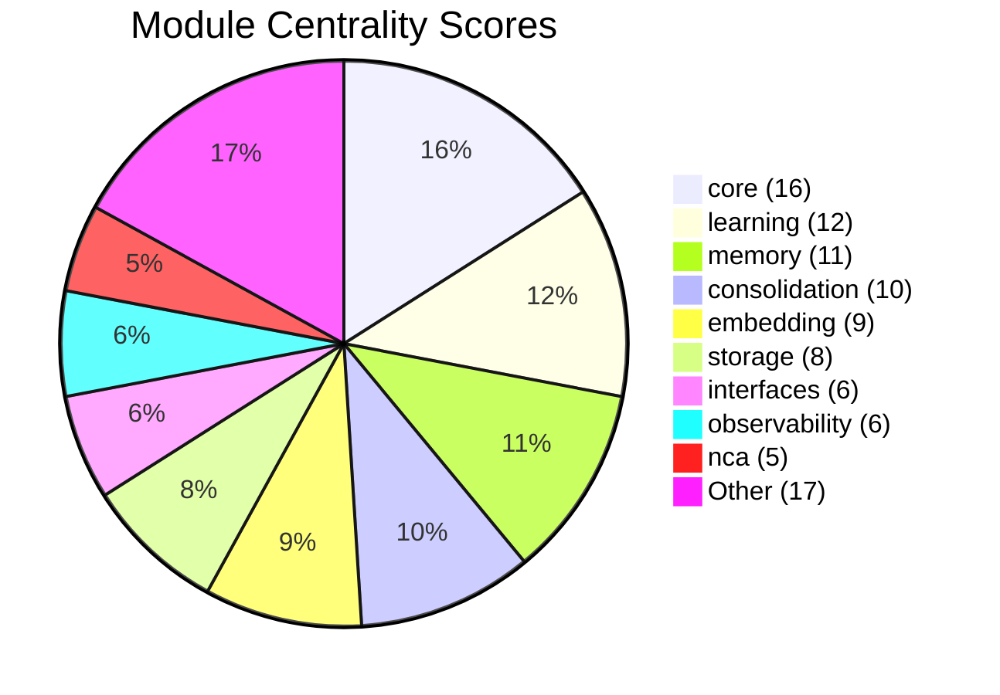
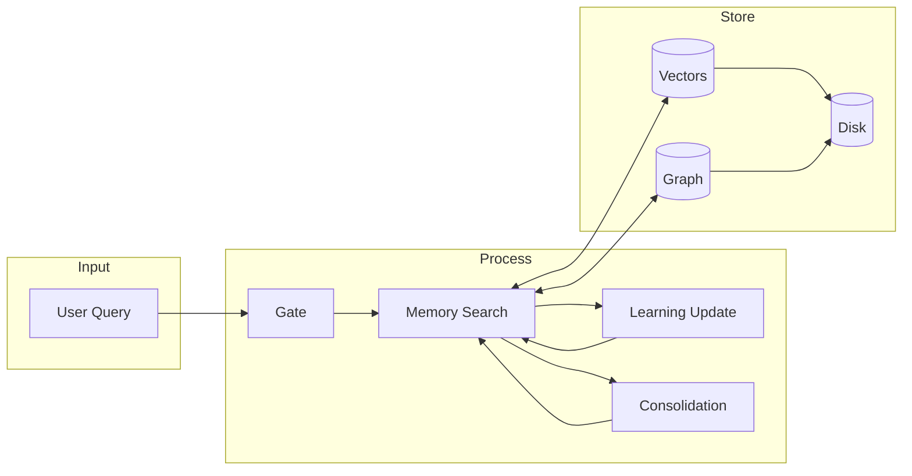

# World Weaver System Network Map

Giant interconnection diagram showing all 23 modules and their relationships.

## Complete System Network

```mermaid
flowchart TB
    subgraph External["External Interfaces"]
        direction LR
        REST[REST API<br/>13 files]
        WS[WebSocket<br/>4 channels]
        CLI[CLI<br/>2 cmds]
        SDK[SDK<br/>3 fns]
        MCP[MCP Tools<br/>17 tools]
    end

    subgraph CoreHub["Core Hub (Centrality: 16)"]
        CORE[core/<br/>Config, Types, Validation]
    end

    subgraph Tripartite["Tripartite Memory System"]
        direction TB
        subgraph Episodic["Episodic (3129 lines)"]
            EP_MAIN[EpisodicMemory]
            EP_CLUSTER[ClusterIndex]
            EP_SPARSE[SparseIndex]
            EP_BUFFER[BufferManager]
        end
        subgraph Semantic["Semantic (1115 lines)"]
            SEM_MAIN[SemanticMemory]
            SEM_ACTR[ACT-R Activation]
            SEM_HEBB[Hebbian Learning]
        end
        subgraph Procedural["Procedural (973 lines)"]
            PROC_MAIN[ProceduralMemory]
            PROC_EXEC[Execution Tracking]
        end
        UNIFIED[UnifiedMemoryService]
    end

    subgraph NCA["Neural Cognitive Architecture (30 files)"]
        direction TB
        subgraph Field["Neural Field"]
            NF_SOLVER[PDE Solver]
            NF_COUPLING[NT Coupling]
            NF_ATTRACTOR[Attractors]
        end
        subgraph Hinton["Hinton Implementations"]
            FF[Forward-Forward]
            CAPS[Capsule Networks]
            ENERGY[Energy Landscape]
        end
        subgraph Bio["Biological Systems"]
            HIPPO[Hippocampus]
            OSC[Oscillators]
            GLYMP[Glymphatic]
            ADENO[Adenosine]
        end
        subgraph Neuromod["Neuromodulators"]
            VTA[VTA Dopamine]
            RAPHE[Raphe 5-HT]
            LC[LC NE]
            NBM[NBM ACh]
        end
    end

    subgraph Learning["Learning System (24 files)"]
        direction TB
        THREE_FACTOR[Three-Factor Rule]
        ELIG[Eligibility Traces]
        DA_SYS[Dopamine System]
        RECON[Reconsolidation]
        SCORER[Learned Scorer]
        ORCH[Neuromod Orchestra]
    end

    subgraph Consolidation["Consolidation (6 files)"]
        direction TB
        SLEEP[SleepConsolidation]
        NREM[NREM Replay]
        REM[REM Abstraction]
        PRUNE[Pruning]
        FES[FES Consolidator]
        PARALLEL[ParallelExecutor]
    end

    subgraph Storage["Storage Layer (6 files)"]
        direction TB
        QDRANT[(Qdrant<br/>Vector)]
        NEO4J[(Neo4j<br/>Graph)]
        SAGA[Saga Pattern]
        CB[Circuit Breaker]
        ARCHIVE[Cold Storage]
    end

    subgraph Persistence["Persistence (6 files)"]
        direction TB
        WAL[Write-Ahead Log]
        CHECKPOINT[Checkpointing]
        RECOVERY[Recovery]
        SHUTDOWN[Graceful Shutdown]
    end

    subgraph Embedding["Embedding (9 files)"]
        BGE[BGE-M3 Provider]
        SPARSE_ENC[Sparse Encoder]
    end

    subgraph Observability["Observability (6 files)"]
        TRACE[OpenTelemetry]
        METRICS[Prometheus]
        AUDIT[Audit Logging]
    end

    %% External to Core
    REST --> CORE
    WS --> CORE
    CLI --> CORE
    SDK --> CORE
    MCP --> CORE

    %% Core to Major Systems
    CORE --> Tripartite
    CORE --> Learning
    CORE --> Storage
    CORE --> Embedding

    %% Memory Internal
    EP_MAIN --> EP_CLUSTER
    EP_MAIN --> EP_SPARSE
    EP_MAIN --> EP_BUFFER
    EP_MAIN --> UNIFIED
    SEM_MAIN --> SEM_ACTR
    SEM_MAIN --> SEM_HEBB
    SEM_MAIN --> UNIFIED
    PROC_MAIN --> PROC_EXEC
    PROC_MAIN --> UNIFIED

    %% Memory to Storage
    EP_MAIN --> QDRANT
    EP_MAIN --> NEO4J
    SEM_MAIN --> QDRANT
    SEM_MAIN --> NEO4J
    PROC_MAIN --> QDRANT

    %% Memory to Embedding
    EP_MAIN --> BGE
    SEM_MAIN --> BGE
    PROC_MAIN --> BGE

    %% NCA Internal
    NF_SOLVER --> NF_COUPLING
    NF_COUPLING --> NF_ATTRACTOR
    NF_SOLVER --> VTA
    NF_SOLVER --> RAPHE
    NF_SOLVER --> LC
    NF_SOLVER --> NBM

    %% NCA to Learning
    VTA --> DA_SYS
    VTA --> ORCH
    RAPHE --> ORCH
    LC --> ORCH
    NBM --> ORCH

    %% Learning Internal
    ORCH --> THREE_FACTOR
    ELIG --> THREE_FACTOR
    DA_SYS --> THREE_FACTOR
    THREE_FACTOR --> RECON
    THREE_FACTOR --> SCORER

    %% Learning to Memory
    RECON --> EP_MAIN
    SCORER --> EP_MAIN

    %% Consolidation
    Tripartite --> SLEEP
    SLEEP --> NREM
    SLEEP --> REM
    SLEEP --> PRUNE
    NREM --> FES
    REM --> SEM_MAIN
    PRUNE --> NEO4J
    FES --> EP_MAIN
    PARALLEL --> SLEEP

    %% Storage Internal
    QDRANT --> CB
    NEO4J --> CB
    SAGA --> QDRANT
    SAGA --> NEO4J
    CB --> ARCHIVE

    %% Persistence
    Storage --> WAL
    WAL --> CHECKPOINT
    CHECKPOINT --> RECOVERY
    RECOVERY --> SHUTDOWN

    %% Observability
    REST --> TRACE
    Storage --> METRICS
    CORE --> AUDIT

    %% Styling
    classDef core fill:#ff9ff3,stroke:#333,stroke-width:3px
    classDef memory fill:#54a0ff,stroke:#333
    classDef nca fill:#ff6b6b,stroke:#333
    classDef learning fill:#5f27cd,stroke:#333,color:#fff
    classDef storage fill:#10ac84,stroke:#333
    classDef external fill:#ffeaa7,stroke:#333

    class CORE core
    class EP_MAIN,SEM_MAIN,PROC_MAIN,UNIFIED memory
    class NF_SOLVER,VTA,FF,CAPS nca
    class THREE_FACTOR,ORCH,RECON learning
    class QDRANT,NEO4J,WAL storage
    class REST,WS,CLI,SDK,MCP external
```

## Module Centrality Ranking

## Data Flow Summary

## Key Statistics

| Metric | Value |
|--------|-------|
| Total Python Files | 206 |
| Total Modules | 23 |
| Total Lines (src) | ~50,000 |
| Total Tests | 257 files |
| Total Docs | 261 files |
| Documentation Words | 575,816 |
| Test Coverage | 79% |
| Hinton Score | 9.0/10 |
| CompBio Score | 92/100 |

## Legend

| Color | Meaning |
|-------|---------|
| Pink | Core hub (highest centrality) |
| Blue | Memory systems |
| Red | Neural cognitive architecture |
| Purple | Learning systems |
| Green | Storage & persistence |
| Yellow | External interfaces |
