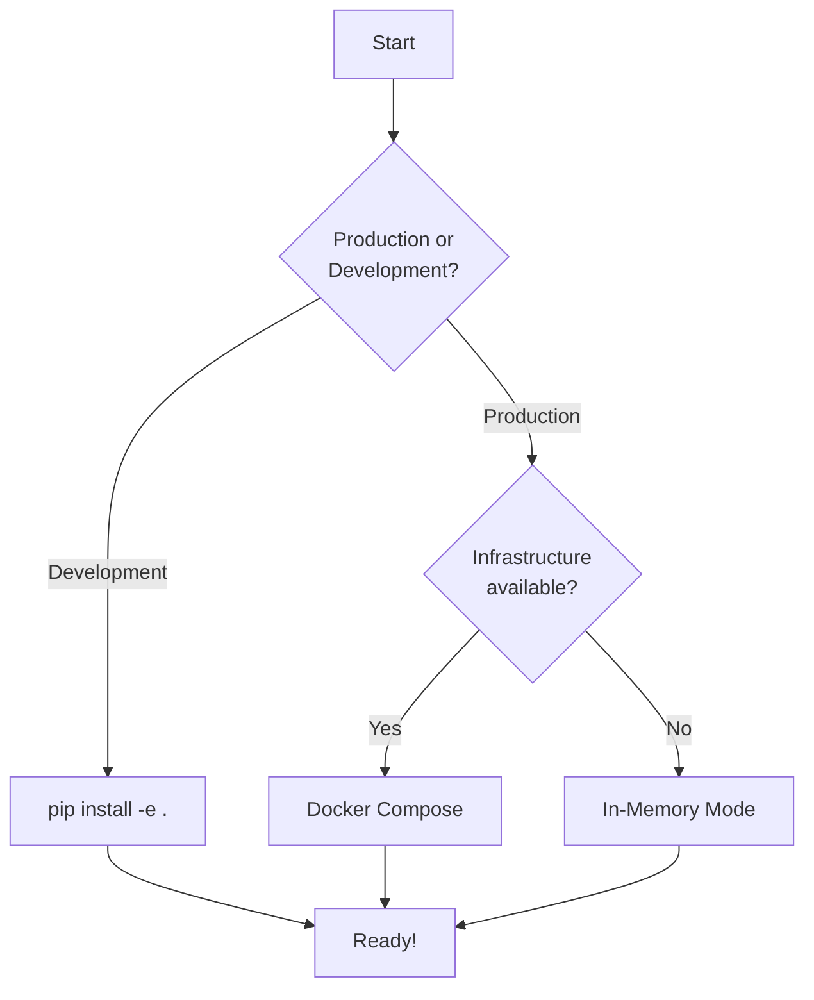

# Getting Started

Welcome to World Weaver! This section will help you get up and running quickly.

## Installation Options

| Method | Best For | Documentation |
|--------|----------|---------------|
| **pip** | Most users | [Installation Guide](installation.md) |
| **Docker** | Production deployments | [Installation Guide](installation.md#docker) |
| **Development** | Contributors | [Installation Guide](installation.md#development) |

## Quick Links

-   :material-download: **[Installation](installation.md)**

    ---

    Install World Weaver and its dependencies

-   :material-rocket-launch: **[Quick Start](quickstart.md)**

    ---

    Your first memory operations in 5 minutes

-   :material-cog: **[Configuration](configuration.md)**

    ---

    YAML config, environment variables, and settings

## Prerequisites

- **Python**: 3.10 or higher
- **Infrastructure** (optional):
    - Neo4j 5.x for graph storage
    - Qdrant 1.7+ for vector storage
- **GPU** (optional): CUDA-compatible GPU for embedding acceleration

## Choosing Your Setup

