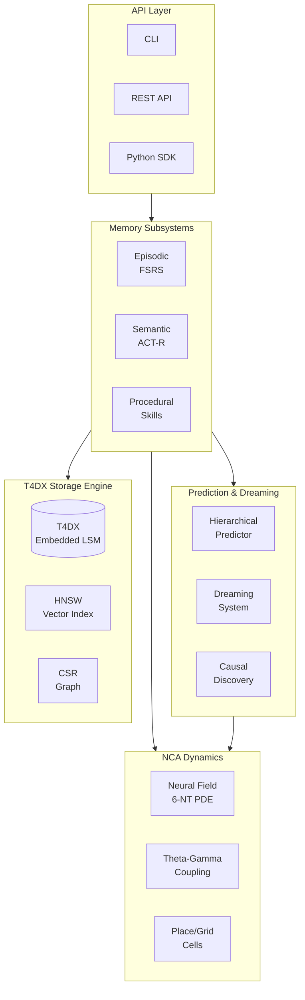

# T4DM

**Biologically-inspired memory for AI**

[](https://github.com/astoreyai/t4d/releases)
[](https://github.com/astoreyai/ww)
[](https://github.com/astoreyai/ww)

T4DM is a modular framework implementing tripartite neural memory (episodic, semantic, procedural) with cognitive consolidation, neuromodulator dynamics, FSRS-based spaced repetition, and world model prediction.

## Features

<div class="grid cards" markdown>

-   :brain: **Tripartite Memory**

    ---

    Episodic, Semantic, and Procedural memory subsystems inspired by cognitive neuroscience

-   :dna: **Biologically Plausible**

    ---

    6-neurotransmitter PDE system with theta-gamma coupling and place/grid cells

-   :crystal_ball: **World Model Prediction**

    ---

    JEPA-style latent prediction with hierarchical multi-timescale horizons

-   :zap: **Production Ready**

    ---

    REST API, Python SDK, CLI, and comprehensive test coverage

</div>

## Quick Start

=== "Python API"

    ```python
    from ww import memory

    # Store content
    await memory.store("User prefers dark mode interfaces")

    # Recall similar memories
    results = await memory.recall("interface preferences")
    for r in results:
        print(f"{r.memory_type}: {r.content}")
    ```

=== "CLI"

    ```bash
    # Store a memory
    ww store "Learned about decorators in Python"

    # Recall memories
    ww recall "Python decorators"

    # Show system status
    ww status
    ```

=== "REST API"

    ```bash
    # Create episode
    curl -X POST http://localhost:8765/api/v1/episodes \
      -H "Content-Type: application/json" \
      -d '{"content": "Learning about T4DM"}'

    # Search memories
    curl -X POST http://localhost:8765/api/v1/episodes/recall \
      -H "Content-Type: application/json" \
      -d '{"query": "T4DM", "limit": 5}'
    ```

## Architecture



## Version 0.4.0 Highlights

### Advanced Neuroscience Integration

- **Hierarchical Prediction**: Fast (1-step), medium (5-step), slow (15-step) timescales
- **Causal Discovery**: Graph-based counterfactual learning
- **Place/Grid Cells**: Nobel Prize 2014 mechanisms (O'Keefe, Moser)
- **Theta-Gamma Coupling**: Working memory slots (7±2 from Miller's Law)

### Previous Releases

| Version | Highlights |
|---------|------------|
| 0.3.0 | JEPA-style prediction, 15-step dreaming, prioritized replay |
| 0.2.0 | Simplified API, CLI tool, YAML configuration |
| 0.1.0 | Core memory systems, hooks, learning algorithms |

## Documentation Sections

| Section | Description |
|---------|-------------|
| [Getting Started](getting-started/index.md) | Installation, quick start, configuration |
| [Concepts](concepts/index.md) | Architecture, memory types, NCA dynamics |
| [Guides](guides/index.md) | Hook development, performance tuning |
| [API Reference](reference/index.md) | REST API, SDK, CLI documentation |
| [Science](science/index.md) | Biology audit, learning theory, algorithms |
| [Operations](operations/index.md) | Deployment, monitoring |

## License

MIT License - see [LICENSE](https://github.com/astoreyai/t4d/blob/master/LICENSE) for details.
