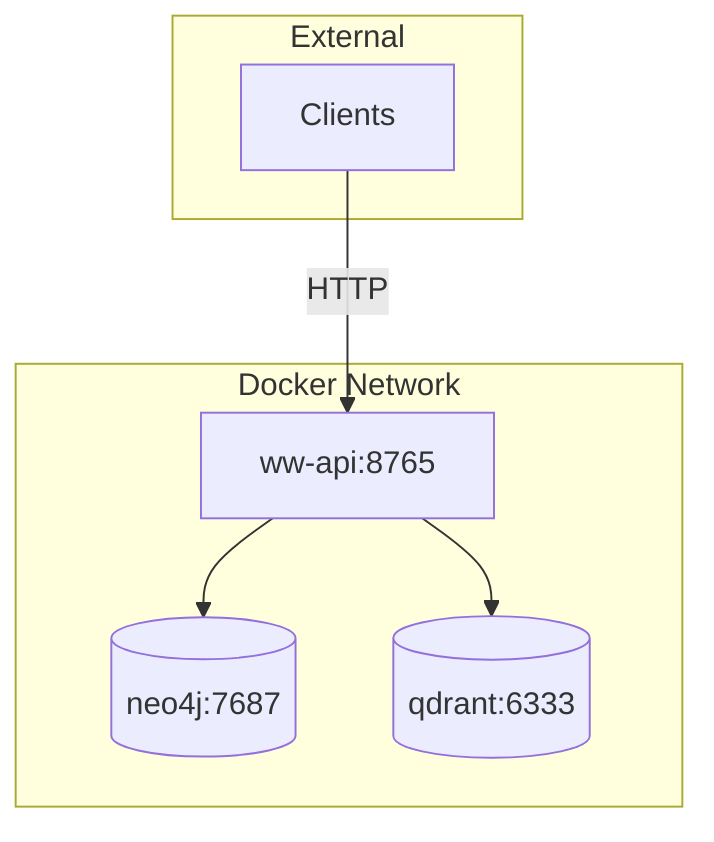
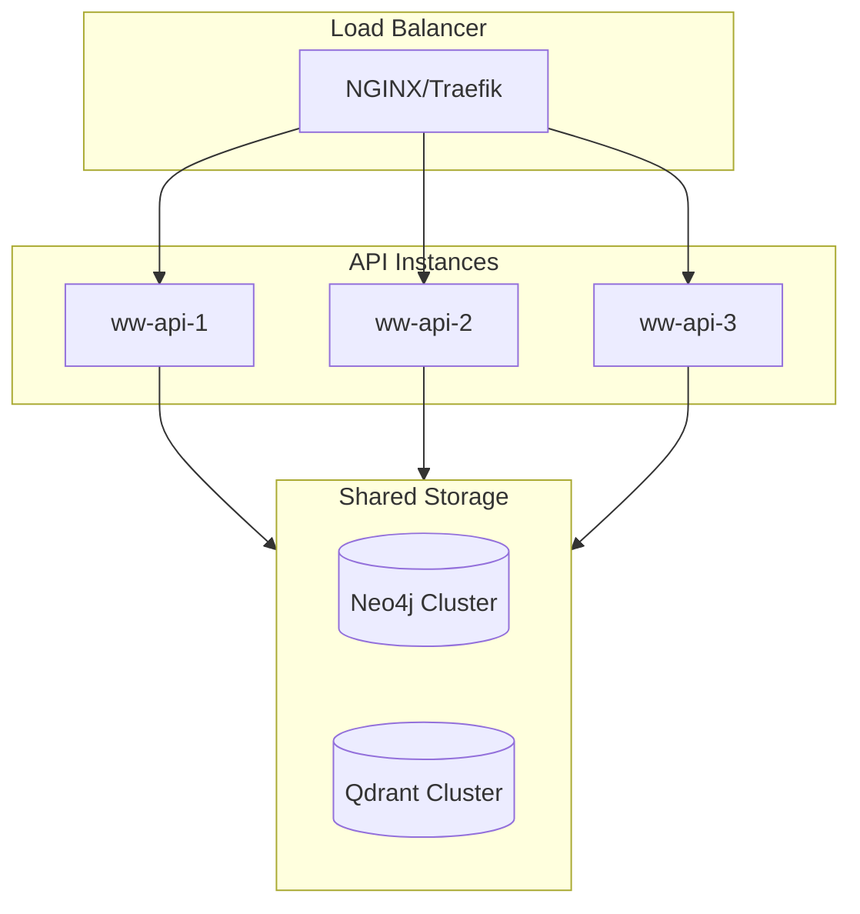

# Deployment Guide

Production deployment options for World Weaver.

## Docker Compose (Recommended)

### Quick Start

```bash
git clone https://github.com/astoreyai/ww
cd ww

# Generate secure passwords
./scripts/setup-env.sh

# Start all services
docker-compose up -d

# Verify
curl http://localhost:8765/api/v1/health
```

### Architecture



### docker-compose.yml

```yaml
version: '3.8'

services:
  ww-api:
    build: .
    ports:
      - "8765:8765"
    environment:
      WW_NEO4J_URI: bolt://neo4j:7687
      WW_NEO4J_PASSWORD: ${NEO4J_PASSWORD}
      WW_QDRANT_HOST: qdrant
      WW_API_KEY: ${API_KEY}
    depends_on:
      - neo4j
      - qdrant
    restart: unless-stopped

  neo4j:
    image: neo4j:5
    ports:
      - "7474:7474"
      - "7687:7687"
    environment:
      NEO4J_AUTH: neo4j/${NEO4J_PASSWORD}
      NEO4J_PLUGINS: '["apoc"]'
    volumes:
      - neo4j_data:/data
    restart: unless-stopped

  qdrant:
    image: qdrant/qdrant:latest
    ports:
      - "6333:6333"
    volumes:
      - qdrant_data:/qdrant/storage
    restart: unless-stopped

volumes:
  neo4j_data:
  qdrant_data:
```

### Environment Variables

```bash
# .env file
NEO4J_PASSWORD=your-secure-password
API_KEY=your-api-key
ADMIN_KEY=your-admin-key
WW_SESSION_ID=production
WW_ENVIRONMENT=production
```

## Kubernetes

### Helm Chart (Coming Soon)

```bash
helm repo add ww https://charts.astoreyai.com
helm install t4dm t4dm/world-weaver
```

### Manual Deployment

#### Namespace

```yaml
apiVersion: v1
kind: Namespace
metadata:
  name: world-weaver
```

#### ConfigMap

```yaml
apiVersion: v1
kind: ConfigMap
metadata:
  name: ww-config
  namespace: world-weaver
data:
  WW_NEO4J_URI: "bolt://neo4j:7687"
  WW_QDRANT_HOST: "qdrant"
  WW_ENVIRONMENT: "production"
```

#### Secrets

```yaml
apiVersion: v1
kind: Secret
metadata:
  name: ww-secrets
  namespace: world-weaver
type: Opaque
stringData:
  neo4j-password: "your-password"
  api-key: "your-api-key"
```

#### Deployment

```yaml
apiVersion: apps/v1
kind: Deployment
metadata:
  name: ww-api
  namespace: world-weaver
spec:
  replicas: 3
  selector:
    matchLabels:
      app: ww-api
  template:
    metadata:
      labels:
        app: ww-api
    spec:
      containers:
      - name: ww-api
        image: astoreyai/ww:0.4.0
        ports:
        - containerPort: 8765
        envFrom:
        - configMapRef:
            name: ww-config
        env:
        - name: WW_NEO4J_PASSWORD
          valueFrom:
            secretKeyRef:
              name: ww-secrets
              key: neo4j-password
        resources:
          requests:
            memory: "2Gi"
            cpu: "500m"
          limits:
            memory: "4Gi"
            cpu: "2000m"
        livenessProbe:
          httpGet:
            path: /api/v1/health
            port: 8765
          initialDelaySeconds: 30
          periodSeconds: 10
        readinessProbe:
          httpGet:
            path: /api/v1/health
            port: 8765
          initialDelaySeconds: 5
          periodSeconds: 5
```

#### Service

```yaml
apiVersion: v1
kind: Service
metadata:
  name: ww-api
  namespace: world-weaver
spec:
  selector:
    app: ww-api
  ports:
  - port: 8765
    targetPort: 8765
  type: ClusterIP
```

## Scaling

### Horizontal Scaling



### Considerations

| Component | Scaling Strategy |
|-----------|-----------------|
| API Server | Horizontal (stateless) |
| Neo4j | Causal cluster (3+ nodes) |
| Qdrant | Distributed mode |
| Embeddings | GPU pool |

## Security

### TLS Configuration

```yaml
# traefik ingress
apiVersion: networking.k8s.io/v1
kind: Ingress
metadata:
  name: ww-ingress
  annotations:
    traefik.ingress.kubernetes.io/router.tls: "true"
spec:
  tls:
  - hosts:
    - api.yourww.com
    secretName: ww-tls
  rules:
  - host: api.yourww.com
    http:
      paths:
      - path: /
        pathType: Prefix
        backend:
          service:
            name: ww-api
            port:
              number: 8765
```

### Network Policies

```yaml
apiVersion: networking.k8s.io/v1
kind: NetworkPolicy
metadata:
  name: ww-network-policy
  namespace: world-weaver
spec:
  podSelector:
    matchLabels:
      app: ww-api
  policyTypes:
  - Ingress
  - Egress
  ingress:
  - from:
    - namespaceSelector:
        matchLabels:
          name: ingress
    ports:
    - port: 8765
  egress:
  - to:
    - podSelector:
        matchLabels:
          app: neo4j
    - podSelector:
        matchLabels:
          app: qdrant
```

## Backup & Recovery

### Neo4j Backup

```bash
# Online backup
docker exec neo4j neo4j-admin database dump neo4j \
  --to-path=/backups/neo4j-$(date +%Y%m%d).dump

# Restore
docker exec neo4j neo4j-admin database load neo4j \
  --from-path=/backups/neo4j-20260103.dump
```

### Qdrant Backup

```bash
# Snapshot
curl -X POST http://localhost:6333/collections/episodes/snapshots

# Restore
curl -X PUT http://localhost:6333/collections/episodes/snapshots/recover \
  -H "Content-Type: application/json" \
  -d '{"location": "file:///snapshots/episodes-20260103.snapshot"}'
```

### Full System Backup

```bash
#!/bin/bash
# backup.sh
DATE=$(date +%Y%m%d)
BACKUP_DIR=/backups/$DATE

mkdir -p $BACKUP_DIR

# Neo4j
docker exec neo4j neo4j-admin database dump neo4j \
  --to-path=$BACKUP_DIR/neo4j.dump

# Qdrant snapshots
for collection in episodes entities procedures; do
  curl -X POST http://localhost:6333/collections/$collection/snapshots
done

# Compress
tar -czf $BACKUP_DIR.tar.gz $BACKUP_DIR

# Upload to S3
aws s3 cp $BACKUP_DIR.tar.gz s3://ww-backups/
```
