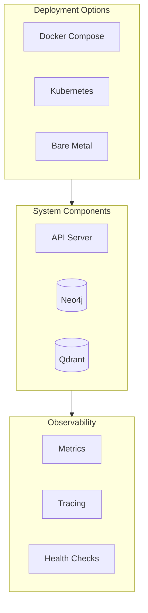

# Operations

Deployment, monitoring, and operational guides for World Weaver.

## Overview



## Quick Links

<div class="grid cards" markdown>

-   :material-docker: **[Deployment](deployment.md)**

    ---

    Docker, Kubernetes, and production deployment guides

-   :material-chart-line: **[Monitoring](monitoring.md)**

    ---

    Metrics, tracing, and observability setup

</div>

## Infrastructure Requirements

### Minimum (Development)

| Component | Specification |
|-----------|--------------|
| CPU | 2 cores |
| Memory | 4 GB |
| Storage | 10 GB |
| GPU | Optional |

### Recommended (Production)

| Component | Specification |
|-----------|--------------|
| CPU | 8+ cores |
| Memory | 32 GB |
| Storage | 100 GB SSD |
| GPU | NVIDIA (for embeddings) |

## Health Endpoints

```mermaid
graph LR
    subgraph Health["Health Checks"]
        H1[/health]
        H2[/health/live]
        H3[/health/ready]
    end

    subgraph Status["Status"]
        S1[API Server]
        S2[Neo4j Connection]
        S3[Qdrant Connection]
        S4[Embedding Service]
    end

    Health --> Status
```

| Endpoint | Purpose | Response |
|----------|---------|----------|
| `/health` | Overall health | `{status, version, session_id}` |
| `/health/live` | Liveness probe | `200 OK` or `503` |
| `/health/ready` | Readiness probe | `200 OK` or `503` |
