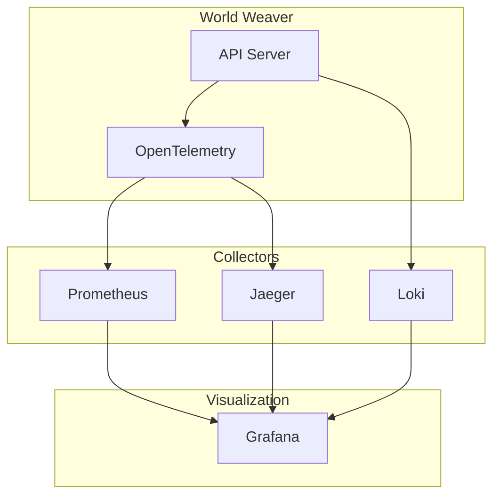
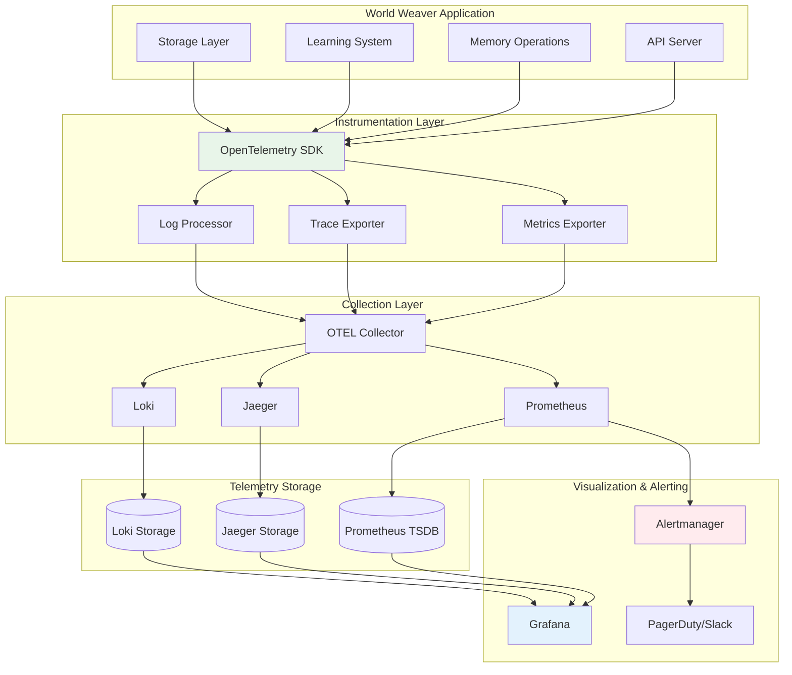
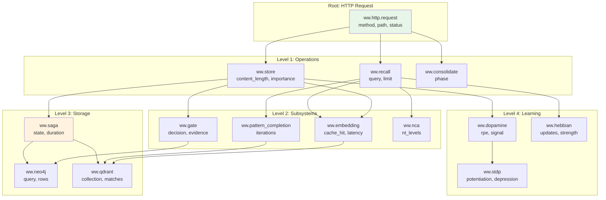
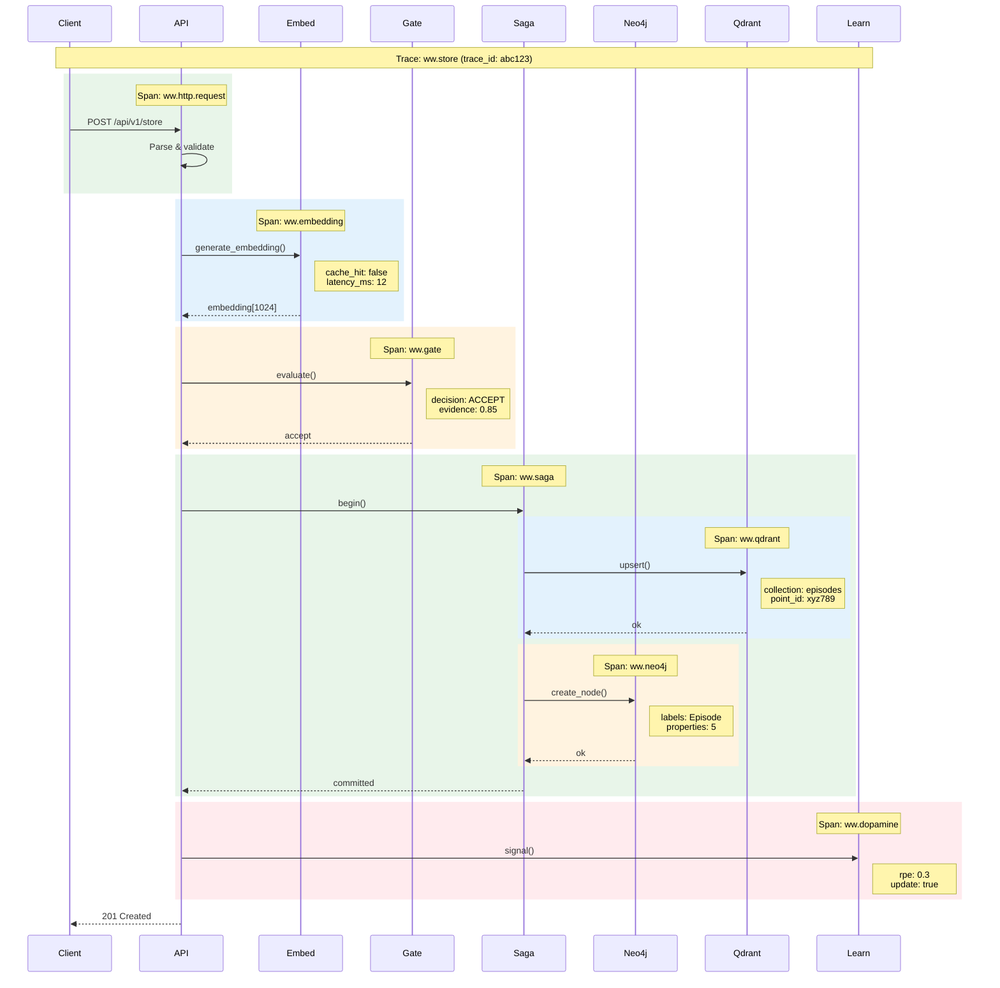
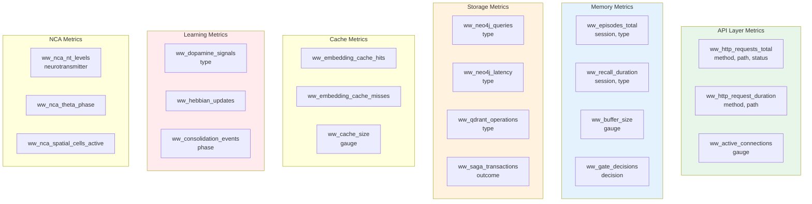
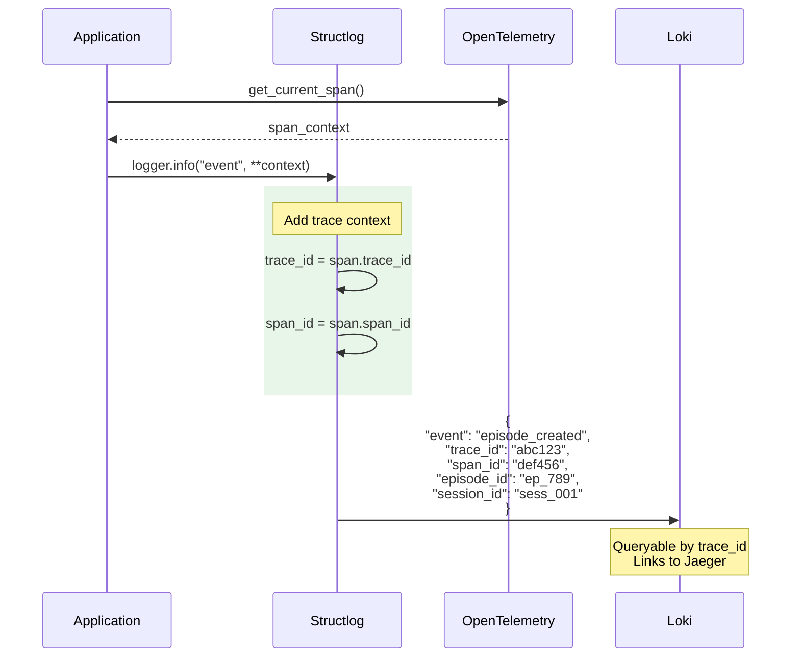
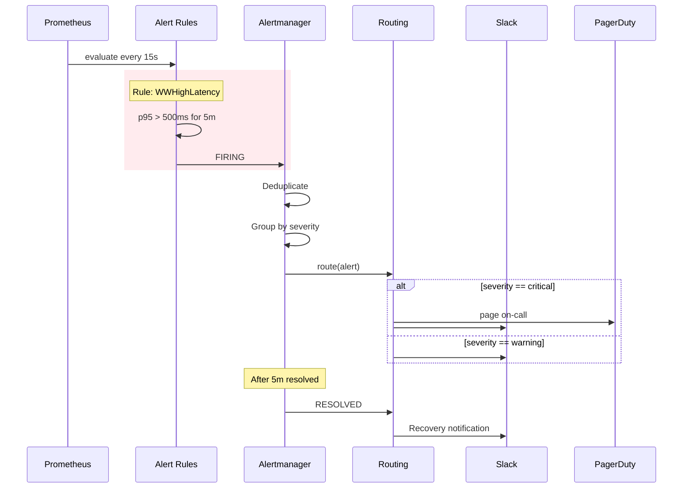
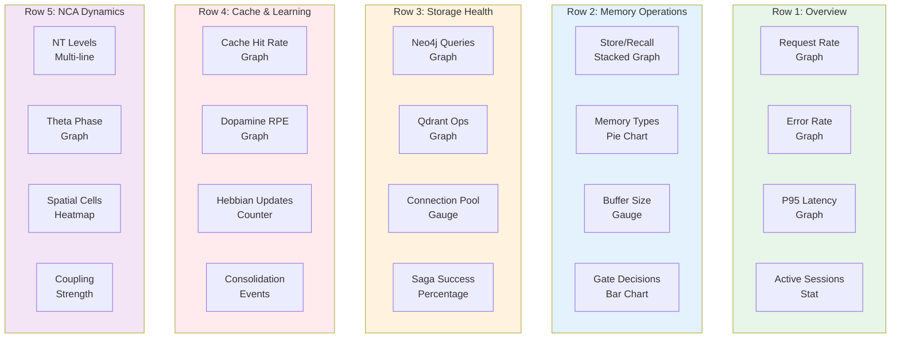

# Monitoring Guide

Observability and monitoring for World Weaver.

## Overview



## Metrics

### Available Metrics

| Metric | Type | Description |
|--------|------|-------------|
| `ww_episodes_total` | Counter | Total episodes created |
| `ww_recall_duration_seconds` | Histogram | Recall operation latency |
| `ww_embedding_cache_hits` | Counter | Embedding cache hits |
| `ww_embedding_cache_misses` | Counter | Embedding cache misses |
| `ww_neo4j_pool_active` | Gauge | Active Neo4j connections |
| `ww_qdrant_queue_depth` | Gauge | Qdrant operation queue |

### Prometheus Configuration

```yaml
# prometheus.yml
global:
  scrape_interval: 15s

scrape_configs:
  - job_name: 'world-weaver'
    static_configs:
      - targets: ['ww-api:8765']
    metrics_path: '/metrics'
```

### Key Dashboards

#### Memory Operations

```
# Recall latency percentiles
histogram_quantile(0.95, rate(ww_recall_duration_seconds_bucket[5m]))

# Operations per second
rate(ww_episodes_total[5m])

# Cache hit rate
rate(ww_embedding_cache_hits[5m]) /
(rate(ww_embedding_cache_hits[5m]) + rate(ww_embedding_cache_misses[5m]))
```

#### Storage Health

```
# Neo4j pool utilization
ww_neo4j_pool_active / ww_neo4j_pool_size

# Qdrant queue depth
ww_qdrant_queue_depth
```

## Tracing

### OpenTelemetry Setup

```python
from ww.observability import WWObserver

observer = WWObserver(
    service_name="world-weaver",
    jaeger_endpoint="http://jaeger:14268/api/traces"
)
```

### Trace Structure

```mermaid
gantt
    title Recall Operation Trace
    dateFormat  X
    axisFormat %L

    section API
    HTTP Request :a1, 0, 5
    Parse Request :a2, 5, 2
    Serialize Response :a3, 95, 5

    section Memory
    Generate Embedding :b1, 7, 30
    Pattern Completion :b2, 37, 10

    section Storage
    Qdrant Search :c1, 47, 20
    Neo4j Query :c2, 67, 15

    section Learning
    Hebbian Update :d1, 82, 10
```



### Trace Attributes

| Attribute | Description |
|-----------|-------------|
| `ww.session_id` | Session identifier |
| `ww.operation` | Operation type |
| `ww.memory_type` | Memory subsystem |
| `ww.result_count` | Number of results |

## Logging

### Structured Logging

```python
import structlog

logger = structlog.get_logger()
logger.info(
    "episode_created",
    episode_id=str(episode.id),
    session_id=session_id,
    content_length=len(content)
)
```

### Log Levels

| Level | Use Case |
|-------|----------|
| ERROR | Failures, exceptions |
| WARNING | Degraded operation |
| INFO | Normal operations |
| DEBUG | Detailed tracing |

### Loki Configuration

```yaml
# promtail.yml
server:
  http_listen_port: 9080

clients:
  - url: http://loki:3100/loki/api/v1/push

scrape_configs:
  - job_name: ww
    static_configs:
      - targets:
          - localhost
        labels:
          job: world-weaver
          __path__: /var/log/ww/*.log
```

## Alerting

### Critical Alerts

```yaml
# prometheus-rules.yml
groups:
  - name: world-weaver
    rules:
      - alert: WWHighLatency
        expr: histogram_quantile(0.95, rate(ww_recall_duration_seconds_bucket[5m])) > 0.5
        for: 5m
        labels:
          severity: warning
        annotations:
          summary: "High recall latency"

      - alert: WWErrorRate
        expr: rate(ww_errors_total[5m]) > 0.05
        for: 2m
        labels:
          severity: critical
        annotations:
          summary: "High error rate"

      - alert: WWNeo4jPoolExhausted
        expr: ww_neo4j_pool_active / ww_neo4j_pool_size > 0.9
        for: 5m
        labels:
          severity: warning
        annotations:
          summary: "Neo4j pool near exhaustion"
```

### Alert Thresholds

| Metric | Warning | Critical |
|--------|---------|----------|
| Recall p95 latency | > 200ms | > 500ms |
| Error rate | > 1% | > 5% |
| Cache hit rate | < 70% | < 50% |
| Pool utilization | > 80% | > 95% |

## Health Checks

### Endpoints

```bash
# Overall health
curl http://localhost:8765/api/v1/health

# Detailed status
curl http://localhost:8765/api/v1/stats
```

### Response Format

```json
{
  "status": "healthy",
  "timestamp": "2026-01-03T12:00:00Z",
  "version": "0.4.0",
  "components": {
    "neo4j": "connected",
    "qdrant": "connected",
    "embedding": "ready"
  }
}
```

### Kubernetes Probes

```yaml
livenessProbe:
  httpGet:
    path: /api/v1/health
    port: 8765
  initialDelaySeconds: 30
  periodSeconds: 10
  timeoutSeconds: 5
  failureThreshold: 3

readinessProbe:
  httpGet:
    path: /api/v1/health
    port: 8765
  initialDelaySeconds: 5
  periodSeconds: 5
  timeoutSeconds: 3
  failureThreshold: 2
```

## Grafana Dashboards

### Import Dashboards

```bash
# Download dashboard JSON
curl -O https://raw.githubusercontent.com/astoreyai/ww/master/dashboards/ww-overview.json

# Import via API
curl -X POST http://grafana:3000/api/dashboards/db \
  -H "Content-Type: application/json" \
  -d @ww-overview.json
```

### Dashboard Panels

1. **Overview**
   - Request rate
   - Error rate
   - Latency percentiles

2. **Memory Operations**
   - Store/Recall counts
   - Memory type distribution
   - Cache performance

3. **Storage**
   - Neo4j metrics
   - Qdrant metrics
   - Connection pool status

4. **Learning**
   - Dopamine signals
   - Hebbian updates
   - Consolidation events

## Detailed Observability Architecture

### Complete Telemetry Pipeline



### Trace Span Hierarchy



### Detailed Store Trace



### Metric Collection Points



### Log Correlation



### Alert Flow



### Dashboard Layout


