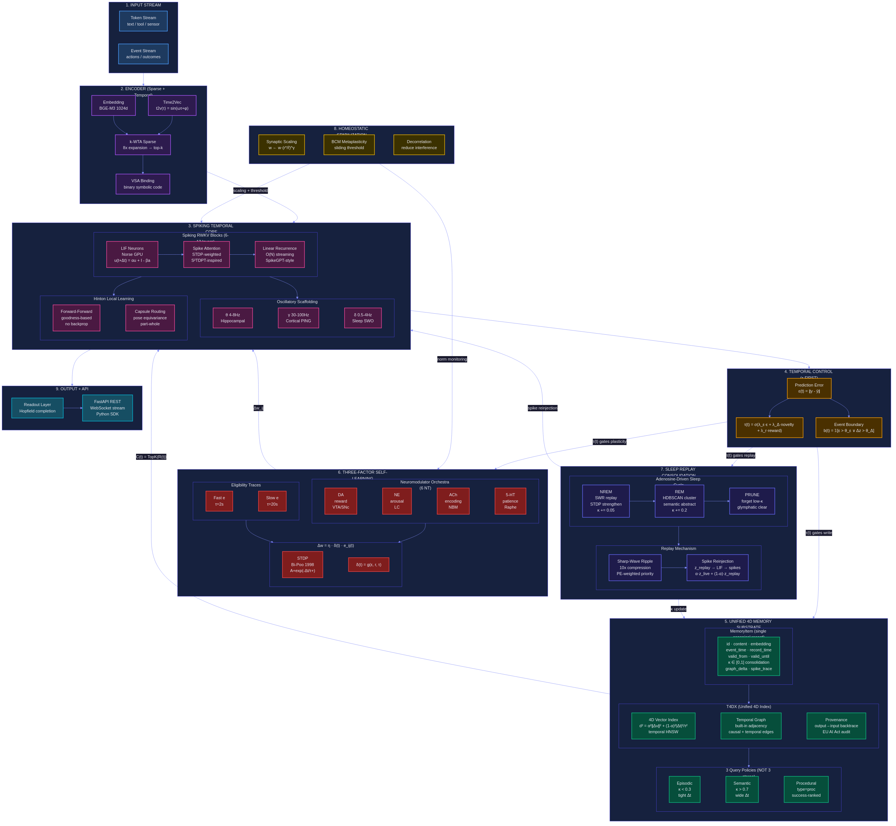

# T4DM SNN-Transformer Novelty Assessment

**Date**: 2026-01-30
**Scope**: How T4DM compares to published SNN-LLM architectures

---

## Architecture Diagram

---

## Comparison Matrix

| Capability | BrainTransformers (ICLR 2025) | SpikeGPT (2023) | SpikeLLM (2024) | S²TDPT (2024) | CLP-SNN (2023) | CALM (2023) | **T4DM (ours)** |
|---|---|---|---|---|---|---|---|
| **Scale** | 3B params | 216M | 70B | Small | Small | 7B+ | <200K neurons |
| **Neuron model** | SNNMatmul (binary) | Binary spike | GIF neuron | LIF | LIF | None (ANN) | LIF (Norse GPU) |
| **Attention** | SNNSoftmax | RWKV linear | Saliency alloc | STDP-weighted | Contrastive | Early exit | Spike RWKV + STDP |
| **Learning** | Backprop (STE) | Backprop (STE) | Backprop (STE) | STDP local | Contrastive local | Backprop | Three-factor local (no backprop) |
| **Memory system** | None | None | None | None | None | None | **Unified 4D (κ-indexed)** |
| **Temporal encoding** | Position embed | Position embed | Position embed | Spike timing | Spike timing | Position embed | **Time2Vec + spike timing** |
| **Sleep consolidation** | No | No | No | No | No | No | **Yes (NREM/REM/prune)** |
| **Neuromodulation** | Synapsis (DA-like) | No | No | No | No | No | **6 NT (DA/NE/ACh/5-HT/Glu/GABA)** |
| **Oscillatory scaffold** | No | No | No | No | No | No | **Yes (θ/γ/δ coupling)** |
| **Homeostasis** | No | No | No | No | No | No | **Yes (BCM + synaptic scaling)** |
| **Graph backend** | No | No | No | No | No | No | **Yes (Neo4j temporal edges)** |
| **Prediction error gating** | No | No | No | No | No | Confidence | **Yes (τ(t) gates all)** |
| **Capsule routing** | No | No | No | No | No | No | **Yes (pose equivariance)** |
| **Forward-Forward** | No | No | No | No | No | No | **Yes (goodness-based)** |
| **Energy focus** | 35.4% energy of ANN | O(N) linear | Binary ops | 88.5% reduction | Low | Saves 50% FLOPs | O(N) + spike sparsity |

---

## Novelty Claims

### 1. Unified 4D Memory Substrate (NOVEL)
No published SNN-LLM has a persistent memory system. All operate as stateless sequence models. T4DM introduces a single canonical `MemoryItem` with consolidation level κ ∈ [0,1], bitemporal fields (event_time, record_time, valid_from, valid_until), and dual-store backends (vector + graph). This replaces the traditional episodic/semantic/procedural split with query policies over a unified store.

**Closest work**: MemGPT (2023) has tiered memory but no consolidation, no graph, no biological dynamics.

### 2. Three-Factor Local Learning Without Backprop (NOVEL in LLM context)
Published SNN-LLMs (BrainTransformers, SpikeGPT, SpikeLLM) all use surrogate gradient backpropagation. T4DM uses Δw = η · δ(t) · e_ij(t) where eligibility traces accumulate STDP-driven correlations and neuromodulatory signals gate plasticity. This is biologically faithful and avoids the non-local credit assignment problem.

**Closest work**: S²TDPT uses STDP for attention but still backprops the rest. Forward-Forward (Hinton 2022) avoids backprop but has no spike dynamics.

### 3. Sleep Consolidation Pipeline (NOVEL)
No SNN-LLM implements sleep-like offline consolidation. T4DM runs adenosine-driven NREM (SWR replay with STDP strengthening, κ += 0.05), REM (HDBSCAN clustering for semantic abstraction, κ += 0.2), and pruning (forget low-κ, glymphatic clearance). Spike traces are reinjected into the LIF core during replay.

### 4. Six-Transmitter Neuromodulation (NOVEL)
BrainTransformers has Synapsis (a single DA-like gain modulator). T4DM implements DA (reward/VTA), NE (arousal/LC), ACh (encoding/NBM), 5-HT (patience/Raphe), plus glutamate and GABA signaling with crosstalk dynamics. These modulate learning rate, attention gain, memory encoding depth, and exploration-exploitation balance.

### 5. Oscillatory Scaffolding (NOVEL in LLM context)
No published SNN-LLM couples theta (4-8Hz hippocampal), gamma (30-100Hz cortical PING), and delta (0.5-4Hz sleep SWO) oscillators. T4DM uses theta-gamma coupling for memory encoding, sharp-wave ripple replay during consolidation, and sleep spindle-ripple coupling for transfer.

### 6. Prediction-Error Temporal Gating (NOVEL)
τ(t) = σ(λ_ε·ε + λ_Δ·novelty + λ_r·reward) is a unified temporal gate that controls memory write, plasticity, and replay priority. No published system uses a single prediction-error-derived signal to gate all three processes simultaneously.

---

## What Is NOT Novel

| Feature | Prior art |
|---|---|
| LIF neurons on GPU | Norse (2021), snnTorch (2021) |
| RWKV linear attention | SpikeGPT (2023), RWKV (2023) |
| STDP attention | S²TDPT (2024) |
| Binary spike operations | BrainTransformers (2025), SpikeLLM (2024) |
| VSA binding codes | Plate (2003), Gayler (2004) |
| k-WTA sparse coding | Makhzani & Frey (2014) |
| Hopfield retrieval | Ramsauer et al. (2021) |
| Saga pattern for dual-store | Standard distributed systems |

---

## Risk Assessment

| Risk | Severity | Mitigation |
|---|---|---|
| Scale ceiling (~200K neurons) | Medium | Designed for agent memory, not language generation at LLM scale |
| No backprop = slower convergence | High | Three-factor + replay + homeostasis compensate; not competing on perplexity |
| Oscillator tuning complexity | Medium | Start with fixed frequencies, tune via grid search |
| Integration test burden | Low | 8,905 existing tests; each atom adds targeted tests |

---

## Positioning Statement

T4DM is **not** competing with BrainTransformers or SpikeLLM on language modeling benchmarks. It occupies a different niche: a **biologically-faithful memory system for AI agents** that uses spiking dynamics for temporal learning rather than token prediction. The combination of unified 4D memory + three-factor learning + sleep consolidation + six-transmitter neuromodulation + oscillatory scaffolding is unprecedented in published literature.

The closest analogue is the mammalian hippocampal-neocortical memory system, not a transformer LLM.
