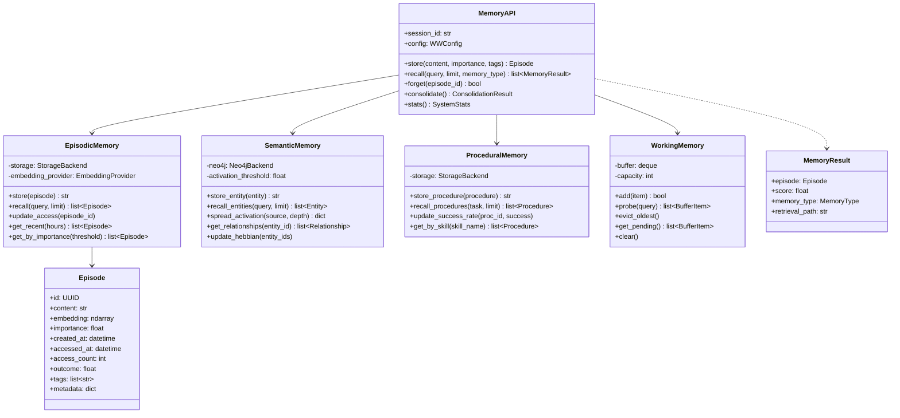
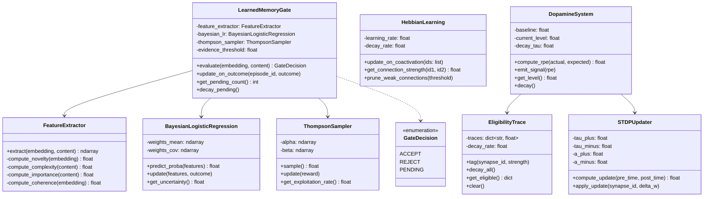
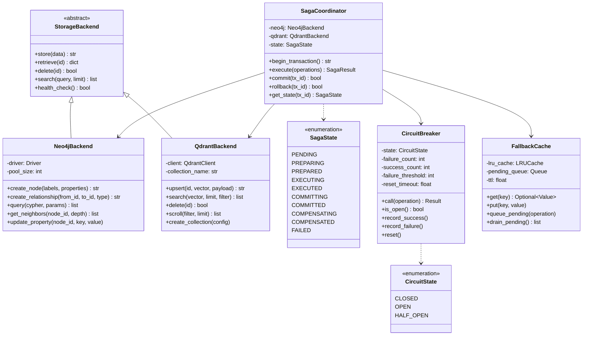
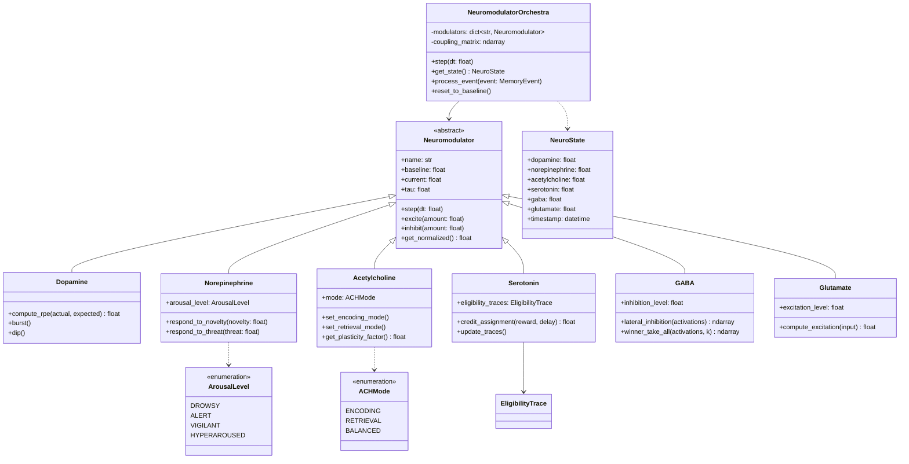
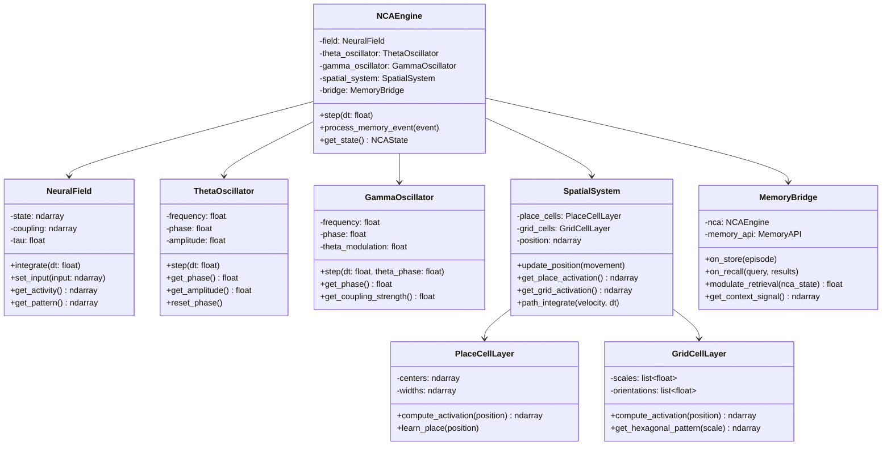
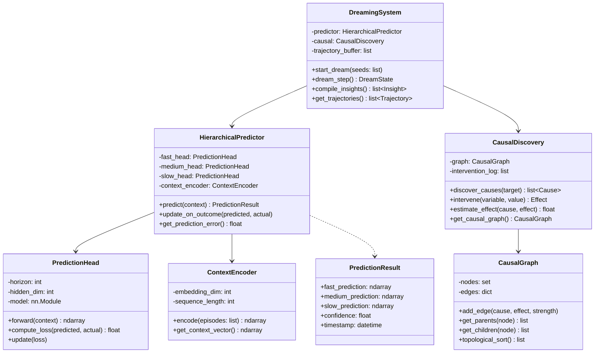
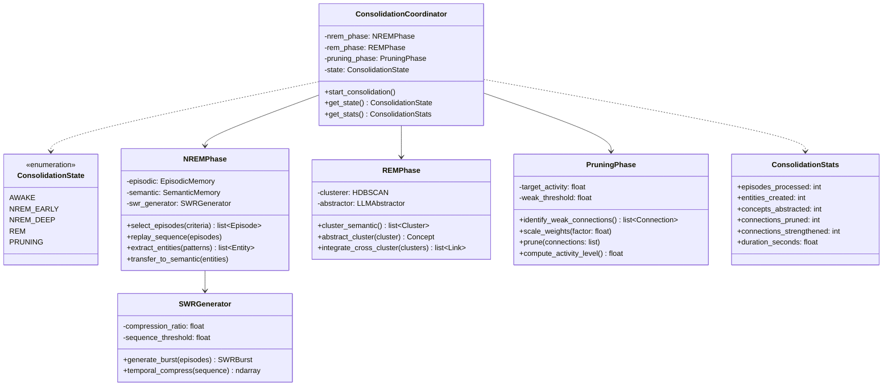
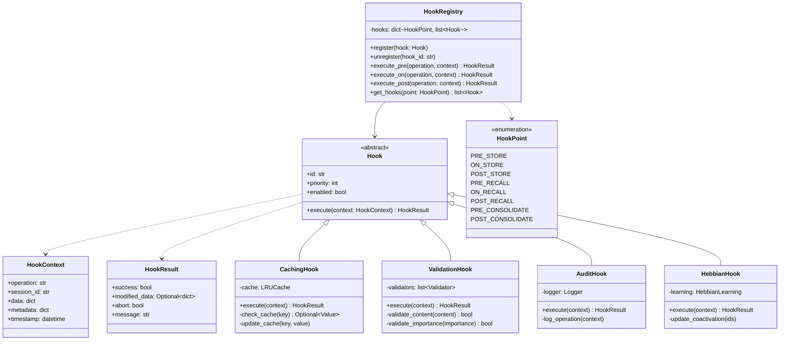

# Class Diagrams

UML class diagrams for World Weaver subsystems.

## Memory Subsystem Classes

## Learning Subsystem Classes

## Storage Subsystem Classes

## Neuromodulation Subsystem Classes

## NCA Dynamics Classes

## Prediction Subsystem Classes

## Consolidation Classes

## Hook System Classes

