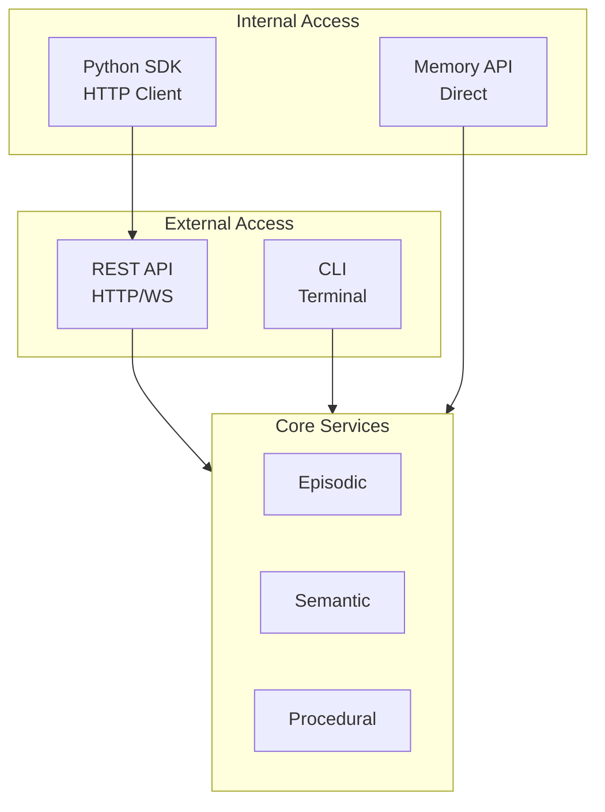
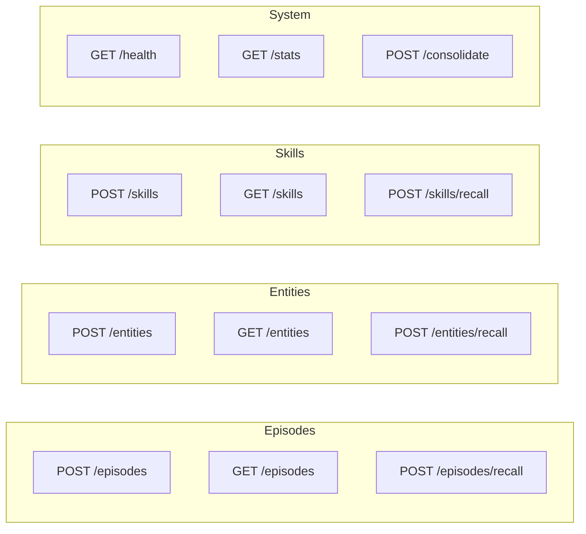
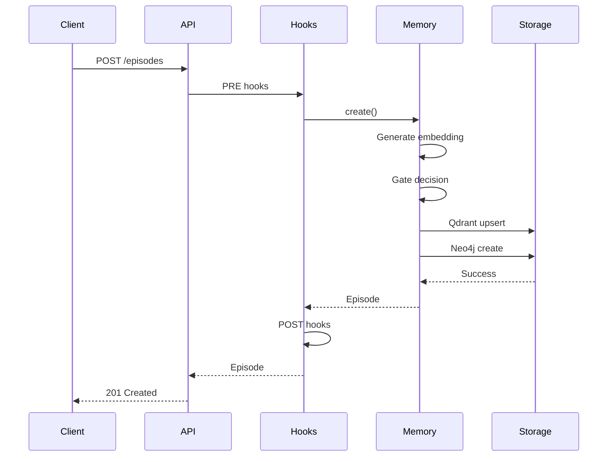
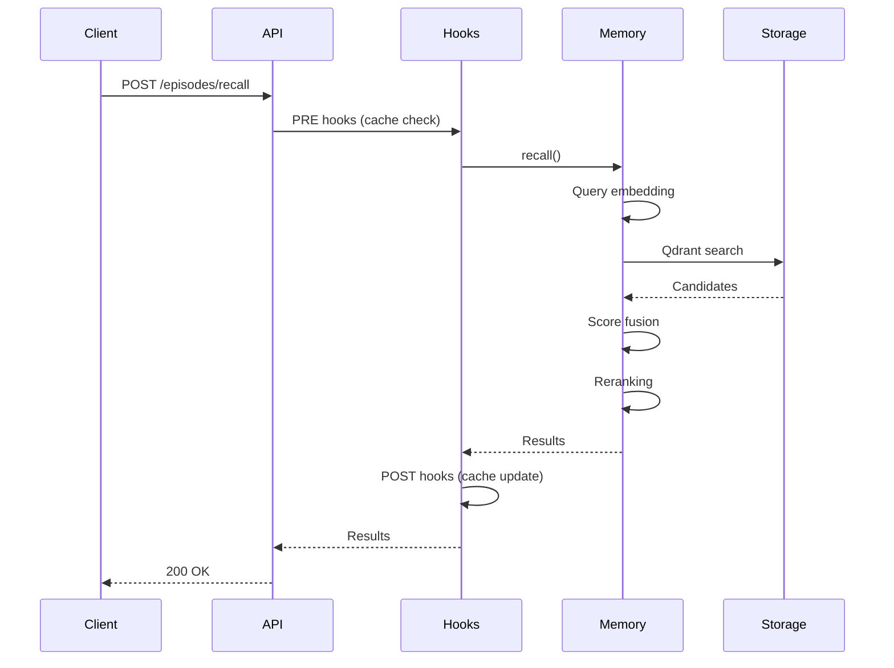
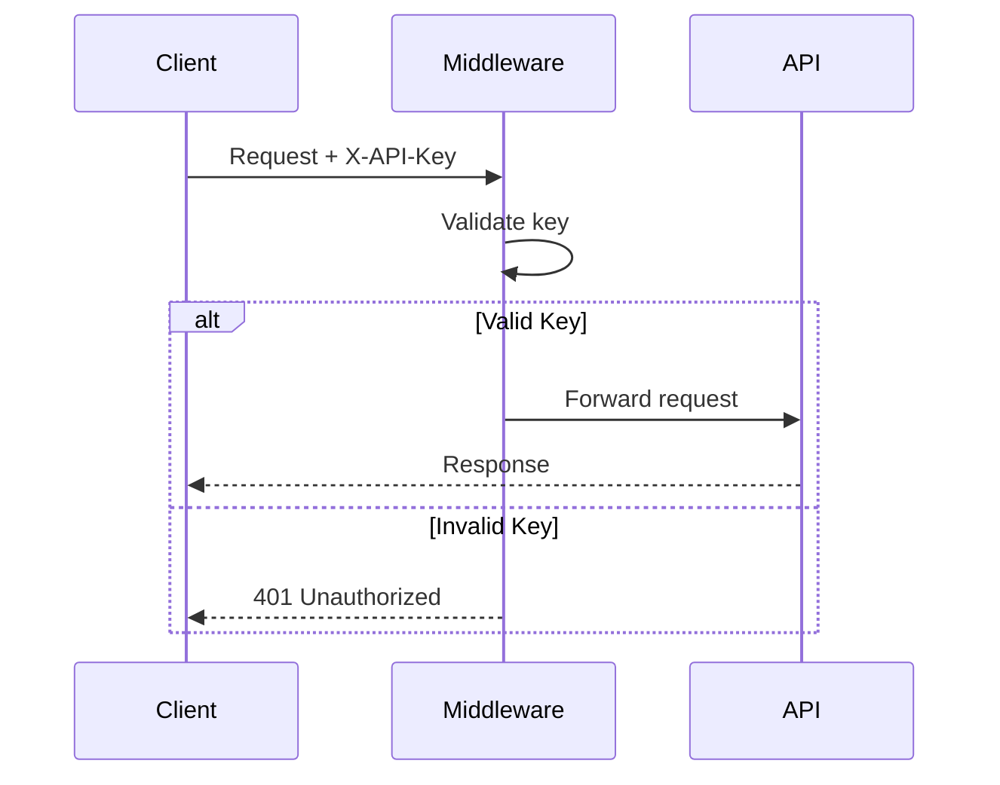
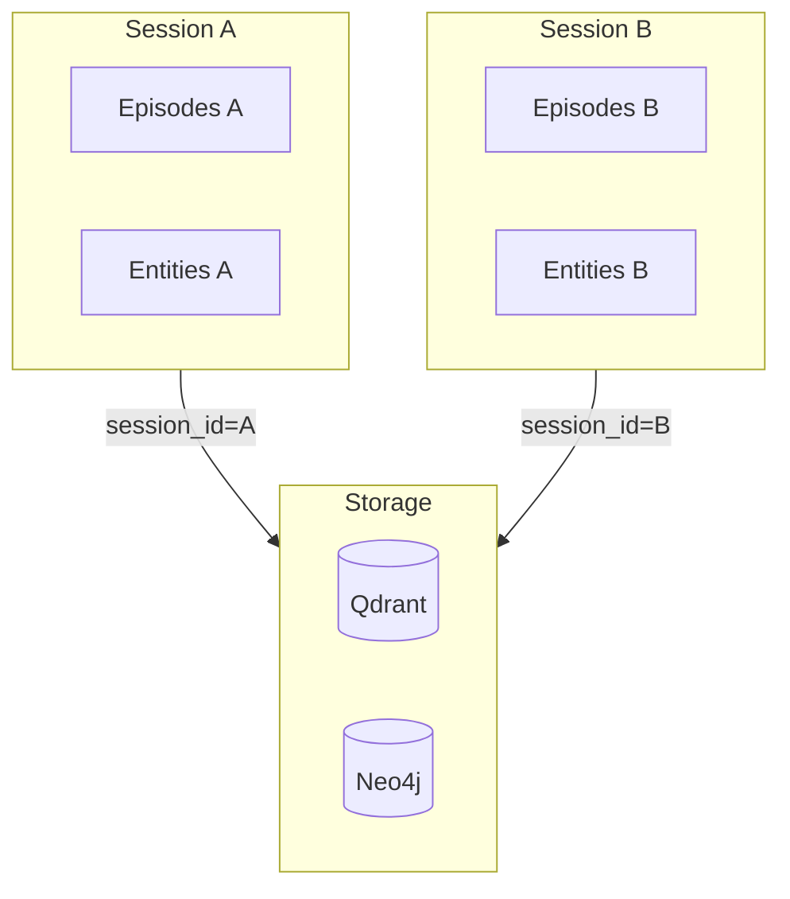
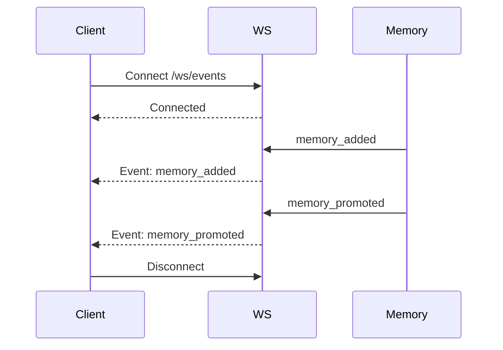

# API Reference

Complete API documentation for World Weaver.

## API Layers

World Weaver provides four access layers:



## Quick Reference

| Interface | Best For | Authentication | Async |
|-----------|----------|----------------|-------|
| [REST API](rest-api.md) | External services | API Key | Yes |
| [Python SDK](sdk.md) | Python apps | API Key | Yes/No |
| [CLI](cli.md) | Terminal users | None | No |
| [Memory API](memory-api.md) | Direct embedding | None | Yes |
| [NCA API](nca-api.md) | Neural dynamics | None | Yes |

## Endpoint Overview



## Data Flow

### Store Operation



### Recall Operation



## Authentication

### API Key Authentication



### Session Isolation



## Common Patterns

### Pagination

```python
# SDK
results = await client.list_episodes(offset=0, limit=50)
while results.has_more:
    results = await client.list_episodes(
        offset=results.offset + 50,
        limit=50
    )
```

### Error Handling

```python
from ww.sdk import WorldWeaverClient, NotFoundError, RateLimitError

try:
    episode = await client.get_episode(episode_id)
except NotFoundError:
    print("Episode not found")
except RateLimitError as e:
    print(f"Rate limited, retry after {e.retry_after}s")
```

### WebSocket Events


