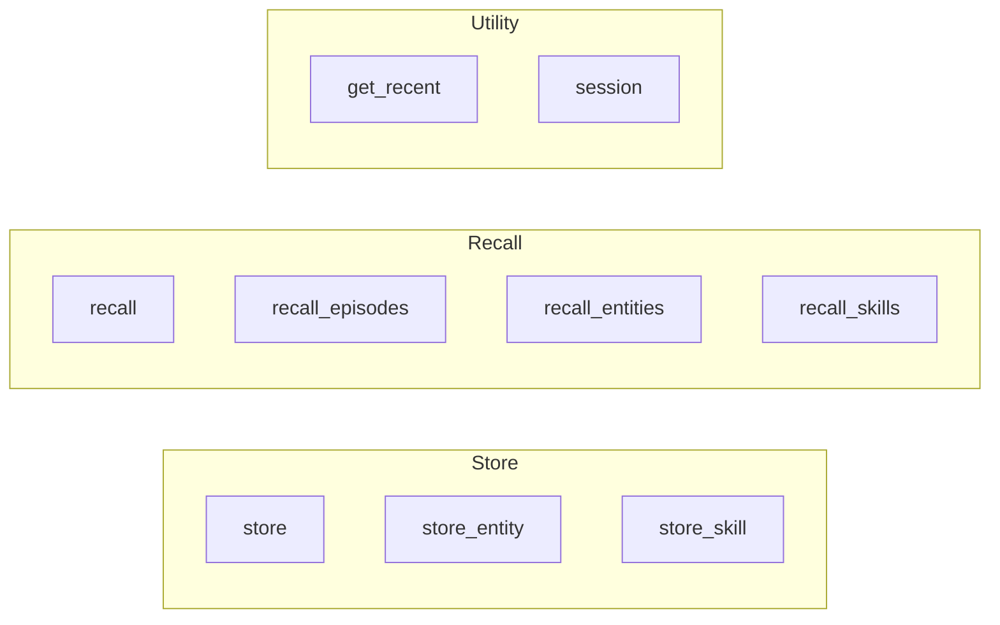

# Memory API Reference

Direct Python API for memory operations.

## Overview

The Memory API provides the simplest way to use World Weaver in Python applications.

```python
from ww import memory

# Store and recall
await memory.store("Your content")
results = await memory.recall("query")
```

## Quick Reference



## Store Functions

### store

Store episodic content.

```python
await memory.store(
    content: str,
    importance: float = 0.5,
    tags: list[str] | None = None,
    metadata: dict | None = None
) -> MemoryResult
```

**Parameters:**

| Parameter | Type | Default | Description |
|-----------|------|---------|-------------|
| `content` | str | required | Memory content |
| `importance` | float | 0.5 | Importance (0.0-1.0) |
| `tags` | list[str] | None | Tags for organization |
| `metadata` | dict | None | Additional metadata |

**Example:**

```python
result = await memory.store(
    "Learned that Python 3.12 has improved error messages",
    importance=0.8,
    tags=["python", "learning"],
    metadata={"source": "documentation"}
)
print(f"Stored: {result.id}")
```

### store_entity

Store semantic entity.

```python
await memory.store_entity(
    name: str,
    description: str,
    entity_type: str = "concept",
    details: dict | None = None
) -> MemoryResult
```

**Entity Types:**

- `concept` - Abstract ideas
- `person` - People
- `project` - Projects
- `tool` - Tools/Software
- `technique` - Methods
- `fact` - Factual statements

**Example:**

```python
result = await memory.store_entity(
    name="Python 3.12",
    description="Python programming language version 3.12",
    entity_type="tool",
    details={"release_date": "2023-10-02"}
)
```

### store_skill

Store procedural skill.

```python
await memory.store_skill(
    name: str,
    script: str,
    domain: str = "coding",
    description: str | None = None
) -> MemoryResult
```

**Domains:**

- `coding` - Programming tasks
- `research` - Research workflows
- `trading` - Trading operations
- `devops` - Operations tasks
- `writing` - Writing tasks

**Example:**

```python
result = await memory.store_skill(
    name="run_pytest",
    script="pytest tests/ -v",
    domain="coding",
    description="Run Python test suite with verbose output"
)
```

## Recall Functions

### recall

Unified recall across all memory types.

```python
await memory.recall(
    query: str,
    limit: int = 5,
    memory_types: list[str] | None = None
) -> list[MemoryResult]
```

**Parameters:**

| Parameter | Type | Default | Description |
|-----------|------|---------|-------------|
| `query` | str | required | Search query |
| `limit` | int | 5 | Max results |
| `memory_types` | list[str] | None | Filter by type |

**Example:**

```python
# Search all types
results = await memory.recall("Python testing")

# Search specific types
results = await memory.recall(
    "Python",
    limit=10,
    memory_types=["episodic", "semantic"]
)

for r in results:
    print(f"[{r.memory_type}] {r.content} (score: {r.score:.2f})")
```

### recall_episodes

Recall episodic memories.

```python
await memory.recall_episodes(
    query: str,
    limit: int = 5
) -> list[MemoryResult]
```

**Example:**

```python
results = await memory.recall_episodes("debugging session", limit=10)
```

### recall_entities

Recall semantic entities.

```python
await memory.recall_entities(
    query: str,
    limit: int = 5
) -> list[MemoryResult]
```

**Example:**

```python
results = await memory.recall_entities("programming languages")
```

### recall_skills

Recall procedural skills.

```python
await memory.recall_skills(
    query: str,
    limit: int = 5
) -> list[MemoryResult]
```

**Example:**

```python
results = await memory.recall_skills("run tests")
```

### get_recent

Get recent memories.

```python
await memory.get_recent(
    limit: int = 10
) -> list[MemoryResult]
```

**Example:**

```python
recent = await memory.get_recent(limit=20)
for r in recent:
    print(f"{r.timestamp}: {r.content[:50]}")
```

## Session Context

### session

Create isolated session context.

```python
async with memory.session(session_id: str) as m:
    await m.store("Session-specific content")
    results = await m.recall("query")
```

**Example:**

```python
# Project-specific memories
async with memory.session("project-alpha") as m:
    await m.store("Alpha configuration settings")
    await m.store("Alpha database schema")

# Different project (isolated)
async with memory.session("project-beta") as m:
    await m.store("Beta configuration settings")
    # Cannot see Alpha's memories
```

## MemoryResult

Return type for all operations.

```python
@dataclass
class MemoryResult:
    content: str           # Memory content
    memory_type: str       # "episodic", "semantic", "procedural"
    score: float          # Relevance score (0.0-1.0)
    id: str | None        # Memory ID
    metadata: dict        # Additional metadata
```

**Accessing Results:**

```python
results = await memory.recall("query")

for r in results:
    print(f"Type: {r.memory_type}")
    print(f"Content: {r.content}")
    print(f"Score: {r.score:.2f}")
    print(f"ID: {r.id}")
    print(f"Metadata: {r.metadata}")
```

## Module-Level Functions

For convenience, functions are also available at module level:

```python
from ww import (
    store,
    recall,
    store_entity,
    store_skill,
    recall_episodes,
    recall_entities,
    recall_skills,
    get_recent
)

# Direct usage
await store("content")
results = await recall("query")
```

## Async/Sync

The Memory API is async-first. For sync usage:

```python
import asyncio
from ww import memory

# Option 1: asyncio.run
result = asyncio.run(memory.store("content"))

# Option 2: Event loop
loop = asyncio.get_event_loop()
result = loop.run_until_complete(memory.store("content"))
```

## Configuration

The Memory API uses the global configuration:

```python
from ww.core.config import get_settings

settings = get_settings()
print(f"Session: {settings.session_id}")
```

Override with environment variables:

```bash
export WW_SESSION_ID=my-session
export WW_QDRANT_HOST=localhost
```

## Error Handling

```python
from ww import memory

try:
    results = await memory.recall("query")
except ConnectionError:
    print("Failed to connect to storage")
except Exception as e:
    print(f"Error: {e}")
```

## Best Practices

### 1. Use Sessions for Isolation

```python
# Good: Isolated contexts
async with memory.session("project-a") as m:
    await m.store("Project A data")

# Avoid: Global pollution
await memory.store("Unscoped data")
```

### 2. Batch Related Stores

```python
# Good: Related in same session
async with memory.session("learning") as m:
    await m.store("Learned A")
    await m.store("Learned B")
    await m.store("Learned C")
```

### 3. Use Appropriate Types

```python
# Episodes for events
await memory.store("Completed the tutorial")

# Entities for concepts
await memory.store_entity("Tutorial", "Learning resource")

# Skills for procedures
await memory.store_skill("run_tutorial", "python tutorial.py")
```
