# Sequence & State Diagrams

Detailed behavioral diagrams for T4DM operations.

## State Machines

### Memory Gate State Machine

The learned memory gate controls what enters long-term memory.

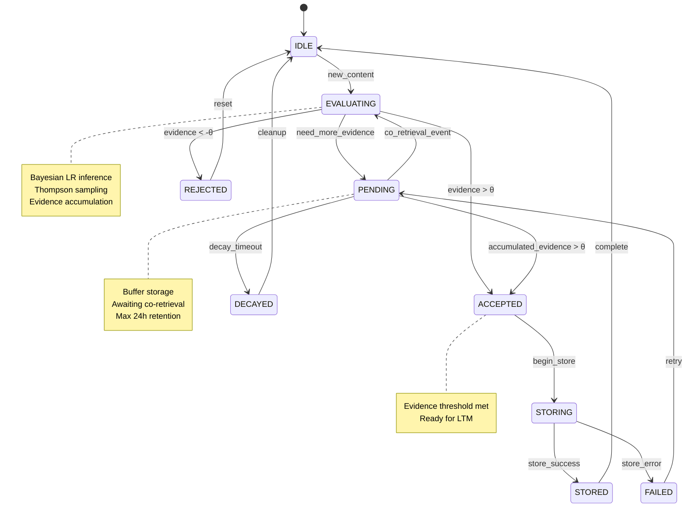

### Neuromodulator State Machine

Tracks the state of each neuromodulator in the NCA system.

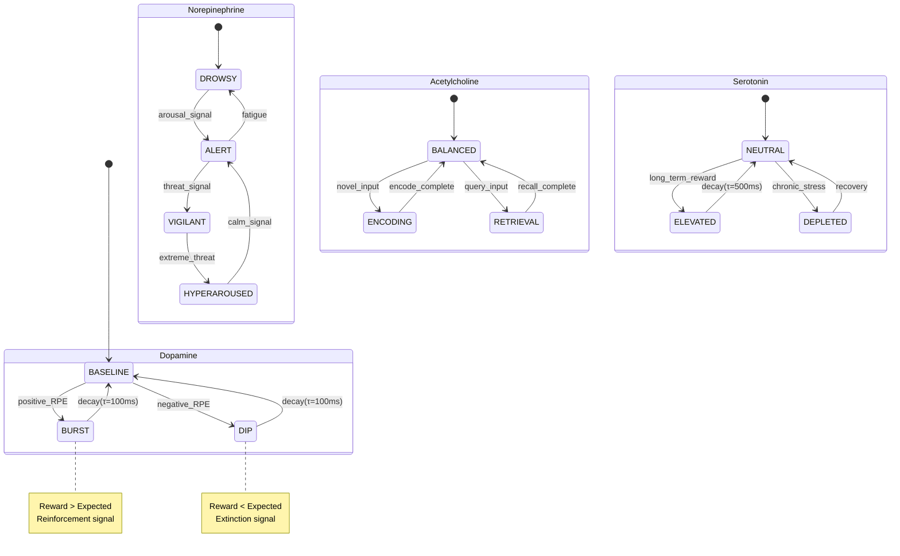

### Consolidation State Machine

Sleep-based memory consolidation phases with delta oscillations and sleep spindles.

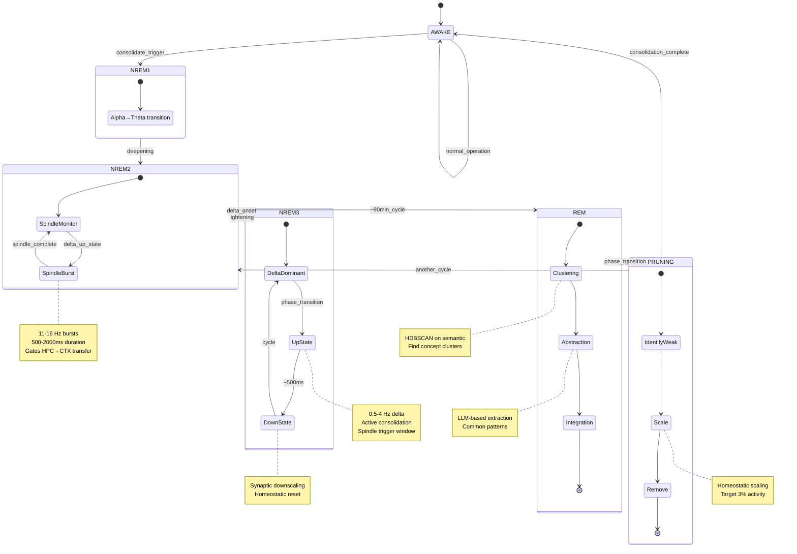

### Delta-Spindle Coordination

Detailed timing of delta oscillations and sleep spindles during NREM.

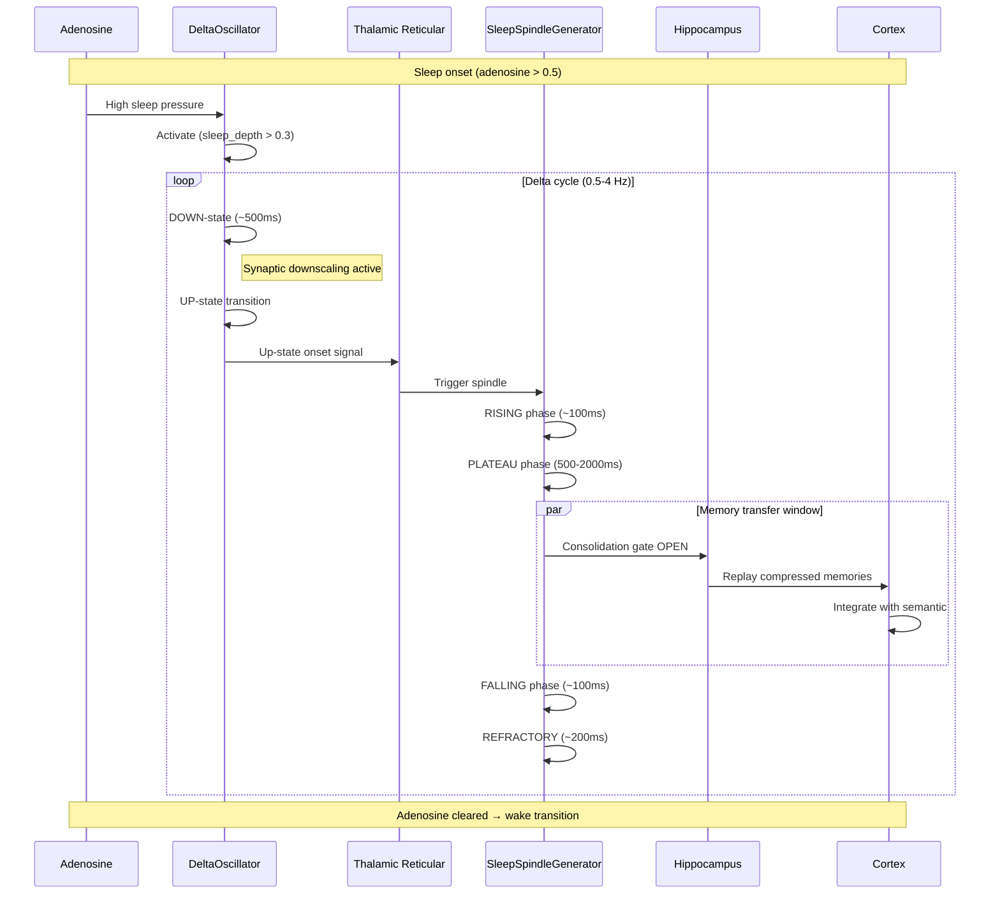

### Circuit Breaker State Machine

Protection against backend failures (also in storage-resilience.md).

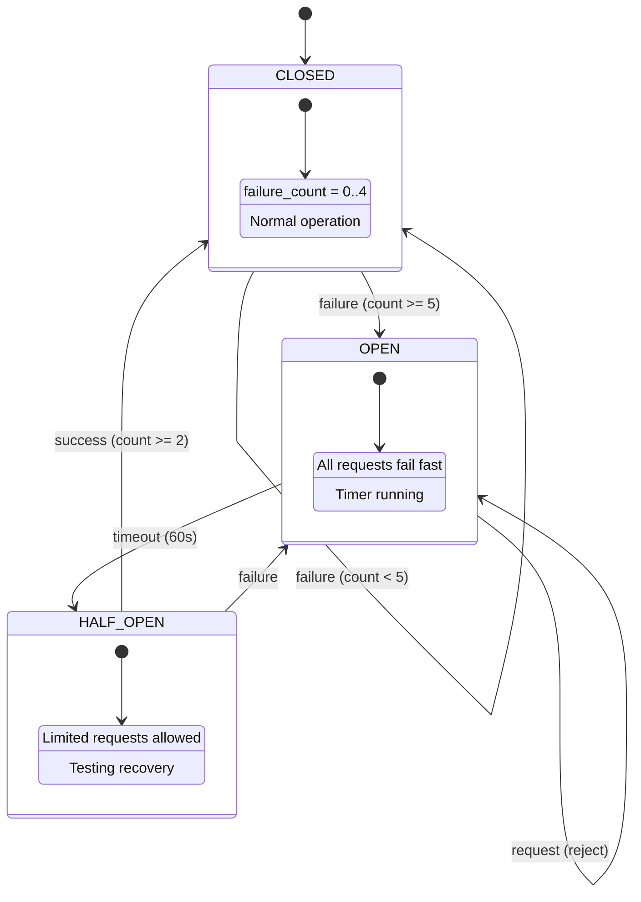

## Full Sequence Diagrams

### Complete Store Flow

End-to-end memory storage with all components.

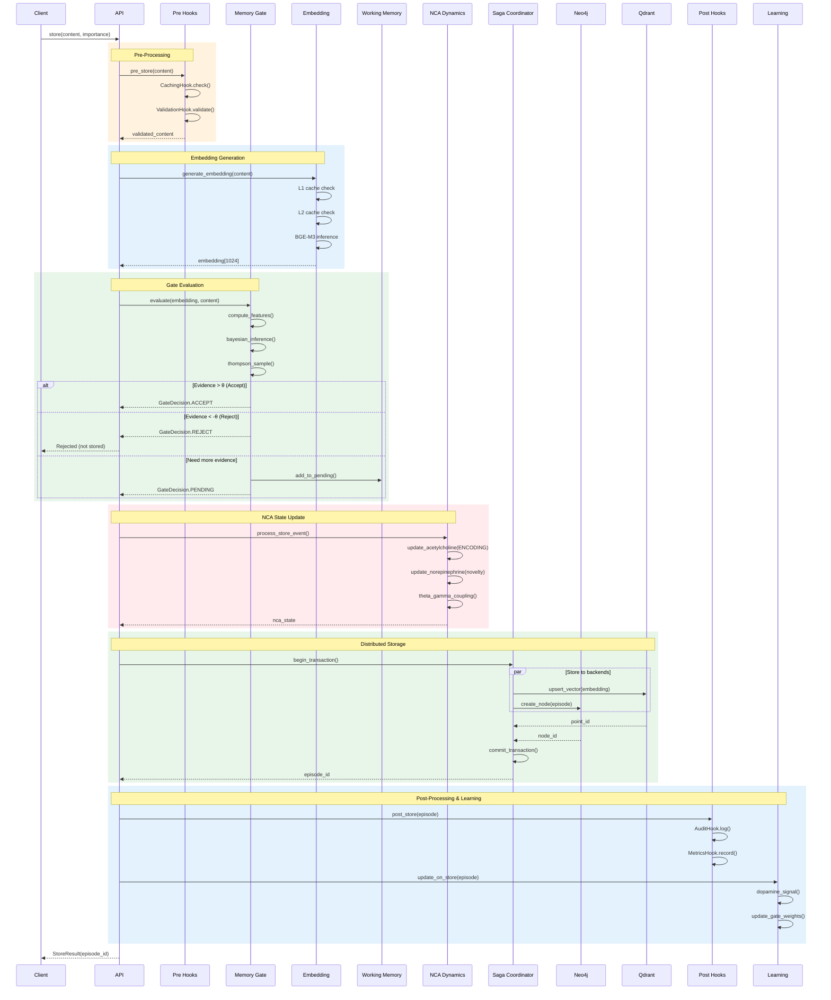

### Complete Retrieve Flow

End-to-end memory retrieval with all components.

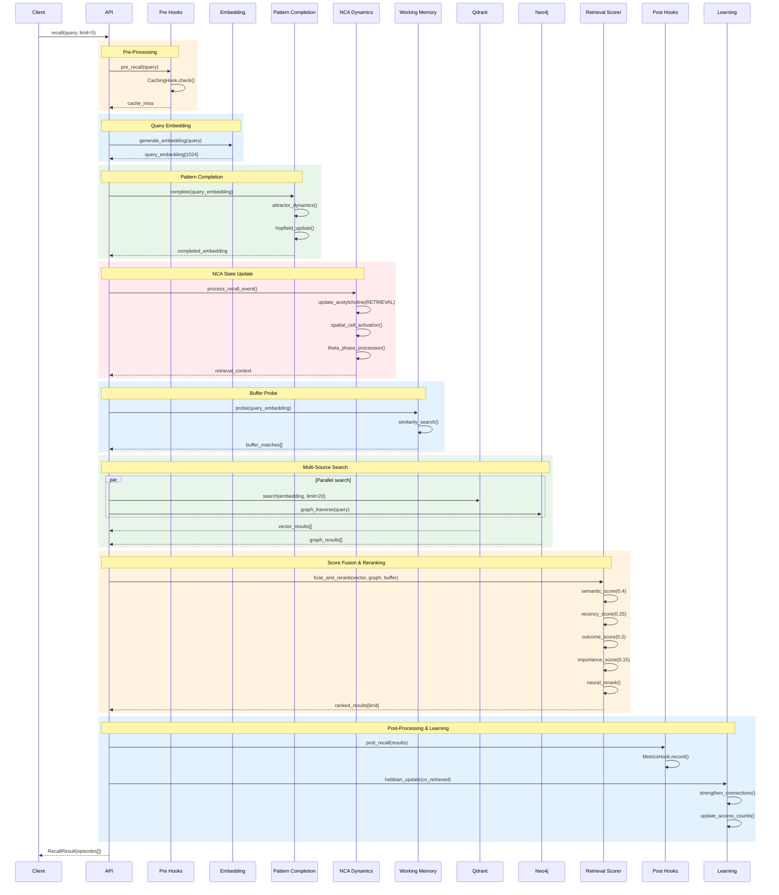

### Complete Consolidation Flow

Full consolidation cycle with all phases.

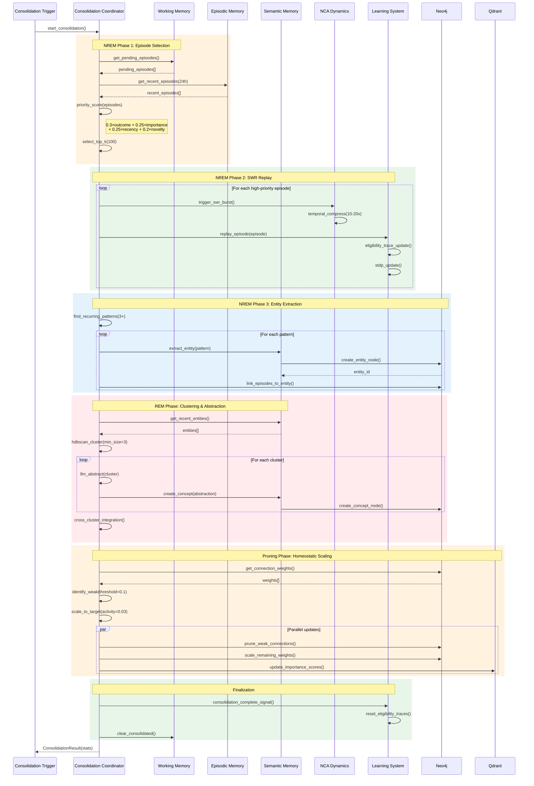

### Dreaming Sequence

Dream trajectory generation for creative exploration.

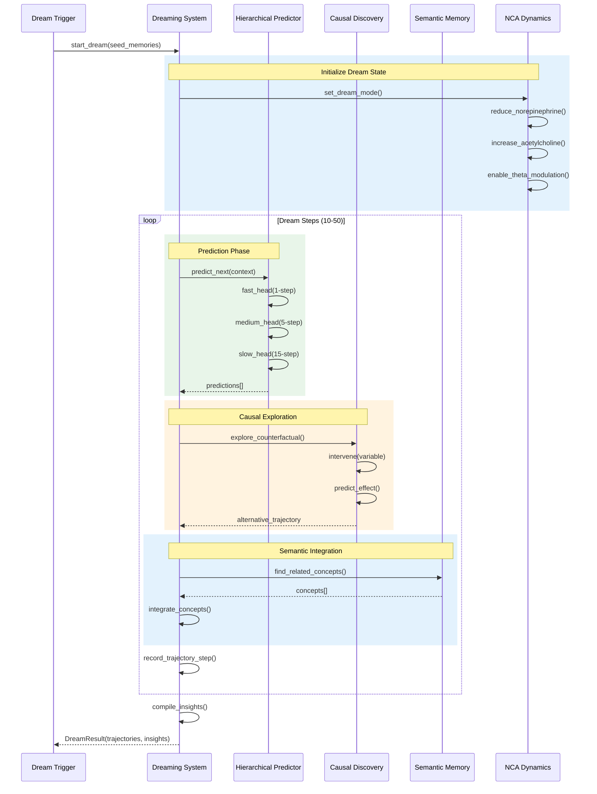

## Component Interaction Diagrams

### Hook Execution Order

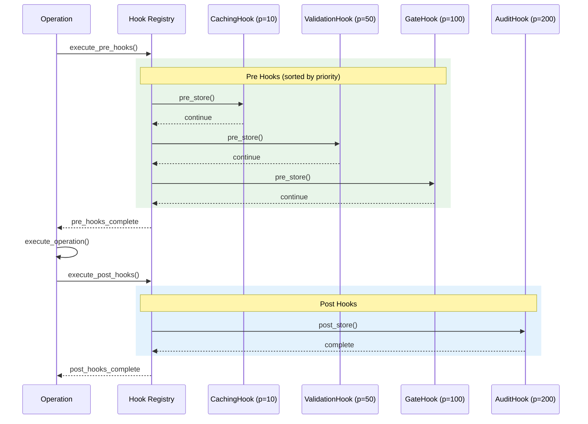

### Learning Signal Propagation

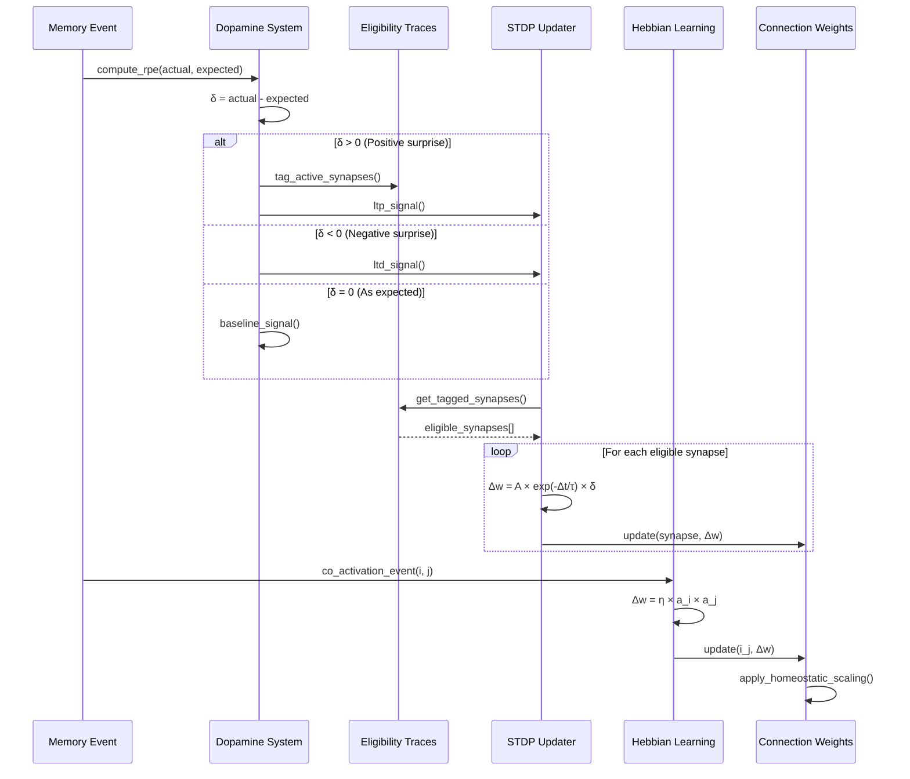
