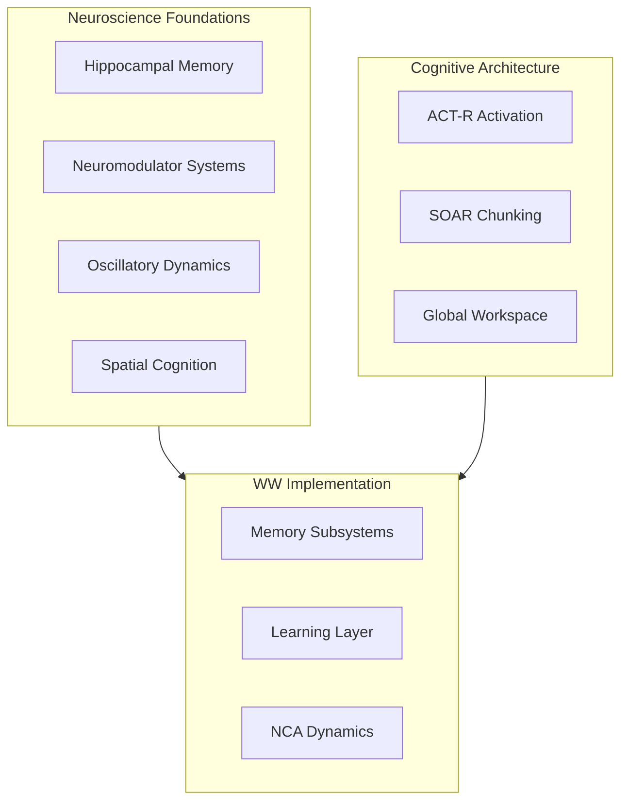

# Science

Scientific foundations and analysis of World Weaver's biologically-inspired design.

## Overview

World Weaver's architecture is grounded in cognitive neuroscience research. This section documents the scientific basis and analysis of the system.

## Documentation

-   :material-dna: **[Biology Audit](biology-audit.md)**

    ---

    Comprehensive biological accuracy assessment (82/100 score)

-   :material-school: **[Learning Theory](learning-theory.md)**

    ---

    Hinton-inspired analysis of neural learning mechanisms

-   :material-chart-line: **[Algorithmic Complexity](algorithmic-complexity.md)**

    ---

    Time and space complexity analysis of all operations

## Key Findings

### Biological Plausibility Score: 82/100

| Category | Score | Status |
|----------|-------|--------|
| NCA Dynamics | 88/100 | Strong PDE implementation |
| Learning Systems | 80/100 | STDP tau clarification needed |
| Memory Consolidation | 78/100 | Missing sleep spindles |
| Prediction | 85/100 | Good JEPA alignment |

### Cognitive Theory Alignment

| Theory | Alignment | Notes |
|--------|-----------|-------|
| ACT-R | 68% | Strong activation, weaker utility |
| SOAR | 63% | Good WM, basic chunking |
| GWT | 66% | Workspace present, basic broadcast |

### Algorithmic Efficiency

| Operation | Complexity | Optimized |
|-----------|------------|-----------|
| Episode Create | O(L + log n) | Yes |
| Episode Recall | O(L + K + k·n/K) | Yes (hierarchical) |
| Duplicate Detection | O(n·k) | Yes (was O(n²)) |
| HDBSCAN | O(n log n) | Capped at 2000 |

## Scientific References

### Memory Systems
- Tulving, E. (1985). Memory and consciousness
- Squire, L.R. (2004). Memory systems of the brain

### Hippocampus
- O'Keefe & Moser (2014). Nobel Prize - Place/Grid cells
- Buzsáki, G. (2006). Rhythms of the Brain

### Learning
- Hebb, D.O. (1949). Organization of Behavior
- Bi & Poo (1998). STDP in hippocampal neurons

### Cognitive Architecture
- Anderson, J.R. (2004). ACT-R Theory
- Laird, J.E. (2012). SOAR Cognitive Architecture
- Baars, B.J. (1988). Global Workspace Theory
