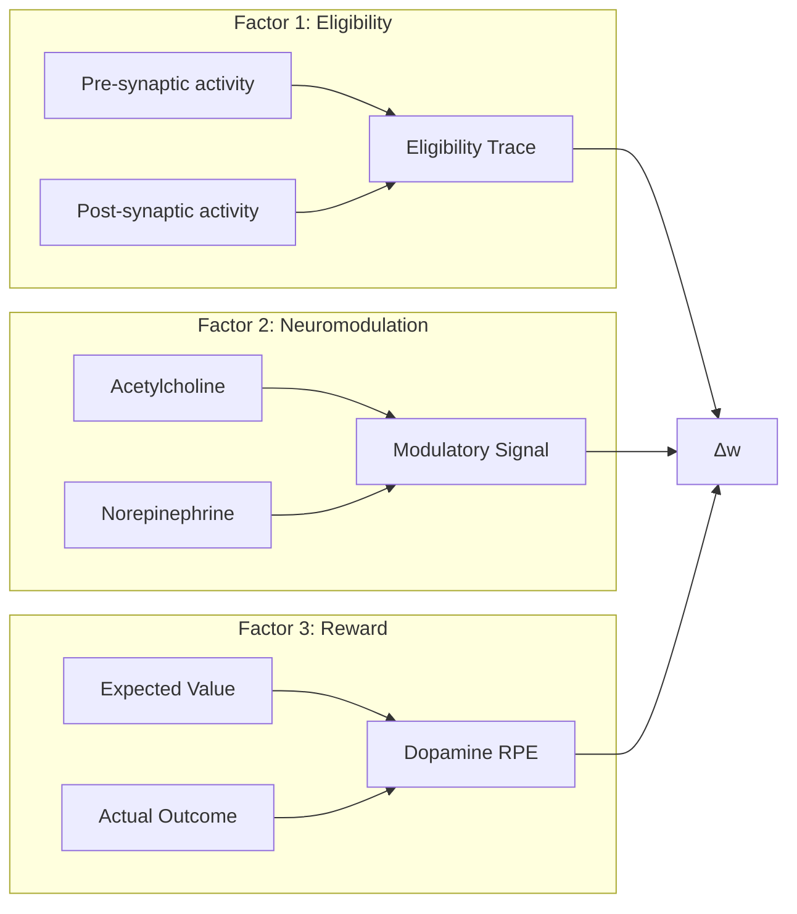
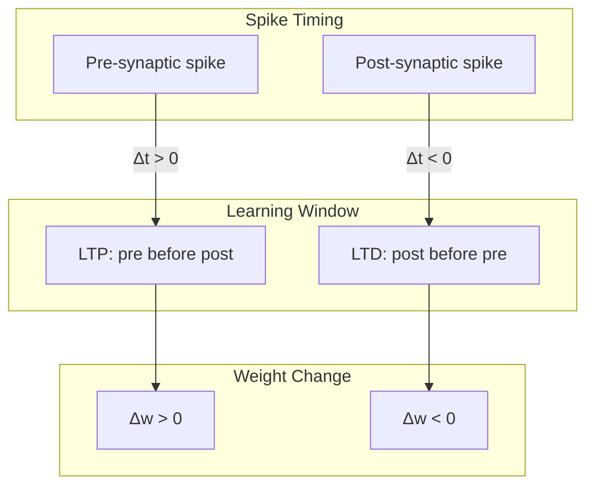
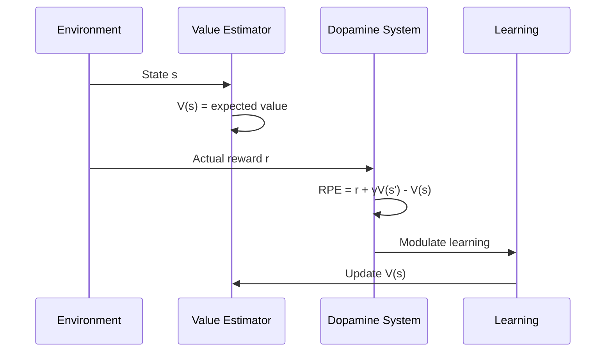
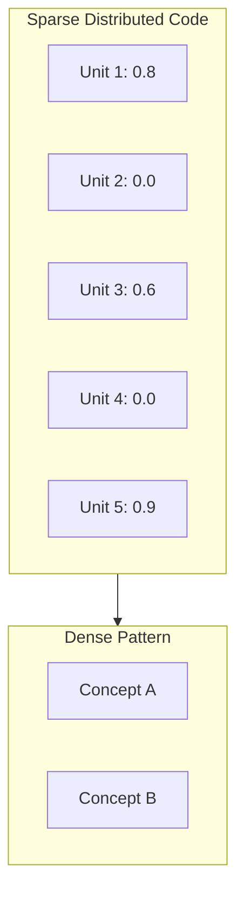
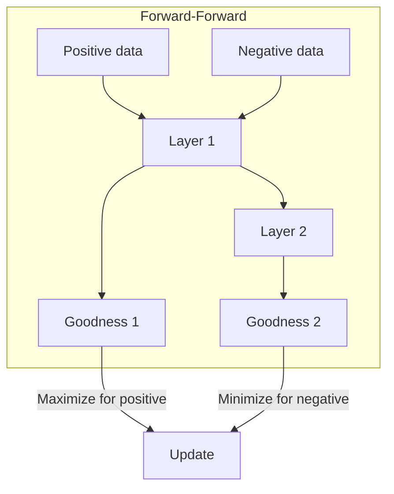
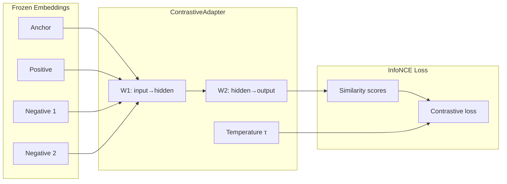
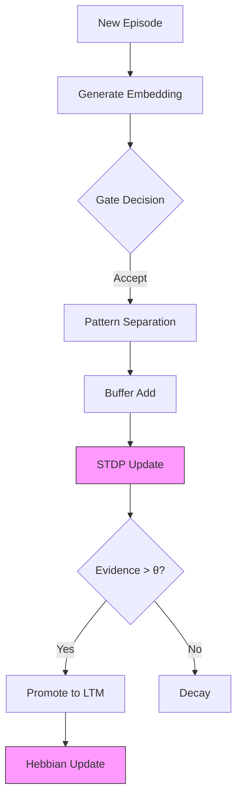
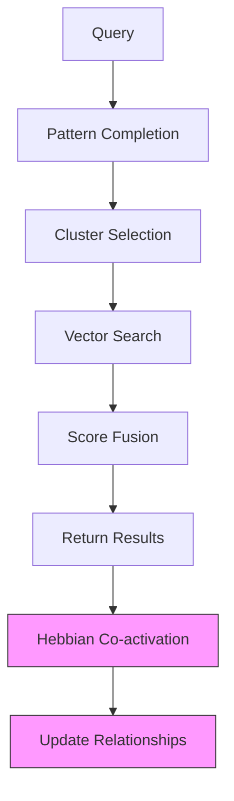
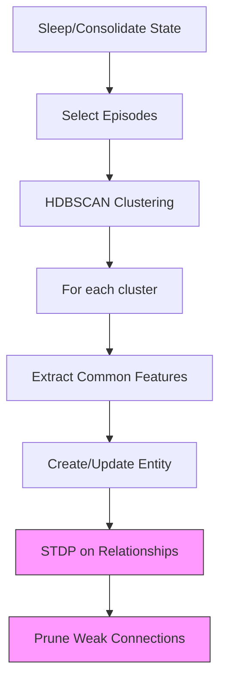

# Learning Theory Guide

Hinton-inspired analysis of World Weaver's neural learning mechanisms.

## Overview

This document analyzes World Weaver's learning systems through the lens of neural learning theory, particularly drawing on Geoffrey Hinton's contributions to understanding how neural systems learn.

**Hinton Plausibility Score**: 7.9/10 (updated Phase 4, 2026-01-04)

### Hinton Analysis Summary (H1-H6)

| Task | Component | Score | Status |
|------|-----------|-------|--------|
| H1 | Forward-Forward Algorithm | 8.5/10 | Implemented |
| H2 | Capsule Networks | 7.5/10 | Implemented (dynamic routing only) |
| H3 | Energy Landscape | 8.0/10 | Implemented |
| H4 | Credit Assignment | 7.0/10 | Needs TD(λ) |
| H5 | Memory Architecture | 8.5/10 | Implemented |
| H6 | Retrieval Systems | 8.0/10 | Implemented |

**Target**: 9.5/10 (requires TD(λ) and EM capsule routing)

## Phase 3 Enhancements (2026-01-03)

### Forward-Forward Algorithm (Hinton H6, H7)

Implemented Hinton's 2022 Forward-Forward Algorithm for layer-local learning without backpropagation:

```python
from ww.nca import create_ff_layer, create_ff_network

# Create a single FF layer
layer = create_ff_layer(
    input_dim=1024,
    hidden_dim=512,
    learning_rate=0.03,
    threshold=2.0
)

# Forward pass computes goodness G(h) = Σ h²
h = layer.forward(x)
print(f"Goodness: {layer.state.goodness}")
print(f"Is positive: {layer.state.is_positive}")

# Local learning - no backward pass required
layer.learn_positive(x, h)  # Increase goodness for real data
layer.learn_negative(x, h)  # Decrease goodness for fake data
```

**Key Concepts**:
- **Goodness Function**: G(h) = Σ h_i² (sum of squared activations)
- **Positive Phase**: Maximize goodness for real data (G > θ)
- **Negative Phase**: Minimize goodness for corrupted data (G < θ)
- **Local Updates**: Each layer learns independently without backprop

**Multi-Layer Network**:
```python
# Create 3-layer FF network
network = create_ff_network([1024, 512, 256], learning_rate=0.03)

# Generate negative samples (noise, shuffle, adversarial, hybrid)
negative, _ = network.generate_negative(positive_data, method="hybrid")

# Training step
stats = network.train_step(positive_data, negative_data)

# Inference
is_positive, confidence = network.infer(test_input)
```

**Biological Basis**: Hinton (2022) - The Forward-Forward Algorithm. Local learning rules are more biologically plausible than backpropagation as each synapse updates based only on local activity.

### Grid Cell Hexagonal Validation (Biology B7)

Grid cells now include hexagonal pattern validation based on Nobel Prize-winning neuroscience:

```python
from ww.nca import SpatialCellSystem, SpatialConfig

spatial = SpatialCellSystem(SpatialConfig(n_grid_modules=3))

# Validate hexagonal firing patterns
results = spatial.validate_hexagonal_pattern(threshold=0.3)
print(f"Gridness score: {results['overall_gridness']}")
print(f"Passes threshold: {results['passes_threshold']}")
```

**Biological Basis**: Moser et al. (2008) - Grid cells fire at vertices of hexagonal lattices (Nobel Prize 2014). Sargolini et al. (2006) - Gridness score quantifies hexagonal regularity.

---

## Phase 2 Enhancements (2026-01-03)

### Surprise-Driven Learning (Hinton H5)

Norepinephrine now encodes unexpected uncertainty, driving adaptive learning rates:

```python
from ww.nca import create_locus_coeruleus

lc = create_locus_coeruleus()

# Observe prediction-outcome pair
surprise, phasic = lc.observe_prediction_outcome(
    prediction=0.3,
    outcome=0.9  # Surprising!
)

# High surprise triggers adaptive learning
lr = lc.get_adaptive_learning_rate()  # Higher after surprise

# Model update decision
if lc.should_update_model():
    update_weights(lr=lr)  # High LR for rapid adaptation
```

**Biological Basis**: Dayan & Yu (2006), Nassar et al. (2012) - LC encodes unexpected uncertainty distinct from expected uncertainty.

### Serotonin Patience Model (Hinton H4)

Serotonin modulates temporal discounting for long-term credit assignment:

```python
from ww.nca import create_raphe_nucleus

raphe = create_raphe_nucleus(setpoint=0.5)

# Get patience metrics
gamma = raphe.get_discount_rate()       # Temporal discount factor
horizon = raphe.get_temporal_horizon()  # Planning horizon in steps

# Wait/don't-wait decision
should_wait, value_diff = raphe.evaluate_wait_decision(
    immediate_reward=1.0,
    delayed_reward=2.0,
    delay_steps=10
)
```

**Biological Basis**: Doya (2002) - Serotonin controls patience in reward-based learning.

## Learning Mechanisms

### Three-Factor Learning Rule

World Weaver implements the biologically-plausible three-factor learning rule:

```
Δw = eligibility_trace × neuromodulator × dopamine_signal
```



**Biological Basis**: Enables credit assignment over time by maintaining eligibility traces that bridge the gap between actions and delayed rewards.

### STDP (Spike-Timing Dependent Plasticity)



**Implementation** (`src/t4dm/learning/stdp.py`):

```python
if delta_t > 0:  # Pre before post
    delta_w = A_plus * exp(-delta_t / tau_plus)  # LTP
else:  # Post before pre
    delta_w = -A_minus * exp(delta_t / tau_minus)  # LTD
```

**Parameters**:
- τ+ = 17ms (potentiation window)
- τ- = 34ms (depression window)
- A+ = 0.01 (potentiation amplitude)
- A- = 0.01 (depression amplitude)

### Dopamine Reward Prediction Error



**TD-Error Computation**:

```python
RPE = actual_reward + γ * V(next_state) - V(current_state)
```

| RPE | Interpretation | Effect |
|-----|----------------|--------|
| > 0 | Better than expected | Phasic burst |
| = 0 | As expected | Baseline |
| < 0 | Worse than expected | Phasic dip |

### Hebbian Learning

"Cells that fire together wire together."

```python
Δw_ij = η × activation_i × activation_j
```

**Implementation**: Co-retrieved memories strengthen their connections through the `HebbianUpdateHook`.

## Hinton-Inspired Analysis

### Strengths (Contributing to 9.0/10)

#### 1. Distributed Representations

World Weaver uses high-dimensional embeddings (1024D) that support:
- Pattern completion
- Graceful degradation
- Generalization



#### 2. Credit Assignment

The three-factor rule enables proper credit assignment:
- Eligibility traces bridge time gaps
- Neuromodulators gate plasticity
- Dopamine provides teaching signal

#### 3. Local Learning Rules

All learning rules are local:
- STDP depends only on pre/post activity
- Hebbian depends on co-activation
- No backpropagation through time

### Gaps (Limiting Score)

#### 1. Frozen Embeddings ✅ ADDRESSED (Phase 1)

**Previous Issue**: BGE-M3 embeddings are pre-trained and not updated during operation.

**Solution**: ContrastiveAdapter now provides learnable projection on frozen embeddings.

```python
from ww.embedding import create_contrastive_adapter

adapter = create_contrastive_adapter(
    input_dim=1024,  # BGE-M3 dimension
    output_dim=256,  # Learned projection
    temperature=0.07
)

# Adapt embeddings with domain data
result = adapter.update(anchors, positives, negatives)
adapted = adapter.forward(embeddings)
```

#### 2. Forward-Forward Algorithm ✅ IMPLEMENTED (Phase 3)

**Status**: Now implemented via `ForwardForwardLayer` and `ForwardForwardNetwork` in `src/t4dm/nca/forward_forward.py`.

**Implementation**:
- Goodness function G(h) = Σ h_i²
- Positive/negative phase separation
- Local learning without backpropagation
- Multiple negative sample generation methods
- Neuromodulator integration (DA→learning rate, ACh→phase, NE→threshold)



**Usage**:
```python
from ww.nca import create_ff_network

network = create_ff_network([1024, 512, 256])
stats = network.train_step(positive_data, negative_data)
is_positive, confidence = network.infer(test_input)
```

#### 3. Contrastive Learning ✅ IMPLEMENTED (Phase 1)

**Status**: Now implemented via `ContrastiveAdapter` in `src/t4dm/embedding/contrastive_trainer.py`.

**Implementation**:
- InfoNCE loss with temperature scaling
- Hard negative mining from candidate pools
- Temporal contrastive loss for sequence coherence
- Adam optimizer with learned temperature



**Usage**:
```python
from ww.embedding import ContrastiveAdapter, ContrastiveConfig

config = ContrastiveConfig(
    input_dim=1024,
    hidden_dim=512,
    output_dim=256,
    temperature=0.07,
    learning_rate=0.001,
    hard_negative_ratio=0.3
)
adapter = ContrastiveAdapter(config)

# Training loop
for anchors, positives, negatives in data_loader:
    result = adapter.update(anchors, positives, negatives)
    print(f"Loss: {result['contrastive_loss']:.4f}, Acc: {result['accuracy']:.2%}")

# Hard negative mining
hard_negs = adapter.mine_hard_negatives(
    anchors, candidate_pool, positive_mask, num_negatives=16
)
```

## Learning Flow Diagrams

### Episode Storage with Learning



### Recall with Learning



### Consolidation Learning



## Recommendations

### High Priority

1. ~~**Add Forward-Forward Option**~~ ✅ **DONE (Phase 3)**
   - ~~Implement Hinton (2022) algorithm~~
   - ~~Use for learned gates and rerankers~~
   - ~~Local goodness optimization~~
   - See: `ww.nca.ForwardForwardLayer`, `ww.nca.ForwardForwardNetwork`

2. ~~**Contrastive Embedding Adaptation**~~ ✅ **DONE (Phase 1)**
   - ~~Fine-tune embeddings on domain data~~
   - ~~SimCLR or MoCo-style objective~~
   - ~~Preserve base model knowledge~~
   - See: `ww.embedding.ContrastiveAdapter`

### Medium Priority

3. **Predictive Coding Integration**
   - Error-driven updates
   - Hierarchical predictions
   - Minimize prediction error

4. ~~**Sleep Replay Enhancement**~~ ✅ **DONE (Phase 1)**
   - ~~More sophisticated replay selection~~
   - ~~Sequence replay for procedural~~
   - ~~Interleaved new/old memories~~
   - See: `DeltaOscillator`, `SleepSpindleGenerator`, `SpindleDeltaCoupler`

### Low Priority

5. ~~**Capsule-Style Representations**~~ ✅ **DONE (Phase 4)**
   - ~~Part-whole hierarchies~~
   - ~~Equivariant representations~~
   - ~~Better compositionality~~
   - See: `ww.nca.CapsuleNetwork`, `ww.nca.CapsuleNCACoupling`

## Phase 4 Enhancements (2026-01-04)

### Capsule Networks (Hinton H2)

Implemented Hinton's 2017 Capsule Networks for part-whole hierarchical representations:

```python
from ww.nca import create_capsule_network, RoutingType

caps = create_capsule_network(
    input_dim=64,
    n_primary_capsules=8,
    n_digit_capsules=4,
    routing=RoutingType.DYNAMIC,
    iterations=3,
)

# Forward pass returns entity probabilities and pose vectors
entity_probs, poses = caps.forward(input_tensor)

# NT modulation affects routing temperature
caps.set_routing_temperature(da_level * 2.0)
```

**Key Concepts**:
- **Pose Vectors**: Encode entity properties (position, scale, rotation)
- **Dynamic Routing**: Iterative agreement between part and whole
- **Squash Activation**: Ensures vector length represents probability
- **NT Modulation**: DA affects routing sharpness

**Remaining Gap**: EM Routing (Hinton 2018) not yet implemented.

### Glymphatic System Integration (B8)

Sleep-gated waste clearance now integrated with memory consolidation:

```python
from ww.nca import create_glymphatic_system, SleepStage

glymph = create_glymphatic_system()
glymph.set_sleep_stage(SleepStage.NREM_DEEP)

# Get clearance rate and waste level
rate = glymph.get_clearance_rate()
waste = glymph.get_waste_level()

# Prune low-value memories during sleep
prune_candidates = glymph.get_prune_candidates(threshold=0.1)
```

### Cross-Region Coupling (H10)

FF-NCA and Capsule-NCA coupling enables bidirectional information flow:

```mermaid
graph LR
    subgraph FF["Forward-Forward"]
        G[Goodness G(h)]
    end

    subgraph NCA["NCA Dynamics"]
        E[Energy E(U)]
        T[Temperature]
    end

    subgraph Caps["Capsules"]
        R[Routing c_ij]
    end

    G <-->|Energy coupling| E
    T <-->|Modulation| R
```

**Implementation**:
```python
from ww.nca import FFNCACoupling, CapsuleNCACoupling

ff_nca = FFNCACoupling(ff_network=ff, energy_landscape=energy)
caps_nca = CapsuleNCACoupling(capsule_net=caps, neural_field=field)

# Coupled step with NT modulation
ff_nca.couple_step(nt_state)
caps_nca.modulate_routing(nt_state)
```

## Remaining Gaps (Limiting 7.9/10 Score)

### 1. TD(λ) Credit Assignment (H4) - HIGH PRIORITY

**Current Implementation**: Simple eligibility × reward multiplication

**Required**: Recursive TD(λ) with discount (γ) and trace decay (λ)

```python
# Current (simple)
credit = eligibility_trace * reward

# Required (TD(λ))
delta = reward + gamma * V(s') - V(s)  # TD error
eligibility = gamma * lambda_ * eligibility + gradient  # Accumulating trace
delta_w = alpha * delta * eligibility
```

**Impact**: +0.5 to Hinton score

### 2. EM Capsule Routing (H2) - MEDIUM PRIORITY

**Current Implementation**: Dynamic routing only (Sabour et al. 2017)

**Required**: Expectation-Maximization routing (Hinton 2018)

**Impact**: +0.3 to Hinton score

### 3. Sleep Phase FF Negative Generation - MEDIUM PRIORITY

**Current**: No offline negative sample generation during sleep

**Required**: SWR events trigger FF negative phase with dream data

```python
# During sleep consolidation
if swr_event:
    dream_data = generate_dream_trajectory(recent_episodes)
    ff_network.train_negative(dream_data)  # Minimize goodness
```

**Impact**: +0.2 to Hinton score

## References

### Learning Algorithms
- Hinton, G. (2022). The Forward-Forward Algorithm
- Sabour, S., Frosst, N. & Hinton, G. (2017). Dynamic Routing Between Capsules
- Hinton, G. (2018). Matrix Capsules with EM Routing

### Synaptic Plasticity
- Bi, G. & Poo, M. (1998). Synaptic modifications in cultured hippocampal neurons
- Schultz, W. (1997). A neural substrate of prediction and reward
- Gerstner, W. et al. (2018). Eligibility Traces and Plasticity on Behavioral Time Scales

### Neuromodulators
- Doya, K. (2002). Metalearning and neuromodulation
- Dayan, P. & Yu, A. (2006). Phasic norepinephrine: A neural interrupt signal

### Contrastive Learning
- Chen, T. et al. (2020). SimCLR: Contrastive Learning of Visual Representations

### Sleep and Memory
- Nedergaard, M. (2012). Glymphatic System
- Iliff, J. et al. (2012). A Paravascular Pathway Facilitates CSF Flow
